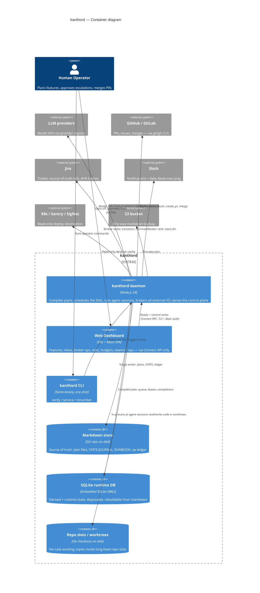
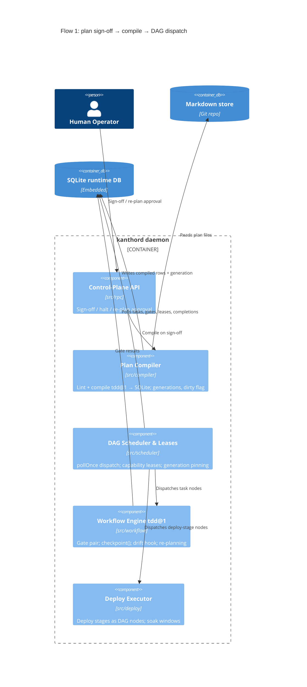
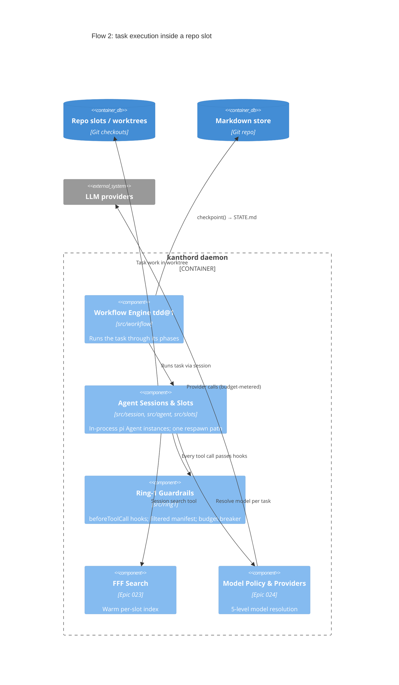
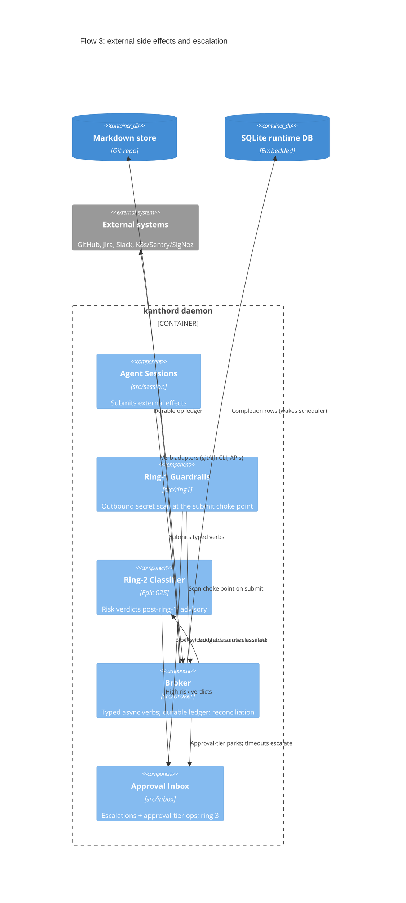
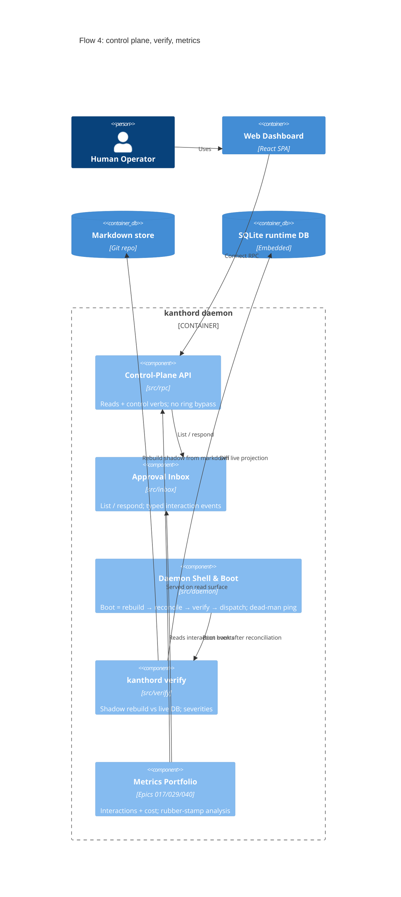

# kanthord — Architecture (C4 Model)

Source: `.agent/plan/prd.md`, `.agent/plan/phases.md`, and the epics in
`.agent/plan/epics/` (000–042). This document describes the target MVP
architecture across all three phases. The **Phase** column shows when each
piece is (or will be) built; earlier phases ship fakes behind the same seams.

The C4 model has four levels; this document covers the two useful ones here:

- **Containers** — separately runnable units and data stores.
- **Components** — modules inside the kanthord daemon process.

---

## 1. Components

Every component lives inside the daemon process unless noted. "Problem it
solves" is the one-line reason the component exists.

| Component | Source | Phase | Problem it solves |
|---|---|---|---|
| **Foundations** | `src/foundations/` | 1 | Every other component needs injectable time and consistent I/O. Provides the fake-able `Clock`, frontmatter/markdown parser, JSONL writer, YAML registry loader, and the SQLite factory (WAL + busy_timeout + migrations). Makes the whole daemon deterministic under test. |
| **Plan Compiler** | `src/compiler/` | 1 | A plan written by a human (or agent) can be wrong in ways that waste days. Lints and compiles the markdown plan (`tdd@1` shape) into SQLite rows — DAG acyclic, scopes disjoint, every node has a ticket — and rejects bad plans like a compiler, with planner-vocabulary errors. Owns `compile_hash`, generations (G/G+1), and dirty detection. |
| **Markdown Store (git)** | `src/store/`, `src/git/` | 1→2A | The system needs one durable, human-readable source of truth that survives any crash. Single-writer store over feature directories (frontmatter/STATE/JOURNAL/RUNBOOK); every logical write set is one attributable git commit. Owns the versioned markdown→SQLite projection contract and `rebuildFromMarkdown`. |
| **DAG Scheduler & Lease Manager** | `src/scheduler/` | 1 | Tasks must run in dependency order and must not collide on shared resources. One `pollOnce` pass dispatches nodes whose gates pass and whose capability leases (write-scope, ports, test DBs…) are free. Leases have expiry + heartbeat; `blocked_on: op_id` parks a task until the broker completion row appears — the single wake-up mechanism. |
| **Broker** | `src/broker/`, `src/broker/verbs/` | 1→2 | Agents must never hold credentials or make raw network calls. All external side effects go through typed, always-async verbs (registry with tier/timeout/idempotency/reconcile). A durable operation ledger in markdown lets a crashed daemon reconcile against real remote state instead of double-posting or losing work. |
| **Workflow Engine (`tdd@1`)** | `src/workflow/` | 1→2B | Task execution needs versioned discipline, not vibes. Implements `phases[]` / `gateCheck` / `checkpoint()`: the failing-test entry gate, tests-pass exit gate, bounded STATE.md rewrites, artifact handoff gates (frozen/`draft_ok`), the phase-boundary ticket-drift hook, and the re-planning flow. |
| **Agent Sessions & Repo Slots** | `src/session/`, `src/agent/`, `src/slots/` | 1→2A | Long-lived LLM contexts degrade; disk and repos are shared assets. Durable repo slot (worktrees or single_checkout with WIP commits), ephemeral pi session: an **in-process `Agent` instance** from `@earendil-works/pi-agent-core` (a library, not a CLI — "spawn/teardown" means create/discard the object and its context, never an OS process). Created from a brief (task + epic + RUNBOOK + STATE + AGENTS.md), torn down at task boundaries, respawned from STATE.md. Compaction, task-boundary, and crash recovery share one respawn code path. |
| **Ring-1 Guardrails** | `src/ring1/` | 1→2A | A model can be talked into anything; deterministic policy cannot. Write-scope blocking in `beforeToolCall`, outbound secret-pattern scan at the broker choke point, fail-closed budget circuit-breaker (ledger survives respawns), per-role path policy, and agent network denial. Model-independent by construction. |
| **Ring-2 Classifier** | (module TBD, Epic 025) | 2B | Some risk is a judgment call, not a rule. LLM-based sensitivity/risk verdict at post-ring-1 checkpoints (broker payloads, runbook appends, PR bodies). High → escalation; fails conservative; its model comes from global config only and can never weaken a ring-1 block. |
| **Approval Inbox** | `src/inbox/` | 2A | The human needs one durable place to see and answer everything the system cannot decide alone. Restart-survivable queue of escalations and approval-tier operations with typed evidence; every response is captured as a typed interaction event (approval / clarification / correction / takeover / external) with cost attribution. |
| **Deploy Chain Executor & Observers** | `src/deploy/` | 1→2B | "PR open" is not "feature done" — deploys look healthy at 90 s and fall over at minute five. Runs per-repo deploy stages as first-class DAG nodes: ordered read-only observer verbs, explicit success criteria, soak windows on the injectable clock. Pass → notify human; fail → halt + escalate with evidence. Also byte-diffs contract artifacts and escalates `unclassified-artifact-change`. |
| **Control-Plane API** | `src/rpc/`, `src/generated/kanthord/v1/` | 1→2B | Every client needs one audited door into the daemon. Connect RPC (gRPC / gRPC-Web / HTTP-JSON) serving read surfaces (features, broker ops, slots, budgets, daemon ops) and control verbs (sign-off, halt, re-plan approval, budget override). No-bypass invariant: the API has no privileged path around the three rings. Basic auth over TLS, VPN-interface bind. |
| **kanthord verify** | `src/verify/`, `src/cli/` | 2A→3 | The derived SQLite can silently drift from the markdown truth. Rebuilds a shadow projection from markdown and diffs it against the live DB per the versioned contract. Phase 3 adds warn / repairable / fatal severities and a boot hook: repairable self-heals, fatal halts dispatch but keeps reads and the inbox up. |
| **FFF Search** | (module TBD, Epic 023) | 2B | Respawned sessions must not pay a per-session index rebuild. Daemon-owned fff index per repo slot (path + content queries, frecency), warm across teardowns, filtered through ring-1 read policy, reachable by agents only via a session tool. |
| **Model Policy & Provider Registry** | (with session/daemon, Epic 024) | 2B | Which model runs which work must be deterministic and credential-free. Five-level resolution chain (task → feature → repo slot → role → system); providers registered once in daemon config; `model@version` stamped into frontmatter and metrics for attribution. Classifier model is global-config only. |
| **S3 Sync** | (with store, Epic 021) | 2B | The markdown truth needs off-machine backup without inviting multi-master conflicts. Strictly one-way allowlist upload to an S3-compatible bucket, own content digests, soft deletes to `trash/<ts>/`, remote-newer is reported and never applied. |
| **Metrics Portfolio** | (aggregation in daemon, Epics 017/029/040) | 2A→3 | You cannot tune autonomy on anecdotes. Aggregates typed interactions + ledger cost per feature ("4 human interactions, $11"), then cross-feature trends, the rework guard metric, and rubber-stamp analysis that names policy-knob candidates from evidence. |
| **Daemon Shell & Boot** | `src/daemon/` | 1→3 | All of the above must become one supervised, crash-safe process. Wires the components; boot runs rebuild-from-markdown → broker ledger reconciliation → verify hook → dispatch. Serves `/healthz`; SIGTERM checkpoints sessions and flushes stores; Phase 3 adds launchd/systemd install, log rotation, and the daily dead-man ping (via `slack.dm`). |
| **CLI** | `src/cli/` | 2A→3 | Operator actions that do not belong in the RPC surface. `kanthord verify`, `kanthord service install|status`, `kanthord renumber` (atomic plan-file renumbering). |
| **Harness (test kit)** | `src/harness/` | 1 | Not a runtime component. Fake clock, fake broker, temp SQLite, temp git repo, crash/restart entrypoint — the named scenario suite that gates every phase. Fakes are never deleted; they stay as permanent test doubles. |

---

## 2. Containers

Runnable units and data stores. The daemon is the system's only always-on
process; everything else is either a client, a data store, or an ephemeral
child process.

| Container | Technology | Phase | What it is for |
|---|---|---|---|
| **kanthord daemon** | Node.js 24 process (ESM) | 1 | The Core. Single long-running, supervised (launchd/systemd) process that hosts every component above: compiles plans, schedules tasks, runs agent sessions, brokers all external I/O, and serves the control plane. The sole writer to the markdown store. |
| **Web Dashboard** | Vite + React SPA (`clients/web/`) | 2B | The MVP UI. One place to see and control everything the daemon owns: features and DAG progress, escalation/approval inbox, broker operations, repo slots, budgets, daemon ops. Talks only to the Control-Plane API; no privileged bypass. |
| **kanthord CLI** | Same binary, one-shot invocations (`src/cli/`) | 2A | Operator commands run outside the daemon loop: `verify` (read-only drift report against the live DB), `service` (supervisor install), `renumber` (plan tooling). |
| **Markdown store** | Git repository on disk | 1 | The source of truth. Feature directories (plan files, STATE.md, journal JSONL, RUNBOOK.md) plus the durable broker operation ledger. Human-readable, synced, single-writer; git history is the plan's version history. |
| **SQLite runtime DB** | Embedded SQLite (WAL) | 1 | Derived + runtime state, never synced, disposable: compiled plan rows, task queue, leases, `op_id → request_id` maps, budget ledger rows, broker completion rows. Rebuildable from markdown at any time. |
| **Repo slots / worktrees** | On-disk git checkouts | 2A | Where task work actually happens. Long-lived slot per repo (fff index, config, leases); a worktree per task, or one checkout with WIP-commit park/resume for heavy mobile repos. |
| **S3 bucket** | S3-compatible object store (external) | 2B | Off-machine backup/replication of the markdown store. One-way push; never multi-master. |

Agent sessions are **not** a container: `@earendil-works/pi-agent-core` is an
in-process library, so each session is an `Agent` object living inside the
daemon process (see the Agent Sessions component in §1). The sessions' tool
manifest permanently blocks exec/shell-class tools, so sessions do not fork
worker processes either.

External actors and systems (context, not containers of this system): the
**human operator** (plans, approves, merges), **LLM providers**, **GitHub /
GitLab** (via `git`/`gh` CLIs), **Jira**, **Slack** (notifications +
dead-man ping), and read-only observability targets **Kubernetes, Sentry,
SigNoz**.

---

## 3. C4 — Container diagram

---

## 4. C4 — Component diagrams (inside the daemon)

One diagram per flow instead of one wall of arrows: each diagram keeps ≤9
elements so the lines stay readable. A component may appear in more than one
flow; the tables in §1 carry the relationships not drawn here.

### 4.1 Plan flow — sign-off to dispatch

### 4.2 Task execution — sessions, slots, models

### 4.3 External side effects — broker and the three rings

### 4.4 Control plane and ops — observe, verify, tune

---

## 5. Cross-cutting invariants (why the diagrams look this way)

- **Markdown = truth, SQLite = derived.** Only the daemon writes markdown;
  the DB is rebuildable at any time. `kanthord verify` is the drift detector.
- **All external I/O goes through the broker.** Agents have no network and no
  credentials; ring 1 scans everything at the broker submit choke point.
- **Always async, one wake-up.** Broker completions land as SQLite rows; the
  scheduler poll is the only mechanism that wakes a parked task.
- **Durable slot, ephemeral session.** Compaction, task-boundary teardown,
  and crash recovery share one respawn path; respawn-equivalence is asserted
  field by field.
- **Three rings, no bypass.** Deterministic policy (ring 1) → classifier
  (ring 2) → human approval (ring 3, the inbox). Nothing — including the
  dashboard and the control-plane API — has a privileged path around them.
- **Interface first, fake second, real third.** Every seam shipped in
  Phase 1 with a fake; Phase 2 swaps in real bricks behind the same
  interface; the fakes live on as the harness test doubles.

---

## 6. Operator routines

The system automates the machine work; these are the ~17 routines that stay
with the human operator. Grouped by rhythm. Each point carries a suggestion
(quoted) for how to keep the routine cheap.

### 6.1 Setup routines (per repo / per feature)

1. **Repo onboarding** — write the repo slot yaml (strategy,
   `max_concurrent_tasks`, `workflows_allowed`), register the PAT in the
   keyring, pass `verifySetup`, author the repo `AGENTS.md`.
   > Treat onboarding as a checklist, not a one-liner: AGENTS.md, resource
   > declarations, and the test command are part of it. A repo added without
   > them fails later in ways that look like agent bugs.
2. **Plan authoring** — external (e.g. a Claude Code brainstorm) produces the
   feature directory: `epic.md`, stories, task files, tickets. Hard rule: no
   task without a source-of-truth ticket.
   > Keep a plan template handy. Lint rejects structure, not wisdom — a bad
   > plan that lints clean still costs real rework.
3. **Sign-off / compile** — explicit action; fix planner-vocabulary lint
   errors; a generation is stamped; ticket content is snapshotted.
   > Sign off only when the multi-file edit set is complete. The feature
   > directory is source code: no casual `mv` — a rename is a plan edit.
4. **Contract artifacts** — author the `.proto` / `openapi.yaml` per boundary
   and declare them in the plan.
   > Gate the authored source, never generated output. List the company's real
   > boundary formats early — that list decides which semantic handler to
   > write first.
5. **Deploy chain + observers** — declare stages, success criteria, and soak
   windows in the plan; observer handler logic is per-project integration
   work.
   > Write criteria as explicit ANDs ("rollout complete AND error rate < X").
   > Vague criteria turn deploy watching back into a human job.

### 6.2 In-loop routines (while features run — the inbox loop)

1. **Diff review** — the dominant load. MVP policy is `escalate_all_diffs`:
   every diff crosses the operator.
   > Time-box review passes (e.g. twice a day) instead of reacting to every
   > item. Parked tasks are async by design; latency is the only cost.
2. **Approvals** — approval-tier verbs (`github.merge`, deploys) park in the
   inbox until the button is pressed.
   > Watch which approvals are always "yes, unchanged" — the rubber-stamp
   > analysis (Phase 3) turns exactly those into policy-knob candidates.
3. **Escalation response** — scope-violation, budget breach, secret-scan
   block, verb timeout/reconcile, ring-2 high verdict, deploy-observer fail.
   > A blocked out-of-scope write is a re-planning signal, not just an
   > incident: it usually means the decomposition was wrong.
4. **`unclassified-artifact-change` review** — any byte change on an artifact
   without a semantic handler escalates.
   > Expect this to be noisy until the first handler exists. These items are
   > excluded from the automation metric on purpose — do not rubber-stamp
   > them into silence.
5. **Interaction classification** — every inbox response asks to confirm the
   proposed type (approval / clarification / correction / takeover).
   > Answer honestly, especially `takeover` — it is the honest capability-gap
   > signal, and the whole tuning loop feeds on this data.
6. **Re-planning approval** — a task signals "the plan is wrong" → review the
   plan diff → approve → the affected subgraph re-opens.
   > Under `breaking_allowed` this loop is normal, not exceptional. Budget
   > time for it; it is being hardened early by design.
7. **Ticket drift response** — a ticket changed after sign-off: keep working
   (default) or halt the subtree; the operator owns talking to the author.
   > Respond to drift items the same day. Drift is detected at phase
   > boundaries precisely so a day-1 change does not cost 2 wasted days.
8. **Merge + rollback** — human merges after the "deploy healthy" notice;
   cross-repo rollback is fully manual in MVP.
   > Before merging a multi-repo feature, decide the merge order yourself —
   > see blocker 2 in §6.4.

### 6.3 Maintenance routines (daily / weekly)

1. **Dead-man ping** — read the daily "alive, N tasks processed" Slack DM.
   > The dangerous line is `N==0` with everything "up": investigate
   > silent-idle the same day; that is the failure crash-restart cannot catch.
2. **`kanthord verify`** — on-demand drift check; respond to
   fatal-corruption halts (Phase 3 adds boot hooks).
   > Run it quiescent (no active writes) or re-run on divergence — it is not
   > a consistent snapshot against a writing daemon.
3. **Budget override** — rate-limited, one-shot ceiling raise with a
   mandatory reason.
   > If the same task class needs overrides repeatedly, raise its default
   > ceiling in config instead of overriding forever.
4. **Retrospective + RUNBOOK curation** — harvest JOURNAL → promote durable
   gotchas to `AGENTS.md`, prune RUNBOOK.
   > This is unglamorous and load-bearing: RUNBOOK is injected into every
   > spawn, and it stays bounded only if this routine actually happens.
5. **Metrics review → policy tuning** — read the portfolio, act on
   rubber-stamp clusters (Phase 3).
   > Never optimize one dial. The guard metric is rework: any metric improving
   > while rework rises is a warning, not a win.
6. **Service ops** — `kanthord service` install/status, log checks, S3 backup
   check, credential rotation.
   > Put PAT expiry dates in a calendar. The first "system down" morning is
   > most likely an expired token surfacing as `blocked-needs-setup`.

### 6.4 Scenario: two parallel features — likely blockers

1. **The operator is the bottleneck.** `escalate_all_diffs` × 2 features
   doubles approval latency; parked tasks pile up behind one human.
   > Accept it consciously for MVP, but track blocked-time per feature from
   > day one — it is the first number that argues for loosening a knob.
2. **Cross-feature file conflicts are not linted.** Scope-disjointness lint
   runs inside one feature. Leases stop concurrent writes, but feature A's
   merged PR can invalidate the base of feature B's open branch — no
   mechanism coordinates merge order across features.
   > Decide merge order manually per pair of features that share a repo, and
   > record the gap as a decision note; it is a real design hole to revisit.
3. **The daily budget kill switch is shared.** One runaway feature can trip
   the per-day global breaker and halt the innocent feature too.
   > Check the ledger design for a per-feature daily tier; if it does not
   > exist, add it before running two expensive features together.
4. **Undeclared shared resources.** Ports, test DBs, emulators only serialize
   if declared in `resources:`; collisions are found empirically.
   > Expect the first real parallel run to fail once and teach a rule. Declare
   > the obvious ones (test DB, dev ports) up front to shrink that lesson.
5. **Same-repo contention (handled by design).** Overlapping write-scopes
   serialize via leases; `single_checkout` repos serialize whole slots.
   > Nothing to fix — but plan throughput expectations accordingly: two
   > features on one mobile repo run mostly one task at a time.
6. **Shared broker rate limits (handled by design).** GitHub/Jira budgets are
   shared; rate-limit backoff slows both features but never consumes the
   failure-retry budget.
   > No action; just do not read "slow" as "stuck" — check the broker view
   > before restarting anything.
7. **Approval expiry while away.** Pending ops expire per-verb; two features
   generate more pending items, and a weekend away may expire approvals that
   must be re-driven.
   > Before going offline, sweep the inbox for approval-tier items or accept
   > the re-drive cost; expiry firing is safe by design, just inconvenient.
8. **Context-switch cost.** Interleaved escalations from two features land in
   one inbox.
   > Lean on the evidence contract: every item must name its feature loudly.
   > If an item is ambiguous, that is a bug in the evidence, not in Ulrich.

### 6.5 Unknown-unknowns (routines easy to miss when projecting)

1. **The classification burden is constant.** Every inbox response asks for a
   category confirmation — small each time, forever.
   > Do not skip or auto-accept it; biased data quietly poisons the tuning
   > loop that decides where autonomy is loosened.
2. **Curation discipline controls agent quality silently.** RUNBOOK and
   STATE.md quality decide respawn quality; a lazy month degrades agents with
   no alarm firing.
   > Put the retrospective harvest on a recurring slot; treat a bloated
   > RUNBOOK as a defect.
3. **Takeovers are the honest adoption signal.** If an agent checkpoints
   badly, respawns get worse, and the operator quietly does the work by hand.
   > Log every takeover as a `takeover` interaction even when it feels faster
   > to just fix it — hidden takeovers make the metrics lie.
4. **Repo onboarding is bigger than a git URL.** AGENTS.md, resource
   declarations, workflows_allowed, and the test command are all part of it.
   > Budget half a day per new repo, not five minutes.
5. **Credential rotation is a routine, not an incident.** PATs and provider
   keys expire on their own schedule.
   > Rotate on a calendar, and let `verifySetup`'s `blocked-needs-setup` path
   > be the safety net, not the notification system.
