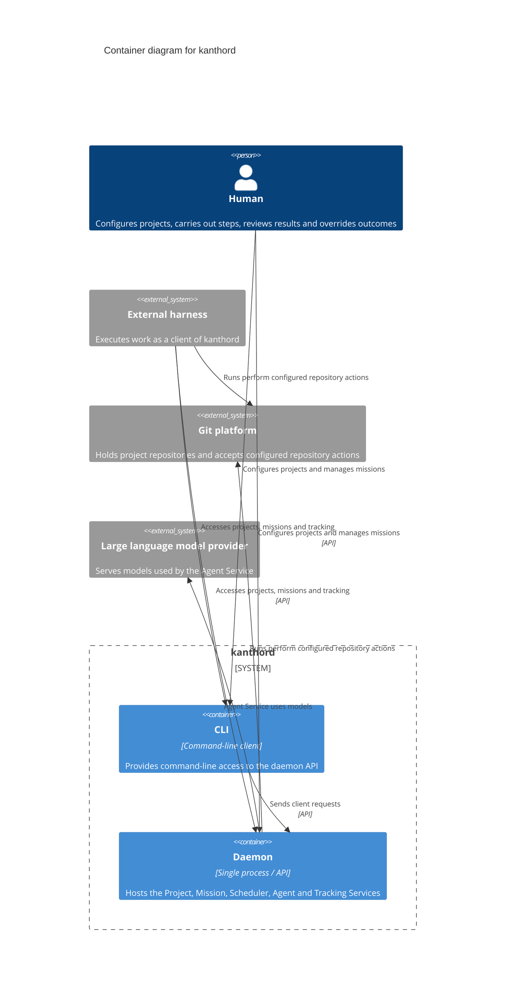

# Architecture

## Scope

This document describes the top level of kanthord.
It names the services, their responsibilities and their relations.
It describes no mechanism inside a service.

## Container diagram

The C4 container view shows the daemon and its CLI client, with the actors and external systems around them.
The five services are logical boundaries inside the daemon, not separate containers.
Service-level relations are listed below.

## Services

A service is a logical part of one process.
A service boundary separates authority.
A service boundary does not describe a deployment.

### Project Service

The Project Service holds the resources of a project.
A project names the mission that it ships, the git repository that it uses, and the workers, agents and providers that it permits.
A project holds the repository strategy.
A project configures how many instances of each permitted worker are available.
It holds the credentials that the resources of a project require, and the bindings that permit their use.

### Mission Service

The Mission Service holds the mission of one project.
It maps one to one with a project.
It represents a mission as a graph.
It holds the validation criteria of every level.
It performs the evaluation of every level.
It holds the assessment record and the outcome record of every level.
It records the block and the unblock of every level.
Every write of a validation criterion, of an assessment and of an outcome passes through the Mission Service.
An executor requests an evaluation, and it never writes the result.

### Scheduler Service

The Scheduler Service manages runs.
It determines which levels are available for work.
It does not make a blocked level available.
It records a run when a worker instance takes an available level.

### Agent Service

The Agent Service supplies the workers and the agents.
It runs the worker instances.
It uses a large language model provider and a coding agent.

### Tracking Service

The Tracking Service holds two separate kinds of record.
It holds evidence, and it holds telemetry.
Evidence and telemetry have different retention.
No outcome depends on telemetry.
No credential enters evidence, and no credential enters telemetry.

## Actors

- A human configures a project, carries out steps, reviews results and overrides an outcome.
- An external harness executes work, and it reaches kanthord as a client through the API or the CLI.

## External systems

- A git platform holds the repository that a project uses and accepts the configured repository action.
- A large language model provider serves the models that the Agent Service uses.

## Relations

- An external harness reaches the Mission Service, the Project Service and the Tracking Service through the API or the CLI.
- A human reaches the Project Service and the Mission Service through the API or the CLI.
- The Scheduler Service reads the graph and the outcome record from the Mission Service.
- The Mission Service reads evidence from the Tracking Service.
- A worker instance takes an available level from the Scheduler Service.
- A run reads the repository strategy and the permitted resources from the Project Service.
- A run uses a repository credential that the Project Service holds.
- A run writes evidence to the Tracking Service.
- A run requests an evaluation from the Mission Service.
- A run acts on the repository through the git platform.
- The Agent Service reads the permitted workers and the instance counts from the Project Service.
- The Agent Service uses a provider credential that the Project Service holds.
- The Agent Service reaches a large language model provider.
- Every service writes telemetry to the Tracking Service.

## Vocabulary

- **service**: A logical part of one process with a boundary that separates authority.
- **telemetry**: An operational record of what the system did.
- **credential**: What authenticates an operation on a resource that a project uses.
