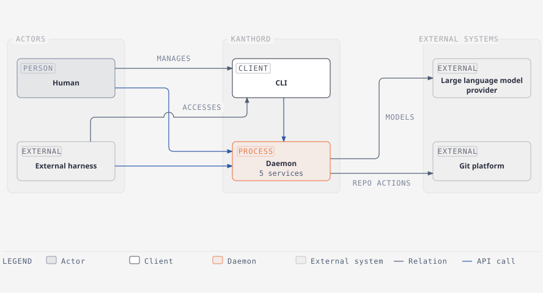
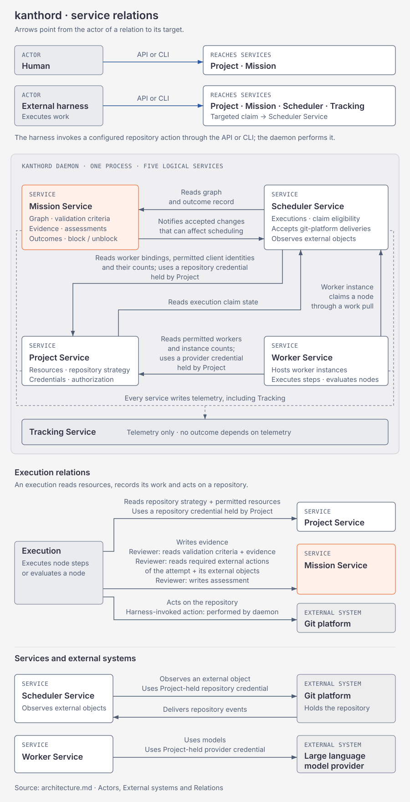

# Architecture

## Scope

This document describes the top level of kanthord.
It names the services, their responsibilities and their relations.
It describes no mechanism inside a service.

## Container diagram

The container view shows the daemon and its CLI client, with the actors and external systems around them.
The five services are logical boundaries inside the daemon, not separate containers.

## Services

A service is a logical part of one process.
A service boundary separates authority.
A service boundary does not describe a deployment.

### Project Service

The Project Service holds the resources of a project.
A project names the mission that it ships, the repositories that it uses, and the workers, agents and providers that it permits.
A project holds the repository strategy.
A project configures the instances that are available for work.
It holds the credentials that the resources of a project require, and it authorizes their use.

### Mission Service

The Mission Service holds the mission of one project.
It maps one to one with a project.
It represents a mission as a graph.
It holds the validation criteria of every node.
It holds the evidence record, the assessment record and the outcome record of every node.
It stores the content of evidence that no other system holds.
It stores the address of evidence that a repository holds.
No credential enters evidence.
It records the block and the unblock of every node.
Every write of a validation criterion, of an assessment and of an outcome passes through the Mission Service.
The worker that executes a node never writes the assessment of that node.

### Scheduler Service

The Scheduler Service manages runs.
It determines which nodes are available for work.
It does not make a blocked node available.
It records a run when a worker instance takes an available node.

### Worker Service

The Worker Service supplies the workers and the agents.
It runs the worker instances that execute a node, and the worker instances that evaluate a node.
It uses a large language model provider and a coding agent.

### Tracking Service

The Tracking Service holds telemetry.
It holds no other kind of record.
Telemetry retention differs from evidence retention.
No outcome depends on telemetry.
No credential enters telemetry.

## Service diagram

The service view shows the five services inside the daemon.
It shows the relations that the sections below name.

## Actors

- A human configures a project, carries out steps, reviews results and overrides an outcome.
- An external harness executes work, and it reaches kanthord as a client through the API or the CLI.
  It performs no authenticated operation on an external system, and it invokes that operation through kanthord.

## External systems

- A git platform holds the repository that a project uses and accepts the configured repository action.
- A large language model provider serves the models that the Worker Service uses.

## Relations

- An external harness reaches the Mission Service, the Project Service and the Tracking Service through the API or the CLI.
- An external harness invokes a configured repository action through the API or the CLI, and the daemon performs that action.
- A human reaches the Project Service and the Mission Service through the API or the CLI.
- The Scheduler Service reads the graph and the outcome record from the Mission Service.
- A worker instance takes an available node from the Scheduler Service.
- A run reads the repository strategy and the permitted resources from the Project Service.
- A run uses a repository credential that the Project Service holds.
- A run writes evidence to the Mission Service.
- A reviewer run reads the validation criteria and the evidence from the Mission Service.
- A reviewer run writes the assessment to the Mission Service.
- A run acts on the repository through the git platform.
- The Worker Service reads the permitted workers and the instance counts from the Project Service.
- The Worker Service uses a provider credential that the Project Service holds.
- The Worker Service reaches a large language model provider.
- Every service writes telemetry to the Tracking Service.

## Vocabulary

- **service**: A logical part of one process with a boundary that separates authority.
- **telemetry**: An operational record of what the system did.
- **credential**: What authenticates an operation on a resource that a project uses.
