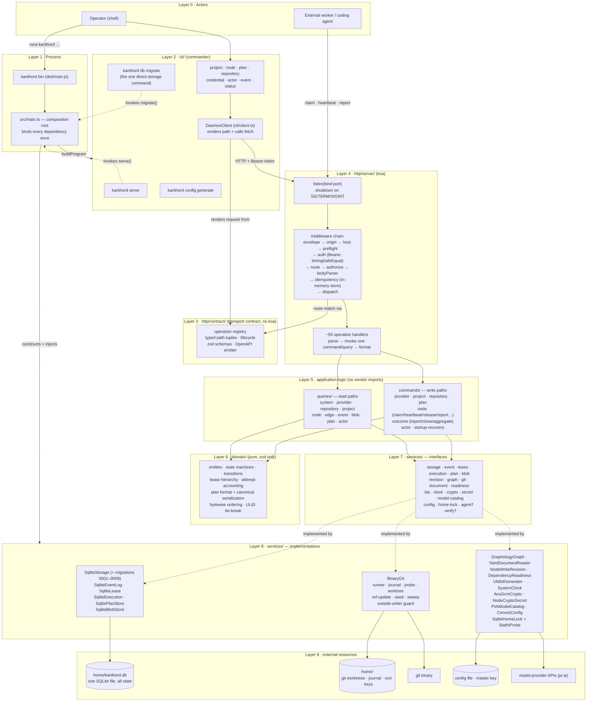

# kanthord Layered Architecture

## Notes

- `†`: `services/agent` and `services/verify` declare interfaces only. Their only implementation is `not-implemented`.
- Startup order: load config → acquire home lock → probe git tools → open and migrate SQLite → bootstrap actor → construct services → recover home → bind handlers → listen.
- One transaction rule: a write command opens one `storage.transact`, and event, lease, execution, and plan stores accept that transaction through their interfaces.
- The CLI imports no command or query. It renders paths from `http/contract/` and speaks HTTP.
