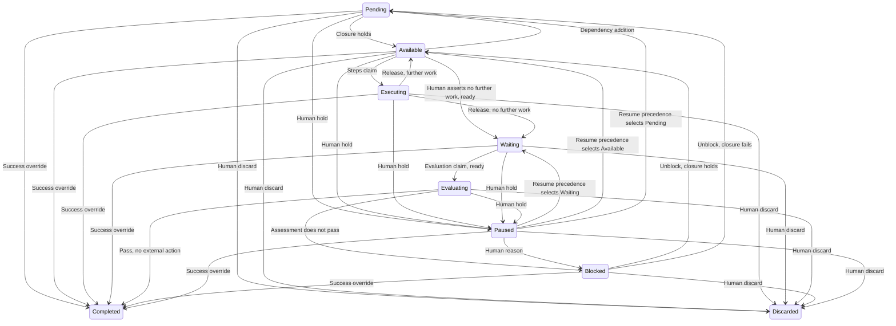
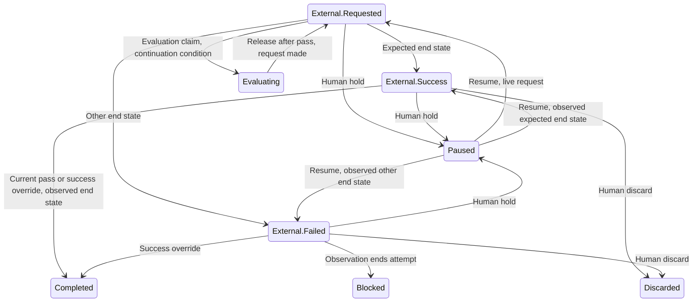

# Mission Service

## Scope

This document describes the Mission Service.
It describes the mission graph, the criteria authority, the evidence record and the assessment record.
It describes the outcome record and the state of a node.
It describes no mechanism of another service.

## Mission structure and nodes

The [overview](overview.vocabulary.md) defines a mission, an initiative, an objective, a task, an execution, a worker, the act of executing a node and landing.
A mission comes into existence with its project, empty and at mission revision 0. No operation creates or deletes a mission.
The mission is a directed graph.
A node of that graph is an initiative, an objective or a task.
Containment and dependency are the two edge kinds.
Every task belongs to exactly one objective.
Every objective belongs to exactly one initiative.
An initiative is a root of the graph.
The Mission Service permits a node with no child.

A dependency relates an initiative or an objective, in any combination of the two.
A task carries no dependency edge.
A task is a unit of execution inside a worker.
A task is never a unit of scheduling.
A dependency makes its dependent unavailable until the node that it names is `Completed`.
A human override that asserts success satisfies a dependency, because it makes the named node `Completed`.
A dependency establishes only what the criteria of the node that it names establish.

A node waits for the nodes that its own dependencies name.
A node waits for the nodes that the dependencies of its ancestors name.
The dependency closure of a node is the set of those nodes, and it holds no node of their subtrees.
The Mission Service checks that closure for a cycle.
It rejects a write that creates a cycle, at construction and at every update.
A containment edge alone forms no cycle, because containment descends from a parent to a child.

An unsatisfied dependency never blocks a node.
A dependency determines availability, and Block and unblock owns the block.

A dependency edit acts on the live graph at once.
A dependency addition requires that no live claim holds the dependent or a node in its subtree.
A dependency removal requires a dependent that is not terminal, because a removal never makes a closure stop holding.
This condition applies on both write paths, and it replaces the import condition for a dependency edit.
In the same transaction the Mission Service reroutes every claim-free node whose closure changes, `Pending -> Available` or `Available -> Pending`, and it writes the work-queue entries of those nodes.
The closure is read at `Pending -> Available`, `Available -> Pending`, the unblock routing and the resume precedence, and nowhere else.
An addition on a node whose execution ended changes no routing of that node, because the gate gates the start.

A landing observation is a platform action, and it uses the credential of a repository binding.

An objective names exactly one repository binding of its project.
An initiative names no repository binding.
A task names no repository binding, and a task acts on the repository that its objective names.
Two objectives name the same binding or different bindings.
An objective names any repository binding that its project holds.
An execution of an initiative derives its repositories from the objectives of that initiative.
One initiative holds work in many repositories.

The mission holds no branch, no merge and no repository action.
The mission supplies the grouping that a repository strategy uses.

A worker takes an initiative or an objective, and it never takes a task.
A worker executes a model judgement and an end-to-end test.
The mission holds precedence alone.
The priority of a node is a recorded act that orders the work queue of the Scheduler Service.
It is not part of the WHAT.
The mission holds no order over the tasks of an objective.

A human sets the priority of a node through the node API.
The Mission Service records the priority with the actor and the time of the act, outside the node revision.
No rule of the Mission Service reads the priority.
The Mission Service admits the act while no claim holds the node and the node is not terminal.
The work-queue entry that the Mission Service writes carries the priority, and an absent priority reads 0.
An import carries no priority.

## Validation criteria and authority

Planning occurs outside kanthord.
A human writes the initiatives, the objectives and the tasks in markdown.
A human decides what the system tests, and which command verifies it.
A human imports that plan into the Mission Service.
An execution creates no node, and an execution writes no criterion.
The import and the node API are the two write paths for a node and for a criterion.
The node API updates a node that holds an attempt, and that update carries the human override authority.
The node API deletes no node that holds an attempt.
The node API edits no node in a terminal state.
The node API reads no condition of the import when it updates a node.
A human takes responsibility for an edit through the node API.
Execution authority never grants planning authority.
No execution identity writes a node, and no execution identity writes a criterion.
An execution identity authorizes no import, whatever node that import names.

The Mission Service owns what an import carries, and it owns no syntax.
Markdown is the medium that a human writes a plan in.
The command line interface converts a plan into an import.
The Mission Service writes no plan file.

An import reconciles a snapshot, and the import set is authoritative.
A plan file that carries no identifier creates a node when the import condition holds.
A plan file that carries an identifier updates that node when the import condition holds.
A plan file that the set omits retires its node when the import condition holds.
A dependency names a plan file, and it carries no path.
The import resolves that name inside the import set.
A file name is unique inside the import set.

An import is atomic, and the Mission Service validates the resulting graph.
One import deletes a node and removes every current inbound reference to it when the import condition holds.
An import declares its scope.
An import names the mission revision that it expects, and a stale snapshot fails that check.
A preview confirms every retirement before the import applies.
The Mission Service rejects an unknown identifier, a duplicate identifier and an identifier of another mission.
An import request identifier binds to its payload, so a retry is idempotent.
The map of assigned identifiers stays retrievable.

A retirement removes the executable work of its node.
A retirement preserves the outcomes, the assessments, the evidence and the historical relations of that node.
A substantive update of a terminal node returns an error.
A node in a terminal state holds no new revision, because a terminal node is not editable.
A no-op import of a terminal node returns no error.

An import creates, updates and deletes a node, and each operation requires the import condition.
The condition holds when the node holds `Pending` or `Available` and its attempt counter reads 0.
Neither write path deletes a node that holds an attempt.
The delete condition is the same on both write paths, so the attempt counter of the node reads 0.
An import modifies no node that holds an attempt, whatever its state.
A release to `Pending` or `Available` leaves the node with an attempt and its records.
A create reads the condition on the parent whose child set changes.
The import condition of a task is the condition of its objective.
A task modification requires its objective to hold `Pending` or `Available` and its attempt counter to read 0.
This rule covers a create, an update and a delete of a task.
A containment move reads the condition on the moved node, the old parent and the new parent.
A dependency edit follows the condition of Mission structure and nodes, and it never reads the node that the dependency names.
A human who stops the work of a node discards that node.
The discard closes the attempt, and the closure writes the outcome and the task outcomes that it owes.
A human who also releases the dependents edits each dependent and removes the dependency.
That edit is a modification of the dependent, so the import condition governs it.
A node that started work stays in the graph, and a discarded node keeps its records.
A modification covers the record of the node, its parent link, its dependency edges and its child set.
The Mission Service terminates an import that fails the condition, and that import produces no effect.
A transaction and a lock cover the condition check and the commit together.
Work on another node never rejects an import and never delays one.
A genuine no-op makes no modification, so it requires no condition check.
The import decides a modification on the resolved graph and never on the text of a plan file, so an unchanged plan file whose dependency resolves to another node identifier is a modification of the dependent.

A change to the content of a node preserves the identity of that node and creates a node revision.
A node revision is one version of the whole content of a node.
It covers the goal, the steps, the validation criteria and every structured field of the node.
A node revision changes no other counter.
The attempt counter is independent of the revision number.
An attempt that a human unblock opens pins the node revision that its unblock names.
An attempt that no human unblock opens pins the revision current at its opening.
An active attempt keeps the revision that it pins.
A revision that a human writes during an open attempt never retargets that attempt.
An import never retargets an active attempt.
A node revision never reopens a node that holds a successful outcome.
That success stands under the revision that establishes it.
An import never unblocks a node, and an import never reopens a node.

The Mission Service returns the revisions of a node as a list, ordered by revision descending.
The read of a worker resolves to the revision that its attempt pins.
That revision is the head of the list that the Mission Service returns to it.
The read of a human returns every revision.
The list of a worker holds the pinned revision and every older revision, and the Mission Service computes no difference between revisions, because each record carries its change.
An execution reads no content of another node, except a current child objective of its initiative through the current outcome of that objective.
That read resolves to the revision that the attempt of that outcome pins.
A child objective that holds no outcome shows its identity and its state.
An execution reads no dependency edge, no node outside its own subtree and no historical record of another node.

A node revision names its reason, its actor and its time.
One record carries the change and its result.

A dependency change is not a field write.
The graph validation and the authority checks of the Mission Service govern it.

An edit of a node carries no state change.
It writes a node revision.
A human changes a state through the act that owns that state change.
An edit of a node that holds an open attempt states that its revision reaches the next attempt and not the open one.

A task holds no revision of its own, exactly as a task holds no state and holds no attempt.
The content of a task belongs to the node revision of its objective.
An edit of a task writes a node revision of its objective.
The execution of the objective reads its tasks from the revision that its attempt pins.

The read of a node names the revision that each attempt pins.
A revision that no attempt pins is visible as such.
On a terminal node no attempt ever pins it.

An import records the actor that submits it.
That record establishes attribution, and it establishes no authorship and no approval.
A criterion that states human authorship records a claim and establishes no authorship.

The verification command is a structured field of the node content, and an import carries it.
A human writes its value.
No execution identity infers a command from prose.
The [tested input](mission-service.vocabulary.md#tested-input) names the content that the command reads, and that content stays mutable.
Attribution and a judgement criterion protect the verification.
An exit status of zero proves that one command returned zero.
It proves nothing about test adequacy, about coverage or about a suppressed failure.

## Evidence

An evidence record carries a content address, a subject, a provenance and a scope.
An evidence record is separate from the content that it addresses.
A content address identifies the accepted bytes, and it establishes nothing about their claims.
Two executions with identical output produce two observations and two records.
A repeated address of unchanged content, with no new observation, creates no evidence.

A commit hash is the preferred address of work that a repository holds.
A commit hash is never required.
A SHA-256 hash addresses content that no repository holds.
Addressed prose is evidence, and a research report and a judgement rationale qualify.
An evaluation determines the strength of that evidence.
A claim that carries no addressed content is not evidence.

An external object is an entity of the Mission Service.
It represents one requested external action and the remote thing that serves it.
The entity is a representation.
It is informative, and no rule of the Mission Service reads it.
The Worker Service uses that representation under its own rules.
The Mission Service acts on an accepted observation alone.
An external object carries its own identity, because one binding of the Project Service serves several requests.
An external object names the external action that it fulfils, the binding of the Project Service, the address of the remote thing and a label for display.
The Mission Service parses no platform content.
An observer interprets the platform, and it writes the accepted observation.
An external action is resolved by an accepted observation of its expected end state.

An observation record is one kind.
It names the node and the attempt, the external action, the expected end state, the external object, the observed state, the observation time and the authorized observer that wrote it.
The observed state is the representation that the Mission Service holds of the external state.
An observer folds the state of a platform into it, and the Mission Service folds nothing itself.
An observation that establishes no end state leaves the request unresolved.
A failure to inspect the platform is therefore not a failure of the request, and it costs no attempt.
An outcome that an `External.Failed` observation closes names that observation, so the cause of the block is reachable from the outcome.
The basis of that outcome stays the passing assessment.

The Mission Service stores the content of produced evidence.
It stores the address of repository evidence.
Stored content stays retrievable.
An address resolves while its repository holds the content.

Evidence durability differs by node.
A task commit is an internal check, and it has meaning while a worker instance executes its objective.
The outcome of an objective represents the outcomes of its tasks after that objective lands.
The system guarantees no resolution of a task commit after that point.
An initiative reads the outcome of each objective and the evidence set that the outcome carries.
A landed commit is a commit identity that a landing observation appends or that a success override carries, and it is the durable repository evidence of an objective.
An objective that a success override completes without a landed commit identity, and an objective whose evidence no repository holds, carry no landed commit, so their outcomes stand on the human assertion or on the stored content.

The evidence of a node is a set of items, and it holds one item most of the time.
An accepted landing observation appends the landed commit identities to the evidence set.
A success override that carries a landed commit identity appends it to the evidence set, and the Mission Service accepts it as a landed commit and performs no check against the repository.
The evidence record of that landed commit names the human as its provenance.
An external action that is not a repository action adds no commit identities.
No assessment weighs the landed snapshot.

A landing record is the observation record of a landing.
A landing record names the external object.
It adds the commit identities.
An authorized observer writes a landing observation, because that observation happens after the execution releases.
An execution submits the evidence of its own node and the evidence of the tasks of that node.
Each submission carries a valid execution identity.
A late submission never becomes current because it arrives last.

A machine check binds its result to the [tested input](mission-service.vocabulary.md#tested-input) that it ran against.
It binds its result to the pinned node revision.
A named tested input does not prove that the check used it.
That binding is an assertion of the executor, unless a clean isolated checkout establishes it.
An executor report is attributable evidence, and it is not an independently verified check.

Evidence is append-only.
Redaction happens before an artifact receives its address.
An evidence record states that redaction transformed its content.
One exceptional path removes content that holds a credential.
An evidence submission is bounded, and it never truncates content silently.
Unassessed evidence, rejected evidence and abandoned evidence each carry a bounded retention.
The retention of outcome-dependent evidence is transitive.
It covers the evidence that supports every child outcome that an assessment weighs.
A correction names what it corrects.

## Run output

A run output is the account that an execution gives of its own run.
It holds what the execution tried, what stopped it and what it recommends for the next run.
A run output is no evidence, so it joins no evidence set and no assessment weighs it.

A run output names its node, its attempt, the execution identity that produced it and the node revision that its attempt pins.
An execution submits a run output before its release.
The Mission Service holds a run output that it accepted, and it recovers no submission that failed.
A repeated submission under one execution identity creates no second record.

The run outputs of a node accumulate.
An execution reads every run output of its node, and a closed attempt keeps its run outputs readable.
The Mission Service retains a run output while its node holds no terminal state, and a bounded retention follows a terminal state.

A run output changes no state of its node and closes no attempt.
It carries the recommendation of an execution as history, and never as a direction that binds a later execution or a human.

## Evaluation and assessment

The Mission Service performs no evaluation, and it is the record authority.
An execution under an evaluation claim performs an evaluation.
`reviewer@1` is a worker whose method is evaluation.
`reviewer@1` takes an objective or an initiative, and it never takes a task.

An evaluation is work that the Scheduler dispatches.
A node that needs an evaluation reaches `Waiting`, and a reviewer claims it through the Scheduler Service.
The readiness condition of Outcome and completion admits an evaluation claim.
An executor requests no evaluation.
Under kanthord's own harness a reviewer is a worker binding of its project.

Under the workers that kanthord hosts, the execution that carries out the steps of a node never writes the assessment of that node, because `general@1` declares `Available` and `reviewer@1` declares `Waiting` and `External.Requested`.
The Mission Service supplies the criteria and the evidence.
Under kanthord's own harness the executing worker never chooses the reviewer, and it never shapes the instructions of the reviewer.
Under an external harness the orchestrator of the harness chooses its reviewer, and kanthord does not verify that separation.
That separation is a separation of duties, and it is not independent verification.
The execution of an objective writes the assessment of each task of that objective.
A task assessment carries no separation of duties.
A task assessment names the node revision of its objective, because a task holds no revision of its own.
The independent review sits at the node whose outcome persists.

The scope of an evaluation differs by node, and its method follows its criterion.
The evaluation of an objective weighs the child outcomes and the tested input.
A model judgement transcript is evidence of its invocation, and it is not an assessment.
The boundary is authority, and it is not a file format.

An assessment names its evidence set and its node revision.
An assessment weighs the evidence against the criteria of that revision.
The assessment of an execution whose worker declares a base prompt also weighs the evidence against the [default standard](overview.vocabulary.md#default-standard).
A worker that an external harness hosts declares no base prompt, so its assessment weighs the criteria alone.
An assessment that finds a violation of the default standard does not pass.
It names every immutable child outcome record that it weighs.
It names the method that it applies and the actor that performs it.

Currency needs three checks.
Context asks whether an assessment matches the evidence that it names, the node revision that its attempt pins, the structure and the selected child outcomes.
The context check reads the evidence that the assessment names, and never requires equality with the whole evidence set.
The context check compares against the node revision that the attempt of the assessment pins.
It never compares against the latest revision of the node.
A revision that a human writes during an open attempt never invalidates the assessment of that attempt.
Authority checks intervening acts: a block, an unblock, a pause, a resume, a discard, a human override and an attempt closure.
The authority check determines whether an assessment still affects current state.
An attempt closure never invalidates a completed record.
An attempt closure scopes a record to its own attempt.
A pause and a resume never invalidate a passing assessment by themselves.
Order selects the latest assessment that those two checks admit.
The record order answers the order check alone.
A changed child outcome invalidates the currency of the assessment of its parent.
That invalidation queues no retry, and it reopens no terminal success.
Assessments accumulate, and the Mission Service overwrites none and deletes none.
An assessment that names a superseded context is never current.

An evaluation has a durable lifecycle, and that lifecycle is independent of execution.
An unreachable reviewer marks an incomplete evaluation.
An incomplete evaluation differs from evidence that establishes no result.
A bounded retry resumes the evaluation.
That retry repeats no execution and no repository action.

## Outcome and completion

The evidence is the artifact of the execution.
The assessment is the artifact of the evaluation.
An attempt closure produces the outcome, and the Mission Service writes it on the closing transition.

### State of a node

The state set covers an initiative and an objective.
A task holds no state, and the worker instance manages the state of a task inside its execution.
The set holds twelve states.

- **Pending**: A node of the dependency closure of this node is not `Completed`.
  No claim holds the node.
- **Available**: Every node of that closure is `Completed`, and execution requires further work.
  No claim holds the node.
- **Executing**: A worker instance holds the claim to execute the node's steps.
- **Waiting**: The execution of the open attempt requires no further work.
  No claim holds the node.
- **Evaluating**: A reviewer execution holds the claim.
- **Blocked**: The attempt closes on a condition, and a human unblock authorizes the next attempt.
  A condition follows the evaluation, except the human block of a paused node.
  No claim holds the node.
- **Paused**: A human holds the work of the node temporarily.
  An open attempt stays open.
  No claim holds the node.
- **Completed**: The node closes with a successful outcome.
- **Discarded**: The node closes with no successful outcome.
- **External.Requested**: The open attempt requests a required external action, and not every required external action of the attempt has reached its expected end state.
  No claim holds the node.
- **External.Success**: Every required external action of the attempt reaches its expected end state.
  No claim holds the node.
- **External.Failed**: A required external action of the attempt ends in a state other than its expected end state.
  No claim holds the node.

`Completed` and `Discarded` are the two terminal states.
A terminal state opens no further attempt, and nothing moves a node out of it.
A terminal node is not editable.
No human override reaches a terminal node, and no correction reaches its outcome.
A human who needs further work on a completed node adds a new node.
An edit writes the WHAT, and a correction writes a new outcome record.

Three conditions reach `Blocked`, and each follows the evaluation except the human block.
They are a current assessment that does not pass, an `External.Failed` observation and a human reason on a paused node.
A dependency produces `Pending` under the dependency rules of Mission structure and nodes.
`External.Failed` folds every non-success end state of the external system.
The [observer](scheduler-service.vocabulary.md#observer) records the detail of that state in the observed state.

### Attempt

At most one attempt of a node is open.
A node whose attempt never opened holds no attempt, and its attempt counter reads 0.
Three acts open an attempt.

- a claim of the node, which opens attempt 1 when the node holds no attempt
- the human assertion that the execution requires no further work, which opens attempt 1 when the node holds no attempt
- a human unblock, which opens the next attempt

An execution and an evaluation attempt pin the attempt that they start under.
An attempt fixes the required external actions of its node at its opening, from the configuration of the Project Service current at that moment, and it records them next to the node revision that it pins.
A configuration change during an open attempt reaches the next attempt.
Every record names its attempt, and it stays the record of that attempt forever.
An attempt closure ends every execution and every evaluation attempt in flight under that attempt.
It invalidates continuation, and it never invalidates a completed record.
A closed attempt never reopens.
An opening and an attempt closure are separate acts.
An attempt that a human unblock opens holds no claim until a claim arrives.
A block of a node whose attempt counter reads 0 closes no attempt, and the counter stays 0.
The unblock of that node clears no attempt and opens none.
A record never migrates into the next attempt.
A human unblock therefore returns the node to `Available` or to `Pending`, and never to `Waiting`.

### Readiness condition

`Waiting` means released, and it does not mean claimable.
The readiness condition admits an evaluation claim when the child rule and the external action rule hold.
It also admits the human assertion of `Available -> Waiting`.
For an objective, every current task holds a current outcome of the open attempt of that objective.
The condition reads the existence of a current child outcome, and never its result.
For an initiative, every current objective holds a terminal state.
No external action of the open attempt is unresolved.
The condition reads the current children of the node, and a retirement removes a node from that set.

### Continuation condition

The continuation condition admits an evaluation claim from `External.Requested`.
It holds when a required external action of the attempt is unrequested and the action that it follows has reached its expected end state.
The Project Service owns what a configured action follows.

### Successful outcome

The ordinary path needs a current passing assessment and the observed expected end state of every required external action of the attempt.
Neither fact alone publishes a successful outcome.
A node that requires no external action needs the assessment alone.
An initiative configures no external action.
Evaluation and assessment owns the currency of an assessment.
The evaluation of a node precedes its external request.
The reviewer execution requests each required external action, and an action that follows another action is requested after that action reaches its expected end state.
The assessment names the [tested input](mission-service.vocabulary.md#tested-input) of its machine check.
Evidence owns the record of the landed commit identities.

### Outcome record

An outcome record holds these fields.

- The node and the attempt.
- The closing event and the stopping reason, separately from the asserted result.
- The asserted result: success, the results do not meet the criteria or the default standard, or nothing is established.
- The basis: an assessment or a human assertion.
- The assessment and its evaluation context, when the basis is an assessment.
- The actor and the human decision, when the basis is a human assertion.
- The evidence set that the outcome carries.
- The previous outcome, when the outcome corrects one.

An absent assessment reference means that the basis carries none, and it never means that an evaluation is pending.
An outcome that asserts that the results do not meet the criteria or the default standard names an assessment as its basis.
A human override that asserts success writes a successful outcome whose basis is a human assertion.
A success override carries an optional landed commit identity.
A discard writes an outcome whose basis is a human assertion and whose asserted result is that nothing is established.
A discarded node satisfies no dependency.
An `External.Failed` observation ends the attempt with an outcome whose basis names the passing assessment.
That outcome records the stopping reason of the external action and asserts that nothing is established, because the expected end state is absent.

### Task outcomes

An execution of an objective writes the outcome of each task alongside the task assessment that Evaluation and assessment requires.
A task outcome carries the commit of that task inside the branch of the objective as its evidence.
The readiness condition enforces the task-outcome obligation on the ordinary path.
Every attempt closure owes the outcome of each task of the node.
At the closure, the Mission Service writes the task outcomes that do not exist.
It uses the closing event as the stopping reason.

### State transitions

The closure in the transition events is the dependency closure of the node.
It holds when every node of that closure is `Completed`.
Each row names the event, the effect on the attempt and the record that the transition writes.
A node reaches a terminal state only when no external action of its open attempt is unresolved.
An external action is unresolved when the open attempt requests it and no accepted observation establishes an end state.
This invariant also governs `Paused -> Completed` and `Paused -> Discarded`.

A human resume reads the required external actions of the attempt, their requests and their accepted observations first.
When a required action ended in a state other than its expected end state, the node goes to `External.Failed`.
Otherwise, when a required action is requested and every required action has reached its expected end state, the node goes to `External.Success`.
Otherwise, when a required action is requested, the node goes to `External.Requested`.
Otherwise the execution-end fact of the attempt sends the node to `Waiting`.
Otherwise the dependency closure sends the node to `Available` when it holds, or to `Pending` when it does not hold.

| Transition | Event | Attempt | Record |
| --- | --- | --- | --- |
| `Pending -> Available` | The closure holds: the last named node enters `Completed`, or a dependency removal | No effect | None |
| `Pending -> Paused` | Human holds the node | Stays open | None |
| `Pending -> Completed` | Human override asserts success | Closes by force | Outcome |
| `Pending -> Discarded` | Human discards the node | Closes by force | Outcome |
| `Available -> Executing` | Steps claim | Opens the attempt when the node holds none; no effect otherwise | None |
| `Available -> Waiting` | Human asserts that the execution of the attempt requires no further work; the readiness condition holds | Opens the attempt when the node holds none; no effect otherwise | None |
| `Available -> Pending` | Dependency addition; the closure does not hold | No effect | None |
| `Available -> Paused` | Human holds the node | Stays open | None |
| `Available -> Completed` | Human override asserts success | Closes by force | Outcome |
| `Available -> Discarded` | Human discards the node | Closes by force | Outcome |
| `Executing -> Waiting` | Release; the execution of the attempt requires no further work | No effect | Evidence |
| `Executing -> Available` | Release; execution requires further work | No effect | Run output |
| `Executing -> Paused` | Human holds the node; execution stops | Stays open | None |
| `Executing -> Completed` | Human override asserts success | Closes by force | Outcome |
| `Executing -> Discarded` | Human discards the node | Closes by force | Outcome |
| `Waiting -> Evaluating` | Evaluation claim; readiness condition holds | No effect | None |
| `Waiting -> Paused` | Human holds the node | Stays open | None |
| `Waiting -> Completed` | Human override asserts success | Closes by force | Outcome |
| `Waiting -> Discarded` | Human discards the node | Closes by force | Outcome |
| `Evaluating -> Completed` | Current passing assessment; node requires no external action | Closes | Outcome |
| `Evaluating -> External.Requested` | Release; current passing assessment stands, and a required external action of the attempt is requested | No effect | Assessment |
| `Evaluating -> Blocked` | Current assessment does not pass | Closes | Outcome |
| `Evaluating -> Paused` | Human holds the node; reviewer execution stops | Stays open | None |
| `Evaluating -> Discarded` | Human discards the node | Closes by force | Outcome |
| `Blocked -> Available` | Human unblock; closure holds | Next attempt opens when the cleared attempt exists | Unblock record |
| `Blocked -> Pending` | Human unblock; closure does not hold | Next attempt opens when the cleared attempt exists | Unblock record |
| `Blocked -> Completed` | Human override asserts success | No open attempt | Outcome |
| `Blocked -> Discarded` | Human discards the node | No open attempt | Outcome |
| `Paused -> Waiting` | Human resumes the node; resume precedence selects Waiting | Stays open | None |
| `Paused -> Available` | Human resumes the node; resume precedence selects Available | Stays open | None |
| `Paused -> Pending` | Human resumes the node; resume precedence selects Pending | Stays open | None |
| `Paused -> External.Requested` | Human resumes the node; resume precedence selects External.Requested | Stays open | None |
| `Paused -> External.Success` | Human resumes the node; resume precedence selects External.Success | Stays open | None |
| `Paused -> External.Failed` | Human resumes the node; resume precedence selects External.Failed | Stays open | None |
| `Paused -> Blocked` | Human blocks the node; record carries the human reason | Closes when an attempt is open; no effect when the counter reads 0; counter stays 0 | Outcome |
| `Paused -> Completed` | Human override asserts success | Closes by force | Outcome |
| `Paused -> Discarded` | Human discards the node | Closes by force | Outcome |
| `External.Requested -> External.Success` | Accepted observation establishes the expected end state of the last unresolved required external action | No effect | Observation record; a landing adds the landed commit identities to the evidence set; an external action that is not a repository action adds none |
| `External.Requested -> External.Failed` | Accepted observation establishes another end state of the request | No effect | Observation record |
| `External.Requested -> Paused` | Human holds the node | Stays open | None |
| `External.Requested -> Evaluating` | Evaluation claim; the continuation condition holds | No effect | None |
| `External.Success -> Completed` | Current passing assessment stands, or human override asserts success after the observation resolves the request | Closes | Outcome |
| `External.Success -> Paused` | Human holds the node | Stays open | None |
| `External.Success -> Discarded` | Human discards the node | Closes by force | Outcome |
| `External.Failed -> Blocked` | Observation ends the attempt | Closes | Outcome |
| `External.Failed -> Completed` | Human override asserts success | Closes by force | Outcome |
| `External.Failed -> Paused` | Human holds the node | Stays open | None |
| `External.Failed -> Discarded` | Human discards the node | Closes by force | Outcome |

The internal case holds nine states.

The external segment holds three external states and the transitions across its boundary.

### Boundary

Mission structure and nodes owns the dependency and the repository binding of a node.
Evidence owns the evidence record and its durability.
Run output owns the run output record and its retention.
Evaluation and assessment owns the lifecycle of an evaluation.
Block and unblock owns the block and the unblock.
The Worker Service owns how the reviewer execution performs the request of a required external action and the idempotency of that request across an attempt boundary.
The Mission Service records the external object.
No rule of the Mission Service reads that record to decide whether to request the action again.
The Mission Service writes the work queue of the Scheduler Service through its public insert and delete, in the transaction that commits every accepted fact that changes the claimability or the priority of a node: a state transition, an accepted observation, an outcome and a priority change.
After the commit the Mission Service wakes the Scheduler Service.
The Scheduler Service owns the work queue, the claim and the lease.

## Block and unblock

### The block

A block is the closure of an attempt on one of the three conditions that Outcome and completion names.
Outcome and completion owns the block of a node that holds no attempt.

A block writes no separate block record.
The closure writes the outcome of the node and the task outcomes that Outcome and completion owes.
The outcome names the condition through its closing event, its stopping reason and its basis.
A block cancels no live request of the closed attempt, and the next attempt reads that request through its external object.

A block changes the state of no other node.
A dependent follows the dependency rules of Mission structure and nodes.
A parent follows the readiness condition of Outcome and completion.
A sibling is unaffected.

A block exists for an initiative and for an objective.
A task is never blocked, because Outcome and completion states that a task holds no state.
The execution of the objective drives every task lifecycle.

The transition that reaches `Blocked` closes the attempt and sets the state in one transaction.
A claim serializes with that transaction, so the Mission Service holds no dispatch window.
The Scheduler Service owns the enforcement at the claim.

### The human block

A human blocks a paused node, and that path is the only human block.

The outcome carries the human reason as the human decision.

The human block closes the attempt when one is open.
A block of a node whose attempt counter reads 0 takes no effect on that counter.
The unblock of that node clears no attempt and opens none.
[Attempt](#attempt) owns the acts that open an attempt.

The human block closes the attempt, so a worker instance executes the node again under the next attempt.
The records of the closed attempt stay.
The effects on a repository and on a platform stay.
A human who keeps the attempt resumable leaves the node in `Paused`.

### The unblock

An unblock is one atomic act.
It names the attempt that it clears.
It names the node revision that it expects.
It carries a content change when the human changes the direction.
It carries a request identifier that binds to its payload.

The act checks the authority of the human, the blocked attempt and the expected revision.
An unblock that carries a content change also checks the authority that a node edit requires.
It writes the node revision when the human carries a change.
It opens exactly one attempt, and it pins a revision to that attempt.
An unblock of a node whose attempt counter reads 0 opens none.

The expected revision is the current revision of the node when the human submits the act.
A content change uses that revision as its base and writes the next revision.
The attempt pins the revision that the act leaves current.

The act recognizes a repeat of an accepted request identifier before it checks the attempt and the revision.
A retry of an accepted unblock returns the accepted record and costs no second attempt.
The same identifier with a different payload is refused.

A repeat of an accepted request identifier authorizes no second attempt, because the act returns the accepted record.
A later request that names a cleared attempt or a superseded revision authorizes no attempt, because the check refuses it.

An unblock writes an unblock record.
The record names the node, the attempt that it clears, the attempt that it opens, the node revision that it pins, the actor and the time.

Every human direction enters the node revision.
The unblock carries that change.
The unblock record carries no direction of its own.

A human who redirects a node that holds an open attempt pauses the node, blocks it and unblocks it with the content change.

Outcome and completion owns the routing of the opened attempt to `Available` or to `Pending`.

The next execution reads the node revision that its attempt pins.
It reads the outcome of the cleared attempt and the cause that the outcome names.
It reads the unblock record of its attempt.
A read of a record of a closed attempt migrates nothing.

The external conversation stays with its platform.
The Mission Service copies no external content.
The next execution fetches that content through the external object.

The actor of an unblock is a human.
That human carries a [human identity](overview.vocabulary.md#human-identity).
No execution identity and no client identity unblocks a node.
The Gateway Service owns how a human identity is established.

The eligibility of an unblock reads the state of the node alone.
It reads no state of the parent.
The routing of the opened attempt still reads the dependency closure.
A content change still passes the graph validation and the authority checks.

The authorization that an unblock carries asserts nothing about the results.
It changes no criterion.
A content change that the same act carries changes the node revision.
The human takes that responsibility.

### The enforcement

The claim operation refuses a claim of a blocked node, whether the claim is to execute the node's steps or to evaluate the node, on both harnesses.

An execution submission or an evaluation submission that names a closed attempt never becomes current because it arrives after the closure.
Evaluation and assessment owns that rule.
A completed record stays valid.

An execution operation that a client requests through the API requires a live claim.
No execution operation proceeds on a blocked node.
An authorized observation needs no claim, because an observation is not an execution operation.
A human who acts directly on the platform is outside the API.
The Mission Service refuses nothing there.
The Project Service owns the authorization of each operation on a resource.

An import never unblocks a node.
Validation criteria and authority owns that rule.

### The read

A client reads the blocked nodes of a mission.
For each node, the read returns the outcome of the closed attempt.
That outcome names its closing event, so the read never infers a cause from the order of the records.
The read returns the external object of every external action that the attempt requests, with the observed state of each one.
A node whose attempt requests no external action returns none.
