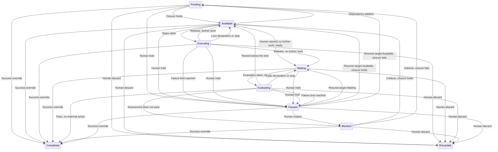
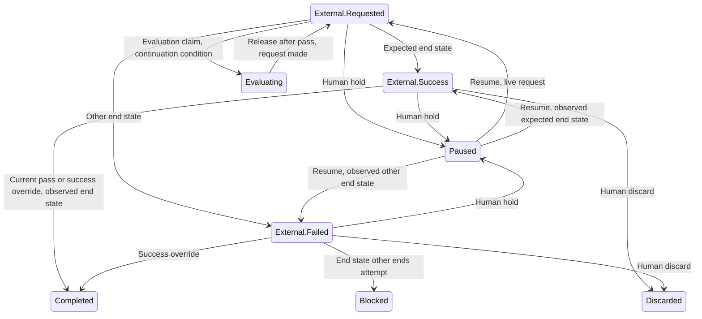

# Mission Service

## Scope

This document describes the Mission Service.
It describes the mission graph, the criterion authority, the evidence record and the assessment record.
It describes the outcome record and the state of a node.
It describes delivery admission and the human check of a request.
It describes no mechanism of another service.

## Mission structure and nodes

The [overview](overview.vocabulary.md) defines a mission, an initiative, an objective, a task, an execution, a worker, the act of executing a node and landing.
A mission comes into existence with its project, empty and at mission version 1. No operation creates or deletes a mission.
The mission is a directed graph.
A node of that graph is an initiative, an objective or a task.
Every node holds a name, a requirement, a criterion, its verifications and its bindings.
A node holds a [plan file name](mission-service.vocabulary.md#plan-file-name) that is unique among the nodes of its mission that are not retired.
A retired node keeps its plan file name as a record, and a node that is not retired can take that name.
An export writes that name.
The name is a title and no identity.
A node revision covers that whole content.
Containment and dependency are the two edge kinds.
Every task belongs to exactly one objective.
Every objective belongs to exactly one initiative.
An initiative is a root of the graph.
The Mission Service permits a node with no child.
An import refuses an objective with no task, as [Criterion and authority](#criterion-and-authority) states.

A dependency relates an initiative or an objective, in any combination of the two.
A task carries no dependency edge.
A task is a unit of execution inside a worker.
A task is never a unit of scheduling.
A dependency makes its dependent unavailable until the node that it names is `Completed`.
A human override that asserts success satisfies a dependency, because it makes the named node `Completed`.
A dependency establishes only what the criterion of the node that it names establishes.

A node waits for the nodes that its own dependencies name.
A node waits for the nodes that the dependencies of its ancestors name.
The dependency closure of a node is the set of those nodes, and it holds no node of their subtrees.
The Mission Service checks the closure edges and the wait edges for a cycle.
It rejects a write that creates a cycle, at construction and at every update.
A wait edge leads from each initiative to each of its current objectives, because the initiative steps condition waits for them.
A dependency from an objective to its own initiative therefore forms a cycle.

An unsatisfied dependency never blocks a node.
A dependency determines availability, and Block and unblock owns the block.

A dependency edit acts on the live graph at once.
A dependency addition requires that no live claim holds the dependent or a node in its subtree.
A dependency removal requires a dependent that is not terminal, because a removal never makes a closure stop holding.
This condition applies on both write paths, and it replaces the import condition for a dependency edit.
In the same transaction the Mission Service reroutes every claim-free node whose closure changes, `Pending -> Available` or `Available -> Pending`, and it writes the jobs of those nodes.
The closure is read at `Pending -> Available`, `Available -> Pending`, the unblock routing and the resume precedence, and nowhere else.
An addition on a node whose execution ended changes no routing of that node, because the gate gates the start.

The check of a landing is a platform operation of the Intake Service, and it uses the credential of a repository binding.

A node names the bindings that its kind permits, and each binding kind states how many a node of each kind names.
An initiative names no repository binding.
A task names no repository binding, and a task acts on the repository that its objective names.
An initiative or an objective names at most one storage binding, and its uploads use that binding.
A task names no storage binding.
Two objectives name the same binding or different bindings.
An objective names any repository binding that its project holds.
An execution of an initiative derives its repositories from the objectives of that initiative, for its verifications too.
One initiative holds work in many repositories.

The mission holds no branch, no merge and no repository action.
The mission supplies the grouping that a repository strategy uses.

A worker takes an initiative or an objective, and it never takes a task.
A worker executes a model judgement and an end-to-end test.
The mission holds precedence alone.
The priority of a node orders the work queue of the Scheduler Service.
It is not part of the WHAT.
The mission holds no order over the tasks of an objective.

A human sets the priority of an initiative or an objective through the node API.
A task holds no priority, because a task is never a unit of scheduling.
The priority is outside the node revision, and no Mission record keeps the earlier value, the actor, the reason or the time of a priority act.
No rule of the Mission Service reads the priority.
The Mission Service admits the act while no claim holds the node and the node is not terminal.
The job that the Mission Service writes carries the priority, and an absent priority reads 0.
An import carries no priority.

## Criterion and authority

Planning occurs outside kanthord.
A human writes the initiatives, the objectives and the tasks in markdown.
A human decides what the system tests, and which verifications check it.
A human imports that plan into the Mission Service.
An execution creates no node, and an execution writes no criterion.
The import and the node API are the two write paths for a node and for a criterion.
The node API updates a node that holds an attempt, and that update carries the human override authority.
A human retires a node through an import that omits its plan file, or through the node API.
The node API creates an initiative at any time.
It creates an objective or a task under a parent that holds `Pending`, `Available`, `Executing`, `Blocked` or `Paused`.
The node API edits no node in a terminal state.
The node API reads no condition of the import when it updates a node.
A human takes responsibility for an edit through the node API.
A rebind is a node API update that changes only the bindings of a node.
It moves the pinned binding revision of one node, or of every node of a mission, to a later revision of the same binding.
It admits every node that is not terminal and not retired.
An open attempt keeps its pinned node revision, so the new binding revision applies at the next attempt.
A rebind of every node of a mission skips each terminal or retired node and reports it.
A rebind refuses a revision of another binding, a tombstone and a disabled revision.
Execution authority never grants planning authority.
No execution identity writes a node, and no execution identity writes a criterion.
An execution identity authorizes no import, whatever node that import names.

The Mission Service owns the Markdown format and the JSON format of a plan.
Markdown is the medium that a human writes a plan in.
The Mission Service exports the current nodes of a mission in both formats, and each export imports back unchanged.

An import reconciles a snapshot, and the import set is authoritative.
A plan file that carries no identifier creates a node when the import condition holds.
A plan file that carries an identifier updates that node when the import condition holds.
A plan file that the set omits retires its node when the import condition holds.
A dependency names a plan file, and it carries no path.
The import resolves that name inside the import set.
A file name is unique inside the import set.

An import is atomic, and the Mission Service validates the resulting graph.
One import retires a node and removes every current inbound reference to it when the import condition holds.
An import covers the whole mission.
An import names the mission version that it expects, and a stale snapshot fails that check.
A write that changes the structure of a mission or the content of a node increments the mission version once.
No other write changes it.
Every `human` write that changes a node, its edges or its state names the mission version that it expects, and a stale value refuses the write, so a human reviews every change of the mission before the next write. A `client` write of an execution names no mission version.
A preview confirms every retirement before the import applies.
The Mission Service rejects an unknown identifier, a duplicate identifier, an identifier of another mission and an identifier of a retired node.

A retirement removes the executable work of its node.
A retirement preserves the outcomes, the assessments, the evidence and the historical relations of that node.
A retirement deletes no node record.
A retired node keeps its identity, its plan file name, its revisions and its last state.
A retirement is final, and no operation reverses it.
A retired node accepts no write, and no write names a retired node as a parent or a dependency.

A node API retirement retires the named node and every current descendant of that node.
It checks every retiring initiative and every retiring objective itself, and every retiring task through its objective.
Each check requires `Pending` or `Available` and an attempt that reads 0.
A dependency on a retiring node from a nonterminal dependent outside the [retirement set](mission-service.vocabulary.md#retirement-set) refuses the retirement.
A human who forces the retirement removes that dependency.
Each freed dependent moves between `Pending` and `Available` by its remaining dependencies.
A dependency from a terminal dependent stays as a historical relation.
A preview confirms the retirement set and the removed dependencies before the retirement applies.
The retirement is atomic and increments the mission version once.
A retirement removes a node that never started work, with no outcome.

A substantive update of a terminal node returns an error.
A node in a terminal state holds no new revision, because a terminal node is not editable.
A no-op import of a terminal node returns no error.

An import creates, updates and retires a node, and each operation requires the import condition.
The condition holds when the node holds `Pending` or `Available` and its attempt reads 0.
An import retires no node that holds an attempt.
An import modifies no node that holds an attempt, whatever its state.
A release to `Pending` or `Available` leaves the node with an attempt and its records.
An import create reads the condition on the parent whose child set changes.
The import condition of a task is the condition of its objective.
A task modification requires its objective to hold `Pending` or `Available` and its attempt to read 0.
This rule covers a create, an update and a retirement of a task.
A containment move reads the condition on the moved node, the old parent and the new parent.
A dependency edit follows the condition of Mission structure and nodes, and it never reads the node that the dependency names.
A human who stops the work of a node discards that node.
The discard closes the attempt, and the closure writes the outcome of the node.
A human who also releases the dependents edits each dependent and removes the dependency.
That edit is a dependency removal, so the dependency rule governs it, not the import condition.
A node that started work stays in the graph, and a discarded node keeps its records.
A modification covers the record of the node, its parent link and its child set.
The Mission Service terminates an import that fails the condition, and that import produces no effect.
A transaction and a lock cover the condition check and the commit together.
Work on another node never rejects an import and never delays one.
A genuine no-op makes no modification, so it requires no condition check.
The import decides a modification on the resolved graph and never on the text of a plan file, so an unchanged plan file whose dependency resolves to another node identifier is a dependency edit of the dependent, not a no-op.

A change to the content of a node preserves the identity of that node and creates a node revision.
A node revision is one immutable snapshot of the whole content of a node.
It covers the plan file name, the name, the requirement, the criterion, the verifications and the bindings.
A node starts at node revision 1.
A node revision changes no attempt.
The attempt is independent of the revision number.
An attempt that a human unblock opens pins the node revision that its unblock names.
An attempt that no human unblock opens pins the revision current at its opening.
An active attempt keeps the revision that it pins.
A revision that a human writes during an open attempt never retargets that attempt.
An import never retargets an active attempt.
A node revision never reopens a node that holds a successful outcome.
That success stands under the revision that establishes it.
An import never unblocks a node, and an import never reopens a node.

The Mission Service returns the revisions of a node as a list, ordered by revision descending.
The read of a worker resolves to the revision that its attempt pins.
That revision is the head of the list that the Mission Service returns to it.
The read of a human returns every revision.
The list of a worker holds the pinned revision and every older revision, and the Mission Service computes no difference between revisions, because each record carries its change.
An execution reads no content of another node, except a current child objective of its initiative through the current outcome of that objective.
That read resolves to the revision that the attempt of that outcome pins, or to the revision current at the human act when the outcome names no attempt.
A child objective that holds no outcome shows its identity and its state.
An execution reads no dependency edge, no node outside its own subtree and no historical record of another node.

A node revision names its reason, its actor and its time.
One record carries the change and its result.

A dependency change is not a field write.
The graph validation and the authority checks of the Mission Service govern it.

An edit of a node carries no state change.
It writes a node revision.
A human changes a state through the act that owns that state change.
An edit of a node that holds an open attempt states that its revision reaches the next attempt and not the open one.

A task holds no revision of its own, exactly as a task holds no state and holds no attempt.
The content of a task belongs to the node revision of its objective.
An edit of a task writes a node revision of its objective.
The execution of the objective reads its tasks from the revision that its attempt pins.

The read of a node names the revision that each attempt pins.
A revision that no attempt pins is visible as such.
On a terminal node no attempt ever pins it.

An import records the actor that submits it.
That record establishes attribution, and it establishes no authorship and no approval.

Every node holds a criterion and at least one verification.
A task is a final-state requirement of its objective, not a transient step.
Its criterion and its verifications hold at the head of the node branch.
The verifications are an ordered list in the node content, and an import carries them.
A human writes their value.
No execution identity infers a verification from prose.
An import requires that each verification of an objective equals a verification of at least one task of that objective in the import set.
An import therefore refuses an objective with no task.
The node API and the change of an unblock do not check this coverage.
The [tested input](mission-service.vocabulary.md#tested-input) names the content that the verification reads, and that content stays mutable.
Attribution and judgement against the criterion protect the verification.
An exit status of zero proves that one verification returned zero.
It proves nothing about test adequacy, about coverage or about a suppressed failure.

## Evidence

An evidence record carries one or more assets, a subject, a provenance and a scope.
The scope of an evidence record is its node and its attempt.
An evidence record is separate from the content that its assets address.
An asset identifies the accepted content, and it establishes nothing about its claims.
Two executions with identical output produce two records.
A repeated submission after a server restart or after the replay window creates a second record, and the Mission Service accepts that duplicate.

A commit hash is the preferred address of work that a repository holds.
A commit hash is never required.
A SHA-256 hash, or an object location and its version when the store keeps one, addresses content that no repository holds.
Addressed prose is evidence, and a research report and a judgement rationale qualify.
An evaluation determines the strength of that evidence.
A claim that carries no addressed content is not evidence.

A request evidence is the evidence of one requested external action.
Its requirement key names the required external action of the attempt that it answers.
It holds one asset: the address of the [external object](mission-service.vocabulary.md#external-object), which is the remote thing that serves the request.
A requirement key names only a required external action, and every other evidence holds none.
An attempt holds at most one request evidence for each required external action.
The Mission Service reads the existence of a request evidence to decide whether an attempt requested a required external action.
The Worker Service uses the request evidence under its own rules.
The Mission Service parses no platform content.
The Intake Service reads the platform, and the platform implementation of the [Repository component](repository.md#platform-connector-and-platform-implementations) folds the platform state into an end state.
The Mission Service sets the end state of a request evidence once, as expected or other, and it refuses a later conclusive result for the same request.
No column records the time at which the end state is set.
An external action is resolved when its request evidence holds an end state.
A result that establishes no end state writes nothing and leaves the request unresolved.
A failure to inspect the platform is therefore not a failure of the request, and it costs no attempt.
The cause of an `External.Failed` block is the request evidence of the closed attempt whose end state is other, and the blocked-node read returns it.
The blocked-node read shows no cause when a human deleted that request evidence.
The basis of that outcome stays the passing assessment.

The Mission Service stores produced evidence as inline content or [object evidence](mission-service.vocabulary.md#object-evidence).
It stores the address of repository evidence.
Stored content stays retrievable until a human deletes it.
An address resolves while its repository holds the content.

Evidence durability differs by node.
A task commit is an internal step of the execution of its objective, and no record names it.
The outcome of an objective represents its tasks.
An initiative reads the outcome of each objective and the evidence set that the outcome carries.
A landed commit is a commit identity that the expected end state of a repository request appends or that a success override carries, and it is the durable repository evidence of an objective.
An objective that a success override completes without a landed commit identity, and an objective whose evidence no repository holds, carry no landed commit, so their outcomes stand on the human assessment or on the stored content.

The evidence of a node is a set of items, and it holds one item most of the time.
When a repository request reaches its expected end state, the Mission Service writes each landed commit as its own evidence record, with the Mission Service as provenance and the attempt of the request.
A success override that carries a landed commit identity appends it to the evidence set, and the Mission Service accepts it as a landed commit and performs no check against the repository.
The evidence record of that landed commit names the human as its provenance.
An external action that is not a repository action adds no commit identities.
No assessment weighs the landed snapshot.

The Mission Service sets the end state of a request after the execution releases, so no execution sets it.
An execution submits the evidence of its own node.
A task holds no evidence.
Each submission carries a valid execution identity.
A late submission never becomes current because it arrives last.

A verification binds its result to the [tested input](mission-service.vocabulary.md#tested-input) that it ran against.
It binds its result to the pinned node revision.
A named tested input does not prove that the check used it.
That binding is an assertion of the executor, unless a clean isolated checkout establishes it.
An executor report is attributable evidence, and it is not an independently verified check.

Evidence is append-only, except the end state of a request evidence and a human delete.
An evidence submission is bounded, and it never truncates content silently.
A correction is a new evidence record, and an assessment names the record that it weighs.

- An evidence record and its assets stay until a human deletes them. A delete removes the row, and a deleted row is gone and not recoverable.
- Only a human deletes an evidence asset or an evidence.
- A human deletes one asset, or deletes an evidence with every asset of it. The Mission Service deletes the content first and the row after it.
- A delete of an evidence also removes its identity from every evidence set of an assessment and of an outcome.
- The span of the delete in the Tracking Service names the remover, any reason and the time.
- A human deletes an evidence asset or an evidence only when the node of the evidence and every ancestor hold a terminal state, unless the human forces the delete with a reason.
- A reason is optional without force.
- Force permits the immediate delete of content that holds a credential.
- A human deletes a request evidence only with force, in every state of the node, and the delete of a request evidence of the open attempt holds the node.
- A delete does not change the effect of an outcome that named the evidence.
- An outcome reference does not prevent a delete.
- kanthord runs no automatic delete of evidence and no cleanup process.

A [pending upload](mission-service.vocabulary.md#pending-upload) is an asset that no complete published yet.
An evidence counts only when every asset of it is published.
An expired asset never completes, and a human deletes it like any other asset.
That delete can publish the evidence when every other asset of it is published.

## Evaluation and assessment

The Mission Service performs no evaluation, and it is the record authority.
An execution under an evaluation claim performs an evaluation.
`reviewer@1` is a worker whose method is evaluation.
`reviewer@1` takes an objective or an initiative, and it never takes a task.

An evaluation is work that the Scheduler dispatches.
A node that needs an evaluation reaches `Waiting`, and a reviewer claims it through the Scheduler Service.
The readiness condition of Outcome and completion admits an evaluation claim.
An executor requests no evaluation.
Under kanthord's own harness a reviewer is a worker binding of its project.

Under the workers that kanthord hosts, the execution that carries out the steps of a node never writes the assessment of that node, because `general@1` declares `Available` and `reviewer@1` declares `Waiting` and `External.Requested`.
The Mission Service supplies the criterion and the evidence.
Under kanthord's own harness the executing worker never chooses the reviewer, and it never shapes the instructions of the reviewer.
Under an external harness the orchestrator of the harness chooses its reviewer, and kanthord does not verify that separation.
That separation is a separation of duties, and it is not independent verification.
A task holds no assessment and no outcome.
The reviewer of an objective judges each current task of the pinned revision against its criterion.
The independent review sits at the node whose outcome persists.

The scope of an evaluation differs by node kind.
The evaluation of an objective weighs the tested input and the criterion of each current task.
The evaluation of an initiative weighs the child outcomes and the tested input.
A model judgement transcript is evidence of its invocation, and it is not an assessment.
The boundary is authority, and it is not a file format.

An assessment names its evidence set and its node revision.
An assessment weighs the evidence against the criterion of that revision.
An assessment holds one result and one required rationale.
The verifications decide the result first, then the judgement against the criterion and the default standard.
A failed or unrun verification produces a result that does not pass, without a judgement.
The rationale names that verification.
Only this case permits an empty judgement.
The assessment of an execution whose worker kanthord hosts also weighs the evidence against the [default standard](overview.vocabulary.md#default-standard).
A worker that an external harness hosts runs no system layer, so its assessment weighs the criterion alone.
An assessment that finds a violation of the default standard does not pass.
An assessment of an initiative names the current outcome of each current objective, and it weighs each one.
It names the actor that performs it.
An assessment holds no method field.
Its actor and evaluation fields identify who judged.
The actor of an assessment is an execution or a human.
A human writes an assessment only through a human act on the node: a success override, a discard or a block.
A human assessment weighs no verification, names no tested input and names no child outcome.
The execution code, never the agent, runs the verifications before the judgement.
A success assessment names exactly one evidence whose verification covers every verification of the pinned revision, and it names no evidence with a pending asset.
For an objective, that verification covers the verifications of the objective and of each current task of the pinned revision.
A named evidence with a partial verification does not count.

Currency needs three checks.
Context asks whether an assessment matches the evidence that it names, the node revision that its attempt pins, the structure and the selected child outcomes.
The context check reads the evidence that the assessment names, and never requires equality with the whole evidence set.
The context check compares against the node revision that the attempt of the assessment pins.
It never compares against the latest revision of the node.
A revision that a human writes during an open attempt never invalidates the assessment of that attempt.
Authority checks intervening acts: a block, an unblock, a pause, a resume, a discard, a human override and an attempt closure.
The authority check determines whether an assessment still affects current state.
An attempt closure never invalidates a completed record.
An attempt closure scopes a record to its own attempt.
A pause and a resume never invalidate a passing assessment by themselves.
Order selects the latest execution assessment that those two checks admit.
A human assessment is never a candidate of the order check, and its human act stays an intervening act of the authority check.
The record order answers the order check alone.
A changed child outcome invalidates the currency of the assessment of its parent.
That invalidation queues no retry, and it reopens no terminal success.
Assessments accumulate, and the Mission Service overwrites none and deletes none.
A human delete of an evidence removes its identity from the evidence set of an assessment, and nothing else changes an assessment.
An assessment that names a superseded context is never current.

An evaluation has a durable lifecycle, and that lifecycle is independent of execution.
An unreachable reviewer marks an incomplete evaluation.
An incomplete evaluation differs from evidence that establishes no result.
A bounded retry resumes the evaluation.
That retry repeats no execution and no repository action.

## Outcome and completion

The evidence is the artifact of the execution.
The assessment is the artifact of the evaluation or of a human act.
An attempt closure produces the outcome, and the Mission Service writes it on the closing transition.

### State of a node

The state set covers an initiative and an objective.
A task holds no state, and the worker instance manages the state of a task inside its execution.
The set holds twelve states.

- **Pending**: A node of the dependency closure of this node is not `Completed`.
  No claim holds the node.
- **Available**: Every node of that closure is `Completed`, and execution requires further work.
  No claim holds the node.
- **Executing**: A worker instance holds the claim to execute the node's steps.
- **Waiting**: The execution of the open attempt requires no further work.
  No claim holds the node.
- **Evaluating**: A reviewer execution holds the claim.
- **Blocked**: The attempt closes on a condition, and a human unblock authorizes the next attempt.
  A condition follows the evaluation, except the human block of a paused node.
  No claim holds the node.
- **Paused**: A human holds the work of the node temporarily.
  An open attempt stays open.
  No claim holds the node.
- **Completed**: The node closes with a successful outcome.
- **Discarded**: The node closes with no successful outcome.
- **External.Requested**: The open attempt requests a required external action, and not every required external action of the attempt has reached its expected end state.
  No claim holds the node.
- **External.Success**: Every required external action of the attempt reaches its expected end state.
  No claim holds the node.
- **External.Failed**: A required external action of the attempt ends in a state other than its expected end state.
  No claim holds the node.

`Completed` and `Discarded` are the two terminal states.
A terminal state opens no further attempt, and nothing moves a node out of it.
A terminal node is not editable.
No human override reaches a terminal node, and no correction reaches its outcome.
A human who needs further work on a completed node adds a new node.
An edit writes the WHAT, and a correction writes a new outcome record.

Three conditions reach `Blocked`, and each follows the evaluation except the human block.
They are a current assessment that does not pass and causes no [rework](#rework-limit), the end state other of a request evidence and a human reason on a paused node.
A dependency produces `Pending` under the dependency rules of Mission structure and nodes.
`External.Failed` folds every non-success end state of the external system.

### Attempt

At most one attempt of a node is open.
A node whose attempt never opened holds no attempt, and its attempt reads 0.
Three acts open an attempt.

- a claim of the node, which opens attempt 1 when the node holds no attempt
- the human assertion that the execution requires no further work, which opens attempt 1 when the node holds no attempt
- a human unblock, which opens the next attempt

The attempt names the actor of the act that opens it.
An execution pins the attempt that it starts under.
The required external actions of an attempt follow from the binding row that its pinned node revision names.
Every record names its attempt, and it stays the record of that attempt forever.
An attempt closure ends every execution in flight under that attempt.
It invalidates continuation, and it never invalidates a completed record.
A closed attempt never reopens.
An opening and an attempt closure are separate acts.
An attempt that a human unblock opens holds no claim until a claim arrives.
A block of a node whose attempt reads 0 closes no attempt, and the attempt stays 0.
The unblock of that node clears no attempt and opens none.
A record never migrates into the next attempt.
A human unblock therefore returns the node to `Available` or to `Pending`, and never to `Waiting`.

### Readiness condition

`Waiting` means released, and it does not mean claimable.
The readiness condition admits an evaluation claim when the child rule and the external action rule hold.
It also admits the human assertion of `Available -> Waiting`.
For an objective, the child rule always holds, because a task holds no outcome.
For an initiative, every current objective holds a terminal state.
No external action of the open attempt is unresolved.
The condition reads the current children of the node, and a retirement removes a node from that set.

### Continuation condition

The continuation condition admits an evaluation claim from `External.Requested`.
It holds when a required external action of the attempt is unrequested and the action that it follows has reached its expected end state.
The Project Service owns what a configured action follows.

### Initiative steps condition

The initiative steps condition admits a steps claim on an initiative from `Available`.
It holds when every current objective of the initiative holds a terminal state.
The condition reads the current children of the node, and a retirement removes a node from that set.
While it does not hold, the initiative in `Available` holds no job.

### Consecutive failure limit

The consecutive failures of an attempt are its lost executions and its stopped executions after its latest finished execution with no stop.
A stopped execution is an execution whose release carries a `stop`.
The Scheduler Service counts them at each loss declaration and at each release with a `stop`, and it hands the count to the Mission Service.
A revocation at a Mission transition before the expiry of the claim is no loss.
A human act can meet a claim whose `ended_at` is null and whose `expired_at` is reached or passed.
The Mission Service first consumes its loss declaration in the same transaction, under [Scheduler liveness](scheduler-service.md#liveness).
The human act then checks its own precondition against the settled state.
A finished execution of the attempt with no stop ends the count: a release with no stop, an assessment end or a revocation.
A human resume resets nothing, so it grants one more try.
Below the limit, a loss or a release with a `stop` returns `Executing` to `Available` and `Evaluating` to `Waiting`, and the transaction inserts the job when the node is claimable.
A loss or a release with a `stop` that reaches the limit moves the node to `Paused` with a service actor, the attempt stays open, and no job exists.
A release with a `stop` writes no outcome and no assessment.
The configuration file of the server sets the limit.

### Rework limit

A rework returns a node from `Evaluating` to `Available` in the same attempt.
A current execution assessment with the result `criterion-not-met` causes a rework while the attempt holds fewer reworks than the limit.
A rework ends the evaluation claim, writes no outcome and keeps the attempt open.
The transaction inserts the job when the node is claimable.
A `criterion-not-met` assessment at the limit and an `undetermined` assessment close the attempt into `Blocked`.
A human unblock opens the next attempt, and that attempt counts its reworks from zero.
The next execution reads the assessment that caused the latest rework of its attempt.
The configuration file of the server sets the limit.

### Successful outcome

The ordinary path needs a current passing assessment and the observed expected end state of every required external action of the attempt.
Neither fact alone publishes a successful outcome.
A node that requires no external action needs the assessment alone.
An initiative configures no external action.
Evaluation and assessment owns the currency of an assessment.
The evaluation of a node precedes its external request.
The reviewer execution requests each required external action, and an action that follows another action is requested after that action reaches its expected end state.
The assessment names the [tested input](mission-service.vocabulary.md#tested-input) of the verification that it names.
Evidence owns the record of the landed commit identities.

### Outcome record

An outcome record holds these fields.

- The node and the attempt.
- The asserted result: success, the results do not meet the criterion or the default standard, or nothing is established.
- The basis: an execution assessment or a human assessment.
- The context of that assessment: its actor, its rationale, its node revision and, for an execution assessment, its evaluation context.
- The evidence set that the outcome carries.

Every outcome names an assessment, and a human assessment never means that an evaluation ran.
An outcome that asserts that the results do not meet the criterion or the default standard names an execution assessment as its basis.
A human override that asserts success writes a human assessment and a successful outcome whose basis is that assessment.
A success override carries an optional landed commit identity.
A discard writes a human assessment and an outcome whose basis is that assessment and whose asserted result is that nothing is established.
A discarded node satisfies no dependency.
The end state other of a request evidence ends the attempt with an outcome whose basis names the passing assessment.
That outcome asserts that nothing is established, because the expected end state is absent.

### State transitions

The closure in the transition events is the dependency closure of the node.
It holds when every node of that closure is `Completed`.
Each row names the event, the effect on the attempt and the record that the transition writes.
A node reaches a terminal state only when no external action of its open attempt is unresolved.
An external action is unresolved when the open attempt holds its request evidence and that request evidence holds no end state.
This invariant also governs `Paused -> Completed` and `Paused -> Discarded`.

A human resume reads the required external actions of the attempt and their request evidence first.
When a required action ended in a state other than its expected end state, the node goes to `External.Failed`.
Otherwise, when a required action is requested and every required action has reached its expected end state, the node goes to `External.Success`.
Otherwise, when a required action is requested, the node goes to `External.Requested`.
Otherwise the target of the resume selects the state.
The target `Waiting` needs the readiness condition and the dependency closure, as the ready act does.
The target `Available` sends the node to `Available` when the dependency closure holds, or to `Pending` when it does not hold.

A forced delete of the request evidence of the open attempt holds the node, and every `-> Paused` row below whose event is a human hold covers that delete.

| Transition | Event | Attempt | Record |
| --- | --- | --- | --- |
| `Pending -> Available` | The closure holds: the last named node enters `Completed`, or a dependency removal | No effect | None |
| `Pending -> Paused` | Human holds the node | Stays open | None |
| `Pending -> Completed` | Human override asserts success | Closes by force | Outcome |
| `Pending -> Discarded` | Human discards the node | Closes by force | Outcome |
| `Available -> Executing` | Steps claim | Opens the attempt when the node holds none; no effect otherwise | None |
| `Available -> Waiting` | Human asserts that the execution of the attempt requires no further work; the readiness condition holds | Opens the attempt when the node holds none; no effect otherwise | None |
| `Available -> Pending` | Dependency addition; the closure does not hold | No effect | None |
| `Available -> Paused` | Human holds the node | Stays open | None |
| `Available -> Completed` | Human override asserts success | Closes by force | Outcome |
| `Available -> Discarded` | Human discards the node | Closes by force | Outcome |
| `Executing -> Waiting` | Release; the execution of the attempt requires no further work | No effect | Evidence |
| `Executing -> Available` | Release with no stop; execution requires further work | No effect | None |
| `Executing -> Available` | Loss declaration or release with a stop of the steps claim below the consecutive failure limit | No effect | None |
| `Executing -> Paused` | Loss declaration or release with a stop of the steps claim that reaches the consecutive failure limit | Stays open | None |
| `Executing -> Paused` | Human holds the node; execution stops | Stays open | None |
| `Executing -> Completed` | Human override asserts success | Closes by force | Outcome |
| `Executing -> Discarded` | Human discards the node | Closes by force | Outcome |
| `Waiting -> Evaluating` | Evaluation claim; readiness condition holds | No effect | None |
| `Waiting -> Paused` | Human holds the node | Stays open | None |
| `Waiting -> Completed` | Human override asserts success | Closes by force | Outcome |
| `Waiting -> Discarded` | Human discards the node | Closes by force | Outcome |
| `Evaluating -> Completed` | Current passing assessment; node requires no external action | Closes | Outcome |
| `Evaluating -> External.Requested` | Release; current passing assessment stands, and a required external action of the attempt is requested | No effect | Assessment |
| `Evaluating -> Available` | Current execution assessment `criterion-not-met` below the rework limit | No effect | Assessment |
| `Evaluating -> Blocked` | Current assessment does not pass and causes no rework | Closes | Outcome |
| `Evaluating -> Paused` | Human holds the node; reviewer execution stops | Stays open | None |
| `Evaluating -> Discarded` | Human discards the node | Closes by force | Outcome |
| `Evaluating -> Waiting` | Loss declaration or release with a stop of the evaluation claim below the consecutive failure limit | No effect | None |
| `Evaluating -> Paused` | Loss declaration or release with a stop of the evaluation claim that reaches the consecutive failure limit | Stays open | None |
| `Blocked -> Available` | Human unblock; closure holds | Next attempt opens when the cleared attempt exists | Unblock record |
| `Blocked -> Pending` | Human unblock; closure does not hold | Next attempt opens when the cleared attempt exists | Unblock record |
| `Blocked -> Completed` | Human override asserts success | No open attempt | Outcome |
| `Blocked -> Discarded` | Human discards the node | No open attempt | Outcome |
| `Paused -> Waiting` | Human resumes the node with target Waiting; readiness condition and closure hold | Opens the attempt when the node holds none; stays open otherwise | None |
| `Paused -> Available` | Human resumes the node with target Available; closure holds | Stays open | None |
| `Paused -> Pending` | Human resumes the node with target Available; closure does not hold | Stays open | None |
| `Paused -> External.Requested` | Human resumes the node; resume precedence selects External.Requested | Stays open | None |
| `Paused -> External.Success` | Human resumes the node; resume precedence selects External.Success | Stays open | None |
| `Paused -> External.Failed` | Human resumes the node; resume precedence selects External.Failed | Stays open | None |
| `Paused -> Blocked` | Human blocks the node; record carries the human reason | Closes when an attempt is open; no effect when the attempt reads 0; the attempt stays 0 | Outcome |
| `Paused -> Completed` | Human override asserts success | Closes by force | Outcome |
| `Paused -> Discarded` | Human discards the node | Closes by force | Outcome |
| `External.Requested -> External.Success` | Delivery admission or a human check sets the expected end state on the request evidence of the last unresolved required external action | No effect | End state of the request evidence; a repository request adds one landed-commit evidence for each commit; an external action that is not a repository action adds none |
| `External.Requested -> External.Failed` | Delivery admission or a human check sets the end state other on a request evidence | No effect | End state of the request evidence |
| `External.Requested -> Paused` | Human holds the node | Stays open | None |
| `External.Requested -> Evaluating` | Evaluation claim; the continuation condition holds | No effect | None |
| `External.Success -> Completed` | Current passing assessment stands, or human override asserts success after the end state resolves the request | Closes | Outcome |
| `External.Success -> Paused` | Human holds the node | Stays open | None |
| `External.Success -> Discarded` | Human discards the node | Closes by force | Outcome |
| `External.Failed -> Blocked` | The end state other ends the attempt | Closes | Outcome |
| `External.Failed -> Completed` | Human override asserts success | Closes by force | Outcome |
| `External.Failed -> Paused` | Human holds the node | Stays open | None |
| `External.Failed -> Discarded` | Human discards the node | Closes by force | Outcome |

The internal case holds nine states.

```mermaid
stateDiagram-v2
    Pending --> Available: Closure holds
    Pending --> Paused: Human hold
    Pending --> Completed: Success override
    Pending --> Discarded: Human discard
    Available --> Executing: Steps claim
    Available --> Waiting: Human asserts no further work, ready
    Available --> Pending: Dependency addition
    Available --> Paused: Human hold
    Available --> Completed: Success override
    Available --> Discarded: Human discard
    Executing --> Waiting: Release, no further work
    Executing --> Available: Release, further work
    Executing --> Available: Loss declaration or stop
    Executing --> Paused: Failure limit reached
    Executing --> Paused: Human hold
    Executing --> Completed: Success override
    Executing --> Discarded: Human discard
    Waiting --> Evaluating: Evaluation claim, ready
    Waiting --> Paused: Human hold
    Waiting --> Completed: Success override
    Waiting --> Discarded: Human discard
    Evaluating --> Completed: Pass, no external action
    Evaluating --> Available: Rework below the limit
    Evaluating --> Blocked: Assessment does not pass
    Evaluating --> Paused: Human hold
    Evaluating --> Discarded: Human discard
    Evaluating --> Waiting: Loss declaration or stop
    Evaluating --> Paused: Failure limit reached
    Blocked --> Available: Unblock, closure holds
    Blocked --> Pending: Unblock, closure fails
    Blocked --> Completed: Success override
    Blocked --> Discarded: Human discard
    Paused --> Waiting: Resume target Waiting
    Paused --> Available: Resume target Available, closure holds
    Paused --> Pending: Resume target Available, closure fails
    Paused --> Blocked: Human reason
    Paused --> Completed: Success override
    Paused --> Discarded: Human discard
```

The external segment holds three external states and the transitions across its boundary.

```mermaid
stateDiagram-v2
    state "External.Requested" as ext_requested
    state "External.Success" as ext_success
    state "External.Failed" as ext_failed
    Evaluating --> ext_requested: Release after pass, request made
    ext_requested --> ext_success: Expected end state
    ext_requested --> ext_failed: Other end state
    ext_requested --> Paused: Human hold
    ext_requested --> Evaluating: Evaluation claim, continuation condition
    Paused --> ext_requested: Resume, live request
    Paused --> ext_success: Resume, observed expected end state
    Paused --> ext_failed: Resume, observed other end state
    ext_success --> Completed: Current pass or success override, observed end state
    ext_success --> Paused: Human hold
    ext_success --> Discarded: Human discard
    ext_failed --> Blocked: End state other ends attempt
    ext_failed --> Completed: Success override
    ext_failed --> Paused: Human hold
    ext_failed --> Discarded: Human discard
```

### Boundary

Mission structure and nodes owns the dependency and the repository binding of a node.
Evidence owns the evidence record and its durability.
Evaluation and assessment owns the lifecycle of an evaluation.
Block and unblock owns the block and the unblock.
The Worker Service owns how the reviewer execution performs the request of a required external action and the idempotency of that request across an attempt boundary.
The Mission Service records the request evidence.
No rule of the Mission Service reads that record to decide whether to request the action again.
The Mission Service writes the work queue of the Scheduler Service through its public insert and delete, in the transaction that commits every accepted fact that changes the claimability or the priority of a node: a state transition, the end state of a request evidence, an outcome, a priority change, a graph change and a retirement. It inserts the job when the node becomes claimable, and it deletes the job when the node stops being claimable.
After the commit the Mission Service wakes the Scheduler Service.
The Scheduler Service owns the work queue, the claim and its deadline.

## Block and unblock

### The block

A block is the closure of an attempt on one of the three conditions that Outcome and completion names.
Outcome and completion owns the block of a node that holds no attempt.

A block writes no separate block record.
The closure writes the outcome of the node.
The outcome names the condition through its basis and its asserted result.
A block cancels no live request of the closed attempt, and the next attempt reads that request through its request evidence.

A block changes the state of no other node.
A dependent follows the dependency rules of Mission structure and nodes.
A parent follows the readiness condition of Outcome and completion.
A sibling is unaffected.

A block exists for an initiative and for an objective.
A task is never blocked, because Outcome and completion states that a task holds no state.
The execution of the objective drives every task lifecycle.

The transition that reaches `Blocked` closes the attempt and sets the state in one transaction.
A claim serializes with that transaction, so the Mission Service holds no dispatch window.
The Scheduler Service owns the enforcement at the claim.

### The human block

A human blocks a paused node, and that path is the only human block.

The human assessment of the block carries the human reason as its rationale.

The human block closes the attempt when one is open.
A block of a node whose attempt reads 0 takes no effect on that attempt.
The unblock of that node clears no attempt and opens none.
[Attempt](#attempt) owns the acts that open an attempt.

The human block closes the attempt, so a worker instance executes the node again under the next attempt.
The records of the closed attempt stay.
The effects on a repository and on a platform stay.
A human who keeps the attempt resumable leaves the node in `Paused`.

### The unblock

An unblock is one atomic act.
It names the attempt that it clears.
It names the node revision that it expects.
It carries a content change when the human changes the direction.

The act checks the authority of the human, the blocked attempt and the expected revision.
An unblock that carries a content change also checks the authority that a node edit requires.
It writes the node revision when the human carries a change.
It opens exactly one attempt, and it pins a revision to that attempt.
An unblock of a node whose attempt reads 0 opens none.

The expected revision is the current revision of the node when the human submits the act.
A content change uses that revision as its base and writes the next revision.
The attempt pins the revision that the act leaves current.

A retry of an accepted unblock authorizes no second attempt, because the attempt check refuses it.
A later request that names a cleared attempt or a superseded revision authorizes no attempt, because the check refuses it.

An unblock names the human as the opener of the attempt that it opens.

Every human direction enters the node revision.
The unblock carries that change.
The attempt carries no direction of its own.

A human who redirects a node that holds an open attempt pauses the node, blocks it and unblocks it with the content change.

Outcome and completion owns the routing of the opened attempt to `Available` or to `Pending`.

The next execution reads the node revision that its attempt pins.
It reads the outcome of the cleared attempt and the cause that the outcome names.
After a rework, it reads the assessment that caused the latest rework of its attempt.
It reads the opener of its attempt.
A read of a record of a closed attempt migrates nothing.

The external conversation stays with its platform.
The Mission Service copies no external content.
The next execution fetches that content through the Intake Service with the address of the request evidence.

The actor of an unblock is a human.
That human carries a [human identity](overview.vocabulary.md#human-identity).
No execution identity and no client identity unblocks a node.
The Gateway Service owns how a human identity is established.

The eligibility of an unblock reads the state of the node alone.
It reads no state of the parent.
The routing of the opened attempt still reads the dependency closure.
A content change still passes the graph validation and the authority checks.

The authorization that an unblock carries asserts nothing about the results.
It changes no criterion.
A content change that the same act carries changes the node revision.
The human takes that responsibility.

### The enforcement

The claim operation refuses a claim of a blocked node, whether the claim is to execute the node's steps or to evaluate the node, on both harnesses.

An execution submission or an evaluation submission that names a closed attempt never becomes current because it arrives after the closure.
Evaluation and assessment owns that rule.
A completed record stays valid.

An execution operation that a client requests through the API requires a live claim.
No execution operation proceeds on a blocked node.
Delivery admission and a human check need no claim, because neither is an execution operation.
A human who acts directly on the platform is outside the API.
The Mission Service refuses nothing there.
The Project Service owns the authorization of each operation on a resource.

An import never unblocks a node.
Criterion and authority owns that rule.

### The read

A client reads the blocked nodes of a mission.
For each node, the read returns the outcome of the closed attempt.
The read derives the cause from the basis and the results of that outcome, never from the order of the records.
The read returns the request evidence of every external action that the attempt requests, with the end state of each one.
A node whose attempt requests no external action returns none.

## Delivery admission and check

The [delivery admission](mission-service.vocabulary.md#delivery-admission) operation receives one [inbound event](intake-service.vocabulary.md#inbound-event) from the [Intake Service](intake-service.md#handoff).
The operation has a unary lifetime: one request and one answer.
Admission is idempotent through the write-once end state of the request evidence.
A repeat that finds the end state of its request set answers the [disposition](mission-service.vocabulary.md#disposition) duplicate and writes nothing.
A refusal is terminal and names its reason.
No table records an admission, and the span of the admission holds its disposition and its reason.
Acceptance means the Mission Service owes every effect of the inbound event.
Acceptance promises no execution.
Admission operates when a project has no live worker instance.
Processing occurs at least once and produces idempotent effects.
The Mission Service deduplicates effects per project and per request evidence across inbounds, redeliveries and checks.
The deduplication key of an unchanged state is the open item C3 of [HANDOFF](HANDOFF.md#mission-service-1).
The Mission Service bounds admission processing separately from its other operations.
It retries no unauthorized request.

Admission resolves the project from the [inbound](intake-service.vocabulary.md#inbound) of the event.
It invokes the decoding of the [platform implementation](repository.vocabulary.md#platform-implementation) of the [Repository component](repository.md#platform-connector-and-platform-implementations), which answers the address of the external object.
Admission interprets no platform payload.
It finds the request evidence of that address among the requests of an open attempt of the project that hold no end state.
More than one match refuses the inbound event as ambiguous.
If no unresolved request of an open attempt matches, admission answers duplicate when a resolved request of the project matches, and otherwise refuses the event as unmatched.
If the platform implementation answers no address of an external object, admission refuses the event as undecodable.
A matching pull request identifier never attaches an inbound event to the newest attempt by itself.
The address correlates the request evidence of one remote thing across attempts, and correlation never depends on the continued existence of the originating instance.

Acceptance as an observation calls the check of the [Intake Service](intake-service.md#boundary) for the request evidence before the admission transaction.
The check reads the platform under the [service identity](project-service.vocabulary.md#service-identity) of the Mission Service and answers the end state.
The admission transaction then writes the end state and the landed-commit evidence together.
The landed-commit evidence names the inbound event in its provenance.
A result that establishes no end state writes nothing.
A failed check answers a retryable failure. The Intake Service marks the inbound event failed, and a human retries it.
A live claim on the node of the request answers a retryable failure in the same way when the check establishes an end state, because the end state follows the release.
A human check answers the same failure for that request.
Acceptance as a human act invokes the Mission operation under the [linked human identity](mission-service.vocabulary.md#linked-human-identity).
Refusal admits no effect.
A duplicate creates no second effect.

A human requests the check of a node.
The check calls the Intake check for each request evidence of the open attempt that holds no end state.
Each result commits in its own transaction.
A node with no unresolved request refuses the check.
The Mission Service decides the end state from the folded result and never from platform content.

The [external input](mission-service.vocabulary.md#external-input) identifies the business effect that admission considers.
A request for new WHAT creates no node and receives no acceptance as a scheduling request.
[Criterion and authority](#criterion-and-authority) owns node writes and their authority.
The [unblock](#the-unblock) requires human authority.
The acceptance of an inbound event alone creates no claim, unblocks no node and starts no execution.
A change request produces an end state that is not the expected end state.
[State transitions](#state-transitions) own the resulting block, and the unblock opens the next attempt.
The Scheduler Service serves the node after that unblock.

The receipt of an inbound event is inbound, the request of an external action is outbound, and the Intake Service performs both.
The [boundary](#boundary) assigns the performance of the request of a required external action and its idempotency to the Worker Service.
A platform signature grants no authority to write WHAT, execute a node or override an outcome.
