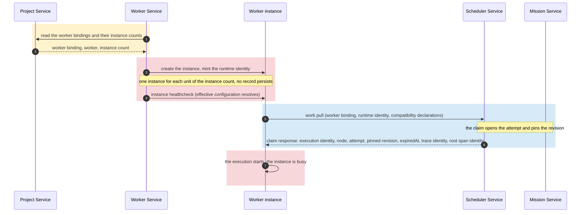
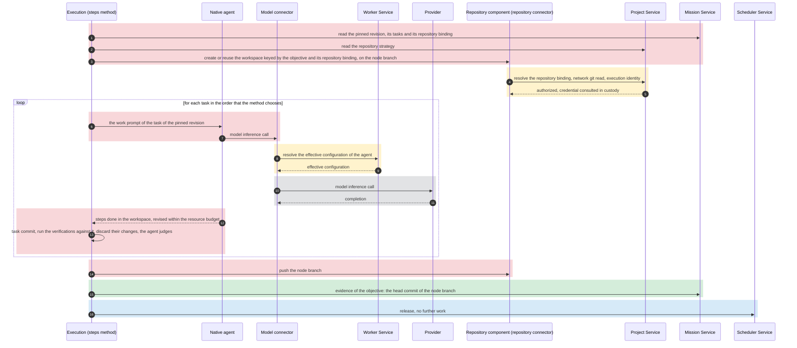
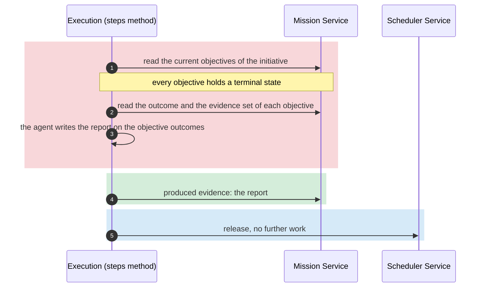
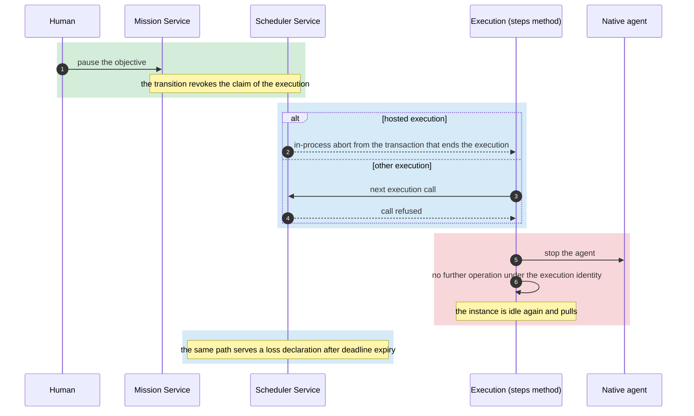
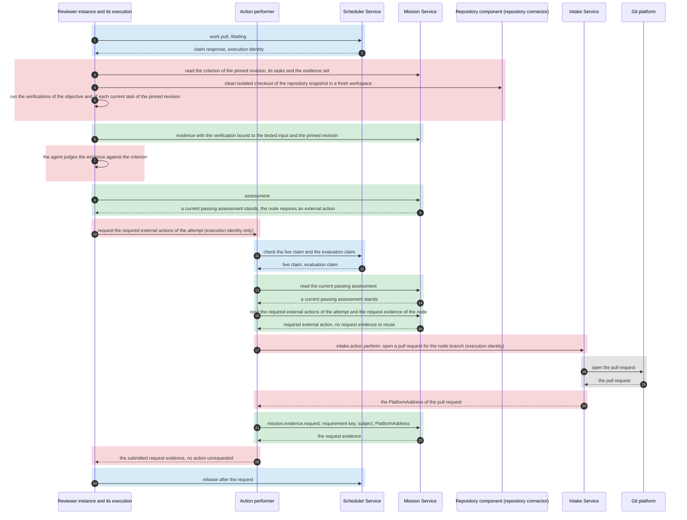
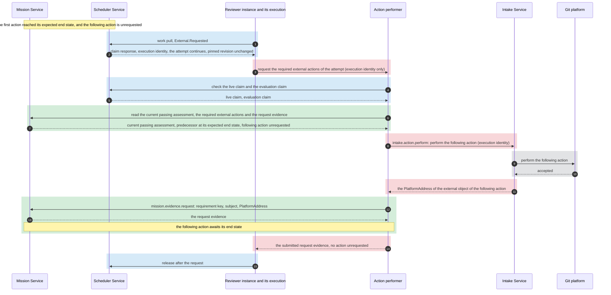
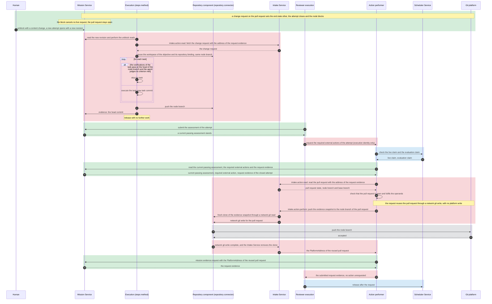
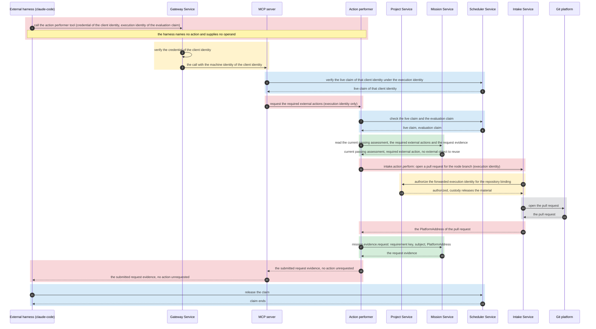

# Worker Service

## Scope

This document describes the Worker Service.
It describes the workers and their agents, the worker instances and how they host an execution, the lifecycle of an execution, the performance of a required external action and the owner of memory.
For a required external action, it describes the configured repository action only.
The Worker Service uses the [Repository component](repository.md) for repository operations and the [Intake Service](intake-service.md#outbound-operations-and-checks) for platform operations.
It describes the MCP server through which a native agent and an external harness reach the server tools.
It describes the prompt of a native agent and the prompt composer that produces it.
It consumes the [Agent component](agent.md) for each native agent of a worker that kanthord hosts.
It describes no mechanism of another service.

## Workers and templates

The [overview](overview.vocabulary.md) defines a worker, a worker instance, an execution, an agent, a tool, memory and a prompt.
The Worker Service supplies the workers.
A worker declares its name, its host, the node states that its instances claim and its required node format.
A worker that kanthord hosts also declares its method and its agents, at least one.
It references the [catalog declaration](agent.md#agent-catalog) of each agent.
A worker that an external harness hosts declares none of those, because its method is the orchestration skill of the harness.
The [Scheduler Service](scheduler-service.md#claims-and-counts) admits a claim from the declared node states.
Every agent of a kanthord-hosted worker is [in the catalog](agent.vocabulary.md#in-the-catalog) of the [Agent component](agent.md#agent-catalog).
A worker reads no other project configuration.
The required node format names the fields of a node that the method requires.
Compatibility reads the node revision that the [work-pull rules](scheduler-service.md#work-pulls) of the Scheduler Service select.
Every worker of this page requires the same node format.

A method is the worker's own.
Two methods of kanthord exist: the steps method and the evaluation method, and the method of a worker that an external harness hosts is the orchestration skill of the harness.
The steps method declares `Available`.
The evaluation method declares `Waiting` and `External.Requested`.
A worker that an external harness hosts declares `Available`, `Waiting` and `External.Requested`.

Each agent of a worker that kanthord hosts is a native agent, an agent loop that the Worker Service runs itself.
The Worker Service publishes the contract of `claude@1` and `opencode@1`.
It holds the name, host, declared node states, required node format and resource budget.
It runs no instance of them, and the [overview](overview.md#external-harness) states what kanthord configures of an external harness.

A worker that kanthord hosts declares the agent prompt of each of its agents.
[Prompt composition](#prompt-composition) states every layer of the prompt.

The Worker Service supplies the model [connector](architecture.vocabulary.md#connector) for a model inference call.
An execution and its agent reach a git platform through the [Repository component](repository.md#boundary) for git transport and through the Intake Service for platform reads, and through nothing else.
A native agent reaches a provider through the model connector alone.
The model connector resolves the binding through the [Project Service](project-service.md#configuration-lifecycle-and-consistency) for each operation, under the requester's identity.
For each native model inference call, the Worker Service resolves the agent's [effective configuration](agent.vocabulary.md#effective-configuration) through the Agent component.
The model connector uses that configuration with the material that [custody](custody.md#secret-use-and-handover) releases or hands over.
An execution honours every value of the effective configuration of its agent.
A local git operation runs in the workspace and passes through no connector.
An agent holds no repository credential.

## Agent configuration

- The [Agent component](agent.md#agent-configuration) owns the agent enablement, the agent provider, the default configuration and the resolution of the effective configuration.
- A worker binding holds optional per-agent [entries](worker-service.vocabulary.md#entry).
- An entry selects only an agent provider of that agent's enablement.
- The Worker Service resolves the effective configuration through the Agent component, with the entry of the worker binding, when a worker works on a node.
- A worker binding write is refused when any agent of its worker has no enabled agent enablement.
- The refusal names the agent.
- A tuning entry follows unchanged fields of the default configuration at its next resolution.
- An externally hosted worker declares no agent and needs no agent enablement.

## Prompt composition

The prompt of a native agent composes prompt layers.
A prompt layer is one part of the prompt, and it has one owner.
The composition places the [system layer](agent.md#prompt-composer) first, then the agent prompt, then the project prompt, then the work prompt.

The system layer states the conventions of the operator and the default standard of the work product, and it holds for every native agent of the server.
A worker declares, for each of its agents, the agent prompt of that agent.
An agent prompt states the role of the agent, its responsibility and its contribution to the WHAT.
The shipped agent prompt is the default of the worker name.
An operator override replaces or extends it on one server, and the [prompt composer](agent.md#prompt-composer) records the override.
The project prompt states the programming language, the development style and the coding conventions of the work product of one repository.
It states no rule about the method, the tools, the repository operations, the assessment or the release.
The work prompt renders from the node revision that the attempt pins.
It states the requirement, the criterion and the verifications of the work that the execution takes.
The agent prompt is required, and every other layer is optional.
The work prompt is required for every unit of work.

A prompt layer takes its text from an ordered list of [prompt sources](agent.md#prompt-composer).
Each source holds one on or off switch.
The composer joins every source of the list that is on, present and valid.
A source that is absent or invalid adds no text, and the composer continues with the next source.
The composition places the layers that hold text.

The project prompt is the working layer of an execution.
It joins `AGENTS.md`, `AGENTS.local.md`, `CLAUDE.md` and `CLAUDE.local.md` of the workspace, then the `projectPrompt` of the [repository binding](project-service.md#repository-configuration-and-policy) that the pinned revision names.
A project has no shipped consumer prompt.
The steps method takes every source of the project prompt.
The evaluation method takes the `projectPrompt` of the repository binding only.
An agent file of the workspace is the work product of the candidate.

The composition states the owner, the source and the precedence of every layer to the agent.
The agent prompt holds the highest precedence, then the system layer, then the work prompt, then the project prompt.
The system layer and the agent prompt state the obligations of the worker.
No project prompt and no work prompt revokes one.
The agent prompt governs the system layer.
An execution performs no conduct that its system layer or its agent prompt forbids, whatever another layer states.
A system layer and a project prompt define no criterion.
An assessment follows the criterion of the node and the [default standard](overview.vocabulary.md#default-standard) that the system layer states.

A prompt layer carries instructions, and it authorizes no operation.
It names no value of the effective configuration, it adds no tool and it changes no resource budget.
The tool table of the agent and the effective configuration bound every operation, whatever a prompt layer states.

The prompt composer is the Worker Service component that produces the prompt of a native agent.
It resolves every layer from its sources, it validates every source that it reads, and it composes the layers.
It is the only component that reads a prompt source for the composition.
It reads the configured source of the project prompt through the [Project Service](project-service.md#configuration-lifecycle-and-consistency), and it authorizes no operation.
It reads a regular file for an agent file source, and it follows no reference inside that file.
An agent file of the workspace resolves inside the workspace, and a path that leaves the workspace is invalid.
A text that exceeds the bound of its layer is invalid, and a text that the composer cannot decode is invalid.
The composer decodes the text of a source, and it changes no instruction of that text.
The composer records every selected source of every layer, the digest of its text, and every source that it read and rejected.
The composer records no prompt text.
That record is telemetry of the execution.

The execution resolves the system layer, the agent prompt and the project prompt once, when it starts.
It holds that text until the execution ends.
The work prompt renders for each unit of work that the method takes.
When the composition takes the agent file source, the composer reads that file before the agent runs.
A configuration revision and a commit change no prompt of a running execution.
A later execution of the same attempt resolves the sources that stand when that execution starts.
No model inference call of the execution drops a layer of its prompt.

## Instances and hosting

The Worker Service reads the worker bindings and their instance counts from the [Project Service](project-service.md#execution-configuration-and-instance-count).
For a worker that kanthord hosts at the `server` placement, it holds one instance for each unit of the instance count of a worker binding.
The instances of one binding form its pool.
An instance holds a runtime identity.
The Worker Service mints the runtime identity when it creates the instance.
The runtime identity is unique inside the server, and it names the worker binding of the instance.
The Worker Service vouches for that association on the [work pull](scheduler-service.md#work-pulls).
For an instance that registers, the Worker Service accepts the registration under the [client identity](project-service.vocabulary.md#client-identity) of its credential and the worker binding that the credential names by its project and its resource identity, mints its runtime identity at that registration, and vouches for it on the work pull like every instance.
A registration pins no revision of the worker binding. Each claim pins the latest revision of the binding, and the execution reads the configuration of that revision until it ends.
A client identity holds at most one live registration.
A registration of a client identity that holds a live registration returns that registration, so a restarted program resumes its live execution.
A human resumes an ended registration while it is the claimant of a live execution.
Two live processes of one machine JWT are an accepted risk until a B9 item fences them.
An instance of a worker that an external harness hosts registers, and an instance at the `worker` placement registers.
It accepts registrations up to the instance count of the binding, and it refuses a further one.
The instance presents its credential at the registration and on every later request, the registration returns no credential, and the [Gateway Service](gateway-service.md#machine-identities) rules that credential.
A work pull and every execution operation of a registered instance require its live registration.
A registered instance sends a [heartbeat](worker-service.vocabulary.md#heartbeat), and a registration ends when no heartbeat arrives inside its window.
A registration also ends when the program deregisters its own instance through the API. A server restart ends no registration.
Removal or unavailability of its worker binding also ends the registration.
A live execution of that instance follows the [liveness rules](scheduler-service.md#liveness) of the Scheduler Service.
The end of a registration proves no stop of the program.
The Worker Service [owns the resource healthcheck](architecture.md#resource-healthcheck) of a registered instance.
It reports the liveness of the registration from server state, distinct from the [instance healthcheck](scheduler-service.vocabulary.md#instance-healthcheck).
A human reads the contract of every worker and the instance record of every instance.
That read changes no instance, no pool and no configuration.

An instance record is runtime-only. The `worker_instance` row holds the durable part of a registered instance.
The [Scheduler Service](scheduler-service.md#liveness) governs the execution record and the claim.
At server start, and when the availability or the instance count of a worker binding changes, the Worker Service adjusts the pool of that binding.
A configuration revision of the binding replaces no instance.
A server restart creates new instances with new runtime identities for a worker at the `server` placement.
For a worker that kanthord hosts at the `server` placement, the Worker Service drains the excess instances of a lowered count under the [count-change rule](scheduler-service.md#claims-and-counts) of the Scheduler Service: it retires idle instances first, and a busy instance ends its execution before it retires.

An instance hosts at most one execution at a time.
An instance holds at most one outstanding work pull or one execution.
It starts no work pull until its preceding pull returns no work or the execution of that pull ends.
No instance is pinned to a node.
Any idle instance of the binding takes the next compatible node.
An idle instance that receives no work retries under the [work-pull rules](scheduler-service.md#work-pulls) of the Scheduler Service.

The Worker Service produces the instance healthcheck before each work pull and once more when the Scheduler Service asks before a claim commits.
The healthcheck of an instance at the `server` placement passes when the effective configuration of the agent resolves under the current binding set.
The healthcheck of an instance at the `worker` placement passes when that configuration resolves and its registration is live.

The healthcheck of an instance that an external harness hosts passes when its registration is live.
The Worker Service computes the healthcheck of every placement from the state of the server alone.
The instance carries the compatibility declarations of its worker: the worker name, the declared node states and the required node format.

- An execution at worker placement obtains its credentials through the [credential handover](custody.vocabulary.md#credential-handover) of custody.
- It performs its network git read, network git write and model inference calls on its own host.
- Its platform actions run through the server like every execution.

The tool of an agent and the verifications of a node run code that the repository supplies.
The Worker Service runs them inside a trust boundary that the operator provides.
The host of a `worker` application is inside that trust boundary.
A rule on the content of a command is a policy and no trust boundary.

The sequence diagram below shows the creation of a steps instance and its first work pull, on a node with no attempt.
In every sequence diagram of this page, a colored block names the service that owns its steps: yellow the Project Service, blue the Scheduler Service, green the Mission Service, red the Worker Service, grey an external system.
A diagram shows the operations of the Worker Service and the responses that it receives, and no mechanism of another service.

## Executions

An execution performs the method of its worker under the live claim that its instance obtained.
The execution takes its execution identity, its node, its attempt, the pinned node revision, its trace identity and its root span identity from the [claim response](scheduler-service.md#work-pulls) of the Scheduler Service.
The [Tracking Service](tracking-service.md#producer-and-ownership) owns what a span of the execution names as its parent.
Every operation of the execution presents its execution identity under the [liveness rules](scheduler-service.md#liveness) of the Scheduler Service.
The execution holds a fixed `expired_at` under [Scheduler configuration](scheduler-service.impl.md#configuration).
A revoked or lost execution stops its agent and performs no further operation under its execution identity.
The execution identity is the identity of the [agent session](agent.vocabulary.md#agent-session) of the execution.

Every worker declares a default [resource budget](worker-service.vocabulary.md#resource-budget) with `wallTimeMs` for one execution.
Every worker binding can override it under the [budget contract](worker-service.impl.md#stop-and-budget).
The agent stops when its turn count or wall time reaches the budget.

An execution reads the [node revision](mission-service.md#mission-structure-and-nodes) that its attempt pins.
After an unblock, it performs the reads that the [unblock rules](mission-service.md#the-unblock) of the Mission Service require.
It fetches the external content that the request evidence addresses through `intake.action.read` of the [Intake Service](intake-service.md#outbound-operations-and-checks).

A workspace is a host-local working directory of one execution.
The method of the execution determines whether the workspace holds a repository checkout, and which snapshot.
The workspace of the steps method on an objective is a checkout of the repository that the pinned revision names, on the node branch.
The Worker Service keys that workspace by the objective and the repository binding of the pinned revision.
An execution reuses that workspace when the host holds one, and it creates one through a network git read otherwise.
Before the reuse, the execution confirms that no earlier execution still acts in that workspace, and it brings the checkout to the head of the node branch at the repository through the Repository component.
The Worker Service removes it after a bounded retention since the last execution of that objective ended.
The workspace of the evaluation method is fresh, and the Worker Service removes it at the release.
The workspace of the steps method on an initiative holds no checkout.

The kanthord component on the file's host serves `evidence upload <path>`.
That component is the server, the `worker` application or the harness extension.
It opens the path safely inside the execution workspace and uses the Mission Service's presigned-transfer flow.
It returns the evidence identity and object URI, never the presigned URL, to the agent.
The storage credential stays in server custody.
The MCP server exposes no upload write.

The rules of the four paragraphs below hold for the steps method on an objective.
The steps method uses one node branch for each objective and repository binding, and it continues that branch across attempts.
The node branch takes its name from the node identity, in the form `kanthord/<node identity>`.
The first execution on that branch creates it from the base branch that the [repository strategy](project-service.md#repository-configuration-and-policy) names.
The execution never rewrites a commit that it pushed or that a record of the Mission Service names.
Every commit that the execution makes is attributable to its task and its attempt.
The execution uses the [node-branch push](repository.md#write-operations) of the Repository component before every release.

The steps method chooses the order of the tasks of the pinned revision.
For each task the agent performs the steps in the workspace, and the execution commits the changes of the task work.
The task commit is the head of the node branch after the last commit of the task work in the attempt that executed the task.
The execution code, never the agent, runs the verifications of the task against the task commit.
It discards every change that the verifications make.
A failed verification leads the agent to revise the task within the resource budget.
The execution commits a revision as a new commit and runs the verifications again.
The agent judges the result against the criterion only after every verification passes.
A task is complete when its verifications pass and the agent judges its criterion met.
The execution writes no evidence, no assessment and no outcome for a task.

At its start, every execution runs the verifications of each task of the pinned revision against the head of the node branch.
A task whose verifications pass and whose criterion the agent judges met is complete, and the execution skips it.
The execution executes every other task.
No record of an earlier execution or an earlier attempt decides that a task is complete.

Before every release with no further work, the execution submits the head commit of the node branch as the evidence of the objective, whatever the task results establish.
When every task of the revision is complete, the execution releases with no further work.
The boundary of the budget end is the task commit.
A task commit whose verification run failed or left an item unrun, with no later task work when the resource budget ends, ends the task work, and the execution releases with no further work.
Otherwise, when the resource budget ends before the task commit of the current task work or during the judgement of a passing run, the agent stops and the execution performs cleanup.
The execution code, not the stopped agent, writes the checkpoint commit, pushes and releases with further work.
Every cleanup command is bounded by `expired_at`, not by the remaining resource budget.
A checkpoint commit establishes no completion and no verification result, and the next execution continues the task.
The [Mission Service](mission-service.md#state-transitions) routes each release.

The sequence diagram below shows the steps method on an objective with a native agent, on the path where every task passes its verifications.

For an initiative the steps method reads the current objectives of the initiative.
The [initiative steps condition](mission-service.md#initiative-steps-condition) admits the claim only when every objective holds a terminal state.
When a graph change adds a nonterminal objective during the execution, the execution releases with further work.
When every objective holds a terminal state, the agent writes a report on the outcome of each objective, the execution submits that report as produced evidence and releases with no further work.

The sequence diagram below shows the steps method on an initiative.

The [overview](overview.md#kanthords-own-harness) owns the end conditions of an execution.
A human pause, a human discard and a success override reach the execution as a revocation.
An assessment that does not pass and a resource limit reach the Mission Service as a release.

The sequence diagram below shows how an execution learns of a revocation or a loss after deadline expiry.

## Action performer and MCP server

The [action performer](worker-service.vocabulary.md#action-performer) requests the required external actions of one attempt for every reviewer execution, whichever harness hosts it.
The evaluation method and the MCP tool of an external harness call the action performer.
Both callers pass the execution identity and nothing else.
The invocation names no action and supplies no operand.
For both callers, the action performer checks that the claim of the execution identity is live.
It checks that the claim is an evaluation claim.
It checks that a current passing assessment of the attempt stands.
The action performer obtains every operand from the records and the evidence snapshot.
The action performer calls `intake.action.perform` of the [Intake Service](intake-service.md#outbound-operations-and-checks), which calls the [configured-action write](repository.md#write-operations) of the Repository component.
It depends on no workspace of a hosted execution.
The action performer serializes the invocations of one execution identity.
It never dispatches an action whose earlier dispatch is unresolved, across callers and invocations.

The action performer returns items in four [return classes](worker-service.vocabulary.md#return-class).

- Submitted request evidence.
- Actions that await a prerequisite, with the request evidence that each one follows.
- Actions whose request fails before any effect, with the refusal.
- Actions whose effect or recording is uncertain.

This page states no release rule for a request failure or an uncertain effect or recording.
Every write that fulfils a configured action belongs to the action performer, and the Intake Service performs it through the Repository component.
The [Repository component](repository.md#result-classes) defines platform result classes and retry rules.

The server runs one [MCP server](worker-service.vocabulary.md#mcp-server).
The MCP server is one form of the API.
It serves a native agent and an external harness.
A native agent presents the execution identity of the execution that hosts it.
An external harness authenticates with the credential of its [client identity](project-service.vocabulary.md#client-identity), which the [Gateway Service](gateway-service.md#machine-identities) rules.
It presents the execution identity of its claim.
The MCP server refuses a call whose execution identity belongs to no live claim of that client identity.
Each tool maps to one read method of a [platform implementation](repository.vocabulary.md#platform-implementation), which the Intake Service performs through `intake.action.read`, or to the action performer.
The MCP server makes no decision of its own.
The Gateway Service authenticates the client identity, the Scheduler Service establishes the live claim, and the owning component performs every operation.

The MCP server exposes a list of resource-scoped read methods, which the Intake Service performs, and the tool of the action performer.
The Worker Service permits each read method individually.
The MCP server exposes no other write to a native agent or to an external harness.
It exposes the same tools to every client, and no state of a claim or of an assessment changes the list.
The tool of the action performer takes no parameter beyond the execution identity.
It returns the four return classes of the action performer.
A native agent reaches the permitted read methods of the Intake Service as tools through the MCP server.

The action performer and the MCP server are server components of the Worker Service.
The [trust boundary](worker-service.vocabulary.md#trust-boundary) of this page is their only containment.
The [Repository component](repository.md#placement) defines its placement.

## Evaluation and required external actions

The reviewer execution reads the criterion of the pinned revision, the evidence set of the attempt and, for an initiative, the current child outcomes.
A reviewer judges the assets that the evidence still holds.
The child outcomes of an initiative are its objective outcomes, and an objective holds no child outcomes.
The reviewer of an objective runs the verifications of the objective and of each current task of the pinned revision, and it judges each task criterion.
For an objective, the reviewer makes a clean isolated checkout of the repository snapshot that the evidence names.
It uses the [Repository component](repository.md#repository-connector).
For an initiative, the reviewer derives the repository bindings of the current objectives and removes duplicates.
A discarded objective still contributes its repository.
The reviewer checks out the head of the base branch of each binding under a directory named after that binding.
An end-to-end suite lives in a repository of one of the objectives.
The tested input names every commit, one per binding.
An initiative whose objectives name no repository keeps the evidence-placement rule.
For an objective whose evidence names no repository snapshot, the reviewer also uses that rule.
Under that rule, the reviewer places the produced evidence of the attempt in its workspace.
The reviewer execution code, never the agent, runs the verifications of the pinned revision from the workspace root.
The execution records the results as an evidence with a `verification`, bound to the tested input and the pinned revision.
The assessment names that evidence in its evidence set.
A failed or unrun verification causes the reviewer execution to write an assessment that does not pass, without a judgement.
Its required rationale names that verification.
Only after every verification passes does the agent judge the evidence against the criterion.
The execution writes the [assessment](mission-service.md#evaluation-and-assessment) with the fields that the Mission Service defines.
The [Mission Service](mission-service.md#evaluation-and-assessment) owns the record and its currency.

A reviewer execution that claims from `Waiting` performs the evaluation.
A reviewer execution that claims from `External.Requested` performs no evaluation.
When the node requires no external action, the passing assessment ends the claim, and the reviewer execution performs nothing more.
Otherwise, on both paths, the reviewer execution invokes the action performer after a current passing assessment stands.
The action performer reads the required external actions of the attempt.
It reads the request evidence of the node across every attempt.
A required action is eligible when it is unrequested in the attempt and it follows no other action.
A required action that follows another action is eligible when it is unrequested in the attempt and its predecessor reached its expected end state.
The action performer requests each eligible action for the reviewer execution until no action is eligible.
A request of a repository action calls `intake.action.perform`, and the Intake Service uses the [configured-action write](repository.md#write-operations) of the Repository component.
The action performer derives every operand from the records of the attempt, the evidence snapshot and the request evidence.
The agent supplies no operand, and an external harness supplies none.

Before it performs a request, the action performer reads the request evidence of the node.
The request reuses the external object of a request evidence of an earlier attempt when three conditions hold.
That request evidence names the same requirement key.
The remote thing fulfils the operands of the current request.
The remote thing is open: the platform still accepts on it the network git write that the action requires.
An end state of the earlier action does not close the remote thing by itself.
A reuse performs, through the Intake Service, the network git write that the action requires and no platform write.
Otherwise the action performer requests the action through the Intake Service.
In both cases the action performer submits the request to the Mission Service through `mission.evidence.request`, as the request evidence of the attempt.
It uses the `PlatformAddress` that the Intake Service answers, or the address of the request evidence that the request reuses.
That submission is the accepted request of the action.
The address correlates the request evidence of one external object across attempts.

For a reviewer execution of kanthord's own harness, the evaluation method invokes the action performer through `worker.action.request`.
An external harness invokes the tool of the action performer through the MCP server for its reviewer execution.
Both paths run the same eligibility, operand and reuse rules.

The reviewer execution releases after its requests when the return of the action performer holds only submitted request evidence and actions that await a prerequisite.
That rule holds for a reviewer execution of an external harness after the tool of the action performer returns.
The [Mission Service](mission-service.md#continuation-condition) owns the continuation condition, and the transaction that makes it hold inserts the evaluation job.

The sequence diagram below shows an objective with one required action after every verification passes.

The sequence diagram below shows the continuation claim from `External.Requested`, on an objective that requires two actions, where the following action follows the first.

The sequence diagram below shows the next attempt after a block: the resume of the tasks and the reuse of the pull request.

The sequence diagram below shows the invocation of the action performer by an external harness, on an objective that requires one action.

## Memory

The execution owns memory.
The [memory](overview.vocabulary.md#memory) of an execution is the context of its agent and the content of its workspace.
It ends with the execution.
The workspace that the Worker Service retains for a later execution of the same objective is a host-local artifact, and its content is no memory of that later execution.
A worker defines how its executions use memory, and it holds no memory of its own.
An instance holds no memory, and each execution starts with a fresh agent context.
A later execution rebuilds its context from the records of the Mission Service and from the content that those records reference, as its method requires.
A later execution never depends on the retained agent context of an earlier execution or on the continued existence of a workspace.

## Boundary

The [Project Service](project-service.md) owns bindings, their entries and configured counts and repository strategy.
[Custody](custody.md) owns resource credentials and suitability.
The [Scheduler Service](scheduler-service.md) owns the work queue, claim, execution record, fixed deadline and live-execution accounting.
The [Mission Service](mission-service.md) owns the node states, the node revision, the evidence record, the assessment record, the outcome record, the request evidence and the readiness and continuation conditions.
The Worker Service owns the workers and their agents, the runtime identity, the pool and the hosting of an execution.
It owns the healthcheck, the compatibility declarations, the workspace, the model connector and the prompt composer.
It owns the action performer, the MCP server and the exposure of its tools.
It owns the lifecycle of an execution between the claim and the release.
It owns the decision of a required external action and its idempotency across attempts, and the Intake Service performs it.
It owns memory.
The [Repository component](repository.md#placement) owns the transport.
The [Intake Service](intake-service.md#outbound-operations-and-checks) performs every platform operation.
The [Tracking Service](tracking-service.md#scope) holds the telemetry of every execution.
An agent transcript is telemetry, unless an execution submits it as evidence under the rules of the Mission Service.
