# KanthorD component architecture

[Explanations](README.md) · [Services and build order](high-level.md)

This view expands services into individual named components. **A container owns its contents. An arrow names a collaboration, call or record flow.** It does not mean “build the entire source service first.” The [build sequence](high-level.md#which-part-should-we-build-first) handles cyclic dependencies through joint implementation slices.

Mission Service is embedded in the Project boundary because a mission is intrinsic to its project. It is not a repository, provider, worker or source binding. This containment does not remove Mission's separate authority over its records.

> **Design scope:** The complete component map includes planned work. Current implementation status is listed in [what runs today](high-level.md#what-runs-today). On the documentation site, the diagram fits a wide panel and shows its full height. Zoom in for detail and scroll horizontally when enlarged; use the high-level diagram for an initial reading.

## Components and ownership

```mermaid
%%{init: {"theme": "base", "themeVariables": {"background": "#f5f5f5", "primaryColor": "#ffffff", "primaryTextColor": "#2d3142", "primaryBorderColor": "#4f5d75", "secondaryColor": "#ececec", "tertiaryColor": "#f5f5f5", "lineColor": "#4f5d75", "edgeLabelBackground": "#f5f5f5", "fontFamily": "system-ui, sans-serif", "fontSize": "14px"}, "flowchart": {"htmlLabels": true, "useMaxWidth": false, "curve": "stepAfter", "nodeSpacing": 24, "rankSpacing": 48}}}%%
flowchart TB
    accTitle: KanthorD component ownership and collaboration
    accDescr: Named components are grouped by their owning service, with Mission embedded in Project, and labeled arrows show invocation, authorization, scheduling, execution, acquisition and persistence dependencies.
    subgraph Runtime["Shared runtime"]
        Config["Configuration"]
        Keys["Key derivation"]
        Context["Context"]
        Lifecycle["Lifecycle"]
        Health["Health registry"]
        Log["Operational log"]
        Store["Operational store"]
        Config -->|"master key"| Keys
        Context -->|"cancellation"| Lifecycle
    end

    subgraph Gateway["Gateway Service"]
        HTTP["HTTP listener"]
        Auth["Authentication"]
        Registry["Operation registry"]
        Invocation["Invocation chain"]
        Replay["Idempotency"]
        HTTPAdapter["HTTP adapter"]
        DirectAdapter["Direct adapter"]
        OpenAPI["OpenAPI emitter"]
        HTTPAdapter -->|"requests"| HTTP
        HTTP -->|"credentials"| Auth
        Auth -->|"caller identity"| Invocation
        DirectAdapter -->|"internal calls"| Invocation
        Registry -->|"operation contracts"| Invocation
        Registry -->|"route contracts"| OpenAPI
        Invocation -->|"mutation replay"| Replay
    end

    subgraph ProjectService["Project Service"]
        Project["Project"]
        Bindings["Binding set"]
        Resolution["Binding resolution"]
        Authorization["Resource authorization"]
        Custody["Credential custody"]
        Grants["Acquisition grants"]
        Verification["Delivery verification"]

        subgraph MissionService["Mission Service"]
            Graph["Mission graph"]
            Attempts["Attempts"]
            Criteria["Validation criteria"]
            Evidence["Evidence records"]
            RunOutputs["Run outputs"]
            Assessments["Assessment records"]
            Outcomes["Outcome records"]
            Objects["External objects"]
        end

        Project ==>|"owns exactly one"| Graph
        Project -->|"allocates resources"| Bindings
        Bindings -->|"configuration"| Resolution
        Resolution -->|"resolved binding"| Authorization
        Authorization -->|"authorized use"| Custody
        Custody -->|"session material"| Grants
        Custody -->|"verification material"| Verification
        Graph -->|"pins revision"| Attempts
        Criteria -->|"assessment basis"| Assessments
        Evidence -->|"assessment basis"| Assessments
        Assessments -->|"accepted assessment"| Outcomes
    end

    subgraph Scheduler["Scheduler Service"]
        Queue["Work queue"]
        Processors["Scheduling processors"]
        Claim["Claim operation"]
        Executions["Execution records"]
        Waits["Wait records"]
        Admission["Delivery admission"]
        Observer["Observer"]
        Queue -->|"ordered candidates"| Processors
        Processors -->|"admission recheck"| Claim
        Claim -->|"claim and lease"| Executions
        Waits -->|"hold out entries"| Queue
        Admission -->|"observation obligation"| Observer
        Processors -->|"runs"| Observer
    end

    subgraph Worker["Worker Service"]
        Templates["Worker templates"]
        Registration["Registration"]
        InstanceHealth["Instance healthcheck"]
        Pools["Instance pools"]
        Execution["Execution"]
        Agents["Native agents"]
        Prompts["Prompt composer"]
        Workspace["Workspace"]
        Memory["Memory"]
        Model["Model connector"]
        Repository["Repository connector"]
        Platform["Platform connector"]
        Implementations["Platform implementations"]
        Action["Action performer"]
        MCP["MCP server"]
        Templates -->|"instantiates"| Pools
        Pools -->|"hosts"| Execution
        Registration -->|"registered identity"| Execution
        Execution -->|"runs"| Agents
        Prompts -->|"composed prompt"| Agents
        Execution -->|"owns"| Workspace
        Execution -->|"owns"| Memory
        Agents -->|"inference"| Model
        Execution -->|"network git"| Repository
        MCP -->|"permitted reads"| Platform
        MCP -->|"external reviewer tool"| Action
        Action -->|"platform actions"| Platform
        Action -->|"network git"| Repository
        Platform -->|"selects"| Implementations
    end

    subgraph Intake["Intake Service"]
        Subscriptions["Subscriptions"]
        Reconciler["Reconciler"]
        Webhook["Webhook acquisition"]
        Poll["Poll acquisition"]
        Stream["Stream acquisition"]
        Deliveries["Delivery store"]
        Handoff["Delivery handoff"]
        Subscriptions -->|"desired state"| Reconciler
        Reconciler -->|"reconciles"| Webhook
        Reconciler -->|"reconciles"| Poll
        Reconciler -->|"reconciles"| Stream
        Webhook -->|"verified delivery"| Deliveries
        Poll -->|"batch and checkpoint"| Deliveries
        Stream -->|"verified message"| Deliveries
        Deliveries -->|"unresolved delivery"| Handoff
    end

    subgraph Tracking["Tracking Service"]
        Tracer["Tracer"]
        SpanProcessor["Span processor"]
        Exporter["Exporter"]
        Ingestion["Telemetry ingestion"]
        Retention["Retention sweep"]
        Tracer -->|"spans"| SpanProcessor
        SpanProcessor -->|"exports"| Exporter
    end

    subgraph Persistence["Persistence"]
        OperationalDB[("kanthord.db")]
        TrackingDB[("tracking.db")]
        ConfigFiles["Configuration files"]
        StateFiles["State files"]
        Cache["Cache"]
    end

    Keys -->|"signing key"| Auth
    Store -->|"owns connection"| OperationalDB
    ConfigFiles -->|"validated at startup"| Config
    Log -->|"file destination"| StateFiles
    Invocation -->|"project operations"| Project
    Invocation -->|"mission operations"| Graph
    Invocation -->|"work pulls"| Processors
    Invocation -->|"registration"| Registration
    Invocation -->|"MCP transport"| MCP
    Invocation -->|"delivery routes"| Webhook
    Invocation -->|"telemetry operations"| Ingestion
    Graph -->|"atomic insert / delete"| Queue
    Claim -->|"atomic node transition"| Graph
    Authorization -->|"prove live claim"| Executions
    Resolution -->|"worker declarations"| Templates
    Pools -->|"work pulls"| Processors
    Execution -->|"renew / release"| Executions
    Claim -->|"healthcheck"| InstanceHealth
    InstanceHealth -->|"effective configuration"| Resolution
    InstanceHealth -->|"registered instances"| Registration
    Claim -->|"binding limits"| Bindings
    Templates -->|"compatibility"| Claim
    Attempts -->|"policy snapshot"| Bindings
    Model -->|"resolve resource"| Resolution
    Repository -->|"resolve resource"| Resolution
    Platform -->|"resolve resource"| Resolution
    Execution -->|"submits"| RunOutputs
    Execution -->|"submits"| Evidence
    Execution -->|"reviewer submits"| Assessments
    Action -->|"requires passing assessment"| Assessments
    Action -->|"records request"| Objects
    Handoff -->|"at-least-once admission"| Admission
    Webhook -->|"verify before storage"| Verification
    Reconciler -->|"acquisition material"| Grants
    Observer -->|"authorized object reads"| Platform
    Observer -->|"accepted observation"| Objects
    Objects -->|"completion facts"| Outcomes
    Exporter -->|"persists"| TrackingDB
    Ingestion -->|"imports"| TrackingDB
    Retention -->|"expires telemetry"| TrackingDB

    classDef focal fill:#fbe9e0,stroke:#eb6c36,color:#2d3142,stroke-width:2px;
    classDef component fill:#ffffff,stroke:#4f5d75,color:#2d3142;
    classDef shared fill:#ececec,stroke:#7a8399,color:#2d3142;
    class Project,Graph focal;
    class HTTP,Auth,Registry,Invocation,Replay,HTTPAdapter,DirectAdapter,OpenAPI,Bindings,Resolution,Authorization,Custody,Grants,Verification,Attempts,Criteria,Evidence,RunOutputs,Assessments,Outcomes,Objects,Queue,Processors,Claim,Executions,Waits,Admission,Observer,Templates,Registration,InstanceHealth,Pools,Execution,Agents,Prompts,Workspace,Memory,Model,Repository,Platform,Implementations,Action,MCP,Subscriptions,Reconciler,Webhook,Poll,Stream,Deliveries,Handoff,Tracer,SpanProcessor,Exporter,Ingestion,Retention component;
    class Config,Keys,Context,Lifecycle,Health,Log,Store,OperationalDB,TrackingDB,ConfigFiles,StateFiles,Cache shared;
    style Runtime fill:#ececec,stroke:#bfc0c0,color:#2d3142
    style Gateway fill:#f5f5f5,stroke:#bfc0c0,color:#2d3142
    style ProjectService fill:#f5f5f5,stroke:#4f5d75,color:#2d3142
    style MissionService fill:#fbe9e0,stroke:#eb6c36,color:#2d3142
    style Scheduler fill:#f5f5f5,stroke:#bfc0c0,color:#2d3142
    style Worker fill:#f5f5f5,stroke:#bfc0c0,color:#2d3142
    style Intake fill:#f5f5f5,stroke:#bfc0c0,color:#2d3142
    style Tracking fill:#f5f5f5,stroke:#bfc0c0,color:#2d3142
    style Persistence fill:#ececec,stroke:#bfc0c0,color:#2d3142
```

**Legend:** Service containers establish component ownership. White nodes are components or domain records; gray nodes are shared infrastructure or persistence. Orange identifies the mandatory Project–Mission composition. Cylinders are database files. Arrow labels state relationships; they do not imply shared authority or one transaction unless explicitly marked atomic.

**Coverage:** The diagram expands the major architectural components rather than listing responsibilities inside service boxes. Repeated cross-cutting edges are omitted: services use Context, lifecycle, health, logging and the store; all services produce telemetry; every resource connector resolves and authorizes its operation through Project. External systems and execution hosts appear in the [service view](high-level.md#services-and-their-relationships).

## Interfaces that determine implementation order

| Consumer                             | Provider                                 | Required contract                                                                                                  | Build consequence                                                                                                 |
| ------------------------------------ | ---------------------------------------- | ------------------------------------------------------------------------------------------------------------------ | ----------------------------------------------------------------------------------------------------------------- |
| Project creation                     | Intrinsic Mission                        | Exactly one mission per project, created through `createMission` in Project's transaction.                         | Build Project creation and Mission creation as one atomic slice; initialize an empty mission at revision 0.       |
| Project binding resolution           | Worker templates                         | Worker name, declared states, node format, agents and valid configuration.                                         | Publish template declarations early; full worker execution is not required to validate a binding.                 |
| Gateway authentication               | Project bindings and Worker registration | Resolve a permitted binding and its live client registration.                                                      | Gateway's transport can exist first; working machine authentication needs these collaborators.                    |
| Mission graph/state                  | Scheduler work queue                     | Insert/delete affected entries inside the committing transaction.                                                  | Mission transitions and queue membership form one atomic implementation slice.                                    |
| Scheduler claim operation            | Mission, Project and Worker              | Node readiness, attempt/revision transition, binding counts, compatibility and instance health.                    | Use narrow contracts and test doubles first; integrate the real collaborators before admitting production claims. |
| Project authorization                | Scheduler execution records              | Prove claim ownership and liveness before authorizing resource use.                                                | Execution-scoped resource authorization follows the claim model, not merely JWT authentication.                   |
| Worker execution                     | Scheduler and Mission                    | Claim/renew/release; read pinned work; submit evidence and assessments.                                            | Implement one minimal execution path before adding more worker methods.                                           |
| Model/repository/platform connectors | Project resolution and custody           | Resolve the binding, authorize use and consult protected credential material.                                      | A connector cannot treat possession of a token or a prompt as permission.                                         |
| Action performer                     | Scheduler, Mission and connectors        | Live evaluation claim, passing assessment, required actions, evidence operands and external-object reconciliation. | Repository actions follow claim and assessment contracts; they are not arbitrary agent tools.                     |
| Intake acquisition                   | Project verification and grants          | Verify a delivery; acquire and revoke session-scoped acquisition material.                                         | Intake cannot acknowledge an unverified or unstored webhook/stream delivery.                                      |
| Intake handoff                       | Scheduler delivery admission             | Durable, idempotent acceptance and an explicit disposition.                                                        | Implement admission and interrupted-handoff recovery before turning on live acquisition.                          |
| Scheduler observer                   | Worker platform connector and Mission    | Decode deliveries, read external objects and submit observations.                                                  | Observer integration needs platform reads; it does not need a worker instance or an LLM.                          |
| Service telemetry                    | Tracking interface                       | Trace/span production without influencing business results.                                                        | Inject a no-op implementation first; real storage and retention can follow independently.                         |

## Component boundaries that must remain explicit

- **Project and Mission:** Mission is mandatory project content. Bindings allocate independently existing resources, never the mission. Mission continues to own its record schemas and operations.
- **Graph and records:** The Mission graph contains initiatives, objectives and tasks. Revisions, attempts, criteria, evidence, run outputs, external objects, assessments and outcomes remain distinct records. Only initiatives and objectives are scheduled; tasks run inside an execution.
- **Queue and claim:** Queue order suggests work. The atomic claim operation rechecks admission and creates the execution record and lease. A wait record holds out work without keeping an instance busy.
- **Registration and claim:** Worker owns runtime identities and registration heartbeat. Scheduler owns execution claims and leases. Neither a registration nor a healthcheck is a claim.
- **Agents and tools:** The prompt composer provides instructions, not permissions. Native agents use model and repository connectors; MCP exposes permitted platform reads and the controlled action tool for external reviewers.
- **Acquisition and interpretation:** Intake owns webhook/poll/stream transport. Worker platform implementations decode platform payloads. Scheduler admission owns their business effects.
- **Evidence and telemetry:** Mission evidence supports assessment. Tracking telemetry explains behavior and may expire. Operational logs are a third, separate facility.

## Persistence and deployment

| Component                  | Ownership and location                                                                                                                                                    |
| -------------------------- | ------------------------------------------------------------------------------------------------------------------------------------------------------------------------- |
| Operational store          | Owns the SQLite connection, exclusive lock and migration runner for `kanthord.db`. Services own their tables; peers call interfaces rather than reading peer tables.      |
| Credential custody         | Project owns credential access. Its protected records use authenticated encryption derived from the installation's master key. Credentials are not evidence or telemetry. |
| Delivery store             | Intake requires durable subscriptions and deliveries. Its physical table/file layout remains an open implementation decision; no database assignment is implied here.     |
| Tracking store             | Tracking owns `tracking.db`, independent migrations and telemetry retention. The no-op tracer phase creates no telemetry file.                                            |
| Configuration files        | The XDG configuration directory holds `kanthord.yaml` and client `cli.yaml`. The server never reads the client configuration.                                             |
| State files                | The XDG state directory holds operational logs and execution workspaces. A native worker's workspace lives on its execution host.                                         |
| Cache                      | Rebuildable artifacts belong here. The current server creates no cache files.                                                                                             |
| External telemetry capture | Harness extensions own their local capture logs, segments and ingestion cursors. These are not server-side Tracking components.                                           |

**No distributed transaction is implied.** Ordinary operations commit their own work. Project–Mission creation and Mission–Scheduler state/queue collaborations explicitly share synchronous transactions to preserve their invariants. Remote effects cannot commit atomically with SQLite.

**No service split is implied.** All seven services target one server process. The platform connector, action performer and MCP server stay server-side. Native model/repository calls can run on a trusted worker host after the required authorization and credential handover.

Read [services and build order](high-level.md) for the recommended first implementation slice and [healthchecks](healthchecks.md) for diagnostics.
