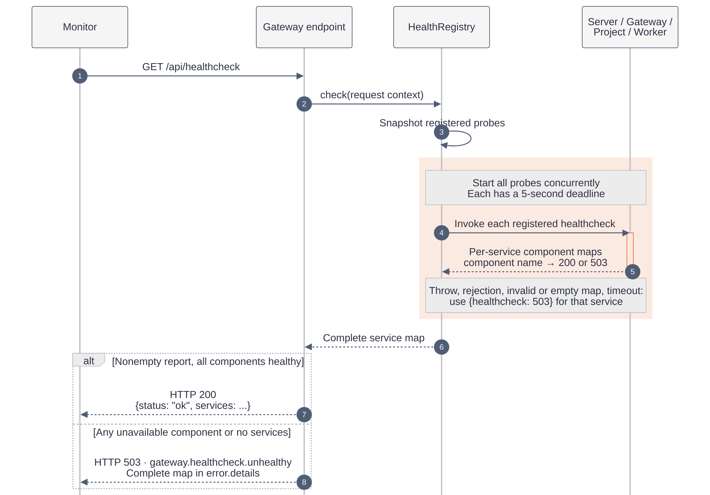
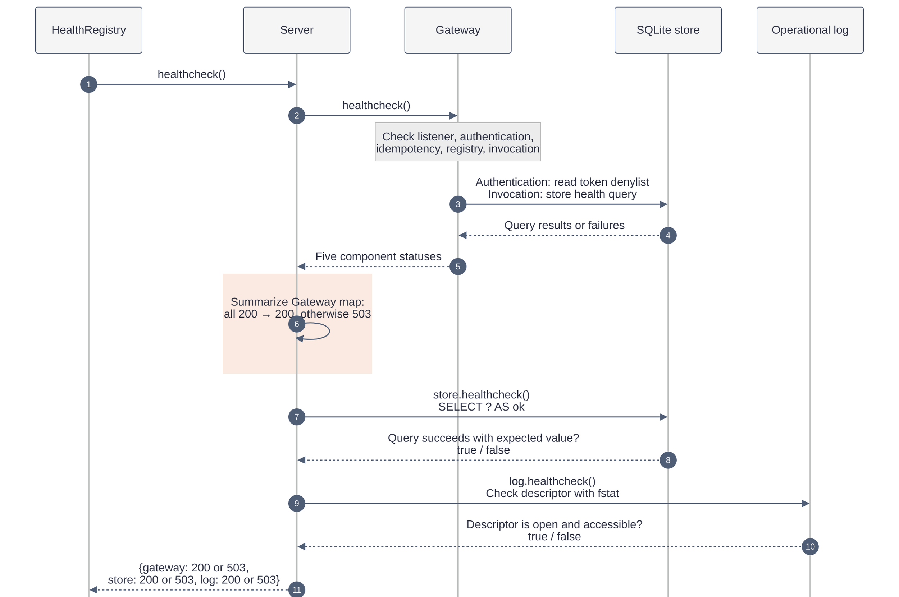

# How healthchecks work

A listening HTTP server does not prove that its database or other dependencies work. KanthorD's healthcheck collects component reports and returns a combined view. The [healthcheck reference](../reference/gateway/healthcheck.md) defines requests, response examples, status codes, and timeouts.

## From request to combined report

1. **Register.** During construction, Server, Gateway, Project, and Worker each register a health callback with the shared `HealthRegistry`.
2. **Collect.** A monitor requests `GET /api/healthcheck`. Once Gateway admits the request, the registry snapshots the registered callbacks and starts them concurrently.
3. **Inspect.** Each service checks its own components and returns a component map. These are in-process calls, not HTTP requests to other services.
4. **Respond.** The registry preserves every service's result. Gateway returns HTTP `200` only when at least one service reports and every component is healthy; otherwise it returns HTTP `503` with the complete report.

The rightmost lifeline groups four independent service probes, not a single service. Gateway's HTTP handling and its component probe appear separately to distinguish their roles. The component checks are expanded in the next diagram.

**Palette:** neutral gray identifies participants and messages; orange highlights collection. Solid arrows are calls, and dashed arrows are replies. Color does not indicate health: the component codes do.

## How services collect component health

The `server` probe illustrates nested collection. It asks Gateway for a component report, reduces that report to one `gateway` status, then checks SQLite and the operational log. This diagram shows a running server; Gateway's internal state checks are summarized, and its database accesses are grouped.

The registry also calls Gateway's probe independently to populate `gateway`. This is not recursion: Gateway's component probe does not invoke the HTTP endpoint or collect other services' reports.

## Read the whole report

The current composed server reports four groups:

| Service   | Components                                                            | What the probe checks                                                                                                                          |
| --------- | --------------------------------------------------------------------- | ---------------------------------------------------------------------------------------------------------------------------------------------- |
| `server`  | `gateway`, `store`, `log`                                             | Gateway's aggregate status, a SQLite query, and the log descriptor.                                                                            |
| `gateway` | `listener`, `authentication`, `idempotency`, `registry`, `invocation` | Listener readiness, signing-key and denylist access, in-memory idempotency state, operation registry state, and invocation/store availability. |
| `project` | `bindings`                                                            | Project Service lifecycle: started and not stopped.                                                                                            |
| `worker`  | `registrations`                                                       | Worker Service lifecycle: started and not stopped.                                                                                             |

Project and Worker currently report lifecycle health, not end-to-end binding resolution, provider reachability, or remote worker-instance health. The endpoint does not poll remote worker applications or external providers.

The server summary and Gateway details can observe slightly different moments because they run separate probes. Additional services must explicitly register their own health callbacks; registering an API operation alone does not add a health probe. An absent service is not an implicit healthy service.

## One failure does not hide the others

An unavailable component makes the overall response unhealthy, but healthy siblings remain in the report. For example, an unavailable log does not erase a healthy database result.

A failed probe is different from an unavailable component: the server has no trustworthy component report. It returns a `healthcheck: 503` marker under that service, rather than guessing which component failed or exposing exception text. An empty report cannot prove health.

## Fresh observations, not an atomic snapshot

Each request collects fresh reports concurrently. The aggregator has no background polling or result cache. Components may change while collection runs, so the combined report is not an atomic snapshot of the whole system.

Probe deadlines bound waiting. A client disconnect or server shutdown cancels collection instead of producing a successful report.

## Reporting is not recovery

A healthcheck does not restart workers, repair logs, reopen databases, or retry work. Before readiness, the Gateway rejects the request without collecting reports. An unreachable listener cannot return diagnostics at all.

Treat this endpoint as operational evidence, not proof that a job succeeded or that every proposed service has been implemented.

[Explanations](README.md) · [Documentation home](../README.md)
