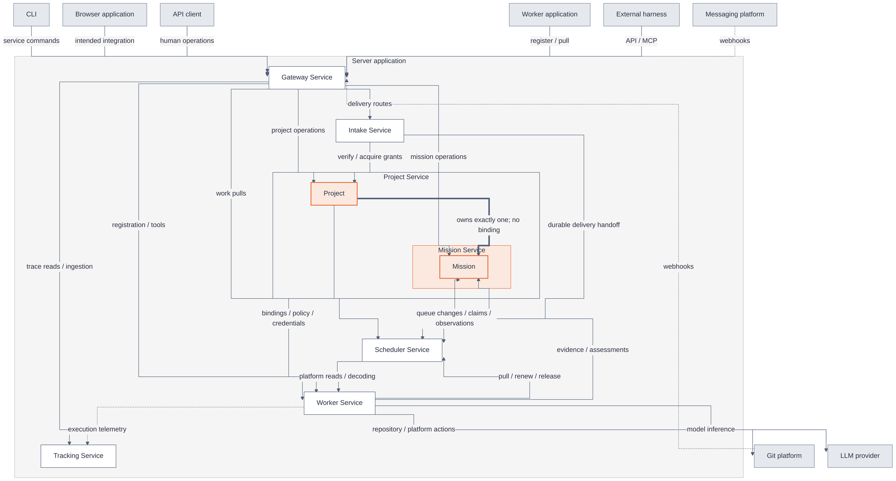

# KanthorD at a glance

[Explanations](README.md) · [Component architecture](architecture.md)

KanthorD separates goals, execution and evaluation. Its seven services run inside one server process. The diagrams show the full design, not only the implemented subset.

**A mission is intrinsic to a project.** Each project has exactly one mission. Mission Service is shown embedded in Project Service's project boundary, not attached as an optional resource binding. Mission still owns its graph, evidence and outcomes through its own service interface.

## Services and their relationships

Every box contains a name only. Containers show ownership; arrow labels describe relationships. Orange emphasizes the mandatory Project–Mission relationship. On the documentation site, the diagram fits a wide panel by default. Use the zoom controls for detail; enlarged diagrams scroll horizontally.

**Reading the arrows:** Solid arrows show calls or supplied information. The thick arrow means mandatory ownership, not an API call. Dashed arrows show external events or telemetry. The two-way Mission–Scheduler arrow represents two different responsibilities, detailed below. Arrows do **not** specify build order.

**Cross-cutting relationships:** Every service produces telemetry, not only Worker. Project authorizes resource use by Worker, Scheduler and Intake. Poll and stream acquisition also belong to Intake. These repeated relationships are described here rather than drawing another web of crossing lines.

**Deployment:** The nesting expresses project ownership, not a second process or permission to read another service's private tables. Native instances can run inside the server or in a `worker` application. A remote native worker performs git and model calls on its own host; platform actions stay server-side. The browser prototype in `apps/` is a separate client, not an engine service.

## Which part should we build first?

**Next: a Project–Mission vertical slice**, on top of the existing runtime and Gateway. A project must not be delivered as a resource-binding shell with its mission left optional. Build the first persisted project together with its intrinsic mission and graph operations.

The following is a recommended dependency order, not an approved delivery schedule. Cyclic service dependencies require narrow contracts and joint slices, not completing whole services in isolation.

| Order | Build slice                                              | Prerequisites                                                                  | Observable completion                                                                                                                                    |
| ----- | -------------------------------------------------------- | ------------------------------------------------------------------------------ | -------------------------------------------------------------------------------------------------------------------------------------------------------- |
| 1     | Runtime, store, Gateway and a no-op Tracking interface   | None for a fresh implementation; much of this foundation already exists.       | Validated configuration, migrations, authenticated operations, lifecycle, health and an injectable telemetry interface.                                  |
| 2     | Project aggregate and intrinsic Mission graph            | Slice 1; worker-template declarations for validating bindings.                 | A project has exactly one mission. A human can persist its graph, criteria and resource bindings. There is no mission-binding command.                   |
| 3     | Mission transitions and Scheduler queue/claim core       | Slice 2; Worker registration and compatibility contracts.                      | State changes and queue membership commit consistently; a compatible test instance can claim, renew and release work.                                    |
| 4     | Project resource authorization and Worker execution core | Slice 3; custody and effective-configuration contracts.                        | Registration, instance pools, lease-aware execution and authorized repository/model calls work together.                                                 |
| 5     | Native execution, evaluation and configured actions      | Slice 4; Mission evidence/assessment contracts and Worker platform connectors. | One objective produces evidence, receives separate evaluation and requests its required repository action.                                               |
| 6     | Intake acquisition and Scheduler observer                | Project grants/verification, durable admission and platform reads.             | A verified delivery survives interruption, reaches Scheduler and updates Mission through an accepted observation.                                        |
| 7     | Working Tracking storage and remote/external clients     | Stable execution identities, operation contracts and telemetry interfaces.     | Trace ingestion/retention and client-hosted execution work without changing outcome authority. These can advance in parallel where contracts are stable. |

**Creation contract:** `project.create` calls Mission's `createMission` collaboration inside the same transaction. The mission starts empty at mission revision 0. No independent operation creates or deletes a mission, so the required association cannot become an optional binding.

**Why Mission and Scheduler form a joint slice:** Mission owns node state and writes the queue changes caused by that state. Scheduler owns the queue, claim and lease. Implementing either side without their atomic collaboration can leave a node claimable after Mission makes it unavailable.

## Relationship contracts

| Relationship                        | Meaning                                                                                                             | Implementation consequence                                                                                                   |
| ----------------------------------- | ------------------------------------------------------------------------------------------------------------------- | ---------------------------------------------------------------------------------------------------------------------------- |
| Project contains Mission            | Exactly one intrinsic mission per project; no binding allocates it.                                                 | Project creation must establish the mandatory association. Mission keeps authority over mission records.                     |
| Project binds external resources    | Repositories, provider accounts, workers and delivery sources are bindings.                                         | These resources are not the mission. Their configuration and authorization belong to Project.                                |
| Mission collaborates with Scheduler | Mission state determines queue membership; Scheduler makes claims and reports accepted execution/observation facts. | State and queue invariants require explicit same-transaction collaboration. Two ordinary operations are not one transaction. |
| Worker calls Scheduler              | Instances pull compatible work, renew leases and release claims.                                                    | Worker cannot assign itself arbitrary work or manufacture an execution identity.                                             |
| Scheduler calls Worker              | Admission decodes platform deliveries; the observer reads external objects through the platform connector.          | The observer is not an instance pool or a model-driven worker. A connector interface is needed before observer integration.  |
| Worker calls Mission                | Executions read criteria and submit evidence, assessments and action records.                                       | Worker performs the work; Mission determines accepted state and outcome records.                                             |
| Intake calls Project and Scheduler  | Project verifies acquisition authority; Scheduler durably admits business effects.                                  | Intake owns transport and delivery durability, not business interpretation or outcomes.                                      |
| Services write Tracking             | Telemetry records behavior, separately from evidence.                                                               | A no-op implementation can precede real storage; correctness cannot depend on telemetry being retained.                      |

## Timeline: an objective that needs a pull request

1. **A human defines work in the project's mission.** Gateway routes the request; Project supplies resource policy and Mission records the graph and criteria.
2. **An instance pulls work.** Scheduler checks admission and commits a claim. Mission opens the attempt and pins its revision.
3. **Worker executes the steps.** Project authorizes connector calls. The execution submits results and evidence to Mission, then releases the claim.
4. **A reviewer takes an evaluation claim.** It checks the pinned criteria and evidence and submits an assessment. Completing steps is not success.
5. **Worker requests the configured action.** The action performer requires a current passing assessment and records the external object through Mission.
6. **Intake receives an update.** Project verifies it; Intake stores it before acknowledgement and hands it to Scheduler.
7. **Scheduler observes; Mission records the outcome.** The observer reads the external object through Worker's platform connector. Mission accepts the observation and applies its completion rules.
8. **Tracking explains the work.** Telemetry is produced throughout, but it never replaces evidence or decides success.

## What runs today

| Area                | Current implementation                                                                                                   |
| ------------------- | ------------------------------------------------------------------------------------------------------------------------ |
| Server              | Composes Gateway, Project and Worker. Mission, Scheduler, Intake and Tracking are not yet composed.                      |
| Gateway and runtime | Configuration, local JWT issuance, Gateway operations, OpenAPI, SQLite store, lifecycle and health infrastructure exist. |
| Project and Worker  | Partial scaffolding and registration contracts exist. Standalone registration lacks the required collaborators.          |
| Worker application  | Resolves client configuration, checks the server version and waits for cancellation. It hosts no instances yet.          |
| Browser application | A React prototype with a separate mock API and an authentication contract that differs from the current engine.          |
| End-to-end workflow | The complete workflow above remains designed behavior, not a supported execution path today.                             |

Continue with the [component architecture](architecture.md) for individual components and their interfaces. Use the [API and CLI reference](../reference/README.md) for implemented commands.

<!-- Sources: docs/brainstorm/architecture.md, architecture.impl.md, project-service.md,
     mission-service.md, scheduler-service.md, worker-service.md, intake-service.md,
     tracking-service.impl.md and HANDOFF.md; engine/src/apps/server/index.ts.
     User ruling: default neutral-orange palette; Mermaid in Markdown; name-only boxes;
     show Mission embedded in Project, never as an optional binding. -->
