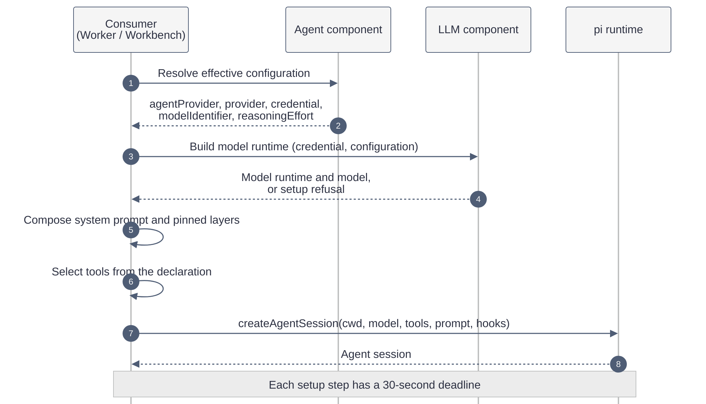
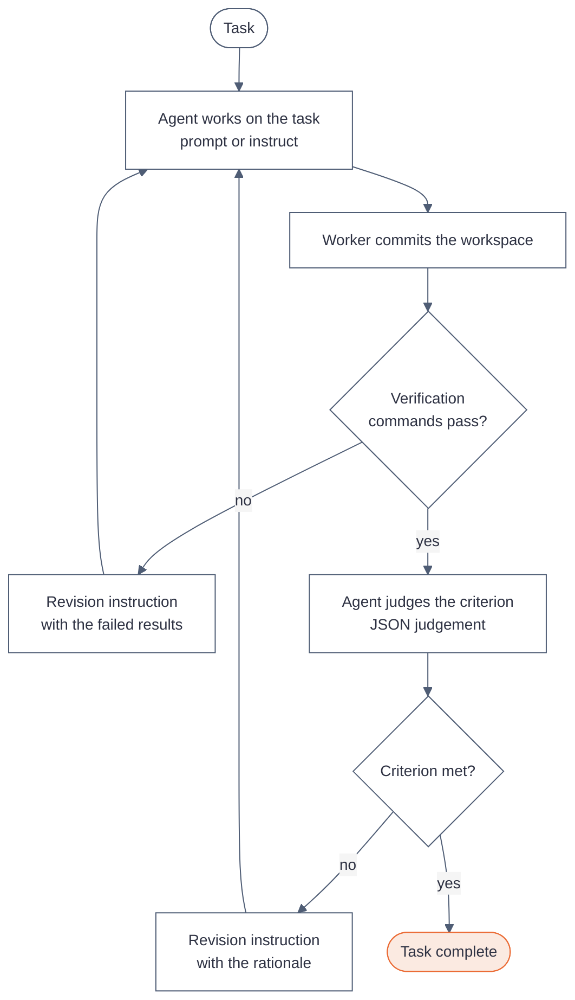

# How the native agent works

A native agent is an LLM agent that KanthorD runs inside its own process. An external harness, for example `claude@1` or `opencode@1`, runs a third-party agent program instead. This page explains how KanthorD builds a native agent, what the agent can see and do, and where its limits are.

KanthorD does not implement the agent loop itself. It embeds [pi](https://www.npmjs.com/package/@earendil-works/pi-coding-agent) (`@earendil-works/pi-coding-agent` 0.86.0) as the runtime. pi supplies the loop, the built-in tools, the session file and the resume. KanthorD supplies the configuration, the credentials, the prompt, the tool set and the budget. KanthorD builds only what pi does not serve.

## The two agents

The agent catalog is static and holds two declarations. An agent name names a role, not a worker.

| Agent   | Role              | Built-in tools                                     | Host tools        | Used by                    |
| ------- | ----------------- | -------------------------------------------------- | ----------------- | -------------------------- |
| `swe@1` | Software engineer | `read`, `edit`, `write`, `grep`, `find`, `ls`, `bash` | `evidence-upload` | Worker `general@1`, the Workbench |
| `re@1`  | Reviewer          | `read`, `grep`, `find`, `ls`                       | none              | Worker `reviewer@1`, the Workbench |

`re@1` has no tool that writes a file or runs a command. Its prompt also forbids a change to the repository. The tool set enforces that rule; the prompt only states it.

Each declaration holds a base prompt, an agent prompt and its tool set. A declaration holds no provider, no model and no reasoning effort. A human selects those values.

## Two consumers

The Agent component belongs to no service. A consumer opens an agent session for its own purpose, under its own authority:

- **Worker execution.** A Worker execution of `general@1` or `reviewer@1` opens a session to do or to judge the work of one node. No human is present during the run.
- **Workbench session.** A human opens a session from the dashboard and talks to the agent. The agent can call KanthorD operations for the human.

Both consumers use the same open path. They differ in the prompt, the tools, the budget and the session storage.

## From configuration to a running session

### Effective configuration

An agent is usable only when a human enables it. The **agent enablement** is global to the server and keyed by agent name. It holds:

- One or more **agent providers**. Each one pairs a provider platform, for example `anthropic` or `openai-compatible`, with one credential.
- One **default configuration**: an agent provider, a model identifier and a reasoning effort.

A consumer can supply an **entry** that overrides any of these three fields. A Worker execution takes the entry from its worker binding. A Workbench session takes the values that the human picked. The Agent component merges the entry over the default and validates the whole result:

- The agent provider exists in the enablement.
- Custody accepts the credential for the platform.
- The model belongs to the built-in model list of the platform. For `openai-compatible`, the model belongs to the approved models of the credential.
- The reasoning effort is one of the levels that the model supports.

The same check runs at enablement write, at worker binding write and at resolution. A configuration that passes once can therefore fail later only when a human changes the enablement or the credential. An enablement change that breaks a worker binding is refused, so that case does not occur in practice. Disablement is the only stop switch: it refuses every later resolution.

### Model runtime

The LLM component turns the effective configuration into a pi `ModelRuntime` and one model:

- The runtime reads secrets through a credential store that custody hands over for this one session. The agent never sees the secret as a value.
- The runtime makes no network call to refresh model lists (`allowModelNetwork: false`). The model must already be known.
- For `openai-compatible`, KanthorD registers a provider from the credential metadata: its base URL, its models and the reasoning levels of each model. These models use the OpenAI Responses API and report zero cost.
- Some platforms need extra values, for example `AWS_REGION` for Amazon Bedrock. KanthorD takes these values from the credential metadata, not from the server environment.

The runtime refuses the setup when the credential does not match the configuration or when the model or the effort is unknown. The refusal reasons are `credential_absent`, `credential_revision_mismatch`, `model_unknown` and `reasoning_effort_unsupported`.

### Isolation from the host pi installation

The host can have its own pi installation with extensions, skills and settings. The native agent ignores all of them:

- pi runs with its own agent directory, `~/.local/state/kanthord/pi`, through `PI_CODING_AGENT_DIR`.
- pi runs offline (`PI_OFFLINE=1`), with telemetry and analytics off.
- The session loads no extension, no skill, no prompt template, no theme and no context file. KanthorD supplies the system prompt and its own hooks only.
- The system prompt shows the working directory relative to the home directory, for example `~/work/repo`, not the absolute path.

## The prompt

The prompt of a native agent is a stack of **layers**. Each layer names its owner and its source, inside a `<prompt-layer>` tag. The system prompt opens with a framing paragraph that states the precedence, from highest to lowest:

| Precedence | Worker execution | Workbench session |
| ---------- | ---------------- | ----------------- |
| 1 | Agent prompt | Agent prompt |
| 2 | Base prompt | Base prompt |
| 3 | Work prompt | Workbench prompt |
| 4 | Project prompt | — |
| 5 | Global prompt | Global prompt |

A layer of higher precedence governs a layer of lower precedence. No layer revokes an obligation of the agent prompt or of the base prompt. No layer authorizes an operation: the tool set and the authority of the consumer decide what the agent can do.

### Where each layer comes from

- **Base prompt** and **agent prompt** ship with KanthorD in `static/prompt/`. The base prompt sets the engineering principles and the writing rules. The agent prompt sets the role: `swe@1` performs the steps of a task, `re@1` judges the evidence of a node.
- **Workbench prompt** ships with KanthorD. It tells the agent that a human reads every reply, and that it asks one question at a time.
- **Global prompt** belongs to the operator of the server. The server configuration value `worker.globalPrompt` names a file. Without that value, KanthorD reads `~/.agents/AGENTS.md`, then `~/.claude/CLAUDE.md`. The value `-` disables the layer.
- **Project prompt** belongs to the project of the repository binding. The binding can hold the text. Without it, KanthorD reads `AGENTS.md`, then `CLAUDE.md`, from the root of the workspace. An evaluation never reads the workspace files, because the candidate under review wrote them.
- **Work prompt** is the node that the execution works on. It holds the name, the requirement, the criterion and the verification commands of one pinned node revision.

KanthorD rejects a file layer that is larger than 32 KiB, that is not UTF-8, that holds control characters, that is not a regular file, that lies outside the workspace, or that takes longer than 10 seconds to read. A rejected layer is left out; the session still opens. The **composition record** lists every selected layer with its SHA-256 digest and every rejected layer with its reason.

### Why some layers are pinned

The base prompt and the agent prompt live in the system prompt. The global, project and work layers are **pinned** instead: before each model call, a pi `context` hook inserts them as messages directly after the system messages. A second guard on the stream function re-inserts any pinned layer that is missing from the request.

Pinning has two effects. A pinned layer survives when pi compacts a long conversation, because KanthorD inserts it again on each call. And the work layer can change between tasks without a new session: each `prompt` or `instruct` call sets the current work, and the next model call carries it.

## Tools

The agent receives only the tools of its declaration. A tool outside the allowlist does not exist for the agent.

- **Built-in tools** are the pi tools `read`, `edit`, `write`, `grep`, `find`, `ls` and `bash`. They act on the working directory. `grep` and `find` need `rg` and `fd` on the host; the worker refuses to start without them.
- **`bash`** runs commands on the host, as the user of the KanthorD process. KanthorD removes every provider API key from the environment of each command, so a command cannot read the credentials of the agent. In a Worker execution, the timeout of each command is capped at the remaining budget.
- **`evidence-upload`** (`swe@1` in a Worker execution) uploads a workspace file as evidence of the attempt and returns its `evidenceId`, `assetId` and `uri`.
- **Operation tools** (Workbench only) expose the human operations of KanthorD, for example the project and worker operations. An operation that handles a secret, or that streams, is excluded. Each call runs with the identity of the human who sent the last message.

A Workbench operation tool that changes state waits for the human. The dashboard shows the pending call, and the human approves or rejects it. A rejection, an abort or the end of the run counts as a rejection. A read operation and a built-in tool run without approval. A Worker execution has no approval step, because no human is present.

## A session inside a Worker execution

A Worker execution opens one session per claim, in a workspace that the worker prepares. The worker method then drives the session with two calls:

- `prompt(work)` sends the work prompt as the user message.
- `instruct(work, text)` pins the work prompt and sends another instruction, for example a revision request.

After each call, the worker reads the last reply of the agent. The worker, not the agent, decides when the work is done.

The other methods use the same session with a single call:

- **Evaluation** (`re@1`). The worker runs the verification commands first. A failure ends the evaluation without the agent. On success, the agent receives the evidence and returns a JSON judgement.
- **Initiative report** (`swe@1`). When every objective of an initiative ends, the agent writes a report from the objectives, the outcomes and the evidence. The worker stores the report as evidence.

An agent reply that does not parse as the expected judgement ends the execution with `judgement_invalid`.

### Budget

Each native worker has a resource budget of 200 turns and 2 hours of wall time. The wall deadline is also capped by the expiry of the claim. When the budget ends:

- pi stops after the current turn, and KanthorD aborts the session.
- Each later `bash` command is refused.
- The worker method stops and releases or ends the execution.

A cancellation of the execution, for example a server shutdown, also aborts the session.

## A session inside the Workbench

A Workbench session is a conversation between one human and one agent, stored as a pi JSONL session file:

- The working directory is `~/.local/state/kanthord/workbench/<agentName>`.
- The session files live under `~/.local/state/kanthord/pi/sessions/workbench/<agentName>`.
- The session identity that KanthorD assigns is also the pi session id.

KanthorD keeps no copy of the conversation. The session list, the history and the resume all come from pi. When the server restarts, KanthorD reopens the file by its session id; every completed turn is restored, and a turn that was running at the restart is lost. The session also answers a `pi --session <file>` command, so a human can continue the same conversation in a terminal.

The human can change the agent provider, the model and the reasoning effort between runs. KanthorD writes each change into the session file as a pi entry, so the file records which model answered which turn.

## Limitations

- **No resume for a Worker execution.** A Worker execution keeps its session in memory. When the worker process ends, the conversation is lost, and a new attempt starts a new session.
- **No transcript storage.** The worker hands the transcript of each execution to a transcript sink at the end. The current sink discards it.
- **No sandbox.** `bash` and the file tools run on the host with the rights of the KanthorD process. The tool set of `re@1` limits what the reviewer can do. The working directory of `swe@1` is only its default location, not a boundary.
- **No approval in a Worker execution.** Only the Workbench asks a human before a call that changes state.
- **Static catalog.** A new agent or a change of a prompt or a tool set requires a new KanthorD release.
