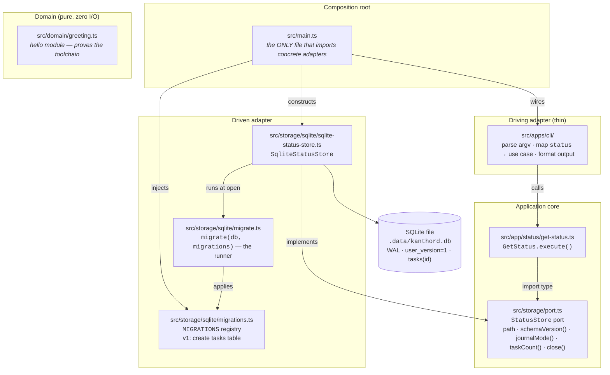
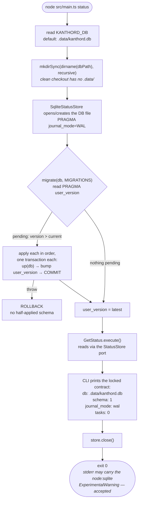
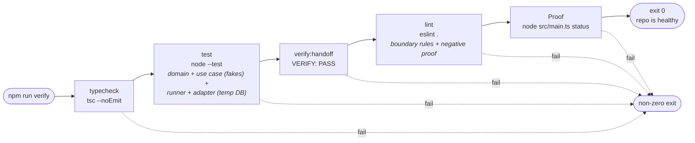

# EPIC 001 — Development environment · what exists after this epic

Three views of the finished epic: the **static architecture** (files and the
import-direction rules, machine-enforced by lint), the **runtime flow** of the
Proof command (`node src/main.ts status`), and the **verification bundle**
(`npm run verify`).

## 1. Static architecture — the walking skeleton

Every arrow is an allowed import direction; anything not drawn is forbidden and
fails `npm run lint`.

Import rules the lint enforces (Story 2):

- `src/domain/**` imports only `src/domain/**` + `node:*`.
- `src/app/**` imports only `src/domain/**` + `*/port.ts` (`import type`).
- Only `src/main.ts` imports concrete adapters.
- `src/apps/**` never imports adapters or `domain/` internals.
- Tests are carved out: `*.test.ts` may import `node:test`, `node:assert`, and
  (co-located adapter tests) the adapter in their own directory.

## 2. Runtime flow — `node src/main.ts status` (the Proof)

The migration runner is the piece later epics reuse: **EPIC 002/003 never write
runner code** — they append `{ version: N, name, up }` entries to `MIGRATIONS`
and the same bootstrap applies them idempotently on next start.

## 3. Verification bundle — `npm run verify`

## Also delivered (not on the diagrams)

- **Pipeline seams** (Story 4): `.agent/tdd/memory/ts-gotchas.md` seeded with
  verified Node 24 pitfalls; `.agent/tdd/history/`, `.agent/plan/stories/`, and
  the engineer journal dirs exist; `/work` pre-flight passes — EPIC 002 is
  dispatchable.
- **First RED→GREEN cycle** (Story 1): `src/domain/greeting.ts` +
  `greeting.test.ts` prove type stripping, explicit `.ts` ESM imports, and the
  `node:test` runner.
- **Negative lint proof** (Story 2): a committed, re-runnable check that a
  forbidden import actually fails — the boundary rules are proven to fire, not
  just configured.

Plan source: [.agent/plan/epics/001-development-environment.md](../../.agent/plan/epics/001-development-environment.md)
· [story files](../../.agent/plan/stories/001-development-environment/index.md)
