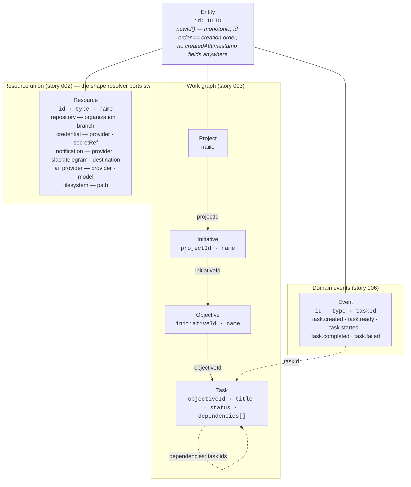
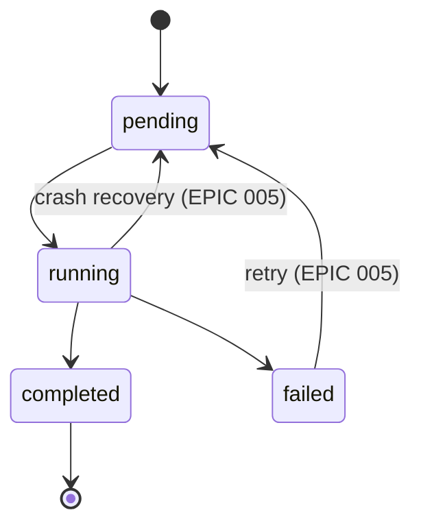
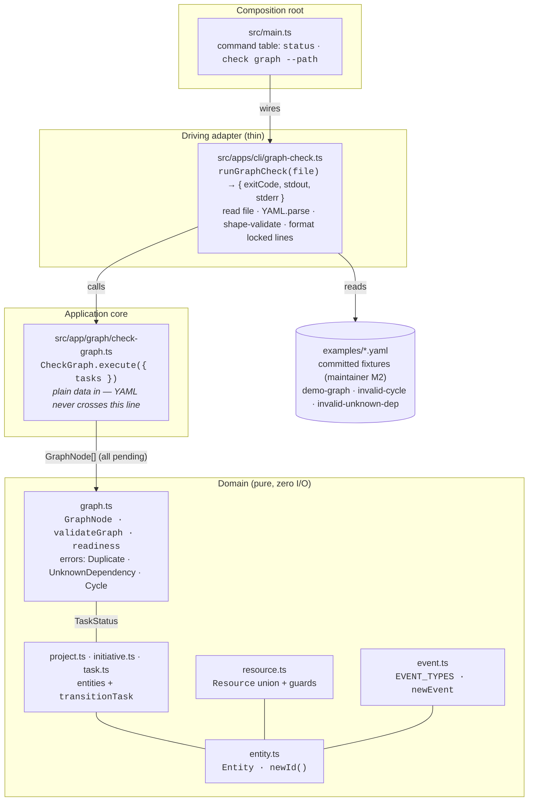
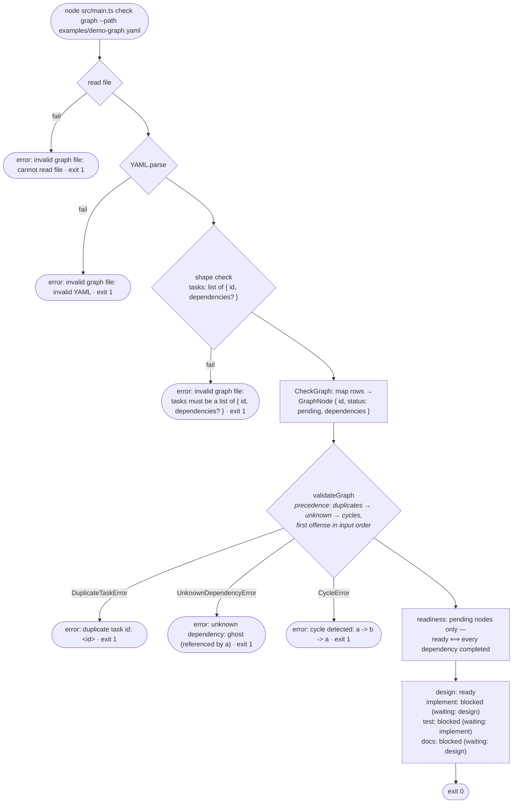

# EPIC 002 — Domain core · what exists after this epic

Three views of the finished epic: the **canonical domain model** (the
hexagon's center, replacing the README sketch), the **static architecture**
(the EPIC 001 skeleton plus the new domain/app/CLI pieces), and the
**runtime flow** of the Proof command
(`node src/main.ts check graph --path examples/demo-graph.yaml`).

## 1. Canonical domain model — pure TS, zero I/O

The entities and their id references (flat ids, never nested object graphs —
a locked decision, see story 003). Field names are verbatim contract names:
the graph YAML uses them exactly (`dependencies`, never `deps`).

Task state rules (story 004) — every edge not drawn throws
`IllegalTransitionError { from, to }`:

## 2. Static architecture — new pieces on the EPIC 001 skeleton

Every arrow is an allowed import direction; the EPIC 001 boundary lint still
enforces it (with one amendment: `src/domain/**` may import `ulid` —
maintainer M1).

`check graph` opens **no database** — the EPIC 001 status/SQLite path is
untouched and still green. EPIC 002 registers **no migration**; the graph
lives in memory (persistence is EPIC 003).

## 3. Runtime flow — `node src/main.ts check graph --path <file>` (the Proof)

All error strings are locked contracts (stderr, exit 1); success lines are
locked too (stdout, exit 0).

The domain pair `validateGraph` + `readiness` is the piece EPIC 005 reuses:
the scheduler feeds real `Task` entities (they satisfy `GraphNode`
structurally) with live statuses — `check graph` is just the all-pending
special case.

## Also delivered (not on the diagrams)

- **Executable Proof** (story 008 M3): a committed script that `diff`s the
  demo output and `grep`s the exact error lines — `PROOF-OK` or non-zero,
  no eyeballing.
- **README cleanup** (story 008 M4, after close): the `### Abstraction`
  sketch leaves `README.md` and every reference to it is repointed in the
  same change (`AGENTS.md`, EPIC 004's Resource-union pointer); story 003 +
  `src/domain/` become the single source of truth for the model.
- **Event vocabulary** for EPIC 003's pull-based feed: monotonic ULID event
  ids are what makes the `GET /events?after=<ulid>` cursor sortable.
- **Reset edges** `failed→pending` (retry) and `running→pending` (crash
  recovery) locked now (amended and confirmed by the maintainer during
  EPIC 005 planning, 2026-07-16, replacing the earlier `failed→running`
  retry edge) so EPIC 005 never reopens domain state rules: claimable =
  `pending`, and `pending→running` is the single entry edge into execution.

Plan source: [.agent/plan/epics/002-domain-core.md](../../.agent/plan/epics/002-domain-core.md)
· [story files](../../.agent/plan/stories/002-domain-core/)
