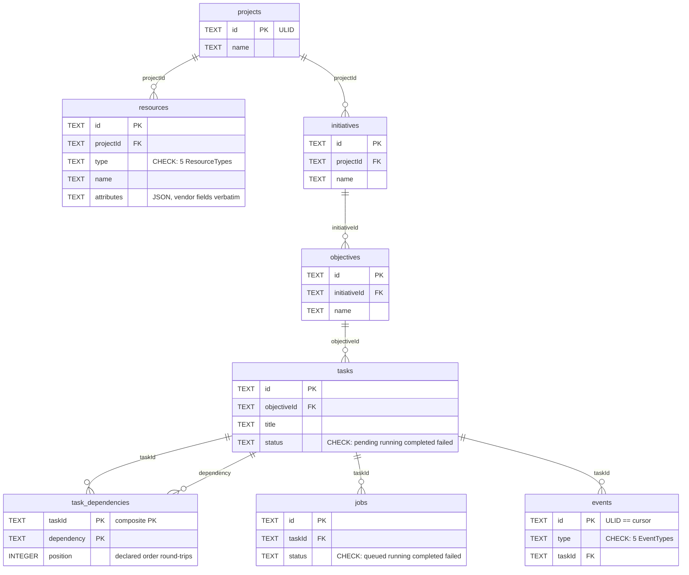
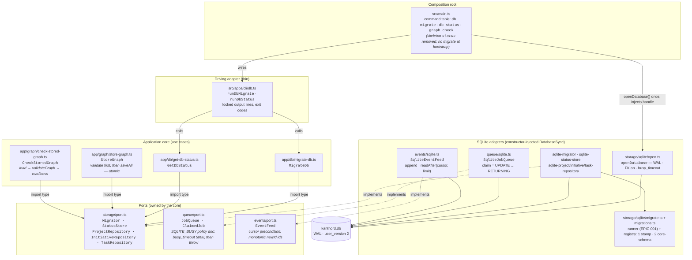
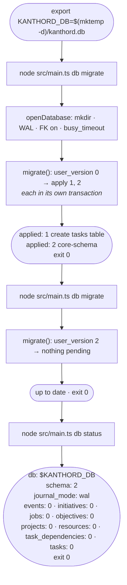
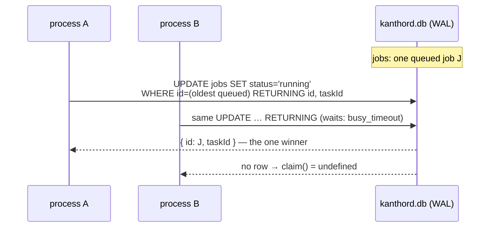
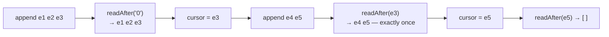

# EPIC 003 — Persistence, queue, and event feed · what exists after this epic

Four views of the finished epic: the **SQLite schema** (migration 2, the
storage half of everything after), the **static architecture** (ports +
adapters on the EPIC 002 program), the **runtime flow** of the Proof
(`db migrate` twice + `db status`), and the **claim/cursor mechanics** the
tests prove with real processes.

## 1. Database schema — migration 2 `core-schema`

One SQLite file (`KANTHORD_DB`, default `.data/kanthord.db`). Every
connection opens through `openDatabase()`: parent dir created,
`journal_mode=WAL`, `foreign_keys=ON`, `busy_timeout=5000`. Column names are
verbatim domain field names (locked decision — no renames between entity and
storage).

Schema facts not drawn:

- `PRAGMA user_version = 2` — the EPIC 001 runner's version stamp; migration
  2 first `DROP TABLE tasks` (the skeleton stamp), then creates the eight
  real tables.
- **Partial unique index** `jobs(taskId) WHERE status='queued'` — this is
  what makes `enqueue` idempotent (`INSERT … ON CONFLICT DO NOTHING`).
- No `events.payload` column yet — EPIC 005 adds it (trivial `ALTER TABLE`)
  when the failure reason lands.

## 2. Static architecture — ports + adapters on the EPIC 002 program

Every arrow is an allowed import direction; the boundary lint still enforces
it. `main.ts` opens the database **once** via `openDatabase()` and injects
the `DatabaseSync` handle into every adapter — adapters never open the DB
themselves.

Not wired to the CLI yet (epic non-goals): `StoreGraph`/`CheckStoredGraph`
(EPIC 004 wires `task list` on top), `JobQueue`/`EventFeed` consumers
(EPIC 005's daemon). The EPIC 002 `graph check` path is untouched.

## 3. Runtime flow — the Proof

Failure contract: a failing migration prints the lines already applied in
the run, then `error: migration <version> <name> failed: <message>`, exit 1.
Only the failing migration rolls back — earlier ones in the run stay applied
(per-migration transactions). Table lines are alphabetical (locked —
`sqlite_master` order is not a contract).

## 4. Claim + cursor mechanics — what the adapter tests prove

The no-double-claim proof runs **two real OS processes** against one DB file
(`node:sqlite` is synchronous — two connections on one event loop would only
interleave, proving nothing):

The event feed's exactly-once poll: the cursor is the last seen ULID; ids
are strictly increasing (single-writer process + monotonic `newId`, asserted
in EPIC 002 S006), so `WHERE id > cursor ORDER BY id` never skips and never
repeats:

## Also delivered (not on the diagrams)

- **Graph round-trip capstone**: an integration test drives `StoreGraph`
  (validate → atomic `saveAll`) then `CheckStoredGraph` (load → readiness)
  through the real adapters on a temp DB — the domain ↔ storage proof, and
  the read model EPIC 004's `task list` reuses.
- **Ordered dependencies survive storage**: `task_dependencies.position`
  (debate finding — SQL row order is not a contract) keeps the EPIC 002
  readiness report's `waiting` order stable.
- **Locked policies on the ports**: `SQLITE_BUSY` → wait `busy_timeout`,
  then throw (callers decide retries); enqueue idempotent only while
  `queued` — a claimed task can be re-enqueued (EPIC 005 retry).
- **Maintainer story 007**: `npm run verify` realigned to the new Proof
  (the skeleton `status` command is gone), `status` consumer sweep, and the
  epic Proof run recorded.

Plan source: [.agent/plan/epics/003-persistence-queue-events.md](../../.agent/plan/epics/003-persistence-queue-events.md)
· [story files](../../.agent/plan/stories/003-persistence-queue-events/)
