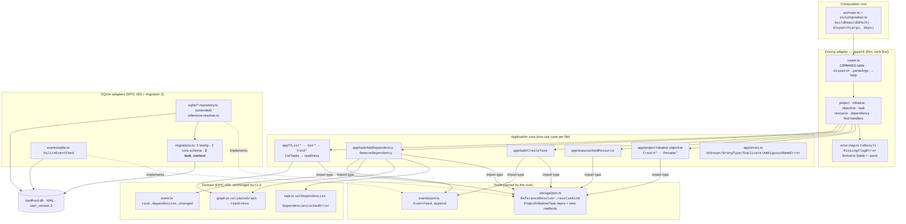
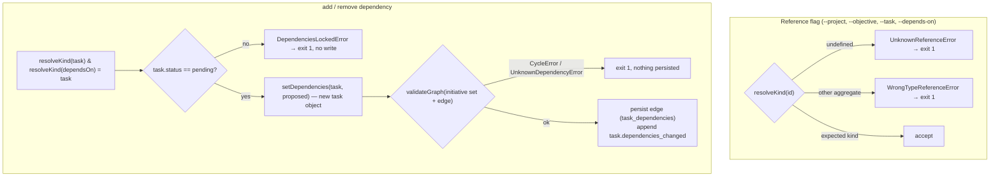

# EPIC 004 — CLI manages the work graph · what exists after this epic

Four views of the finished epic: the **command surface** (verb-first, 1:1 to
use cases), the **static architecture** (the CLI app + use cases layered on the
EPIC 003 storage program), the **runtime flow** of the Proof (create → list →
re-arrange → reject), and the **guard logic** every reference and every
dependency mutation passes through.

New vs EPIC 003: the whole `apps/cli` command layer, the `app/*` command +
query use cases, a `ReferenceResolver` port, migration 3 `task_context`, and
new read/find/mutation methods on the existing aggregate repos. No new
repository types (resources stay on `ProjectRepository`, objectives on
`InitiativeRepository`).

## 1. Command surface — verb-first, 1:1 with use cases

Every command key is `<verb> <object>` and maps to exactly one use-case class.
Reference flags (`--project`, `--objective`, `--depends-on`, `--task`) take
ULIDs; `--name`/`--title` are values. Creates print the new ULID as sole
stdout; humans read stderr.

| Command | Flags | Use case |
|---|---|---|
| `create project` | `--name` | `CreateProject` |
| `create initiative` | `--project --name` | `CreateInitiative` |
| `create objective` | `--initiative --name` | `CreateObjective` |
| `create task` | `--objective --title [--depends-on … --context type=id …]` | `CreateTask` |
| `create repository` | `--project --name --organization --branch` | `AddResource` |
| `create credential` | `--project --name --provider --secret-ref` | `AddResource` |
| `create notification` | `--project --name --provider --destination` | `AddResource` |
| `create ai-provider` | `--project --name --provider --model` | `AddResource` |
| `create filesystem` | `--project --name --path` | `AddResource` |
| `rename project/initiative/objective` | `--id --name` | `Rename*` |
| `add dependency` | `--task --depends-on` | `AddDependency` |
| `remove dependency` | `--task --depends-on` | `RemoveDependency` |
| `list project/initiative/objective/task` | scope flag `[--json]` | `List*` |
| `get project/initiative/objective/task` | `--id [--json]` | `Get*` |
| `find project/initiative/objective/resource` | scope + `--name` | `Find*` |

Subsystem commands: `db migrate`, `db status` (kept), plus EPIC 002's
`check graph --path <file>` (already verb-first).

## 2. Static architecture — CLI app on the EPIC 003 program

Every arrow is an allowed import direction (the boundary lint still enforces
it). `main.ts` → `buildDeps(dbPath)` opens the DB once and injects handles.

## 3. Runtime flow — the Proof

```mermaid
flowchart TD
    START(["export KANTHORD_DB=… ; db migrate (→ user_version 3)"]) --> P["PROJECT=create project --name demo"]
    P --> R["create repository --project $PROJECT<br/>--name backend --organization acme --branch main"]
    R --> I["INITIATIVE=create initiative --project $PROJECT --name oauth"]
    I --> O["OBJECTIVE=create objective --initiative $INITIATIVE --name backend"]
    O --> TA["TASK_API=create task --objective $OBJECTIVE --title 'implement api'"]
    TA --> TD["TASK_DEPLOY=create task … --title deploy --depends-on $TASK_API"]
    TD --> L1["list task --initiative $INITIATIVE"]
    L1 --> L1O(["implement api → ready<br/>deploy → blocked (waiting: implement api) · exit 0"])
    L1O --> PREP["TASK_PREP=create task … --title 'spike auth'"]
    PREP --> ADD["add dependency --task $TASK_API --depends-on $TASK_PREP"]
    ADD --> L2["list task --initiative $INITIATIVE"]
    L2 --> L2O(["spike auth → ready · implement api → blocked (waiting: spike auth)<br/>deploy → blocked (waiting: implement api) · exit 0"])
    L2O --> CYC["add dependency --task $TASK_PREP --depends-on $TASK_DEPLOY"]
    CYC --> CYCO(["error: cycle … · exit 1 · graph unchanged"])
    CYCO --> BAD["create task --objective $TASK_API --title 'bad parent'"]
    BAD --> BADO(["WrongTypeReferenceError · exit 1 · no stack trace"])
```

## 4. Guard logic — references and dependency mutation

Every reference passes `resolveKind`; every dependency mutation adds the
pending gate then the cycle check, and writes nothing until both pass.

## Facts not drawn

- **Task context is persistence-only** — `create task --context type=id` writes
  `task_context` (migration 3); the domain `Task` entity gains no `context`
  field. The `TaskContext` resolver is EPIC 005.
- **Aggregate-owned repos** — resources on `ProjectRepository`, objectives on
  `InitiativeRepository`; no `ResourceRepository`/`ObjectiveRepository`.
- **`ListTasks` runs `validateGraph` on read** so a corrupt persisted graph is
  a named error, not a wrong report; in EPIC 004 all tasks are `pending`, so
  every task appears in the readiness report.
- **Cross-epic precondition** — `task.dependencies_changed` needs EPIC 003's
  `events.type` CHECK to list all 6 `EVENT_TYPES` (EPIC 002 now declares the
  6th); sync migration 2, or story 06 rebuilds the CHECK.
- **`create`-only cannot cycle** (deps must pre-exist; ULIDs are monotonic) —
  cycles are reachable only through `add dependency`, which is why the cycle
  guard lives on mutation, not create.

Plan source: [.agent/plan/epics/004-cli-work-graph.md](../../.agent/plan/epics/004-cli-work-graph.md)
· [story files](../../.agent/plan/stories/004-cli-work-graph/)
