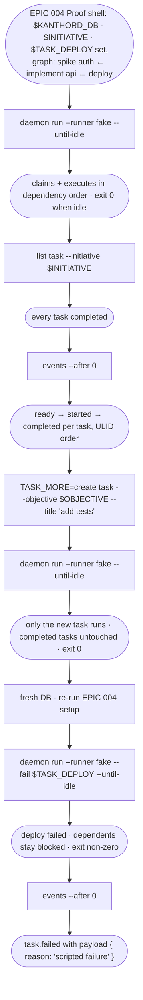
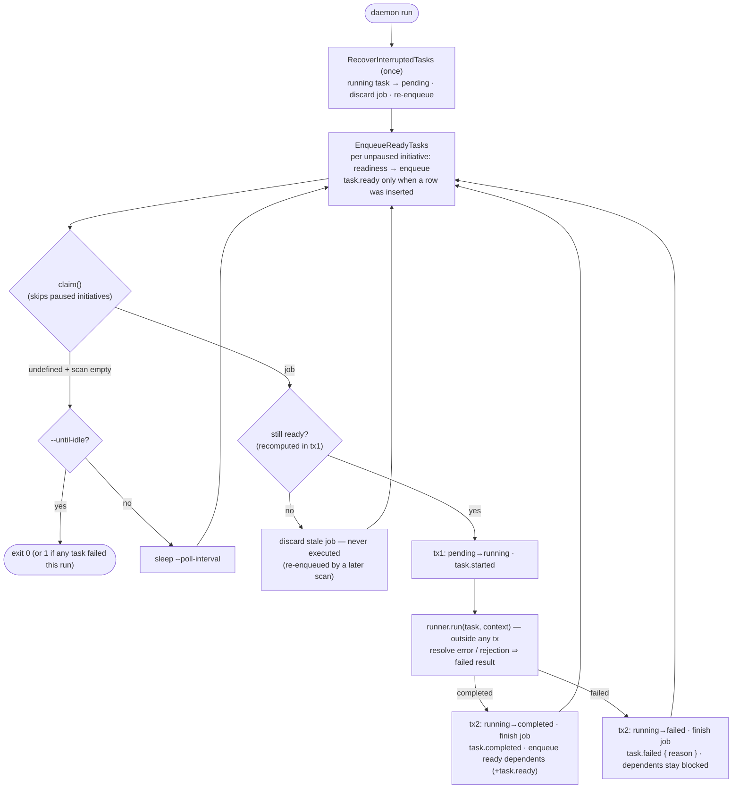
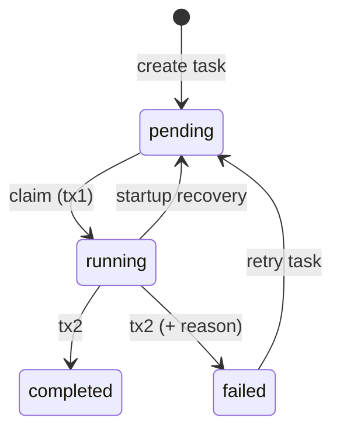

# EPIC 005 — Execution loop with a fake agent · what exists after this epic

Four views of the finished epic: the **command surface** (what the daemon and
its control commands add), the **static architecture** (the agent-runner
capability + scheduling use cases layered on the EPIC 004 program), the
**runtime flow** of the Proof (drain → live insert → failure path), and the
**loop logic** every claim passes through (scan→claim cycle, transactions,
task state machine).

New vs EPIC 004: the `agent-runner/` capability (port + `FakeRunner` +
resolver), the scheduling use cases (`EnqueueReadyTasks`, `RunNextTask`,
`RecoverInterruptedTasks`, `RunDaemon`, `RetryTask`, `ListEvents`,
`PauseInitiative`/`ResumeInitiative`), the `UnitOfWork` transaction port,
migration 4 (`events.payload`, `initiatives.paused`), and the `JobQueue`
extensions (boolean `enqueue`, paused-aware `claim`, `finish`, `discard`,
`listRunningJobs`).

## 1. Command surface — what EPIC 005 adds

| Command | Flags | Use case |
|---|---|---|
| `daemon run` | `[--runner <name>] [--fail <task-id> …] [--until-idle] [--poll-interval <ms>]` | `RunDaemon` |
| `pause initiative <id>` | — | `PauseInitiative` |
| `resume initiative <id>` | — | `ResumeInitiative` |
| `retry task <id>` | — | `RetryTask` |
| `events` | `--after <cursor> [--limit <n>] [--json] [--follow] [--poll-interval <ms>]` | `ListEvents` |

`daemon run` is a subsystem command (like `db migrate`); `pause`/`resume`/
`retry` are new verb-first verbs; `events` is the one locked non-verb-first
exception (the epic's own contract, reused by EPIC 006's Proof).

## 2. Static architecture — the loop on the EPIC 004 program

```mermaid
flowchart TB
    subgraph composition["Composition root"]
        MAIN["src/main.ts<br/><code>buildDaemon(deps)</code> · flags → FakeRunner{failTaskIds}"]
    end

    subgraph apps["Driving adapter — apps/cli (thin)"]
        DCLI["daemon.ts <code>daemon run</code> · SIGINT → stop()"]
        ECLI["events.ts <code>events --after/--follow</code> · AbortSignal"]
        ICLI["initiative.ts <code>pause/resume initiative</code>"]
        TCLI["task.ts <code>retry task</code>"]
    end

    subgraph core["Application core (one use case per file)"]
        RD["app/task/<code>RunDaemon</code><br/>recover once · scan→claim cycle<br/>SQLITE_BUSY retry · exit 0/1"]
        ERT["app/task/<code>EnqueueReadyTasks</code><br/>readiness → enqueue → task.ready (once)"]
        RNT["app/task/<code>RunNextTask</code><br/>tx1 claim+start · run · tx2 record+unblock"]
        REC["app/task/<code>RecoverInterruptedTasks</code>"]
        RET["app/task/<code>RetryTask</code>"]
        LEV["app/task/<code>ListEvents</code>"]
        PSE["app/initiative/<code>Pause/ResumeInitiative</code>"]
    end

    subgraph domain["Domain (EPIC 002, amended table)"]
        DTASK["task.ts <code>transitionTask</code><br/>pending→running · running→completed/failed<br/>failed→pending (retry) · running→pending (recovery)"]
        DGRAPH["graph.ts <code>readiness</code>"]
        DEVENT["event.ts <code>newEvent + payload</code>"]
    end

    subgraph ports["Ports (owned by the core)"]
        ARPORT["agent-runner/port.ts<br/><code>AgentRunner.run · AgentRunnerResolver.for<br/>TaskResult · RunnerNotResolvableError</code>"]
        QPORT["queue/port.ts<br/><code>enqueue→bool · claim · finish · discard · listRunningJobs</code>"]
        SPORT["storage/port.ts<br/><code>UnitOfWork.transaction</code> · repos + <code>setPaused · listAllInitiatives · getInitiativeId</code>"]
        EPORT["events/port.ts <code>EventFeed</code> (+payload)"]
    end

    subgraph adapters["Adapters"]
        FAKE["agent-runner/fake.ts <code>FakeRunner</code><br/>agent-runner/resolver.ts <code>RegistryRunnerResolver</code>"]
        QADP["queue/sqlite.ts<br/>claim joins initiatives · skips paused"]
        SADP["storage/sqlite/* + <code>SqliteUnitOfWork</code><br/>migrations: … · <b>4 execution-loop</b>"]
        EADP["events/sqlite.ts (payload JSON)"]
    end

    DB[("kanthord.db · WAL · user_version 4")]

    MAIN --> DCLI & ECLI & ICLI & TCLI
    DCLI --> RD
    ECLI --> LEV
    ICLI --> PSE
    TCLI --> RET
    RD --> REC & ERT & RNT
    RNT -->|"import type"| ARPORT
    ERT & RNT & REC & RET -->|"import type"| QPORT & SPORT & EPORT
    RNT --> DTASK & DGRAPH & DEVENT
    ERT --> DGRAPH & DEVENT
    REC & RET --> DTASK & DEVENT
    FAKE -.->|implements| ARPORT
    QADP -.->|implements| QPORT
    SADP -.->|implements| SPORT
    EADP -.->|implements| EPORT
    QADP & SADP & EADP --> DB
```

## 3. Runtime flow — the Proof

## 4. Loop logic — scan→claim cycle, transactions, task states

Every iteration scans before it claims (live inserts are seen next
iteration); idle = scan enqueued nothing **and** claim returned nothing.

Task state machine after the EPIC 002 amendment (claimable = `pending`,
one entry edge into execution):

## Facts not drawn

- **Runner selection (this epic):** an `ai_provider` context binding →
  `RunnerNotResolvableError` → the task fails with that named reason (no AI
  runner is registered yet); no binding → the default runner (`fake`).
  `Task.agent` stays deferred to EPIC 006 behind the unchanged
  `AgentRunnerResolver.for(task, context)` seam.
- **Queue = operational state; events = audit.** Stale and crash-interrupted
  jobs are deleted; the interrupted attempt remains visible as a
  `task.started` without a matching `task.completed`.
- **Crash window:** between tx1 and tx2 the task and job are both `running`;
  startup recovery repairs exactly that state. A restart re-emits
  `task.ready`/`task.started` — an observable restart, by design.
- **`SQLITE_BUSY`:** adapters throw after `busy_timeout=5000`; `RunDaemon`
  retries the iteration after 100 ms — the daemon owns the retry policy
  (EPIC 003 contract).
- **Pause gates claiming, not in-flight work** — a running task finishes
  even if its initiative is paused mid-flight; queued jobs of a paused
  initiative survive an `--until-idle` exit.
- **One worker** — no parallelism; concurrency safety beyond the EPIC 003
  atomic claim is out of scope (epic non-goal).

Plan source: [.agent/plan/epics/005-execution-loop-fake-agent.md](../../.agent/plan/epics/005-execution-loop-fake-agent.md)
· [story files](../../.agent/plan/stories/005-execution-loop-fake-agent/)
