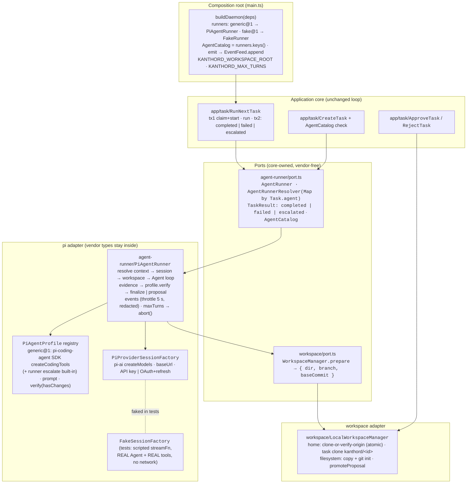
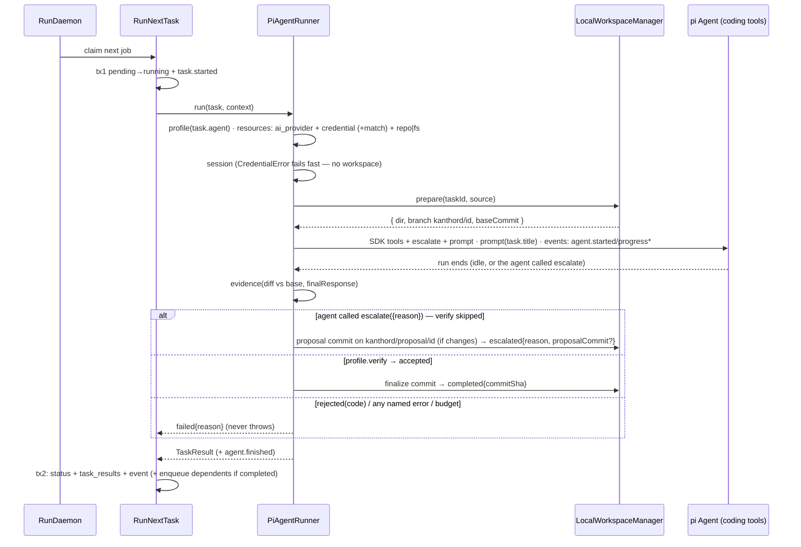
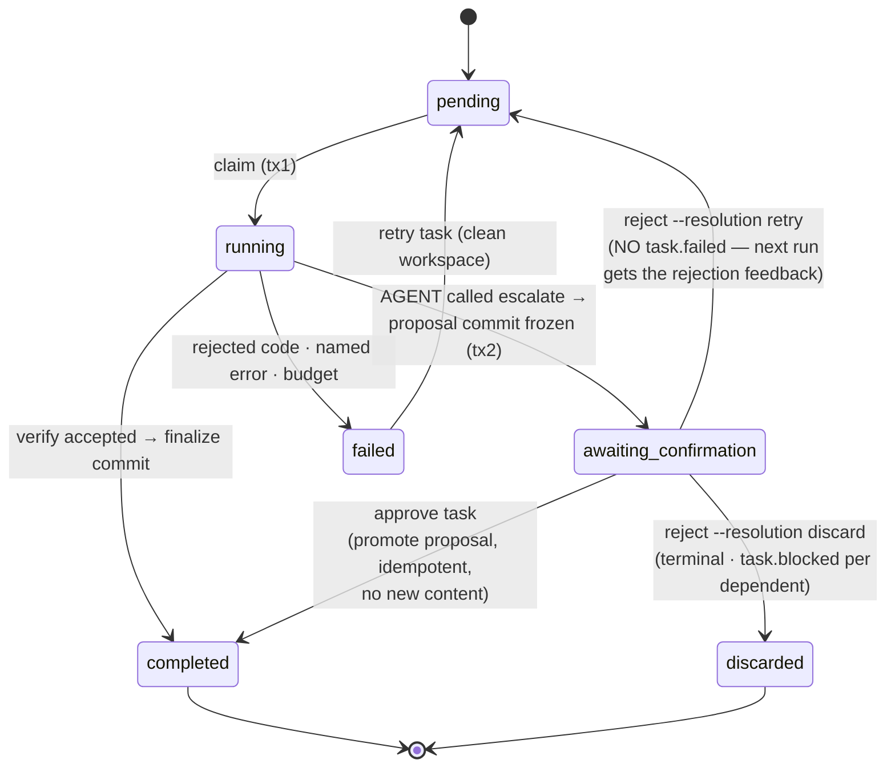

# EPIC 006 — Real agents via pi · what exists after this epic

Four views of the finished epic: the **command surface** (agents, sessions,
and confirmation verbs added to the EPIC 005 program), the **static
architecture** (the pi runner + profiles behind the unchanged ports), the
**runtime flow** of one real-agent task (resolve → workspace → loop →
evidence → verdict), and the **escalation state machine** (frozen proposal →
approve/reject).

New vs EPIC 005: the pi adapter (`PiAgentRunner` + adapter-private
`PiAgentProfile`s — `generic@1`'s tools come exclusively from the
`@earendil-works/pi-coding-agent` SDK (`createCodingTools`, a verification
gate) —, `PiProviderSessionFactory` with API-key + OAuth,
`FakeSessionFactory`), the workspace capability (local-home Repository model,
per-task clones, proposal promotion), `Task.agent` (versioned ref) +
`awaiting_confirmation` (migration 5), verification over runner-computed
evidence, agent-decided escalation (the `escalate` tool →
`approve`/`reject`), agent progress events (throttled, redacted), the turn
budget, `login <provider>`, and `import resource`.

## 1. Command surface — what EPIC 006 adds/changes

| Command | Flags | Use case |
|---|---|---|
| `create task` | `+ [--agent <ref>=generic@1]` | `CreateTask` (AgentCatalog-validated) |
| `create repository` | `--organization --branch [--path]` (amended) | `AddResource` |
| `create credential` | `--provider --value` (amended) | `AddResource` |
| `create ai-provider` | `--provider --model [--base-url]` (amended) | `AddResource` |
| `login <provider>` | `--project <ref> --name <name>` | OAuth flow → credential resource |
| `approve task <id>` | — | `ApproveTask` |
| `reject task <id>` | `--resolution <retry\|discard> [--reason <text>]` | `RejectTask` |
| `list task` | `+ [--status <status>]` | `ListTasks` |
| `import resource <path>` | — | `ImportResources` |
| `daemon run` | `--runner` **removed** (per-task agent refs) | `RunDaemon` |

## 2. Static architecture — the pi adapter behind the EPIC 005 ports

## 3. Runtime flow — one real-agent task

## 4. Escalation state machine — agent-decided, frozen proposal, human confirmation

Invariants: claimable = `pending` only; crash recovery never touches
`awaiting_confirmation`; dependents enqueue only on `completed`; escalated ≠
failed (daemon exit 0 + "N task(s) awaiting confirmation" line); a rejection
is never an execution failure (no `task.failed` on reject); rejection
decisions are durable and idempotent (same resolution → no-op, conflicting →
error); `discarded` is terminal — its dependents stay visibly blocked until
the human re-points them (EPIC 004 re-arrange); the actor approves exactly
the frozen `proposalCommit` — never a mutable workspace; kanthord never
pushes; every persisted string is credential-redacted.
