# Kanthord Git Workflow

How kanthord moves code from an agent's edits to your remote.

This covers the objective-branch workflow (EPICs 007.11–007.13). An initiative
targets a single repository. Per-task candidate landing and the EPIC 007.14
transplant recovery are in §6.

---

## 1. Glossary

| Term                          | Meaning                                                                                                                                                                                            |
| ----------------------------- | -------------------------------------------------------------------------------------------------------------------------------------------------------------------------------------------------- |
| **Remote (origin)**           | The upstream git server. The source of truth for _delivered_ work. Only `publish` writes to it.                                                                                                    |
| **Bare managed home**         | A kanthord-owned **bare** git repo (objects + refs, **no working tree**). A cache of landed work. Created once with `git clone --bare` from the remote.                                            |
| **Integration tip**           | `refs/heads/main` in the bare home — the base a new initiative branches from.                                                                                                                      |
| **Initiative branch**         | `refs/heads/kanthord/init/<initId>` in the bare home. One branch per initiative.                                                                                                                   |
| **Isolated clone**            | The agent's working copy: `git clone --no-hardlinks --single-branch --branch <initBranch> <home>`, then **`origin` removed**. The agent edits here — it has no configured git remote back to home. |
| **Initiative**                | A feature. Maps to one initiative branch and one isolated clone.                                                                                                                                   |
| **Objective**                 | A unit of an initiative that becomes **exactly one commit** on the initiative branch.                                                                                                              |
| **Task**                      | A working unit inside an objective. Tasks of an objective run **sequentially** in the clone.                                                                                                       |
| **Squash**                    | At the objective boundary: `git reset --soft <parentOid>` + `git commit` — collapses the objective's commits into one, in the clone.                                                               |
| **Broker**                    | The daemon-side step of `approve objective`: fetch the squashed commit from the clone into home, check it is exactly one commit past the parent, then CAS-advance the initiative branch.           |
| **CAS (compare-and-swap)**    | `git update-ref <ref> <newOID> <expectedOID>` — advances a ref only if it still points where we expect. Guards against concurrent moves.                                                           |
| **Land (locally landed)**     | Work whose commit is on a ref **in the bare home**. It is _not_ on the remote yet.                                                                                                                 |
| **Publish / publication**     | The explicit operator step that pushes a landed branch to the remote. Distinct from landing.                                                                                                       |
| **Publication state**         | Per (repository, branch): `unpublished` (no record) / `published@<remoteOID>` / `diverged`.                                                                                                        |
| **Fast-forward push**         | `publish` pushes fast-forward. When a prior remote OID is known it adds a `--force-with-lease=<ref>:<oid>` guard so an unexpectedly-moved remote is **rejected**, not clobbered.                   |
| **Scope-filtered claim**      | The queue hands out the next task only if its initiative has no task already running. Serializes tasks per initiative (per clone) while letting different initiatives/projects run in parallel.    |
| **Approval gate**             | Human step: `approve objective` (objective workflow) or `approve task` (per-task landing).                                                                                                         |
| **Objective conflict**        | Broker found the squash was not exactly one commit onto the tip, or the CAS failed → objective goes to `conflict` for re-resolution.                                                               |
| **Runner candidate output**   | The runner's internal `outcome: "candidate"` for a changed run. In the objective workflow this completes the task — it does **not** create a durable landing record.                               |
| **Durable landing candidate** | A persisted `landing_candidates` row created for a repository-bound task **without** a workspace binding. Basis for `approve task` and the 007.14 transplant.                                      |
| **Transplant**                | Deterministic 3-way replay (`git merge-tree`, no model) of a stale candidate onto a moved base.                                                                                                    |

---

## 2. Topology & invariants

Three stores, one direction of trust:

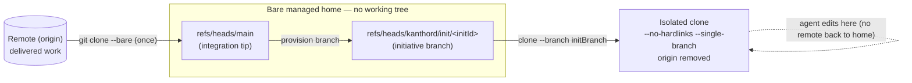

Invariants:

- The home is **bare** — no working tree can drift out of sync.
- The isolated clone has **no configured git remote** back to home. The agent
  writes only the clone; it never advances a home ref itself.
- Home refs are advanced only by the **kanthord control plane** (the daemon's
  broker on `approve objective`, and landing use cases) — never by agent code.
- The **remote** is written only by `publish`. Nothing else pushes.
- "Locally landed" (a commit on a home ref) is always distinguishable from
  "delivered" (pushed to the remote) via the per-target **publication state**.
- **One task at a time per initiative.** The clone is per-initiative, so tasks
  of one initiative are serialized: the queue's **scope-filtered claim** never
  hands out a task from an initiative that already has a running task. Different
  initiatives (and different projects) may run in parallel; tasks _within_ an
  initiative are strictly sequential, in dependency order.

### Ref ownership

| Ref                             | Lives in            | Written by                                                   | How                                     |
| ------------------------------- | ------------------- | ------------------------------------------------------------ | --------------------------------------- |
| `refs/heads/main`               | Remote **and** home | Remote: PR merge (out of scope). Home: fetch of merged main. | —                                       |
| `refs/heads/kanthord/init/<id>` | Bare home           | Daemon broker                                                | CAS `update-ref` on `approve objective` |
| (working commits)               | Isolated clone      | Agent                                                        | edit + commit; squashed at boundary     |
| `refs/heads/kanthord/init/<id>` | Remote              | `publish repository`                                         | fast-forward push (+ lease guard)       |

---

## 3. The workflow (flowchart)

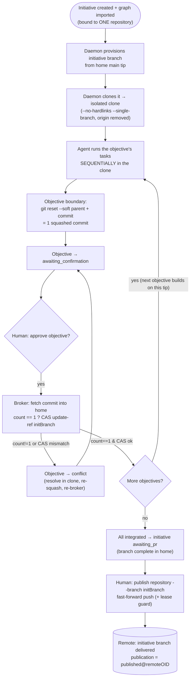

Result: **one commit per objective**, linear history on the initiative branch,
each commit gated by a human before it enters the bare home.

---

## 4. State machines

These are **separate** state machines. They are related but must not be read as
one chart.

**Task** (objective workflow — a task completes; the _objective_ is the
integration unit):

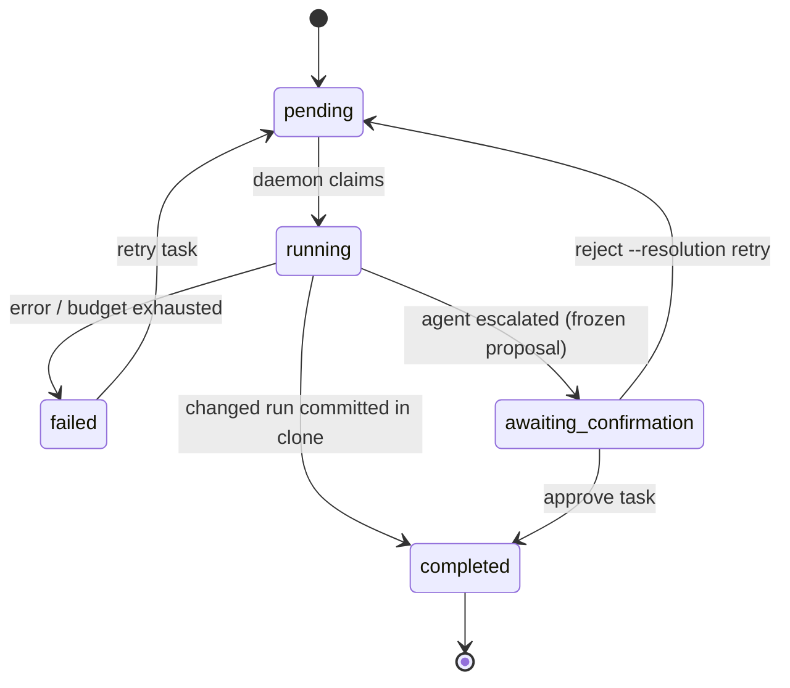

**Objective:**

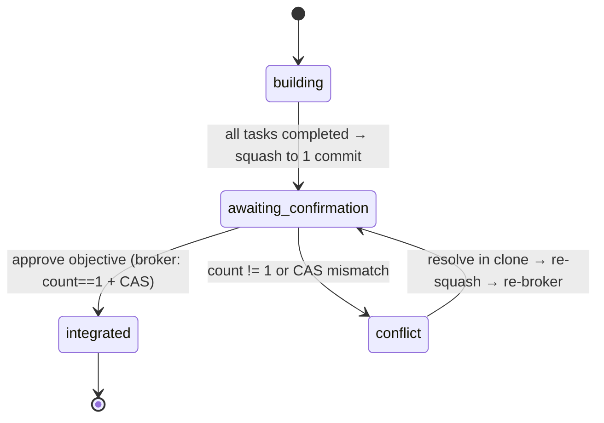

An **integrated non-tip objective is immutable** — `retry objective` on it is
refused with corrective-objective / restart guidance.

**Initiative:**

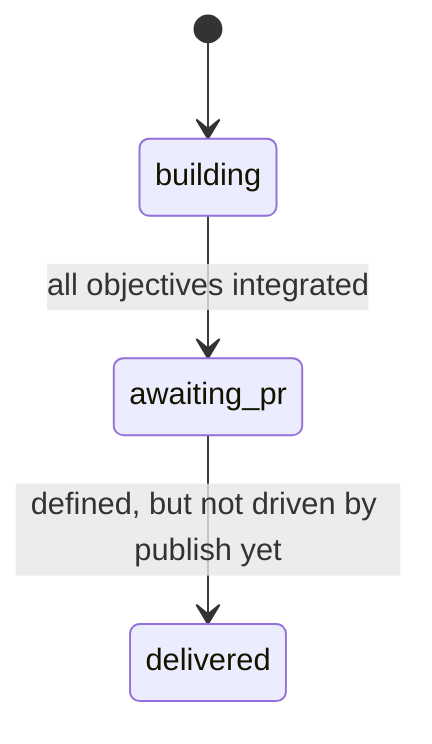

`awaiting_pr` means the branch is complete in home and ready to publish. The
`delivered` transition is defined in the domain but not driven in production:
`publish` records **publication** state and does not move the initiative.

**Publication** (per repository + branch):

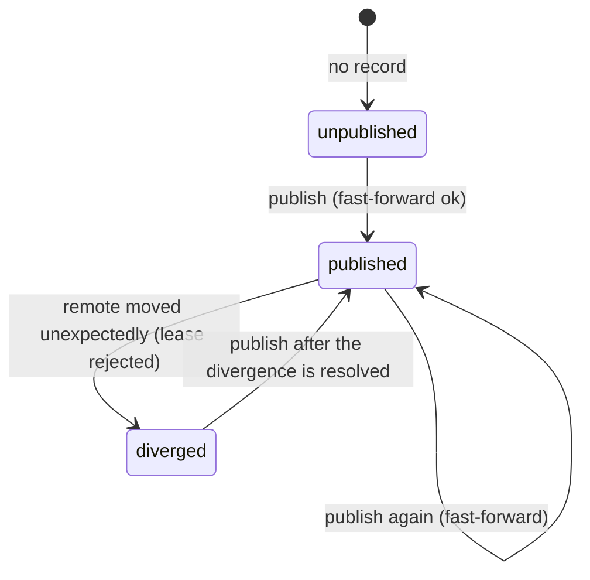

---

## 5. Operating sequences

Actors: **Human**, **CLI**, **Daemon**, **Agent**, **Clone** (isolated clone),
**Home** (bare home), **Remote**.

### 5a. Start from fresh — first initiative through delivery

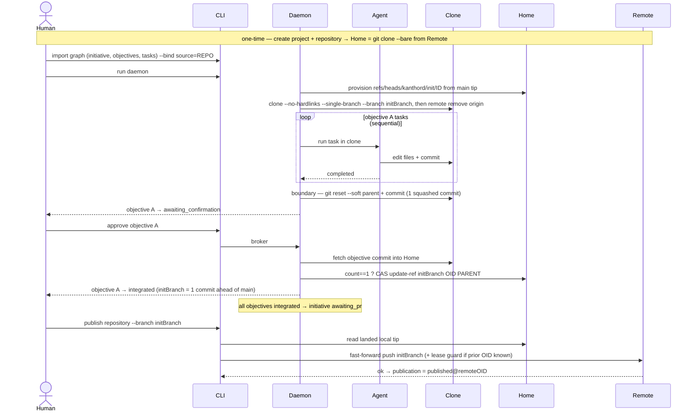

### 5b. Process the next task after finishing one (within an objective)

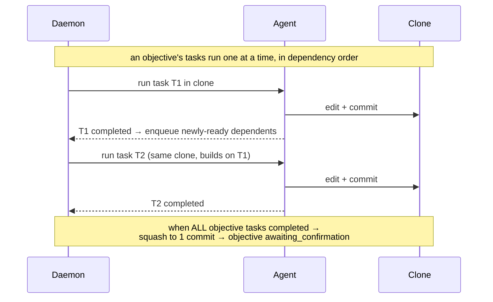

### 5c. Process the next objective after finishing one

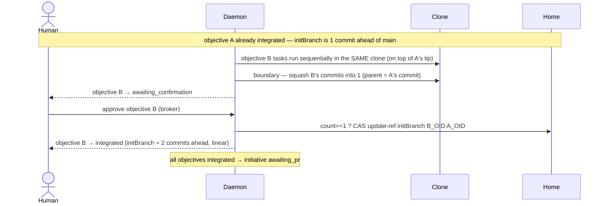

### 5d. Process the next initiative after finishing one

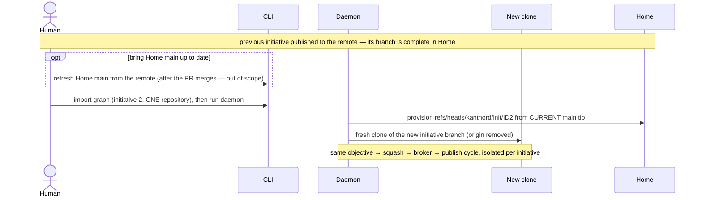

Each initiative gets its own branch and its own isolated clone. A new initiative
branches from whatever `main` points to in home at provision time. Home `main`
advances only when the delivered branch is merged on the remote and that merged
`main` is fetched back.

---

## 6. Per-task candidate landing & transplant recovery (007.14)

A repository-bound task that runs without a workspace binding produces a
**landing candidate**: the task holds at `awaiting_confirmation`, and
`approve task` lands the candidate onto its target branch by advancing the ref
(CAS `update-ref`). An initiative task carries a workspace binding and takes the
objective workflow instead (§3–§5).

If the base moves before approval, the candidate is stale. `retry task --refresh`
recovers it deterministically, without the model:

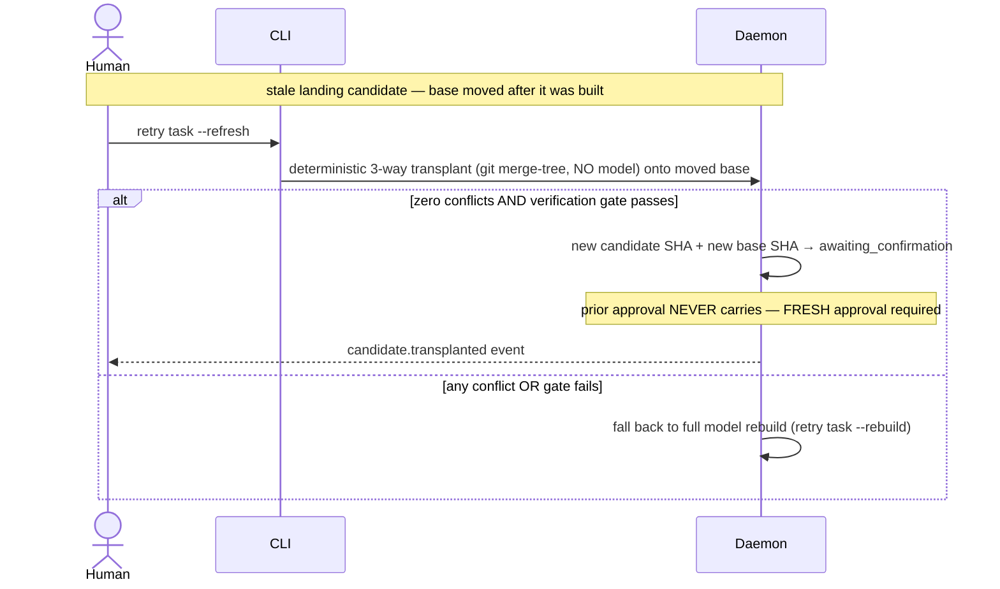

---

## 7. Constraints

- **One repository per initiative.** Provisioning uses the first repository
  binding for the whole initiative; a mixed/multi-repository initiative would
  run tasks against the wrong clone. Bind exactly one repository.
- **Concurrency is serialized per initiative, parallel across them.** The
  queue's claim is scope-filtered: it will not start a task from an initiative
  that already has one running, so the single per-initiative clone is never
  mutated by two tasks at once — regardless of how many daemon processes run.
  Separate initiatives and projects still run concurrently.
- **Delivery is a separate, human-gated step.** A completed objective that is
  `integrated` is _locally landed_ in the bare home. It reaches the remote only
  via an explicit `publish`. Automatic push (the deferred `pr@1` agent) is not
  implemented.
- **Publish does not force by default.** The first publish is a plain
  fast-forward push. A `--force-with-lease` guard is added only to reject a
  remote that moved off a known OID. After a recorded divergence, a later
  publish leases against that recorded OID.
