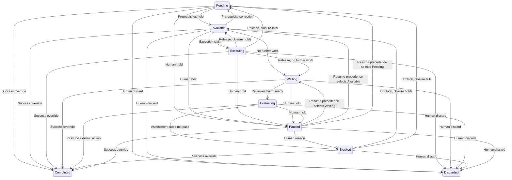
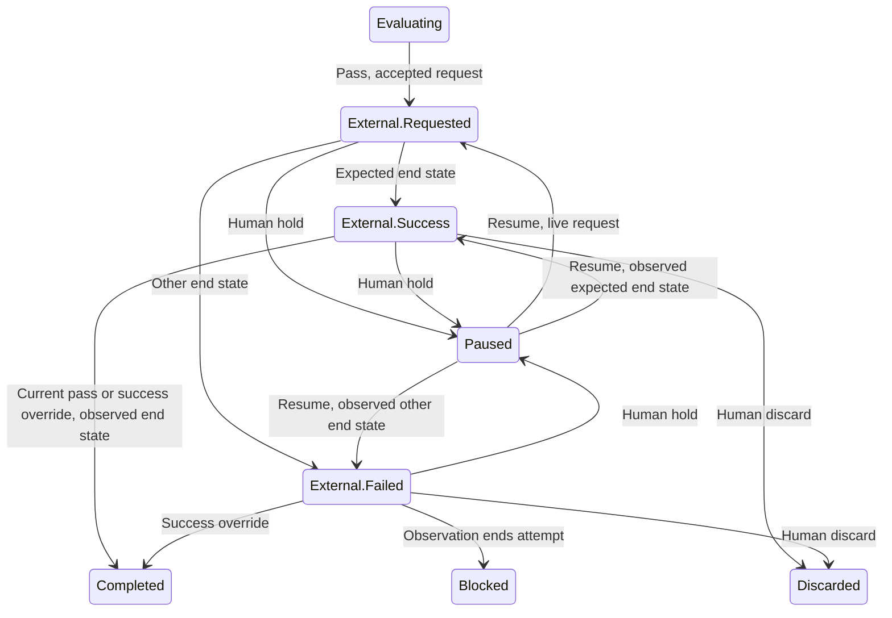

# Mission Service

## Scope

This document describes the Mission Service.
It describes the mission graph, the criteria authority, the evidence record and the assessment record.
It describes the outcome record and the state of a node.
It describes no mechanism of another service.

## Mission structure and nodes

The [overview](overview.md#vocabulary) defines a mission, an initiative, an objective, a task, a run, a worker and landing.
The mission is a directed graph.
A node of that graph is an initiative, an objective or a task.
Containment and dependency are the two edge kinds.
Every task belongs to exactly one objective.
Every objective belongs to exactly one initiative.
An initiative is a root of the graph.
The Mission Service permits a node with no child.

A dependency relates an initiative or an objective, in any combination of the two.
A task carries no dependency edge.
A task is a unit of execution inside a worker.
A task is never a unit of scheduling.
A dependency carries a kind.
A start dependency and a landing dependency are the two kinds.

A start dependency makes its dependent unavailable until the node that it names holds a current successful outcome.
A human override that asserts success satisfies a start dependency.
A start dependency establishes only what the criteria of the node that it names establish.

A landing dependency never makes its dependent unavailable.
A landing dependency delays every repository action in the subtree of its dependent until the node that it names lands.
An observed landing satisfies a landing dependency.
A human override never satisfies a landing dependency.
Preparation, local validation and the successful outcome of a task proceed while a landing dependency waits.
A wait on a landing dependency is never an assessment that does not pass.
A landing dependency gates an operation.
Each harness enforces that gate when a client requests the operation.

A node waits for the nodes that its own dependencies name.
A node waits for the nodes that the dependencies of its ancestors name.
A dependency propagates to both subtrees.
Every node in the subtree of the dependent waits for every node in the subtree of the named node.
The Mission Service checks that closure for a cycle.
It rejects a write that creates a cycle, at construction and at every update.
A containment edge alone forms no cycle, because containment descends from a parent to a child.
A start dependency and a reverse landing dependency between two nodes form a cycle.

An unsatisfied dependency never blocks a node.
A dependency determines availability, and an assessment determines a block.

A node lands when every configured repository action in its subtree reaches its expected end state.
A dependent releases on the observed state, and never on the completion of the local action.
A landing observation is a platform action, and it uses the credential of a repository binding.

An objective names exactly one repository binding of its project.
An initiative names no repository binding.
A task names no repository binding, and a task acts on the repository that its objective names.
Two objectives name the same binding or different bindings.
An objective names any repository binding that its project holds.
A run of an initiative derives its repositories from the objectives of that initiative.
One initiative holds work in many repositories.

The mission holds no branch, no merge and no repository action.
The mission supplies the grouping that a repository strategy uses.

A worker takes an initiative or an objective, and it never takes a task.
A worker executes a model judgement and an end-to-end test.
The mission holds precedence alone.
The mission holds no order over the tasks of an objective.

## Validation criteria and authority

Planning occurs outside kanthord.
A human writes the initiatives, the objectives and the tasks in markdown.
A human decides what the system tests, and which command verifies it.
A human imports that plan into the Mission Service.
A run creates no node, and a run writes no criterion.
The import and the node API are the two write paths for a node and for a criterion.
The node API updates a node that holds an attempt, and that update carries the human override authority.
The node API deletes no node that holds an attempt.
The node API edits no node in a terminal state.
The node API reads no condition of the import when it updates a node.
A human takes responsibility for an edit through the node API.
Execution authority never grants planning authority.
No execution identity writes a node, and no execution identity writes a criterion.
An execution identity authorizes no import, whatever node that import names.

The Mission Service owns what an import carries, and it owns no syntax.
Markdown is the medium that a human writes a plan in.
The command line interface converts a plan into an import.
The Mission Service writes no plan file.

An import reconciles a snapshot, and the import set is authoritative.
A plan file that carries no identifier creates a node when the import condition holds.
A plan file that carries an identifier updates that node when the import condition holds.
A plan file that the set omits retires its node when the import condition holds.
A dependency names a plan file, and it carries no path.
The import resolves that name inside the import set.
A file name is unique inside the import set.

An import is atomic, and the Mission Service validates the resulting graph.
One import deletes a node and removes every current inbound reference to it when the import condition holds.
An import declares its scope.
An import names the mission revision that it expects, and a stale snapshot fails that check.
A preview confirms every retirement before the import applies.
The Mission Service rejects an unknown identifier, a duplicate identifier and an identifier of another mission.
An import request key binds to its payload, so a retry is idempotent.
The map of assigned identifiers stays retrievable.

A retirement removes the executable work of its node.
A retirement preserves the outcomes, the assessments, the evidence and the historical relations of that node.
A substantive update of a terminal node returns an error.
A no-op import of a terminal node returns no error.

An import creates, updates and deletes a node, and each operation requires the import condition.
The condition holds when the node holds `Pending` or `Available` and its attempt counter reads 0.
Neither write path deletes a node that holds an attempt.
The delete condition is the same on both write paths, so the attempt counter of the node reads 0.
An import modifies no node that holds an attempt, whatever its state.
A release to `Pending` or `Available` leaves the node with an attempt and its records.
A create reads the condition on the parent whose child set changes.
The import condition of a task is the condition of its objective.
A task modification requires its objective to hold `Pending` or `Available` and its attempt counter to read 0.
This rule covers a create, an update and a delete of a task.
A containment move reads the condition on the moved node, the old parent and the new parent.
A dependency edit reads the condition on the dependent node, and never on the node that the dependency names.
A human who stops the work of a node discards that node.
The discard closes the attempt, and the closure writes the outcome and the task outcomes that it owes.
A human who also releases the dependents edits each dependent and removes the dependency.
That edit is a modification of the dependent, so the import condition governs it.
A node that started work stays in the graph, and a discarded node keeps its records.
A modification covers the record of the node, its parent link, its dependency edges and its child set.
The Mission Service terminates an import that fails the condition, and that import produces no effect.
A transaction and a lock cover the condition check and the commit together.
Work on another node never rejects an import and never delays one.
A genuine no-op makes no modification, so it requires no condition check.

A criteria change preserves the identity of its node and creates a criteria revision.
An attempt pins the criteria revision that it claims under.
An active attempt keeps the criteria revision that it pins.
An import never retargets an active attempt.
A criteria revision never reopens a node that holds a successful outcome.
That success stands under the revision that establishes it.
An import never unblocks a node, and an import never reopens a node.

An import records the actor that submits it.
That record establishes attribution, and it establishes no authorship and no approval.
A criterion that states human authorship records a claim and establishes no authorship.

A verification command belongs to the WHAT, and an import carries it.
The files that the command reads belong to the repository, and they stay mutable.
Attribution and a judgement criterion protect the verification.
An exit status of zero proves that one command returned zero.
It proves nothing about test adequacy, about coverage or about a suppressed failure.

## Evidence

An evidence record carries a content address, a subject, a provenance and a scope.
An evidence record is separate from the content that it addresses.
A content address identifies the accepted bytes, and it establishes nothing about their claims.
Two executions with identical output produce two observations and two records.
A repeated address of unchanged content, with no new observation, creates no evidence.

A commit hash is the preferred address of work that a repository holds.
A commit hash is never required.
A SHA-256 hash addresses content that no repository holds.
Addressed prose is evidence, and a research report and a judgement rationale qualify.
An evaluation determines the strength of that evidence.
A claim that carries no addressed content is not evidence.

The Mission Service stores the content of produced evidence.
It stores the address of repository evidence.
Stored content stays retrievable.
An address resolves while its repository holds the content.

Evidence durability differs by node.
A task commit is an internal check, and it has meaning while its objective runs.
The outcome of an objective represents the outcomes of its tasks after that objective lands.
The system guarantees no resolution of a task commit after that point.
An initiative points at an objective commit, and an objective commit is a landed commit.

The evidence of a node is a set of items, and it holds one item most of the time.
An accepted landing observation appends the landed commit identities to the evidence set.
No assessment weighs the landed snapshot.

A landing record names the repository action, the expected end state and the platform object.
It names the observed state, the observation time and the commit identities.
An authorized observer writes a landing observation, because that observation happens after the run releases.
A run submits the evidence of its own node and the evidence of the tasks of that node.
Each submission carries a valid execution identity.
A late submission never becomes current because it arrives last.

A machine check binds its result to the snapshot that it ran against.
It binds its result to the pinned criteria revision.
A named snapshot does not prove that the check used it.
That binding is an assertion of the executor, unless a clean isolated checkout establishes it.
An executor report is attributable evidence, and it is not an independently verified check.

Evidence is append-only.
Redaction happens before an artifact receives its address.
An evidence record states that redaction transformed its content.
One exceptional path removes content that holds a credential.
Ingestion is bounded, and it never truncates content silently.
Unassessed evidence, rejected evidence and abandoned evidence each carry a bounded retention.
The retention of outcome-dependent evidence is transitive.
It covers the evidence that supports every child outcome that an assessment weighs.
A correction names what it corrects.

## Evaluation and assessment

The Mission Service performs no evaluation, and it is the record authority.
A worker performs an evaluation.
`reviewer@1` is a worker whose method is evaluation.
`reviewer@1` takes an objective or an initiative, and it never takes a task.

An evaluation is work that the Scheduler dispatches.
A node that needs an evaluation reaches `Waiting`, and a reviewer worker instance claims it.
The readiness condition of Outcome and completion admits a reviewer claim.
An executor requests no evaluation.
A reviewer worker is a worker binding of its project.

The worker that executes a node never writes the assessment of that node.
The Mission Service supplies the criteria and the evidence.
The executing worker never chooses the reviewer, and it never shapes the instructions of the reviewer.
That separation is a separation of duties, and it is not independent verification.
The run of an objective writes the assessment of each task of that objective.
A task assessment carries no separation of duties.
The independent review sits at the node whose outcome persists.

The scope of an evaluation differs by node, and its method follows its criterion.
The evaluation of an objective weighs the child outcomes and the tested snapshot.
A model judgement transcript is evidence of its invocation, and it is not an assessment.
The boundary is authority, and it is not a file format.

An assessment names its evidence set and its criteria revision.
It names every immutable child outcome record that it weighs.
It names the method that it applies and the actor that performs it.

Currency needs three checks.
Context asks whether an assessment matches the evidence that it names, its criteria, the structure and the selected child outcomes.
The context check reads the evidence that the assessment names, and never requires equality with the whole evidence set.
Authority checks intervening acts: a block, an unblock, a pause, a resume, a discard, a human override and an attempt closure.
The authority check determines whether an assessment still affects current state.
An attempt closure never invalidates a completed record.
An attempt closure scopes a record to its own attempt.
A pause and a resume never invalidate a passing assessment by themselves.
Order selects the latest assessment that those two checks admit.
The record order answers the order check alone.
A changed child outcome invalidates the currency of the assessment of its parent.
That invalidation queues no retry, and it reopens no terminal success.
Assessments accumulate, and the Mission Service overwrites none and deletes none.
An assessment that names a superseded context is never current.

An evaluation has a durable lifecycle, and that lifecycle is independent of execution.
An unreachable reviewer marks an incomplete evaluation.
An incomplete evaluation differs from evidence that establishes no result.
A bounded retry resumes the evaluation.
That retry repeats no execution and no repository action.

## Outcome and completion

The evidence is the artifact of the execution.
The assessment is the artifact of the evaluation.
An attempt closure produces the outcome, and the Mission Service writes it on the closing transition.

### State of a node

The state set covers an initiative and an objective.
A task holds no state, and the worker manages the state of a task inside its run.
The set holds twelve states.

- **Pending**: A node of the start-dependency closure of this node holds no current successful outcome.
  No claim holds the node.
- **Available**: Every node of that closure holds a current successful outcome, and execution requires further work.
  No claim holds the node.
- **Executing**: An execution run holds the claim.
- **Waiting**: The execution of the open attempt requires no further work.
  No claim holds the node.
- **Evaluating**: A reviewer run holds the claim.
- **Blocked**: The attempt closes on a condition after the evaluation, and a human unblock authorizes the next attempt.
  No claim holds the node.
- **Paused**: A human holds the work of the node temporarily.
  An open attempt stays open.
  No claim holds the node.
- **Completed**: The node closes with a successful outcome.
- **Discarded**: The node closes with no successful outcome.
- **External.Requested**: An actor requests the required external action, and the external system holds no end state of that request.
- **External.Success**: The external system reaches the expected end state.
- **External.Failed**: The external system reaches any other state that ends the request.

`Completed` and `Discarded` are the two terminal states.
A terminal state opens no further attempt, and nothing moves a node out of it.
A terminal node is not editable.
A human override corrects the recorded result of a terminal node, and the node keeps its terminal state.
An edit writes the WHAT, and a correction writes a new outcome record.

Three conditions reach `Blocked`, and each follows the evaluation.
They are a current assessment that does not pass, an `External.Failed` observation and a human reason on a paused node.
A dependency produces `Pending` under the dependency rules of Mission structure and nodes.
`External.Failed` folds every non-success end state of the external system.
The worker handles the detail of that state.

### Attempt

An attempt is one try at a node, and it spans every run, every observation and every evaluation of that try.
At most one attempt of a node is open.
A node that starts no work holds no attempt, and its attempt counter reads 0.
The first claim of the node opens attempt 1, and a human unblock opens the next attempt.
A run and an evaluation attempt pin the attempt that they start under.
Every record names its attempt, and it stays the record of that attempt forever.
An attempt closure ends every run and every evaluation attempt in flight under that attempt.
It invalidates continuation, and it never invalidates a completed record.
A closed attempt never reopens.
An opening and an attempt closure are separate acts.
An attempt that a human unblock opens holds no claim until a claim arrives.
A record never migrates into the next attempt.
A human unblock therefore returns the node to `Available` or to `Pending`, and never to `Waiting`.

### Readiness condition

`Waiting` means released, and it does not mean claimable.
The readiness condition admits a reviewer claim when the child rule and the external action rule hold.
For an objective, every current task holds a current outcome of the open attempt of that objective.
The condition reads the existence of a current child outcome, and never its result.
For an initiative, every current objective holds a terminal state.
No required external action of the node is outstanding.
An action is outstanding when the open attempt requests it and no accepted observation establishes its expected end state.
An unrequested action is never outstanding.
The condition reads the current children of the node, and a retirement removes a node from that set.

### Successful outcome

The ordinary path needs a current passing assessment and the observed expected end state of every required external action of that node.
Neither fact alone publishes a successful outcome.
A node that requires no external action needs the assessment alone.
An initiative configures no external action.
Evaluation and assessment owns the currency of an assessment.
The evaluation of a node precedes its external request.
The assessment names the tested snapshot.
Evidence owns the record of the landed commit identities.

### Outcome record

An outcome record holds these fields.

- The node and the attempt.
- The closing event and the stopping reason, separately from the asserted result.
- The asserted result: success, the results do not meet the criteria, or nothing is established.
- The basis: an assessment or a human assertion.
- The assessment and its evaluation context, when the basis is an assessment.
- The actor and the human decision, when the basis is a human assertion.
- The evidence set that the outcome carries.
- The previous outcome, when the outcome corrects one.

An absent assessment reference means that the basis carries none, and it never means that an evaluation is pending.
A human override that asserts success writes a successful outcome whose basis is a human assertion.
A discard writes an outcome whose basis is a human assertion and whose asserted result is that nothing is established.
That outcome releases no start dependency.
An `External.Failed` observation ends the attempt with an outcome whose basis names the passing assessment.
That outcome records the stopping reason of the external action and asserts that nothing is established, because the expected end state is absent.

### Task outcomes

A run of an objective writes the outcome of each task alongside the task assessment that Evaluation and assessment requires.
A task outcome carries the commit of that task inside the branch of the objective as its evidence.
The readiness condition enforces the task-outcome obligation on the ordinary path.
Every attempt closure owes the outcome of each task of the node.
At the closure, the Mission Service writes the task outcomes that do not exist.
It uses the closing event as the stopping reason.

### State transitions

The closure in the transition events is the start-dependency closure of the node.
It holds when every node of that closure holds a current successful outcome.
Each row names the event, the effect on the attempt and the record that the transition writes.
A node reaches a terminal state only when no external request of its open attempt is unresolved.
A request is unresolved when an actor requests it and no accepted observation establishes an end state.
This invariant also governs `Paused -> Completed` and `Paused -> Discarded`.

A human resume reads the request of the attempt and its accepted observations first.
A live request sends the node to `External.Requested`.
A resolved request sends the node to `External.Success` or to `External.Failed`, according to its observed end state.
Otherwise the execution-end fact of the attempt sends the node to `Waiting`.
Otherwise the start-dependency closure sends the node to `Available` when it holds, or to `Pending` when it does not hold.

| Transition | Event | Attempt | Record |
| --- | --- | --- | --- |
| `Pending -> Available` | Last node of the closure reaches a current successful outcome | No effect | None |
| `Pending -> Paused` | Human holds the node | Stays open | None |
| `Pending -> Completed` | Human override asserts success | Closes by force | Outcome |
| `Pending -> Discarded` | Human discards the node | Closes by force | Outcome |
| `Available -> Executing` | Execution claim | Opens the attempt when the node holds none; no effect otherwise | None |
| `Available -> Waiting` | Accepted fact establishes that the execution of the attempt requires no further work | No effect | None |
| `Available -> Pending` | Human override corrects a prerequisite outcome to a failure | No effect | None |
| `Available -> Paused` | Human holds the node | Stays open | None |
| `Available -> Completed` | Human override asserts success | Closes by force | Outcome |
| `Available -> Discarded` | Human discards the node | Closes by force | Outcome |
| `Executing -> Waiting` | Release; the execution of the attempt requires no further work | No effect | Evidence |
| `Executing -> Available` | Release; execution requires further work; closure holds | No effect | None |
| `Executing -> Pending` | Release; execution requires further work; closure does not hold | No effect | None |
| `Executing -> Paused` | Human holds the node; run stops | Stays open | None |
| `Executing -> Completed` | Human override asserts success | Closes by force | Outcome |
| `Executing -> Discarded` | Human discards the node | Closes by force | Outcome |
| `Waiting -> Evaluating` | Reviewer claim; readiness condition holds | No effect | None |
| `Waiting -> Paused` | Human holds the node | Stays open | None |
| `Waiting -> Completed` | Human override asserts success | Closes by force | Outcome |
| `Waiting -> Discarded` | Human discards the node | Closes by force | Outcome |
| `Evaluating -> Completed` | Current passing assessment; node requires no external action | Closes | Outcome |
| `Evaluating -> External.Requested` | Current passing assessment stands; accepted fact establishes the request for the required external action | No effect | Assessment |
| `Evaluating -> Blocked` | Current assessment does not pass | Closes | Outcome |
| `Evaluating -> Paused` | Human holds the node; reviewer run stops | Stays open | None |
| `Evaluating -> Discarded` | Human discards the node | Closes by force | Outcome |
| `Blocked -> Available` | Human unblock; closure holds | Next attempt opens | None |
| `Blocked -> Pending` | Human unblock; closure does not hold | Next attempt opens | None |
| `Blocked -> Completed` | Human override asserts success | No open attempt | Outcome |
| `Blocked -> Discarded` | Human discards the node | No open attempt | Outcome |
| `Paused -> Waiting` | Human resumes the node; resume precedence selects Waiting | Stays open | None |
| `Paused -> Available` | Human resumes the node; resume precedence selects Available | Stays open | None |
| `Paused -> Pending` | Human resumes the node; resume precedence selects Pending | Stays open | None |
| `Paused -> External.Requested` | Human resumes the node; resume precedence selects External.Requested | Stays open | None |
| `Paused -> External.Success` | Human resumes the node; resume precedence selects External.Success | Stays open | None |
| `Paused -> External.Failed` | Human resumes the node; resume precedence selects External.Failed | Stays open | None |
| `Paused -> Blocked` | Human blocks the node; record carries the human reason | Closes | Outcome |
| `Paused -> Completed` | Human override asserts success | Closes by force | Outcome |
| `Paused -> Discarded` | Human discards the node | Closes by force | Outcome |
| `External.Requested -> External.Success` | Accepted observation establishes the expected end state | No effect | Landing record; landed commit identities in evidence set |
| `External.Requested -> External.Failed` | Accepted observation establishes another end state of the request | No effect | Observation record |
| `External.Requested -> Paused` | Human holds the node | Stays open | None |
| `External.Success -> Completed` | Current passing assessment stands, or human override asserts success after the observation resolves the request | Closes | Outcome |
| `External.Success -> Paused` | Human holds the node | Stays open | None |
| `External.Success -> Discarded` | Human discards the node | Closes by force | Outcome |
| `External.Failed -> Blocked` | Observation ends the attempt | Closes | Outcome |
| `External.Failed -> Completed` | Human override asserts success | Closes by force | Outcome |
| `External.Failed -> Paused` | Human holds the node | Stays open | None |
| `External.Failed -> Discarded` | Human discards the node | Closes by force | Outcome |

The internal case holds nine states.

The external segment holds three external states and the transitions across its boundary.

### Boundary

Mission structure and nodes owns the dependency, the landing and the repository binding of a node.
Evidence owns the evidence record and its durability.
Evaluation and assessment owns the lifecycle of an evaluation.
Block and unblock owns the block and the unblock.
An unblock carries the human guideline or the content of the external conversation that the next run reads.
The Worker Service owns which entity requests a required external action and the idempotency of that request across an attempt boundary.
The Mission Service records the platform object through the landing record.
No rule of the Mission Service reads that record to decide whether to request the action again.

## Vocabulary

- **assessment**: The record of one evaluation of one evidence set against one criteria revision.
- **asserted result**: The result that an outcome asserts, separately from its stopping reason.
- **attempt**: One try at a node across its runs, observations and evaluations.
  The first claim opens attempt 1, and a human unblock opens the next attempt.
- **attempt counter**: The per-node ordinal that names the attempt of a record.
  The attempt counter reads 0 when the node starts no work.
- **attempt closure**: The act that ends an attempt and every run and evaluation attempt in flight under it.
- **basis**: The assessment or human assertion that an outcome names as its basis.
- **criteria revision**: One version of the criteria of a node.
- **currency**: The property of an assessment that the context check, the authority check and the order check admit.
- **dependency**: A graph relation that controls the availability of a node or the timing of its repository actions.
- **start dependency**: A dependency that makes its dependent unavailable until the node it names holds a current successful outcome.
- **landing dependency**: A dependency that delays the repository actions of its dependent until the node it names lands.
- **landing observation**: The platform action that observes a landing.
- **landing record**: The record of a landing observation.
- **import**: The snapshot reconciliation that writes the structure and the criteria of a mission.
  A modification requires `Pending` or `Available` and an attempt counter that reads 0.
  A task modification reads the condition of its objective.
- **import set**: The complete set of nodes that one import carries.
  An omission requests a retirement under the import condition.
  Each modification requires `Pending` or `Available` and an attempt counter that reads 0.
  A task modification reads the condition of its objective.
- **readiness condition**: The condition over current task outcomes, current objective terminal states and outstanding external actions that admits a reviewer claim.
- **retirement**: The removal of the executable work of a node, with its historical records preserved.
  Each modified node requires `Pending` or `Available` and an attempt counter that reads 0.
  A task modification reads the condition of its objective.
- **stopping reason**: The reason that an outcome records for the ending, separately from its asserted result.
- **terminal state**: A state that a node never leaves and that opens no further attempt.
  A terminal node is not editable.
  A human override corrects its recorded result through a new outcome record.
