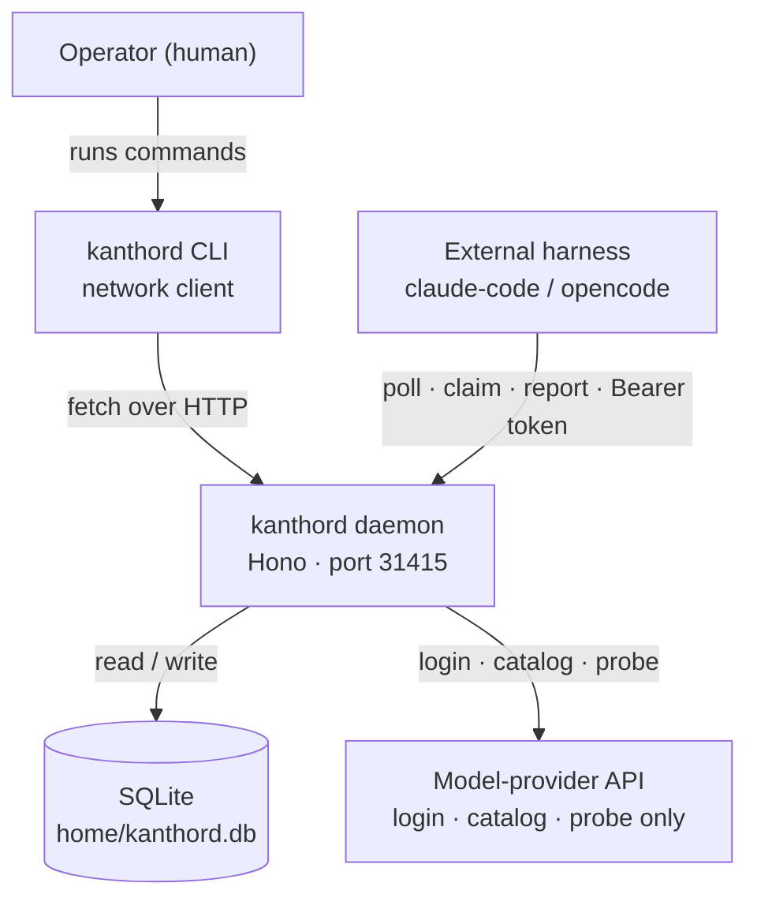

# kanthord — Overview

kanthord is one long-running Node daemon. It stores a plan as a graph of work, tracks the state of each unit, and hands units to external coding-agent harnesses over HTTP. All persistent state lives in one SQLite file. An operator drives the system with the `kanthord` CLI. Harnesses drive it through the same HTTP API.

At engine commit `c17e718`: the daemon records whatever outcome a harness reports; it does not verify the reported result against a git ref. No model call for work happens inside the daemon; the agent service throws "not implemented".

## System context

The daemon reaches a model-provider API only for provider login, the model catalog, and a credential probe. The agent service throws "not implemented" for every request; no model call for work happens inside the daemon today.

## Vocabulary

**initiative** — A top-level work node. It has no parent node and no repository.

**objective** — A mid-level work node. It carries a repository reference. It is the only kind that passes through `awaiting_approval`.

**task** — A leaf work node. It carries acceptance criteria. A harness claims and reports tasks.

**harness** — An external coding-agent process (for example, claude-code). It authenticates, polls for ready nodes, claims them, does work, and reports outcomes.

**actor** — A registered identity in the daemon. An actor row holds a name, a kind (`human` or `harness`), and a hash of its token. A human registers an actor and hands the token over out of band.

**run** — A bounded lease opened when a harness claims a node. The run carries a fence. Every write against the node re-checks the fence.

**plan revision** — One atomic import of a plan directory. A revision is a diff of the Markdown files against the current graph. Nodes and edges persist inside one transaction.

**block reason** — The reason a node is stuck in `blocked`. Only a human `node.unblock` call clears the block. See [recovery.md](recovery.md) for the full list.

## Documentation map

| Page | Question answered |
|---|---|
| [system-map.md](system-map.md) | What is kanthord, and what talks to what? |
| [identity-access.md](identity-access.md) | Who may do what, and how do they prove it? |
| [setup-registration.md](setup-registration.md) | What must exist before any work can exist? |
| [work-graph.md](work-graph.md) | Where does the work come from? |
| [who-does-work.md](who-does-work.md) | Who actually does the work? |
| [state-completion.md](state-completion.md) | What states does work move through, and who may move it? |
| [recovery.md](recovery.md) | Why is this stuck, and what happens after a crash? |
| [capability-status.md](capability-status.md) | What is real, what is not, and what is undecided? |
| [reference.md](reference.md) | Exact tables, operations and commands. |

## Design migration in progress

Epics 050 through 057 describe a design migration of the authentication, verification, and close model. They are not evidence of behavior implemented at `c17e718`. See [capability-status.md](capability-status.md) for the scope and implementation status of each capability.

## Claims register

The claims below are the load-bearing assertions of this overview. Each later page declares which claim ids it evidences in its frontmatter.

- **C01.** kanthord is one long-running Node daemon that stores all plan state in one SQLite file at `<home>/kanthord.db`.
  *Present at engine c17e718.*
  Source: [`src/main.ts#L842`](https://github.com/kanthorlabs/kanthord-engine/blob/c17e718/src/main.ts#L842) — `join(home, "kanthord.db")`

- **C02.** The HTTP server uses Hono and listens on port 31415 by default.
  *Present at engine c17e718.*
  Sources: [`src/http/server/app.ts#L1`](https://github.com/kanthorlabs/kanthord-engine/blob/c17e718/src/http/server/app.ts#L1) (Hono), [`src/services/config/convict.ts#L173`](https://github.com/kanthorlabs/kanthord-engine/blob/c17e718/src/services/config/convict.ts#L173) (port default)

- **C03.** The daemon owns state and not execution; no coding agent runs inside the daemon process. The agent service and verify service both throw "not implemented".
  *Present at engine c17e718. The agent service and the verify service are absent — each interface throws.*
  Sources: [`src/services/agent/not-implemented.ts`](https://github.com/kanthorlabs/kanthord-engine/blob/c17e718/src/services/agent/not-implemented.ts), [`src/services/verify/not-implemented.ts`](https://github.com/kanthorlabs/kanthord-engine/blob/c17e718/src/services/verify/not-implemented.ts)

- **C04.** The CLI is a network client. Every command except `db migrate`, `serve`, `plan convert`, and `config generate` calls the running daemon over `fetch`.
  *Present at engine c17e718.*
  Sources: [`src/cli/client.ts`](https://github.com/kanthorlabs/kanthord-engine/blob/c17e718/src/cli/client.ts), [`src/cli/program.ts`](https://github.com/kanthorlabs/kanthord-engine/blob/c17e718/src/cli/program.ts) — the four exceptions are wired in-process there

- **C05.** The work graph has exactly three node kinds: `initiative`, `objective`, and `task`. An initiative has no parent; an objective carries a repository; a task carries acceptance criteria.
  *Present at engine c17e718.*
  Source: [`src/domain/state.ts`](https://github.com/kanthorlabs/kanthord-engine/blob/c17e718/src/domain/state.ts)

- **C06.** A node becomes `ready` when every dependency node is in state `done` or `partial`, or the edge to that dependency is waived. A waived edge counts as satisfied regardless of the dependency node's state.
  *Present at engine c17e718.*
  Source: [`src/domain/readiness.ts`](https://github.com/kanthorlabs/kanthord-engine/blob/c17e718/src/domain/readiness.ts)

- **C07.** One shared state machine governs all node kinds. Eight states exist: `pending`, `ready`, `running`, `blocked`, `awaiting_approval`, `done`, `partial`, `discarded`. Terminal states are `done`, `partial`, and `discarded`.
  *Present at engine c17e718.*
  Source: [`src/domain/state.ts`](https://github.com/kanthorlabs/kanthord-engine/blob/c17e718/src/domain/state.ts)

- **C08.** `awaiting_approval` is legal only for an `objective`. An objective never auto-closes to `done` or `partial`; a human must act.
  *Present at engine c17e718.*
  Source: [`src/domain/outcome.ts`](https://github.com/kanthorlabs/kanthord-engine/blob/c17e718/src/domain/outcome.ts)

- **C09.** Exactly two workers are registered: `claude@1` (harness `claude-code`) and `opencode@1` (harness `opencode`). Both have `driver: "external"`.
  *Present at engine c17e718.*
  Source: [`src/domain/worker-registry.ts`](https://github.com/kanthorlabs/kanthord-engine/blob/c17e718/src/domain/worker-registry.ts)

- **C10.** A harness authenticates with `Authorization: Bearer <token>` where the token has the form `actor_<ulid>.<secret>`. A human registers the actor and hands the token to the harness out of band.
  *Present at engine c17e718.*
  Sources: [`src/http/server/auth.ts#L44`](https://github.com/kanthorlabs/kanthord-engine/blob/c17e718/src/http/server/auth.ts#L44) — `bearerToken(c.req.header("authorization"))`; [`src/http/contract/actor.ts#L30`](https://github.com/kanthorlabs/kanthord-engine/blob/c17e718/src/http/contract/actor.ts#L30) — the token pattern

- **C11.** The daemon never pushes work to a harness. A harness starts every exchange.
  *Present at engine c17e718. This is an absence claim: searched every operation in `src/http/contract/` for an outbound call to a harness and found none.*
  Source: [`src/http/contract/event.ts#L76`](https://github.com/kanthorlabs/kanthord-engine/blob/c17e718/src/http/contract/event.ts#L76) — the `event.list` long poll exists but admits `allowedActors: ["human"]`, so no harness can wait on it

- **C12.** A claim opens a run that carries a fence. Renew, release and report each re-check authority in this fixed order: `run-not-found`, `run-ended`, `run-expired`, `run-caller-mismatch`, `target-outside-run`, `fence-stale`. The claim itself opens the run and so runs no such check.
  *Present at engine c17e718.*
  Sources: [`src/domain/run-authority.ts#L35`](https://github.com/kanthorlabs/kanthord-engine/blob/c17e718/src/domain/run-authority.ts#L35); its three callers [`renew-run.ts#L107`](https://github.com/kanthorlabs/kanthord-engine/blob/c17e718/src/commands/run/renew-run.ts#L107), [`release-node.ts#L96`](https://github.com/kanthorlabs/kanthord-engine/blob/c17e718/src/commands/node/release-node.ts#L96), [`report-outcome.ts#L350`](https://github.com/kanthorlabs/kanthord-engine/blob/c17e718/src/commands/outcome/report-outcome.ts#L350)

- **C13.** A run carries an attempt limit. When attempts are exhausted the node moves to `blocked` with reason `attempt-limit`. Only a human `node.unblock` call clears that reason.
  *Present at engine c17e718.*
  Sources: [`src/domain/attempt-accounting.ts#L71`](https://github.com/kanthorlabs/kanthord-engine/blob/c17e718/src/domain/attempt-accounting.ts#L71) — the `exhausted` computation; [`src/domain/state.ts`](https://github.com/kanthorlabs/kanthord-engine/blob/c17e718/src/domain/state.ts) — the block reasons

- **C14.** The daemon publishes four role contracts over `GET /agent`: `general@1`, `swe@1`, `te@1`, and `re@1`. The daemon does not run them.
  *Present at engine c17e718.*
  Source: [`src/domain/agent-contract.ts`](https://github.com/kanthorlabs/kanthord-engine/blob/c17e718/src/domain/agent-contract.ts)

- **C15.** `src/main.ts` around line 270 hardcodes `callerRecord` as `{ worker: "claude@1", authorized: ["claude@1"] }` for every request. This is a code defect. The consequence is that `opencode@1` cannot be selected by the dispatch path, and the `run-caller-mismatch` authority check fires only for `claude@1` callers.
  *Present at engine c17e718 — this is a code defect, not a design decision.*
  Source: [`src/main.ts#L270`](https://github.com/kanthorlabs/kanthord-engine/blob/c17e718/src/main.ts#L270)

- **C16.** The daemon does not verify what a harness reports. `claim` opens a run with `workspaceId: null`. `report` stores the `objectId` string the harness asserts with no git read.
  *Present at engine c17e718. Verification is proposed by the epic 051 family and is absent from the code.*
  Sources: [`src/commands/node/claim-node.ts#L409`](https://github.com/kanthorlabs/kanthord-engine/blob/c17e718/src/commands/node/claim-node.ts#L409) — `workspaceId: null`; [`src/commands/outcome/report-outcome.ts`](https://github.com/kanthorlabs/kanthord-engine/blob/c17e718/src/commands/outcome/report-outcome.ts) — stores the reported object id with no git read
