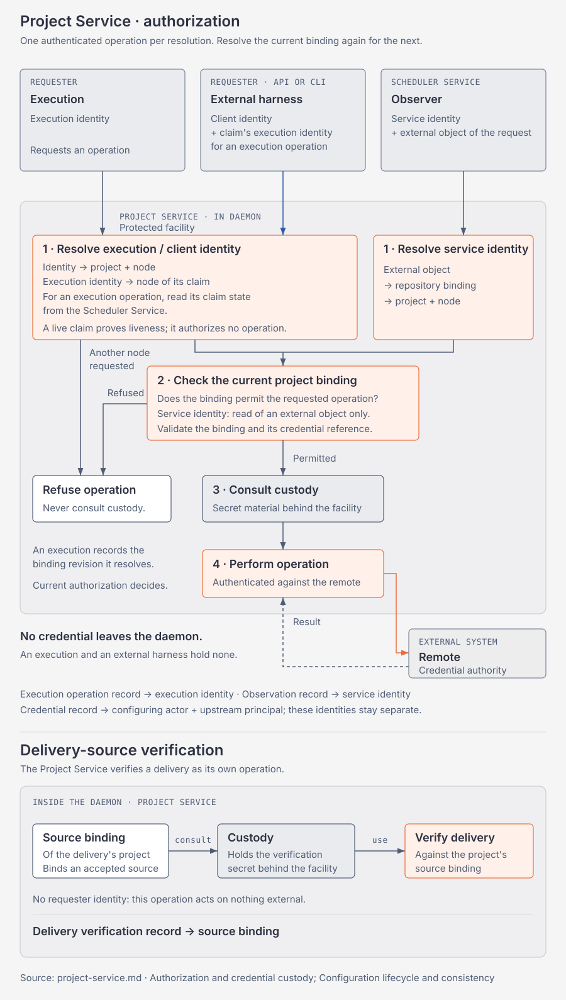
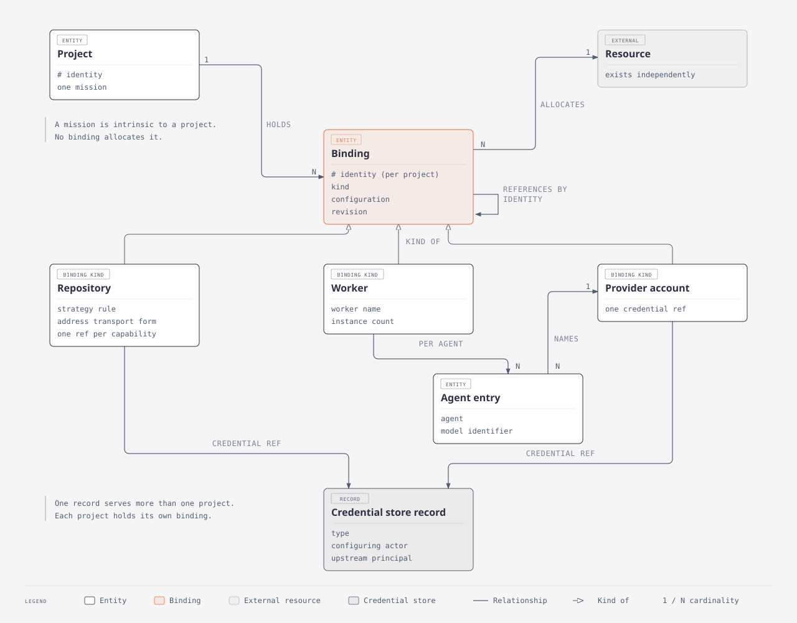

# Project Service

## Scope

This document describes the Project Service.
It describes how a project allocates a resource, and how the system authorizes an operation on that resource.
It describes no mechanism of another service.

## Project identity and ownership

The [overview](overview.md#vocabulary) defines a project, its identity and a binding.
A resource exists independently of the project that binds it.
The mission of a project is intrinsic to that project, so no binding allocates it.

## Resource and binding model

Every resource that a project uses arrives as a binding.
A binding has an identity that is unique inside its project.
A binding has a kind.
The kind determines the configuration that the binding holds, the cardinality that a project permits, and the validation that the configuration satisfies.
A binding references another binding by identity.
A reference never names a revision.
A project shares a resource with another project.
A binding belongs to one project, and no project shares a binding.

## Repository configuration and policy

A project binds each repository that it uses.
The repository strategy states an explicit rule for each repository that requires one.
A capability is one class of authenticated operation on a repository.
A network git read, a network git write and a platform action are the capabilities.
A commit, a branch and a merge are local, so none of them is a capability.
An unauthenticated operation is not a capability, so a public read requires no capability and no credential reference.
The repository strategy and the transport form of the repository address determine the capabilities that a repository binding requires.
A repository binding holds one credential reference for each capability that it requires.
One credential reference satisfies more than one capability.

## Execution configuration and instance count

A worker template declares its agents.
A worker template declares the configuration that a project sets for each agent of that worker.
The worker name determines that declaration.
A worker template carries no configuration version of its own.
A worker name that differs in its version declares its own configuration.
A worker binding names one worker.
A worker binding holds one entry for each agent of that worker.
An entry names a provider account binding by identity, and it names the model identifier at that account.
An entry inherits no value, so a worker binding holds no provider account of its own.
Two agents of one worker name different provider accounts.
A provider account is a binding kind.
A model inference call is the capability of a provider account.
A provider account binding holds a credential reference for that capability.
Two worker bindings of one worker carry different configuration.
A binding identity is separate from a worker name.
Two worker bindings of one worker do not share an instance count.

## Authorization and credential custody

A project holds the authorization binding that permits an operation on a resource.
Custody is a dedicated component of the Project Service.
Secret material sits behind a protected facility.
A trusted execution consults that facility after it checks the binding.
Holding a resource does not confer custody of its secret.
A binding does not narrow upstream authority.
One SSH key reaches many repositories, and one API key authorizes a whole account.
System authorization is what kanthord permits an execution to access.
Credential authority is what the remote permits any holder.
The Project Service enforces system authorization, and it records credential authority.
The boundary is the authorization of an operation, and it is not the custody of bytes.
An agent that never reads a key still uses an authenticated tool.
A requester presents its identity when it requests an operation.
A run presents its execution identity, and an external harness presents its client identity.
The protected facility resolves that identity to the project and to the level of the request.
The facility checks the binding of that project for the requested operation.
The facility consults custody after that check.
No credential leaves the daemon.
A run holds no credential, and an external harness holds no credential.
A liveness token proves that a run is live, and it authorizes no operation.
A credential store holds one record for a secret, and a binding names that record.
A credential store record serves more than one project.
Each project holds its own binding that names that record.
A rotation changes one record, and every binding that names that record stays valid.
Unrestricted selection of a record is the danger, and central storage is not.
A human selects the record that satisfies a capability.
The Project Service validates a credential reference with two checks.
Coverage states that every required capability has a credential reference.
Suitability states that the type of the referenced record performs that class of operation.
An SSH key does not perform a platform action.
Suitability states no scope, because a binding does not narrow upstream authority.
A credential record names the configuring actor and the upstream principal.
The record of an operation names the execution identity.
The configuring actor, the upstream principal and the execution identity stay separate.
An OAuth credential does not imply a person.
An API key does not imply an organization.

The diagram shows the order of one authorization.
It shows that a refusal never reaches custody.

## Configuration lifecycle and consistency

A binding set changes when the resource requirements of a project change.
A change to the resource that a binding names creates a replacement binding.
A change to the configuration of a binding preserves the identity of the binding and creates a revision.
A change to the credential reference of a binding is a configuration change, so it creates a revision.
A change to the secret material behind an unchanged reference changes no binding.
A change to the remote that a credential authorizes is a change to the resource, so it creates a replacement binding.
A revision never invalidates a reference to its binding.
A replacement invalidates every reference to the binding that it replaces.
An edit that replaces a binding repoints every dependent binding in that same edit.
The Project Service rejects a binding set that references a binding which does not exist.
The Project Service validates a binding set when a project writes it, and it validates a binding again when a run resolves it.
Local disablement, upstream revocation, rotation, expiry and OAuth refresh are five different changes.
A run resolves a binding at the moment that it needs the resource.
A resolution authorizes one operation, and the next operation resolves the binding again.
A run records the binding revision that it resolves.
A recorded revision states what a run selected.
Current authorization states what an execution performs.
A recorded revision never authorizes an operation after a disablement.
A disablement takes effect at the next resolution.
An operation that is in progress ends against the remote, because the remote holds the credential authority.

The diagram shows the binding graph that these rules act on.
It shows every reference that a replacement invalidates.

## Vocabulary

- **capability**: One class of authenticated operation on a resource.
- **custody**: The holding of secret material behind a protected facility.
