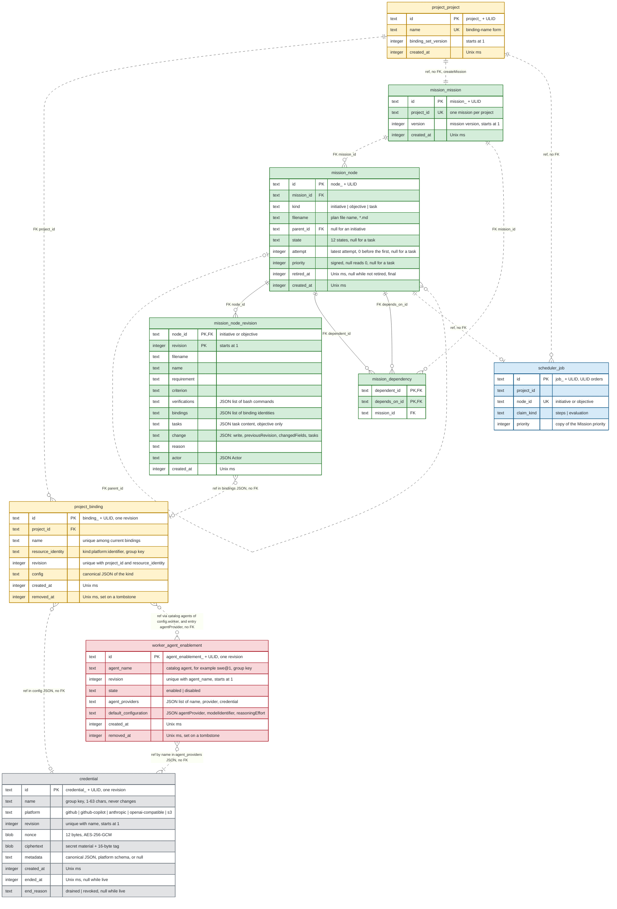

# ERD 1: Environment and planning

## Scope

This view holds the tables that set up an environment and write a plan.
After this group, a human creates a project, stores credentials, binds repositories, a storage bucket and workers, enables agents, and imports the mission plan.
No execution runs yet.

The [README](README.md) holds the conventions, the colors and the map of every group.

## Capability limits

- A project binds the kinds `repository`, `storage` and `worker`.
- A worker binding of a native worker needs an enabled [agent enablement](#worker-service), because `validateEntry` refuses a binding whose agent has no enabled enablement.
- A worker binding of an externally hosted worker needs no agent enablement.
- A delivery source is no binding. The Intake Service designs it under [HANDOFF](../../brainstorm/HANDOFF.md#intake-service).
- The Mission Service accepts the import, the export, the node API, the dependency edits, the criterion set and the priority.
- The human controls (pause, resume, block, unblock, ready, override and discard) come with [ERD 2](02-execution.md), because most of them write an attempt, an outcome or an unblock record.
- The Scheduler work queue is in this group, although the Scheduler Service owns it. A Mission write that makes a node claimable inserts its job in the same transaction. A Scheduler migration cannot read a Mission table, so no later migration can back-fill the queue.

## Owners without a table

- The Gateway Service owns no table. It holds idempotency records in memory. It stores no human account and no client identity. A human `sub` and a `client_identity_<ulid>` appear only as values inside an `actor` column.
- The Repository component owns no table. It is stateless transport.
- The worker catalog is a static server module. A worker name and an agent name are keys of that module, not rows.

## Diagram

## Tables

The basis column states the source of each table.
A ruled table has its name and its columns in a design page.
A derived table maps a ruled record to rows, and this page proposes that mapping.

| Table | Owner | Basis |
| --- | --- | --- |
| `credential` | Custody | Ruled: [custody.impl.md](../../brainstorm/custody.impl.md#the-credential-store-record), [the credential table](../../brainstorm/architecture.impl.md#the-credential-table). |
| `project_project` | Project Service | Ruled: [the binding store](../../brainstorm/project-service.impl.md#the-binding-store). |
| `project_binding` | Project Service | Ruled: [the binding store](../../brainstorm/project-service.impl.md#the-binding-store). |
| `worker_agent_enablement` | Worker Service | Derived from the [agent enablement](../../brainstorm/worker-service.md#agent-configuration) record and the [agent enablement record](../../../engine/docs/cli/worker.md#agent-enablement-record--proposed). |
| `mission_mission` | Mission Service | Derived from the `Mission` record of the [Mission CLI](../../../engine/docs/cli/mission.md#proposed-result-schemas). |
| `mission_node` | Mission Service | Derived; the unique index on `(mission_id, filename)` is ruled in [the plan file name](../../brainstorm/mission-service.impl.md#the-plan-file-name). |
| `mission_node_revision` | Mission Service | Derived from [the revisions](../../brainstorm/mission-service.impl.md#the-revisions). |
| `mission_dependency` | Mission Service | Derived from the dependency [edge kind](../../brainstorm/mission-service.vocabulary.md#edge-kind). |
| `scheduler_job` | Scheduler Service | Derived from the `Job` record of [the Scheduler operation contracts](../../brainstorm/scheduler-service.impl.md#operation-contracts). |

## Keys and relationship notation

- A solid line is an identifying relationship: the primary key of the child contains the primary key of the parent. A dashed line is a non-identifying relationship.
- `project_binding` holds one row for each revision. The group `(project_id, resource_identity)` is one binding, and its latest row states the binding. A record pins one row by `id`.
- `worker_agent_enablement` holds one row for each revision. The group `agent_name` is one enablement, and its latest row states the enablement.
- `mission_node_revision` holds one row for each content revision of an initiative or an objective. The current revision of a node is its row with the greatest `revision`, and the primary key `(node_id, revision)` serves that lookup. A task has no revision row.
- No pair of tables references each other. The self-reference `parent_id` of `mission_node` inserts the parent first, so no key is deferred. `foreign_keys` is `ON`, as [architecture.impl.md](../../brainstorm/architecture.impl.md#the-connection-and-the-transaction) rules.

## Constraints

The owning service enforces every rule below in the transaction of its write. A rule that SQL can hold is an index or a key. Every other rule is a validation of the owner.

### Custody

- `credential` holds one row for each revision. `(name, revision)` has a unique index, and a taken name answers 409 `credential.name_conflict`.
- The write keeps one `platform` for every row of a name. The newest live revision is the greatest `revision` of the name with a null `ended_at`.
- A rotation inserts the next revision and keeps the older revisions live. A drain or a revoke sets `ended_at` and `end_reason`. Custody refuses a revoke of the newest live revision.
- The secret shape and the `metadata` schema depend on `platform`, as the [platform validators](../../brainstorm/custody.impl.md#platform-validators) state.
- Each revision holds its own `metadata`. A rotation copies the metadata of the newest live revision unless the request replaces it. A metadata edit inserts the next revision in one transaction, with the secret of the newest live revision and the new metadata, and the older revisions stay live.
- The `baseUrl` of an `openai-compatible` revision is fixed for the life of the revision and changes only at a rotation. A removal of an approved model is refused while a default configuration or an entry names it. The check and the metadata update commit in one transaction.
- The additional authenticated data of the envelope is the row identity and the platform.
- A removal is refused while a dependent names the credential. The dependents are an agent provider and a `project_binding` row. A binding row is a dependent when it is the latest row of its group and no tombstone, or when no tombstone follows it and a node that is not terminal and not retired pins it through its current revision or its open attempt. The check and the removal are atomic. A removal revokes every live revision and keeps the rows.
- A login session is a runtime record of custody, and no table holds it. A failed or expired session stores nothing.

### Project Service

- `project_project.name` has a unique index.
- `project_binding` has a unique index on `(project_id, resource_identity, revision)`.
- Every kind holds a `resource_identity`: `repository:github:<owner>/<name>`, `worker:kanthord:<binding name>` and `storage:s3:<endpoint host>/<bucket>`. Its first part is the binding kind, and no column holds the kind. A read derives the kind from that part.
- The write refuses a name that another current binding of the project holds. A partial index cannot select the latest row of a group, so the write checks this rule.
- A row is immutable. A configuration change inserts the next revision of its group.
- A tombstone is the next row of a group with `removed_at` set and the last `config` copied. A disablement is the next row with `available: false`, or `instanceCount: 0` for a worker binding.
- A use reads the `config` of its pinned row. A disabled latest row of the group refuses the use, and a tombstone after the pinned row refuses the use.
- Every Project table holds `id` as its first column. `project_binding` belongs to a project, so it holds `project_id` as its second column, as [the binding store](../../brainstorm/project-service.impl.md#the-binding-store) rules.
- Every committed binding-set write increments `binding_set_version`, including a write equal to the stored set. A write that names another version is refused.
- No sweep deletes a removed binding or a revision.
- A write derives `resource_identity` from the configuration of the binding. A human never enters it.
- A write compares each submitted binding with the current binding of the same name. An unchanged configuration inserts no row. A changed configuration of the same resource inserts the next revision of the group. A changed resource inserts a tombstone in the old group and revision 1 of the new group. A new name inserts revision 1 of its group, or the next revision after the tombstone of a group that it binds again. A name that the submission omits takes a tombstone, and its rows stay.
- A write refuses a change of the worker of an existing worker binding under the same name.
- `config` holds the configuration of its kind: [repository](../../../engine/docs/cli/project.md#repository-configuration--proposed-fields), [worker](../../../engine/docs/cli/project.md#worker-and-agent-configuration--proposed-fields) and [storage](../../../engine/docs/cli/project.md#storage-configuration). Every credential reference inside `config` holds a credential name. A worker binding also holds the worker name and, in an entry, an agent name and an agent provider name. SQLite enforces no foreign key inside JSON, so the write validates each reference.

### Worker Service

- An enablement belongs to no project. `agent_name` is its group key.
- `worker_agent_enablement` has a unique index on `(agent_name, revision)`.
- A row is immutable. Every change of an enablement, including a change of `state` and a change of a provider credential, inserts the next revision of its group.
- A removal inserts a tombstone: the next row of the group with `removed_at` set and the last content copied. A later write of the same agent inserts the next revision after the tombstone.
- `agent_providers` holds one or more items. Each item holds `name`, `provider` and `credential`. `name` is unique inside the row, and `credential` holds a credential name.
- `default_configuration` holds `agentProvider`, `modelIdentifier` and `reasoningEffort`. `agentProvider` names an item of `agent_providers` of the same row.
- SQLite enforces no key inside JSON, so the write validates each reference.
- An enablement write validates its own providers and default configuration first: the suitability of each credential platform, the model catalog or the credential metadata, and the reasoning effort that the model supports. Then it validates every dependent worker binding.
- A retained provider name keeps its `provider` in every later revision.
- A worker binding depends on every agent that the catalog declares for its worker, whether or not the binding holds an entry for that agent. The catalog is static, so this dependency is no column.
- A binding write is refused when an agent of a native worker has no enabled enablement. `validateEntry` runs for every agent inside the binding write transaction.
- An enablement change validates every dependent worker binding through `entriesOfAgent` in the transaction of its commit, and a change that invalidates one is refused.
- A disablement is always permitted, and it refuses every later resolution.
- A resolution reads the latest row of the enablement. A latest row with `state` `disabled` or with `removed_at` set refuses the resolution.
- The credential dependents of an enablement are the items of `agent_providers` of its latest row, unless that row is a tombstone. An older row is no dependent, because no resolution reads it.
- An `agentProvider` of a complete entry names an item of `agent_providers` of the latest row of the enablement of its own agent. A provider name is unique only inside one enablement, so the lookup reads the latest row of that `agent_name`.
- A removal of an enablement is refused while a worker binding of a worker that uses the agent exists. A write that omits a provider of the latest row is refused while an entry of a dependent worker binding names it. The write checks the new row, so a replacement that moves the default configuration to another provider and omits the old provider is valid.

### Mission Service

- `mission_mission.project_id` has a unique index. `project.create` inserts the project row and calls `createMission` in one transaction.
- `mission_node` has a partial unique index on `(mission_id, filename)` where `retired_at` is null.
- An initiative has a null `parent_id`. An objective names an initiative, and a task names an objective.
- A parent and a dependency name nodes of the same mission.
- A binding in `bindings` belongs to the project of the mission.
- A task holds no revision, no state, no attempt and no priority. Its content is in the `tasks` column of the revision of its objective.
- `tasks` holds one `TaskContent` item for each current task, as the [Mission CLI](../../../engine/docs/cli/mission.md#human-actions) proposes: the task identity, its plan file name and its complete content. A revision keeps that content for its moment, so a later move or rename changes no stored revision.
- `name`, `requirement` and `criterion` are nonblank text. `verifications` is a nonempty ordered list of nonblank bash commands.
- `bindings` obeys the rule table of [the node content](../../brainstorm/mission-service.impl.md#the-node-content): an objective names exactly one repository binding, an initiative and an objective name at most one storage binding, and an initiative and a task name none.
- A content change of a node inserts the next `mission_node_revision` row of its content owner in the same transaction. `mission_node.filename` equals the `filename` of the current revision.
- A task change inserts the next revision of its objective, and the `filename` of a task row equals its item in `tasks`. A task move inserts the next revision of both objectives. An objective move changes `parent_id` and inserts no revision.
- A retired node keeps its row, its `filename`, its revisions and its last state. A retirement is final.
- A node API retirement retires the node and every current descendant. A retired node accepts no write. A node API write or a human control on it answers 409 `mission.node.retired`, and an import entry with its identifier answers 400 `mission.import.retired_id`. No write names a retired node as a parent or a dependency. The retirement of a task inserts the next revision of its objective when that objective is outside the retirement set, and the task row takes no revision.
- A node in a terminal state takes no new revision.
- A dependency on a retiring node from a nonterminal dependent outside the retirement set refuses the retirement, unless the human forces it. A forced retirement deletes that dependency row. A dependency from a terminal dependent stays.
- A retirement deletes the job of every retired node in its transaction.
- A dependency edit, a retirement and a move reroute every claim-free node whose dependency closure changes, including the descendants of the edited node, between `Pending` and `Available`. The same transaction inserts or deletes their jobs.
- A dependency relates two initiatives or objectives of one mission. A write that creates a cycle in a dependency closure is refused.
- A write that changes the structure or the content of the mission increments `mission_mission.version` once. A write with no change does not.
- `mission_node.priority` holds the authoritative priority. A priority act overwrites it, and no Mission row keeps the earlier value. `scheduler_job.priority` holds a copy for the selection order.
- An `actor` column holds one of three JSON forms: a human, an execution or a service. In this group only the human form occurs.

### Scheduler Service

- `scheduler_job.node_id` has a unique index, because the queue holds one job for each claimable node.
- `project_id` equals the project of the mission of the node. The Mission Service supplies both values at the insert.
- The selection order is `priority` descending, then `id` ascending.
- A priority change keeps the `id` of the job, so the job keeps its age.
- The Mission Service inserts and deletes the rows through the public insert and delete of the work queue, in the transaction of its accepted fact.
- In this group every job has `claim_kind` `steps`. An evaluation job comes with [ERD 2](02-execution.md).

## Cross-group references

| From | To | Kind |
| --- | --- | --- |
| `mission_mission.project_id` | `project_project.id` | Reference, no FK. |
| `mission_node_revision.bindings` | `project_binding.id` | Reference in JSON, no FK. Each item pins one row. An objective names exactly one repository binding, and an initiative or an objective names at most one storage binding. |
| `project_binding.config` | `credential.name` | Reference in JSON by name, no FK. |
| `project_binding.config` | `worker_agent_enablement.agent_name` | Reference through the catalog agents of the worker, no FK. |
| `project_binding.config` | `worker_agent_enablement.agent_providers` | Reference to an item name in a complete entry, no FK. |
| `worker_agent_enablement.agent_providers` | `credential.name` | Reference in JSON by name, no FK. |
| `scheduler_job.node_id` | `mission_node.id` | Reference, no FK. |
| `scheduler_job.project_id` | `project_project.id` | Reference, no FK. |
