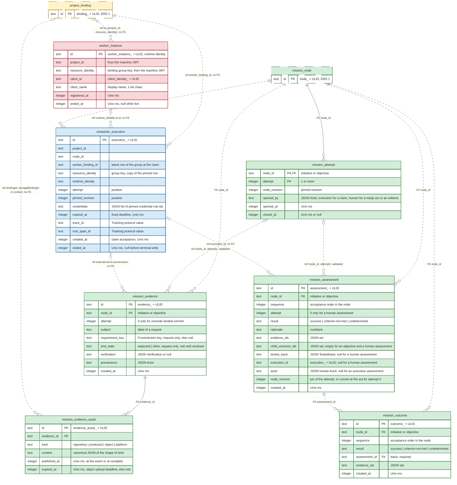

# ERD 2: Execution

## Scope

This view holds the tables that execute the work of a mission.
After this group, worker instances pull work, a steps execution carries out the steps of a node, a reviewer execution evaluates it, and the Mission Service records the evidence, the assessments and the outcomes.
A human uses the human controls of a node.

The [README](README.md) holds the conventions, the colors and the map of every group.
[ERD 1](01-setup.md) holds the tables that this view shows as stubs.

## Capability limits

- An objective whose attempt requires no external action completes after a current passing assessment.
- An objective whose attempt requests a required external action stops in `External.Requested`. Delivery admission in [ERD 3](03-integration.md) or a human check sets the end state of its request evidence.
- A success override and a discard do not end that attempt, because a node reaches a terminal state only when no external action of its open attempt is unresolved. A human pauses the node, blocks it and unblocks it. The next attempt reads the binding row that its pinned revision names.
- An action that the attempt requires but has not requested is not unresolved, so it prevents no terminal transition.
- The action performer holds no durable dispatch record. That record is the open item B9 W2 of [HANDOFF](https://github.com/kanthorlabs/kanthord/blob/main/docs/brainstorm/HANDOFF.md#worker-and-project-services).

## Records without a table

- The pool of a worker binding and the runtime fields of an instance record are runtime-only. A `server` placement instance holds no `worker_instance` row.
- The time of the last heartbeat is a monotonic-clock value in memory.
- The MCP session `mcp_session_<ulid>` lives in memory and ends at the server stop.
- The mutex of the action performer lives in memory.
- A workspace is a directory of the state directory, not a row.
- The credential handover is an API answer. The pin of a credential revision is the `credentials` list of `scheduler_execution`.
- The currency of an assessment is computed at each read, not stored.
- The closing event of an outcome is derived at each read, not stored.
- The worker version of an assessment is derived at each read, not stored.
- The `worker` application and an external harness hold no table of the server.

## Diagram

## Tables

| Table | Owner | Basis |
| --- | --- | --- |
| `worker_instance` | Worker Service | Derived: `worker.register` commits a registration and the instance-count collaboration in one transaction, under [the operation and its two entry adapters](https://github.com/kanthorlabs/kanthord/blob/main/docs/brainstorm/architecture.impl.md#the-operation-and-its-two-entry-adapters). |
| `scheduler_execution` | Scheduler Service | Derived from the `ExecutionRecord` of [the Scheduler operation contracts](https://github.com/kanthorlabs/kanthord/blob/main/docs/brainstorm/scheduler-service.impl.md#operation-contracts); [configuration](https://github.com/kanthorlabs/kanthord/blob/main/docs/brainstorm/scheduler-service.impl.md#configuration) rules the fixed deadline, and [loss settlement](https://github.com/kanthorlabs/kanthord/blob/main/docs/brainstorm/scheduler-service.impl.md#loss-settlement) rules the loss declaration. |
| `mission_attempt` | Mission Service | Derived from [the attempt](https://github.com/kanthorlabs/kanthord/blob/main/docs/brainstorm/mission-service.impl.md#the-attempt) and the `Attempt` record of the [Mission CLI](https://github.com/kanthorlabs/kanthord-engine/blob/main/docs/cli/mission.md#proposed-result-schemas). `opened_by` names the actor of the act that opens the attempt. |
| `mission_evidence` | Mission Service | Derived from [evidence content](https://github.com/kanthorlabs/kanthord/blob/main/docs/brainstorm/mission-service.impl.md#evidence-content), [the request record](https://github.com/kanthorlabs/kanthord/blob/main/docs/brainstorm/mission-service.impl.md#the-request-record) and [evidence retention](https://github.com/kanthorlabs/kanthord/blob/main/docs/brainstorm/mission-service.impl.md#evidence-retention). |
| `mission_evidence_asset` | Mission Service | Derived from [evidence content](https://github.com/kanthorlabs/kanthord/blob/main/docs/brainstorm/mission-service.impl.md#evidence-content) and [object evidence](https://github.com/kanthorlabs/kanthord/blob/main/docs/brainstorm/mission-service.impl.md#object-evidence). `content` holds the canonical JSON of the shape that `kind` names. |
| `mission_assessment` | Mission Service | Derived from [the assessment](https://github.com/kanthorlabs/kanthord/blob/main/docs/brainstorm/mission-service.impl.md#the-assessment). `sequence` is derived: the order check selects the latest admitted assessment, and neither a timestamp nor an identity establishes that order. |
| `mission_outcome` | Mission Service | Derived from [the outcome record](https://github.com/kanthorlabs/kanthord/blob/main/docs/brainstorm/mission-service.impl.md#the-outcome-record). `sequence` is derived: the current outcome is the outcome with the greatest `sequence`, and neither a timestamp nor an identity establishes that order. |

## Keys and relationship notation

- The [README](README.md) states the notation. A solid line is identifying, a dashed line is non-identifying, and the label states the enforcement.
- A record that names an attempt holds the attempt number, not an attempt row. The attempt reads 0 before the first attempt opens, and no `mission_attempt` row exists for 0. So `(node_id, attempt)` is a validated reference and no foreign key.
- A task holds no row in `mission_evidence`, `mission_assessment` or `mission_outcome`.

## Constraints

The owning service enforces every rule below in the transaction of its write.
A remote effect never commits with a SQLite transaction. A row that records a remote effect follows that effect.

### Worker Service

- `worker_instance` holds one row for each registration of an instance. `worker.register` inserts the row, and `id` is the runtime identity.
- `worker_instance` has a partial unique index on `client_id` where `ended_at` is null, so a client identity holds at most one live registration.
- The live registrations of a worker binding are the rows of that group where `ended_at` is null.
- A registration is admitted only while the live registrations of its worker binding are fewer than the instance count of that binding. The registration and the instance-count collaboration of the Project Service commit in one transaction, and a deregistration frees the slot in its transaction.
- A lower instance count of 1 or more ends no live registration. It refuses a new registration until the live registrations fall below the count, and the Scheduler Service admits no claim beyond the count. An instance count of 0 makes the binding unavailable, so it ends every live registration of the binding.
- `project_id` and `resource_identity` come from the verified machine JWT. The Project Service confirms that the group is a current, available worker binding of that project.
- A row pins no binding revision. Each claim pins the latest row of the group in `scheduler_execution.worker_binding_id`.
- A registration ends at a deregistration, at a heartbeat expiry, and at a removal or unavailability of its worker binding. The start of the server keeps every live row and sets its last heartbeat to the start time.
- A registration of a client identity that holds a live row answers that row and inserts nothing.
- `worker.instance.resume` first settles an expired unsettled execution in the same transaction. It clears `ended_at` of an ended registration only while that row is the claimant of a `running` execution, and it takes the slot again. No other act clears `ended_at`.
- An instance at the `server` placement registers never, so it holds no row.
- An ended row stays, so an execution names its program through `runtime_identity` after the deregistration.

### Scheduler Service

- `scheduler_execution` has a partial unique index on `node_id` where `ended_at` is null, so a node holds at most one execution without a terminal write.
- `scheduler_execution` has a partial unique index on `runtime_identity` where `ended_at` is null, so an instance holds at most one execution without a terminal write.
- The live executions of a worker binding are the `running` rows of that group, whatever revision each row pins.
- The claim admits an execution only while the live executions of the worker binding are fewer than its instance count.
- The claim reads the latest row of the group `(project_id, resource_identity)` through the Project Service in its transaction. `worker_binding_id` holds that row, and every use of the execution reads the `config` of that row.
- `project_id` is the project of the worker binding and the project of the mission of the node. `resource_identity` copies the value of the worker binding row. `runtime_identity` names an instance of that worker binding. For a registered instance, it equals `worker_instance.id`.
- The claim admits a node only in a state that the worker of the binding declares. A claim from `Available` is a steps claim. A claim from `Waiting` needs the readiness condition, a claim from `External.Requested` needs the continuation condition, and both are evaluation claims. The row holds no kind. While the claim is live, the node state `Executing` or `Evaluating` fixes it.
- The claim transaction inserts the execution row, sets the node state to `Executing` or `Evaluating`, opens attempt 1 when the node holds none, and deletes the job of the node. `attempt` and `pinned_revision` equal the open attempt and its `node_revision`.
- A work pull is idempotent by `runtime_identity`. Before admission, the claim transaction settles an expired unsettled execution of the pulling runtime identity, then reads its `running` row. When one exists, the pull answers that row and inserts nothing. After that row ends, a pull of the instance selects new work.
- The claim sets `expired_at = created_at + wallTimeMs + 1000 × scheduler.releaseReserve`, under [Scheduler configuration](https://github.com/kanthorlabs/kanthord/blob/main/docs/brainstorm/scheduler-service.impl.md#configuration). The effective `wallTimeMs` comes from the worker binding row that `worker_binding_id` pins. The deadline never moves, including at a registration resume. A later configuration change affects only later claims.
- Every execution mutation repeats the full proof in its write transaction: the claimant, a null `ended_at` and time before `expired_at`. This includes release, evidence and assessment submissions, and every operation that requires a live execution. The transaction reads the clock once at its start, and a terminal write uses that reading as `ended_at`. Equality with `expired_at` is a loss. A failed check answers 409 `scheduler.execution.not_running`. The invocation-chain proof before the handler stays in place. Of two terminal writes, only one wins, and only the winner routes the Mission Service.
- A release sets `ended_at` and answers `{ executionId, endedAt }`. The Mission Service reads the `ExecutionRelease.furtherWork` input in that transaction, and nothing stores it. A release retry after the end meets the refusal of the proof. After a lost release answer, the worker reads `claim get`, which shows `finished`. No stored release receipt exists.
- The Mission Service routes a steps release in the same transaction. With no further work, it sets `Waiting` and inserts an evaluation job when the readiness condition holds. With further work, it sets `Available` and inserts a new steps job only when the node is claimable.
- The Mission Service routes a reviewer release after a request in the same transaction: it sets `External.Requested` and inserts no job. The transaction that makes the continuation condition hold inserts the evaluation job.
- A current passing assessment of an evaluation claim on a node that requires no external action closes the attempt with `Completed` and ends the claim. A current assessment that does not pass closes the attempt with `Blocked` and ends the claim.
- Every 30 s, the Scheduler settles every row whose `ended_at` is null and whose `expired_at` is reached or passed. The loss declaration sets `ended_at` to the clock reading at the start of its transaction. A loss closes no attempt. The loss declaration counts the lost rows of the attempt after its latest finished row, and it hands the count to the Mission Service. The Mission Service consumes it in the same transaction. Below `mission.consecutiveLossLimit`, `Executing` returns to `Available` and `Evaluating` returns to `Waiting`, and the transaction inserts the job when the node is claimable. At the limit, the node moves to `Paused`, the attempt stays open and no job exists. A release ends the count. A resume resets nothing, so it grants one more try.
- A claim and every Mission transition first settle each expired unsettled execution that they meet in the same transaction. A human act then checks its own precondition against the settled state. The work-pull lookup and the registration resume follow the same rule and read a `running` execution, never merely a null `ended_at`.
- A revocation at a Mission transition before expiry sets `ended_at` in that transaction. It counts as no loss. Revocation of a lost claim takes effect at the expiry, never at the replacement claim.
- The end of a registration ends no execution row by itself. Its live execution follows its deadline and the loss declaration.
- No sweep deletes an execution row.
- The Scheduler derives `claimState`: `running` means `ended_at` is null and time is before `expired_at`; `lost` means `ended_at` is at or after `expired_at`, or `ended_at` is null and time is at or after `expired_at`; `finished` means `ended_at` is before `expired_at`. So the table holds no claim state column.
- An initiative in `Available` holds a steps job only while every current objective holds a terminal state. The transaction that commits the terminal state of its last objective inserts the job, and a graph change that adds a nonterminal objective deletes it.

### Mission Service: attempts and human controls

- `mission_attempt` has a partial unique index on `node_id` where `closed_at` is null, so a node holds at most one open attempt. A task holds no attempt row.
- Attempt numbers of a node start at 1 and have no gap. `mission_node.attempt` equals the highest number.
- Three acts open an attempt: a claim of a node that holds no attempt, a human ready act on a node that holds no attempt, and a human unblock of a blocked attempt. `opened_by` names the actor of that act: the execution of the claim, or the human of the ready act or the unblock. An attempt of 2 or more always opens by an unblock.
- An attempt pins `node_revision` at its opening and never changes it. The required external actions of the attempt are the policy of the `project_binding` row that its pinned revision names. An initiative requires none.
- A human ready act opens attempt 1 when the node holds none, sets `Waiting` and inserts the evaluation job in one transaction.
- A resume takes `target` `Available` or `Waiting`. A requested external action of the attempt takes precedence over the target. `Waiting` needs the readiness condition and the dependency closure. `Available` routes to `Pending` when the closure does not hold.
- An attempt closure sets `closed_at` and the node state, and writes the outcome of the node, in one transaction. A closed attempt never reopens.
- A human block, discard or success override on a node whose attempt reads 0 writes its human assessment with `attempt` 0 and the node outcome that names it. It closes no attempt.
- An unblock is one transaction: the content revision when the act carries a change, the attempt that it opens with the human as `opened_by` and the revision that the act leaves current as `node_revision`, and the routing to `Pending` or `Available`. An unblock while the attempt reads 0 opens no attempt and writes no row.

### Mission Service: evidence

- An execution submission names an attempt of 1 or more, and its `attempt` equals the open attempt of the claim. Its `node_id` equals the claimed node.
- The provenance of an execution submission is that execution. An evidence has no natural key, so a repeat after a restart creates a second row.
- A submission writes the evidence row and every asset row in one transaction. No asset joins an evidence later.
- `content` of an asset holds the RFC 8785 canonical JSON of the shape that `kind` names. A repository shape holds `bindingId` and `commit`. A produced shape holds `mediaType`, `sha256` and canonical base64 `data` of at most 5 MiB decoded, and `sha256` equals the digest of those bytes. An object shape holds `location`, `size`, `mediaType`, `storageBindingId` of the pinned storage binding row, `objectVersion` when the store returns one, and an optional `sha256`. A platform shape holds `kind`, `resourceIdentity` and the fields of its kind.
- `bindingId` of a repository shape names a repository binding row of the project in every context. For the evidence of an objective, and for a landed commit, it equals the repository binding of the pinned revision, or, for a success override while the attempt reads 0, the binding of the revision current at the act. For the tested input of an initiative, the list holds one address for each distinct repository binding of its current objectives.
- A `repository`, `produced` or `platform` asset sets `published_at` at the insert. An `object` asset sets `expired_at` 1 hour after the submission. The complete checks the size and the optional checksum, then sets `published_at`. An asset whose `expired_at` has passed never completes.
- An evidence is published when every asset of it holds `published_at`. An unpublished evidence joins no evidence set.
- An object is at most 5 GiB. Without a storage binding, the Mission Service accepts no object asset.
- A row is append-only, except `end_state` of a request and a human delete.
- A human delete removes the content first and the row after it. `mission.evidence.asset.delete` deletes one asset and keeps the evidence row. `mission.evidence.delete` deletes every asset and the evidence row, and it removes the identity from every `evidence_ids` set and from `mission_delivery_admission.evidence_id`. Both need a terminal state of the node and of every ancestor, unless a human forces the delete with a reason. No row records the remover, the reason or the time.
- kanthord runs no automatic delete and no cleanup process of evidence or of unpublished objects.
- `attempt` is 1 or more, except the landed-commit evidence of a success override on a node whose attempt reads 0.
- An `expected` result of a repository request writes each landed commit as its own evidence row with one `repository` asset, the provenance `{ kind: "service", service: "mission" }` and the attempt of the request.
- A success override with a landed commit inserts a published evidence row with the human actor as provenance, and the outcome names it.
- `verification` holds `testedInput` and `results` of the run of the verifications of the pinned revision.
- No index serves the lookup of delivery admission. It compares `content` of the `platform` assets.

### Mission Service: assessments

- Exactly one of `execution_id` and `actor` is set. An execution assessment names the execution of its evaluation claim in `execution_id`, and the read derives the `Actor` of the execution form from it. A human assessment holds a human `actor`, a null `tested_input` and an empty `child_outcome_ids`. An evaluation attempt is one reviewer execution and holds no row of its own.
- A human override, discard or block writes its human assessment and the outcome that names it in one transaction. No other act writes a human assessment.
- `node_revision` equals the pin of `mission_attempt` at `(node_id, attempt)`, or the revision current at the act when a human assessment names attempt 0. Its evidence, its tested input and its child outcomes belong to the node and to the context of that attempt.
- `child_outcome_ids` of an initiative names the current outcome of each current objective at the acceptance, and no other outcome. `child_outcome_ids` of an objective is empty. The child set of the assessment is the set of nodes of those outcomes. `evidence_ids` and `child_outcome_ids` are sets.
- A failed or unrun verification gives `criterion-not-met`, with a rationale that names the verification. A success with a failed or unrun verification is refused with `mission.assessment.verification_failed`.
- A success execution assessment names exactly one evidence with a `verification` whose `results` hold one entry per verification of the node and, for an objective, of each current task of the pinned revision, each with `exitCode` 0. An assessment that names an unpublished evidence is refused with `mission.assessment.evidence_unpublished`.
- For a worker that declares a base prompt, a default-standard violation turns `success` into `criterion-not-met`.
- `sequence` is the acceptance order of the assessments of one node, from 1 with no gap. The order check of the currency reads it over the execution assessments only.
- Assessments accumulate. The Mission Service overwrites none and deletes none. A human delete of an evidence removes its identity from `evidence_ids`, and nothing else changes an assessment row.

### Mission Service: outcomes

- An outcome stores no revision and no attempt. Its revision and its attempt are `node_revision` and `attempt` of the assessment that `assessment_id` names.
- `sequence` is the acceptance order of the outcomes of one node, from 1 with no gap.
- The current outcome of a node in an attempt is its outcome with the greatest `sequence` among the outcomes whose assessment names that attempt. The current outcome of a node is its outcome with the greatest `sequence`.
- `assessment_id` is required. The kind of the basis is the kind of the actor of that assessment, and the read derives it.
- The context of the basis is the assessment row that `assessment_id` names, so the outcome copies none of it.
- Only an execution assessment supports `criterion-not-met`. A human block and a human discard assert `undetermined`.
- The outcome of an `External.Failed` closure keeps the passing assessment as its basis and asserts `undetermined`. Its cause is the request evidence of its attempt whose `end_state` is `other`.
- An outcome is immutable, except that a human delete of an evidence removes its identity from `evidence_ids`. A correction appends an outcome of the same node and attempt. No correction reaches a node in a terminal state.

### Mission Service: requests

- The action performer submits a request evidence under a live evaluation claim, for the open attempt of the claim. `requirement_key` equals the key of a required external action of that attempt, and the evidence holds exactly one `platform` asset.
- `mission_evidence` has a unique index on `(node_id, attempt, requirement_key)` over the rows with a non-null `requirement_key`, so one attempt holds at most one request for each required external action.
- A reuse is a request evidence of a later attempt of the same node whose `platform` asset holds the same `content` as a request of an earlier attempt with the same `requirement_key`.
- Delivery admission and a human check set `end_state` once, to `expected` or `other`, and refuse a later conclusive result. A result that establishes no end state writes nothing.
- A request evidence is deleted only with force. A forced delete of a request of the open attempt holds the node in the same transaction.

## Cross-group references

| From | To | Kind |
| --- | --- | --- |
| `worker_instance.project_id`, `resource_identity` | `project_binding.project_id`, `resource_identity` | Reference to a binding group, from the machine JWT, no FK. It pins no revision. |
| `scheduler_execution.worker_binding_id` | `project_binding.id` | Reference, no FK. The latest row of the group at the claim. |
| `scheduler_execution.worker_binding_id` | `worker_agent_enablement.agent_name` | Derived through the catalog agents of `config.worker` of the pinned binding row, no FK. A resolution reads the latest row of the enablement. |
| `scheduler_execution.resource_identity` | `project_binding.resource_identity` | Copy of the pinned row, no FK. It groups the rows of one binding across revisions. |
| `scheduler_execution.runtime_identity` | `worker_instance.id` | Reference, no FK. A hosted instance has no row. The Worker Service answers the client attribution of a registered instance through it. |
| `scheduler_execution.node_id` | `mission_node.id` | Reference, no FK. |
| `scheduler_execution.credentials` | `credential.id` | Reference in JSON, no FK. Custody appends each pinned revision through `pinCredential`. |
| `scheduler_execution.trace_id`, `root_span_id` | Tracking trace and span | Correlation value in [ERD 4](04-tracking.md). |
| Every execution actor, `mission_evidence.provenance` included | `scheduler_execution.id` | Reference in JSON, no FK. |
| `mission_assessment.execution_id` | `scheduler_execution.id` | Reference, no FK. Null for a human assessment. |
| `mission_evidence_asset.content` (`bindingId`, `storageBindingId`) | `project_binding.id` | Reference in JSON, no FK. |
