# ERD 2: Execution

## Scope

This view holds the tables that execute the work of a mission.
After this group, worker instances pull work, a steps execution carries out the steps of a node, a reviewer execution evaluates it, and the Mission Service records the evidence, the assessments and the outcomes.
A human uses the human controls of a node.

The [README](README.md) holds the conventions, the colors and the map of every group.
[ERD 1](01-setup.md) holds the tables that this view shows as stubs.

## Capability limits

- An objective whose attempt freezes no required external action completes after a current passing assessment.
- An objective whose attempt requests a required external action stops in `External.Requested`. Only the observer writes an observation, and the observer runs only on an observation obligation that delivery admission creates in [ERD 3](03-integration.md).
- A success override and a discard do not end that attempt, because a node reaches a terminal state only when no external action of its open attempt is unresolved. A human pauses the node, blocks it and unblocks it. The next attempt freezes the configuration current at its opening.
- An action that the attempt freezes but has not requested is not unresolved, so it prevents no terminal transition.
- The action performer holds no durable dispatch record. That record is the open item B9 W2 of [HANDOFF](../../brainstorm/HANDOFF.md#worker-and-project-services).

## Records without a table

- The pool of a worker binding and the runtime fields of an instance record are runtime-only. A `server` placement instance holds no `worker_instance` row.
- The time of the last heartbeat is a monotonic-clock value in memory.
- The MCP session `mcp_session_<ulid>` lives in memory and ends at the server stop.
- The mutex of the action performer lives in memory.
- A workspace is a directory of the state directory, not a row.
- The credential handover is an API answer. The pin of a credential revision is the `credentials` list of `scheduler_execution`.
- The currency of an assessment is computed at each read, not stored.
- The `worker` application and an external harness hold no table of the server.

## Diagram

```mermaid
erDiagram
    project_binding {
        text id PK "binding_ + ULID, ERD 1"
    }
    mission_node {
        text id PK "node_ + ULID, ERD 1"
    }

    worker_instance {
        text id PK "worker_instance_ + ULID, runtime identity"
        text project_id "from the machine JWT"
        text resource_identity "binding group key, from the machine JWT"
        text client_id "client_identity_ + ULID"
        text client_name "display name, 1-64 chars"
        integer registered_at "Unix ms"
        integer ended_at "Unix ms, null while live"
    }

    scheduler_execution {
        text id PK "execution_ + ULID"
        text project_id
        text node_id
        text worker_binding_id "latest row of the group at the claim"
        text resource_identity "group key, copy of the pinned row"
        text runtime_identity
        text client_id "copy at the claim, null for a hosted instance"
        text client_name "copy at the claim, null for a hosted instance"
        text claim_kind "steps | evaluation"
        integer attempt "positive"
        integer pinned_revision "positive"
        text credentials "JSON list of pinned credential row ids"
        integer expires_at "lease expiry, Unix ms"
        integer renewed_at "Unix ms or null"
        text renewal_request_id "current renewal or null"
        integer loss_declared_at "Unix ms or null"
        integer released_at "Unix ms or null"
        integer further_work "0 or 1, null before release"
        text trace_id "Tracking protocol value"
        text root_span_id "Tracking protocol value"
        integer created_at "claim acceptance, Unix ms"
        integer ended_at "Unix ms, null while live"
    }

    scheduler_renewal {
        text execution_id PK, FK
        text request_id PK "request_ + ULID"
        integer sequence "order of acceptance"
        integer expires_at "lease expiry that it set"
        integer accepted_at "Unix ms"
    }

    scheduler_request {
        text project_id PK
        text request_id PK "request_ + ULID"
        text scope_digest "resource identity + runtime identity"
        text payload_digest
        text result "JSON claimed answer at acceptance"
        integer created_at "Unix ms"
    }

    mission_attempt {
        text node_id PK, FK "initiative or objective"
        integer attempt PK "1 or more"
        integer node_revision "pinned revision"
        text required_external_actions "JSON FrozenAction list"
        integer execution_ended "0 or 1"
        integer consecutive_losses "0 or more, reset by a release and a resume"
        text unblock_id "unblock_ + ULID or null"
        integer opened_at "Unix ms"
        integer closed_at "Unix ms or null"
    }

    mission_unblock {
        text id PK "unblock_ + ULID"
        text mission_id FK
        text node_id FK
        integer cleared_attempt "0 or more"
        integer opened_attempt "0 or more"
        integer pinned_revision "null when the attempt reads 0"
        integer resulting_revision
        text state "Pending | Available"
        text actor "JSON Actor, human"
        integer created_at "Unix ms"
    }

    mission_evidence {
        text id PK "evidence_ + ULID"
        text node_id FK "node or task"
        text content_owner_id FK "objective for task evidence"
        integer attempt "0 only for override landed commit"
        integer node_revision
        text scope "node | task"
        text subject
        text address_kind "repository | produced | object"
        text binding_id "repository address"
        text commit "40 or 64 hex"
        text sha256 "produced, optional for object"
        text media_type "type/subtype, produced and object"
        blob content "inline bytes, at most 5 MiB, null after removal"
        integer size "object size"
        text storage_binding_id "object evidence, pinned row"
        text location "s3 URI, server-generated key"
        text object_version "when the store returns one"
        text status "pending | published"
        integer expires_at "pending upload, 1 hour"
        integer cleaned_up "0 or 1, pending upload"
        text execution_id "null for a human or service provenance"
        text observation_key
        text submission_digest "canonical JSON digest"
        integer redacted "0 or 1"
        text redaction_description
        text corrects_evidence_id FK
        text machine_check "JSON MachineCheck or null"
        text provenance "JSON Actor"
        text removed_by "JSON Actor or null"
        text removed_reason
        integer created_at "Unix ms"
    }

    mission_run_output {
        text node_id PK, FK
        text execution_id PK
        integer attempt
        integer node_revision
        text tried
        text stopped_by
        text recommendations "JSON list"
        text actor "JSON Actor, execution"
        integer accepted_at "Unix ms"
    }

    mission_evaluation {
        text id PK "evaluation_ + ULID"
        text node_id FK
        integer attempt "unique with node_id"
        integer node_revision
        integer created_at "Unix ms"
    }

    mission_evaluation_try {
        text evaluation_id PK, FK
        integer evaluation_attempt PK "1 or more"
        text execution_id UK
        integer started_at "Unix ms"
        integer ended_at "Unix ms or null"
    }

    mission_assessment {
        text id PK "assessment_ + ULID"
        text node_id FK "node or task"
        text content_owner_id FK "objective for a task assessment"
        integer sequence "acceptance order in the content owner"
        integer attempt
        integer node_revision "of the content owner"
        text evaluation_id FK "null for a task assessment"
        integer evaluation_attempt "null for a task assessment"
        text result "success | criterion-not-met | undetermined"
        text rationale "nonblank"
        text evidence_ids "JSON set"
        text child_outcome_ids "JSON set"
        text child_node_ids "JSON set, recorded at acceptance"
        text tested_input "JSON TestedInput"
        text default_standard_findings "JSON list or null"
        text worker_version
        text actor "JSON Actor, execution"
        integer created_at "Unix ms"
    }

    mission_outcome {
        text id PK "outcome_ + ULID"
        text node_id FK "node or task"
        text content_owner_id FK "objective for a task outcome"
        integer attempt "0 or more"
        integer node_revision
        text closing_event
        text stopping_reason
        text result "success | criterion-not-met | undetermined"
        text basis_kind "assessment | human-assertion"
        text assessment_id FK "assessment basis"
        text evaluation_context "JSON copy of the assessment context"
        text basis_actor "JSON Actor, human assertion"
        text decision "human assertion"
        text evidence_ids "JSON set"
        text previous_outcome_id FK "correction"
        text observation_id FK "External.Failed closure"
        integer created_at "Unix ms"
    }

    mission_external_object {
        text id PK "external_object_ + ULID"
        text node_id FK
        integer attempt
        text action_key "binding name.action name"
        text binding_id
        text address "remote address"
        text label "display label"
        text reuses_external_object_id FK "earlier attempt"
        text actor "JSON Actor, execution"
        integer created_at "Unix ms"
    }

    mission_observation {
        text id PK "observation_ + ULID"
        text node_id FK
        integer attempt
        text action_key
        text expected_end_state "pull_request_merged | base_branch_pushed"
        text external_object_id FK
        text end_state "expected | other | none"
        text detail "platform-neutral text"
        text landed_commits "JSON RepositoryAddress list"
        text observer "JSON Actor, service scheduler"
        integer observed_at "Unix ms"
        integer accepted_at "Unix ms"
    }

    project_binding }o..o{ worker_instance : "ref by (project_id, resource_identity), no FK"
    project_binding ||..o{ scheduler_execution : "ref worker_binding_id, no FK"
    worker_instance |o..o{ scheduler_execution : "ref runtime_identity to id, no FK"
    mission_node ||..o{ scheduler_execution : "ref, no FK"
    scheduler_execution ||--o{ scheduler_renewal : "FK execution_id"
    scheduler_execution ||..|| scheduler_request : "ref in result JSON"

    mission_node ||--o{ mission_attempt : "FK node_id"
    mission_node ||..o{ mission_unblock : "FK node_id"
    mission_attempt |o..o| mission_unblock : "ref unblock_id"

    mission_node ||..o{ mission_evidence : "FK node_id"
    mission_node ||..o{ mission_evidence : "FK content_owner_id"
    mission_evidence |o..o{ mission_evidence : "FK corrects_evidence_id"
    mission_attempt |o..o{ mission_evidence : "ref (content_owner_id, attempt), validated"
    scheduler_execution |o..o{ mission_evidence : "ref execution_id, no FK"
    project_binding |o..o{ mission_evidence : "ref binding_id, storage_binding_id, no FK"

    mission_node ||--o{ mission_run_output : "FK node_id"
    scheduler_execution ||--o| mission_run_output : "ref execution_id, no FK"

    mission_node ||..o{ mission_evaluation : "FK node_id"
    mission_attempt ||..o| mission_evaluation : "ref (node_id, attempt), validated"
    mission_evaluation ||--|{ mission_evaluation_try : "FK evaluation_id"
    scheduler_execution ||..o| mission_evaluation_try : "ref execution_id, no FK"

    mission_node ||..o{ mission_assessment : "FK node_id"
    mission_node ||..o{ mission_assessment : "FK content_owner_id"
    mission_evaluation |o..o{ mission_assessment : "FK evaluation_id"
    scheduler_execution ||..o{ mission_assessment : "ref in actor, no FK"

    mission_node ||..o{ mission_outcome : "FK node_id"
    mission_node ||..o{ mission_outcome : "FK content_owner_id"
    mission_attempt |o..o{ mission_outcome : "ref (content_owner_id, attempt), validated"
    mission_assessment |o..o{ mission_outcome : "FK assessment_id"
    mission_outcome |o..o| mission_outcome : "FK previous_outcome_id"

    mission_node ||..o{ mission_external_object : "FK node_id"
    mission_attempt ||..o{ mission_external_object : "ref (node_id, attempt), validated"
    mission_external_object |o..o{ mission_external_object : "FK reuses_external_object_id"
    project_binding ||..o{ mission_external_object : "ref binding_id, no FK"

    mission_node ||..o{ mission_observation : "FK node_id"
    mission_external_object ||..o{ mission_observation : "FK external_object_id"
    mission_observation |o..o| mission_outcome : "FK observation_id"

    classDef project fill:#fff3cd,stroke:#b8860b,color:#212529
    classDef worker fill:#f8d7da,stroke:#b02a37,color:#212529
    classDef mission fill:#d4edda,stroke:#2e7d32,color:#212529
    classDef scheduler fill:#d6eaf8,stroke:#1f618d,color:#212529
    classDef stub stroke-dasharray:4 3

    class project_binding project
    class mission_node mission
    class project_binding,mission_node stub
    class worker_instance worker
    class scheduler_execution,scheduler_renewal,scheduler_request scheduler
    class mission_attempt,mission_unblock,mission_evidence,mission_run_output,mission_evaluation,mission_evaluation_try,mission_assessment,mission_outcome,mission_external_object,mission_observation mission
```

## Tables

| Table | Owner | Basis |
| --- | --- | --- |
| `worker_instance` | Worker Service | Derived: `worker.register` commits a registration and the instance-count collaboration in one transaction, under [the operation and its two entry adapters](../../brainstorm/architecture.impl.md#the-operation-and-its-two-entry-adapters). |
| `scheduler_execution` | Scheduler Service | Derived from the `ExecutionRecord` of [the Scheduler operation contracts](../../brainstorm/scheduler-service.impl.md#operation-contracts); the renewal and release columns are ruled in [durable requests](../../brainstorm/scheduler-service.impl.md#durable-requests). |
| `scheduler_renewal` | Scheduler Service | Derived: a renewal identifier that a later renewal superseded answers 409, so the Scheduler keeps every accepted renewal identifier of an execution. |
| `scheduler_request` | Scheduler Service | Ruled: [durable requests](../../brainstorm/scheduler-service.impl.md#durable-requests). |
| `mission_attempt` | Mission Service | Derived from [the attempt](../../brainstorm/mission-service.impl.md#the-attempt) and the `Attempt` record of the [Mission CLI](../../../engine/docs/cli/mission.md#proposed-result-schemas). |
| `mission_unblock` | Mission Service | Derived from the [unblock record](../../brainstorm/mission-service.vocabulary.md#unblock-record). |
| `mission_evidence` | Mission Service | Derived from [evidence content](../../brainstorm/mission-service.impl.md#evidence-content), [object evidence](../../brainstorm/mission-service.impl.md#object-evidence) and [evidence retention](../../brainstorm/mission-service.impl.md#evidence-retention). `content_owner_id` is derived from the outcome record, so a task move changes no stored row. |
| `mission_run_output` | Mission Service | Derived from the [run output](../../brainstorm/mission-service.md#run-output) record; its natural key `(node_id, execution_id)` is proposed in the Mission CLI. |
| `mission_evaluation` | Mission Service | Derived from the durable evaluation lifecycle of [evaluation and assessment](../../brainstorm/mission-service.md#evaluation-and-assessment). This page maps one evaluation to one attempt. |
| `mission_evaluation_try` | Mission Service | Derived from the [evaluation attempt](../../brainstorm/mission-service.vocabulary.md#evaluation-attempt). |
| `mission_assessment` | Mission Service | Derived from [the assessment](../../brainstorm/mission-service.impl.md#the-assessment). `sequence` is derived: the order check selects the latest admitted assessment, and neither a timestamp nor an identity establishes that order. |
| `mission_outcome` | Mission Service | Derived from [the outcome record](../../brainstorm/mission-service.impl.md#the-outcome-record). |
| `mission_external_object` | Mission Service | Derived from the [external object](../../brainstorm/mission-service.md#evidence) record. |
| `mission_observation` | Mission Service | Derived from [the observation record](../../brainstorm/mission-service.impl.md#the-observation-record). Its only writer is the observer of [ERD 3](03-integration.md). |

## Keys and relationship notation

- The [README](README.md) states the notation. A solid line is identifying, a dashed line is non-identifying, and the label states the enforcement.
- A record that names an attempt holds the attempt number, not an attempt row. The attempt reads 0 before the first attempt opens, and no `mission_attempt` row exists for 0. So `(content_owner_id, attempt)` is a validated reference and no foreign key.
- A task record names the task in `node_id`, its objective in `content_owner_id` and the attempt of that objective in `attempt`. For an initiative or an objective, `content_owner_id` equals `node_id`.
- `mission_run_output` holds `execution_id` in its primary key, so its line to `scheduler_execution` is identifying, and the value stays a reference without a foreign key.

## Constraints

The owning service enforces every rule below in the transaction of its write.
A remote effect never commits with a SQLite transaction. A row that records a remote effect follows that effect.

### Worker Service

- `worker_instance` holds one row for each registration of an instance. `worker.register` inserts the row, and `id` is the runtime identity.
- `worker_instance` has a partial unique index on `client_id` where `ended_at` is null, so a client identity holds at most one live registration.
- `worker_instance` has a partial index on `(project_id, resource_identity)` where `ended_at` is null. The live registrations of a worker binding are the live rows of that group.
- A registration is admitted only while the live registrations of its worker binding are fewer than the instance count of that binding. The registration and the instance-count collaboration of the Project Service commit in one transaction, and a deregistration frees the slot in its transaction.
- A lower instance count of 1 or more ends no live registration. It refuses a new registration until the live registrations fall below the count, and the Scheduler Service admits no claim beyond the count. An instance count of 0 makes the binding unavailable, so it ends every live registration of the binding.
- `project_id` and `resource_identity` come from the verified machine JWT. The Project Service confirms that the group is a current, available worker binding of that project.
- A row pins no binding revision. Each claim pins the latest row of the group in `scheduler_execution.worker_binding_id`.
- A registration ends at a deregistration, at a heartbeat expiry, at a removal or unavailability of its worker binding, and at a server restart. The start of the server ends every live row before it admits a request.
- An instance at the `server` placement registers never, so it holds no row.
- An ended row stays. The execution record copies its client identity and display name, so a trace names the program after the deregistration.

### Scheduler Service

- `scheduler_execution` has a partial unique index on `node_id` where `ended_at` is null, so one live claim holds a node.
- `scheduler_execution` has a partial unique index on `runtime_identity` where `ended_at` is null, so an instance hosts at most one execution.
- `scheduler_execution` has a partial index on `(project_id, resource_identity)` where `ended_at` is null. The live executions of a worker binding are the live rows of that group, whatever revision each row pins.
- The claim admits an execution only while the live executions of the worker binding are fewer than its instance count.
- The claim reads the latest row of the group `(project_id, resource_identity)` through the Project Service in its transaction. `worker_binding_id` holds that row, and every use of the execution reads the `config` of that row.
- `project_id` is the project of the worker binding and the project of the mission of the node. `resource_identity` copies the value of the worker binding row. `runtime_identity` names an instance of that worker binding. For a registered instance, it equals `worker_instance.id`.
- The claim admits a node only in a state that the worker of the binding declares. A claim from `Available` has `claim_kind` `steps`. A claim from `Waiting` needs the readiness condition, a claim from `External.Requested` needs the continuation condition, and both have `claim_kind` `evaluation`. The kind never changes.
- The claim transaction inserts the execution row and the `scheduler_request` row, sets the node state to `Executing` or `Evaluating`, opens attempt 1 when the node holds none, and deletes the job of the node. `attempt` and `pinned_revision` equal the open attempt and its `node_revision`.
- `scheduler_request` holds accepted work pulls only. `project_id` equals the project of its execution. `scope_digest` is the digest of the canonical JSON of the resource identity and the runtime identity. `result` is the answer at acceptance and never changes, so a replay returns it and never the current execution row.
- A renewal with a new identifier inserts a `scheduler_renewal` row and sets `renewed_at`, `expires_at` and `renewal_request_id` on the execution. A repeat of the current identifier extends nothing. An identifier of an earlier row of the execution answers 409 `scheduler.execution.renewal_superseded`. `sequence` of an execution starts at 1 and has no gap.
- A release sets `released_at`, `further_work` and `ended_at` once. A repeat with an equal payload returns the accepted receipt.
- The Mission Service routes a steps release in the same transaction. With no further work, it sets `execution_ended` 1 on the attempt, sets `Waiting`, and inserts an evaluation job when the readiness condition holds. With further work, it sets `Available` and inserts a new steps job only when the node is claimable.
- The Mission Service routes a reviewer release after a request in the same transaction: it sets `External.Requested` and inserts no job. The transaction that makes the continuation condition hold inserts the evaluation job.
- A current passing assessment of an evaluation claim on a node that requires no external action closes the attempt with `Completed` and ends the claim. A current assessment that does not pass closes the attempt with `Blocked` and ends the claim.
- A loss declaration sets `loss_declared_at` and `ended_at`. A revocation at a Mission transition ends the claim through the same path. A loss closes no attempt. The Mission Service consumes it in the same transaction: it adds one to `consecutive_losses` of the attempt. Below `mission.consecutiveLossLimit`, `Executing` returns to `Available` and `Evaluating` returns to `Waiting`, and the transaction inserts the job when the node is claimable. At the limit, the node moves to `Paused`, the attempt stays open and no job exists. A release and a resume set `consecutive_losses` to 0.
- The end of a registration ends no execution row by itself. Its live execution follows the lease and the loss declaration.
- No sweep deletes an execution row, a renewal row or a request row.
- The closed set of the claim state, the lease duration and the renewal cadence are open in [HANDOFF](../../brainstorm/HANDOFF.md#scheduler-service-and-delivery). So the table holds no claim state column.
- An initiative in `Available` holds a steps job only while every current objective holds a terminal state. The transaction that commits the terminal state of its last objective inserts the job, and a graph change that adds a nonterminal objective deletes it.

### Mission Service: attempts and human controls

- `mission_attempt` has a partial unique index on `node_id` where `closed_at` is null, so a node holds at most one open attempt. A task holds no attempt row.
- Attempt numbers of a node start at 1 and have no gap. `mission_node.attempt` equals the highest number.
- Three acts open an attempt: a claim of a node that holds no attempt, a human ready act on a node that holds no attempt, and a human unblock of a blocked attempt.
- An attempt pins `node_revision` at its opening and never changes it. `required_external_actions` freezes the configuration of the Project Service current at the opening. An initiative freezes an empty list.
- A human ready act sets `execution_ended` 1 on the opened or the open attempt, sets `Waiting` and inserts the evaluation job in one transaction. A resume reads `execution_ended` to select `Waiting`.
- An attempt closure sets `closed_at` and the node state, and writes the outcome of the node and the owed task outcomes, in one transaction. A closed attempt never reopens.
- A human block, discard or success override on a node whose attempt reads 0 writes the node outcome with `attempt` 0. It closes no attempt and writes no task outcome.
- An unblock is one transaction: the content revision when the act carries a change, the `mission_unblock` row, the attempt that it opens and the routing to `Pending` or `Available`.
- `mission_unblock.mission_id` references `mission_mission.id` and is the mission of its node. When the cleared attempt exists, `opened_attempt` is `cleared_attempt + 1`, `pinned_revision` is the revision that the act leaves current, and the opened attempt holds `unblock_id`. When the attempt reads 0, `cleared_attempt` and `opened_attempt` are 0 and `pinned_revision` is null.

### Mission Service: evidence

- An execution submission names an attempt of 1 or more, and its `attempt` and `node_revision` equal the open attempt and the pinned revision of the claim. Evidence of scope `task` names a current task of the claimed objective.
- An execution submission holds a nonnull `execution_id`, `observation_key` and `submission_digest`, and its provenance is that execution. `mission_evidence` has a unique index on `(execution_id, observation_key)` over pending and published rows.
- `submission_digest` is the digest of the canonical JSON of the validated submission, the target node included. A repeat with the same key and digest returns the stored row: the published evidence, or the pending upload with its grant while the upload is unexpired. A repeat of `begin` for an expired pending upload answers 409 `mission.evidence.upload_expired`, and a new upload uses a new key. A repeat with another digest answers 409 `mission.evidence.observation_key_conflict`.
- A repository address holds `binding_id` and `commit`, and no inline content. A produced address holds `sha256`, `media_type` and inline `content` of at most 5 MiB, and `sha256` equals the digest of those bytes. A content removal keeps `sha256` and `media_type`. An object address holds `location`, `size`, `media_type`, the pinned storage binding row, `object_version` when the store returns one, and an optional `sha256`. Every other address column is null.
- `binding_id` of a repository address names a repository binding row of the project in every context. For the evidence of an objective or a task, and for a landed commit, it equals the repository binding of the pinned revision, or, for a success override while the attempt reads 0, the binding of the revision current at the act. For the tested input of an initiative, the list holds one address for each distinct repository binding of its current objectives.
- An object upload starts as `pending` with `expires_at` 1 hour after the start. The complete checks the size and the optional checksum, then sets `published`. An expired pending row never completes. A pending row joins no evidence set.
- An object is at most 5 GiB. Without a storage binding, the Mission Service accepts no object evidence.
- A published row is append-only. Only a content removal changes it.
- A content removal needs a terminal state of the node and of every ancestor, unless a human forces it with a reason. It deletes the object, at its recorded version when one exists, or it sets `content` to null. It then sets `removed_by` to the verified human actor and `removed_reason`. Both are null while the content exists. The row, its key and its digest stay for the life of the mission, and no removal time exists.
- A pending cleanup is a human act on one mission, and it covers expired pending rows only. It deletes the object, then sets `cleaned_up` 1. The row stays.
- kanthord runs no automatic cleanup of evidence or of unpublished objects.
- `attempt` is 1 or more, except the landed-commit evidence of a success override on a node whose attempt reads 0.
- `corrects_evidence_id` names evidence of the same node and scope.
- An accepted `expected` landing observation appends its landed commits to the evidence set. This page maps each landed commit to a published evidence row of the repository address kind, with the service actor as provenance and the attempt of the observation.
- A success override with a landed commit inserts a published evidence row with the human actor as provenance, and the outcome names it.

### Mission Service: run outputs, evaluations and assessments

- `mission_run_output` holds zero or one row for each execution. A repeat under the same execution creates no second row, and a failed submission leaves no row.
- An execution submits a run output before a release with further work. Its `attempt` and `node_revision` equal those of the claim.
- A run output stays while its node holds no terminal state. The bound of its retention after a terminal state is open.
- `mission_evaluation` has a unique index on `(node_id, attempt)`. The first reviewer execution that claims the node from `Waiting` under an attempt opens its evaluation. Each reviewer execution from `Waiting` adds one try with the next `evaluation_attempt`.
- A claim from `External.Requested` performs no evaluation, so it adds no try.
- `node_id`, `attempt` and `node_revision` of an evaluation equal those of the claims of its tries. A try ends when its execution ends, and an attempt closure ends every open try.
- The status and the retry budget of an evaluation are open, so no status column exists.
- A task assessment has a null `evaluation_id` and names the steps execution of its objective as actor. A reviewer assessment names the evaluation and the try of its claim, and the try names the execution of the actor.
- `node_revision` of an assessment equals the revision that its attempt pins. Its evidence, its tested input and its child outcomes belong to the node and to the context of that attempt.
- `child_node_ids` equals the current child set of the node at the acceptance. Each child outcome names a node of that set. `evidence_ids`, `child_outcome_ids` and `child_node_ids` are sets.
- A failed or unrun verification gives `criterion-not-met`, with a rationale that names the verification. A success with a failed or unrun verification is refused with `mission.assessment.verification_failed`.
- For a worker that declares a base prompt, a default-standard violation turns `success` into `criterion-not-met`.
- `sequence` is the acceptance order of the assessments of one content owner, from 1 with no gap. The order check of the currency reads it.
- Assessments accumulate. The Mission Service overwrites none and deletes none.

### Mission Service: outcomes

- `node_revision` of an outcome equals the revision that its attempt pins, or the revision current at the act when the attempt reads 0.
- The basis is one of two variants. An assessment basis holds `assessment_id` and `evaluation_context`, and the other basis columns are null. A human-assertion basis holds `basis_actor` and `decision`, and the assessment columns are null.
- `evaluation_context` copies the revision, the evidence, the child set and the child outcomes of the assessment at the closure.
- Only an assessment basis asserts `criterion-not-met`. A human block and a human discard assert `undetermined`.
- A submitted task outcome and its paired task assessment commit in one transaction. The outcome holds `closing_event` `task-assessment`, the result of that assessment and an assessment basis that names it, and its evidence includes the accepted task commit.
- A closure that a human override, discard or block causes fills an outcome for each current task that holds no current outcome of the closed attempt. The filled outcome asserts `undetermined`, holds the basis of the node outcome and the closing event as `closing_event` and `stopping_reason`, and carries the accepted task evidence of that task in the attempt.
- An outcome that an `External.Failed` observation closes keeps the passing assessment as its basis, asserts `undetermined` and holds `observation_id`. That observation names the same node and attempt and holds `end_state` `other`.
- An outcome is immutable. A correction appends an outcome that names `previous_outcome_id` of the same node and attempt. No correction reaches a node in a terminal state.

### Mission Service: external objects and observations

- The action performer submits an external object under a live evaluation claim, for the open attempt of the claim. `action_key` and `binding_id` equal a frozen action of that attempt.
- `reuses_external_object_id` names an external object of an earlier attempt of the same node, with the same action and binding, and the new object keeps its `address`.
- An observation names an external object of the same node and attempt, and `action_key` equals the `action_key` of that object. `expected_end_state` copies the frozen action.
- An `expected` observation of a repository action holds a nonempty `landed_commits`. Every other observation holds an empty list.
- The Mission Service reads `end_state` alone and never `detail`.

## Cross-group references

| From | To | Kind |
| --- | --- | --- |
| `worker_instance.project_id`, `resource_identity` | `project_binding.project_id`, `resource_identity` | Reference to a binding group, from the machine JWT, no FK. It pins no revision. |
| `scheduler_execution.worker_binding_id` | `project_binding.id` | Reference, no FK. The latest row of the group at the claim. |
| `scheduler_execution.worker_binding_id` | `worker_agent_enablement.agent_name` | Derived through the catalog agents of `config.worker` of the pinned binding row, no FK. A resolution reads the latest row of the enablement. |
| `scheduler_execution.resource_identity` | `project_binding.resource_identity` | Copy of the pinned row, no FK. It groups the rows of one binding across revisions. |
| `scheduler_execution.runtime_identity` | `worker_instance.id` | Reference, no FK. A hosted instance has no row. |
| `scheduler_execution.node_id` | `mission_node.id` | Reference, no FK. |
| `scheduler_execution.credentials` | `credential.id` | Reference in JSON, no FK. Custody appends each pinned revision through `pinCredential`. |
| `scheduler_execution.trace_id`, `root_span_id` | Tracking trace and span | Correlation value in [ERD 4](04-tracking.md). |
| `mission_evidence.execution_id`, `mission_run_output.execution_id`, `mission_evaluation_try.execution_id` and every execution actor | `scheduler_execution.id` | Reference, no FK. |
| `mission_evidence.binding_id`, `storage_binding_id` | `project_binding.id` | Reference, no FK. |
| `mission_external_object.binding_id` | `project_binding.id` | Reference, no FK. |
