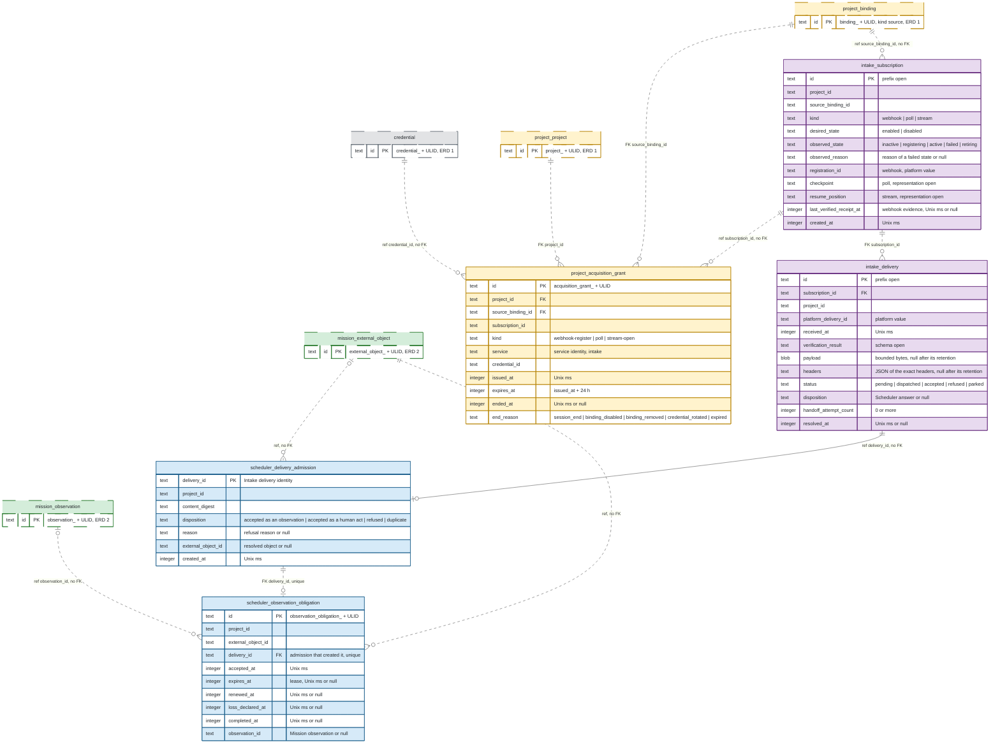

# ERD 3: External acquisition and observation

## Scope

This view holds the tables that receive the deliveries of an external platform and turn them into observations.
After this group, a human binds a delivery source and manages its subscriptions.
The Intake Service acquires deliveries through a webhook, a poll or a stream, and hands each delivery to the delivery admission of the Scheduler Service.
The observer of the Scheduler Service reads the external object and writes the observation to the Mission Service, so a node in `External.Requested` reaches its end state.

The [README](README.md) holds the conventions, the colors and the map of every group.

## Capability limits

- The ruled acquisition and delivery machinery supports the GitHub platform only. Slack, Telegram and Jira wait for their platform entries and credential types in [HANDOFF](../../brainstorm/HANDOFF.md#project-service).
- The complete source binding configuration is open. The proposed GitHub fields are in the [Project CLI](../../../engine/docs/cli/project.md#source-configuration--partially-blocked).
- Acceptance as a human act needs a linked human identity. The mapping from a platform account to a human identity is part of the open source binding configuration.
- A request for new WHAT receives no acceptance. The inbound request contract is POSTPONED in HANDOFF.
- The Intake Service is extractable in principle: it declares no collaboration, and no foreign key crosses its boundary. It still runs in the server process and in `kanthord.db`. Its peers reach it through `service`-policy operations, which the direct adapter alone serves, and the cross-process identity contract is POSTPONED.

## Records without a table

- The acquisition material of a grant stays in a module-private map of the Intake Service for the session. No store holds it.
- The evidence of a poll and of a stream for the subscription healthcheck stays in memory, keyed by the acquisition grant identity.
- No store holds a resource healthcheck result.

## Diagram

## Tables

| Table | Owner | Basis |
| --- | --- | --- |
| `project_acquisition_grant` | Project Service | Ruled: [the acquisition grant](../../brainstorm/project-service.impl.md#the-acquisition-grant). |
| `intake_subscription` | Intake Service | Derived from [subscriptions](../../brainstorm/intake-service.md#subscriptions); the column `last_verified_receipt_at` is ruled in [the resource healthcheck](../../brainstorm/intake-service.impl.md#the-resource-healthcheck). The subscription store is open in [HANDOFF](../../brainstorm/HANDOFF.md#intake-service). |
| `intake_delivery` | Intake Service | Derived from [deliveries](../../brainstorm/intake-service.md#deliveries) and [handoff](../../brainstorm/intake-service.md#handoff). The delivery store is open in HANDOFF. |
| `scheduler_delivery_admission` | Scheduler Service | Derived: admission records its decision durably before it answers, keyed by the delivery identity, under [the Scheduler identities](../../brainstorm/scheduler-service.impl.md#the-identities-of-the-scheduler-service). |
| `scheduler_observation_obligation` | Scheduler Service | Derived from the `ObservationObligation` record of [the Scheduler operation contracts](../../brainstorm/scheduler-service.impl.md#operation-contracts). |

The source binding is a `project_binding` row of kind `source` in [ERD 1](01-setup.md). Its configuration holds `webhookSecretRotation`, and the verification secret derives from `masterKey`, so no table holds a webhook secret.

## Constraints

The owning service enforces every rule below in the transaction of its write.
A remote effect never commits with a SQLite transaction. A row that records a remote effect follows that effect.

### Project Service

- `project_acquisition_grant` holds no acquisition material. The answer of `project.acquisition_grant` carries the material to the Intake Service through the direct adapter alone.
- At the issue of a grant, `source_binding_id` names a current and available binding of kind `source` of `project_id`, and `credential_id` is the record that the source binding configuration names for its platform. A grant row stays after a later disablement, removal or revision of that binding.
- `subscription_id` names a subscription of that source binding. The grant `kind` matches the subscription kind: `webhook-register` for a webhook, `poll` for a poll and `stream-open` for a stream. A passive webhook obtains no grant.
- A subscription holds at most one open grant, so `subscription_id` has a partial unique index where `ended_at` is null.
- `service` holds the service identity of the Intake Service. The facility refuses every other service identity.
- `expires_at` is 24 hours after `issued_at`. A sweep every minute ends an expired grant with `end_reason` `expired`, and the Project Service calls `intake.grant_revoked` after that commit.
- An end sets `ended_at` and `end_reason` once. The Intake Service ends a grant with `session_end` at the end of its session.
- A binding-set write that disables or removes a source binding ends its open grants in the same transaction, with `binding_disabled` or `binding_removed`. A change of the material of the credential record ends its open grants with `credential_rotated`. After the commit of every revocation, the expiry included, the Project Service calls `intake.grant_revoked` and retries until the Intake Service acknowledges. The Intake Service closes the acquisition at once and drops the material.
- No sweep deletes a grant row.

### Intake Service

- `intake_subscription.source_binding_id` names a binding of kind `source`, and `project_id` is the project of that binding.
- `intake_subscription` has a unique index on `(source_binding_id, kind)`, because a source binding holds at most one subscription of each kind. The rule of a retired subscription is open.
- A human sets `desired_state`. The reconciler writes `observed_state` and `observed_reason`, and it moves the observed state toward the desired state, never the reverse.
- A successful enabling sets `observed_state` `active`.
- A revocation for a source binding disablement disables every subscription under that binding. A revocation sets `observed_state` `failed` with the reason.
- Beyond the capacity bound, a stream closes and ends its session, and `observed_state` takes `failed` with the reason `capacity`. A poll pauses beyond the bound, and a webhook receives a retryable refusal.
- The kind-specific state survives a disable: `registration_id` of a webhook, `checkpoint` of a poll and `resume_position` of a stream. A column of another kind stays null.
- The reconciler writes `registration_id` after the platform answers. After an uncertain result, it reads the registrations at the platform before any retry, and it adopts a registration that names the same address.
- A change of `desired_state` to `enabled` resets `last_verified_receipt_at`. A verified webhook delivery of the session sets it.
- Only evidence of the current acquisition session counts for the subscription healthcheck. For a registered webhook, that session is the current acquisition grant, so a receipt before that grant is no evidence. For a passive webhook, it is the time since `desired_state` last changed to `enabled`.
- A poll advances `checkpoint` in the transaction that stores every delivery of the batch. A stream writes `resume_position` with each stored message.
- No row holds acquisition material or a credential.
- `intake_delivery.project_id` equals the `project_id` of its subscription, so every stored delivery belongs to exactly one project.
- `intake_delivery` has a unique index on `(subscription_id, platform_delivery_id)`, so a redelivery inside one subscription creates no second row.
- A webhook delivery is verified before it is stored, and it is stored before its acknowledgement. A stream message follows the same order. The treatment of a delivery that fails verification waits for the verification-result schema, which is open.
- A stored row keeps its `payload` and `headers` unchanged, so every handoff of the delivery carries the same delivery identity and the same content.
- `status` starts as `pending`. A handoff sets `dispatched`. A disposition `accepted as an observation` or `accepted as a human act` sets `accepted`, and `refused` sets `refused`. A `duplicate` disposition also ends the handoff and stops the retries. Its status spelling is open. `resolved_at` records the end of the handoff for every disposition.
- A declared failure or an indeterminate result increments `handoff_attempt_count`. After a bounded count, the delivery takes `parked`. The value of the bound is open.
- A parked delivery never expires. An unresolved delivery and its payload are never removed.
- The row of a resolved delivery stays with its identity, because `scheduler_delivery_admission.delivery_id` references it. After a bounded retention, the Intake Service sets `payload` and `headers` to null. The value of that retention is open.
- The count of unresolved deliveries has a bound, and its value is open.

### Scheduler Service

- Admission inserts its `scheduler_delivery_admission` row before it answers.
- `project_id` is the project of the source binding of the delivery. `content_digest` is the digest of the delivery content.
- A repeat with the same `delivery_id` and the same `content_digest` returns the recorded disposition. A repeat with another digest is refused.
- A refusal is terminal and holds its `reason`. A refusal and a duplicate admit no effect.
- `external_object_id` names an external object of the project. Admission resolves it by the repository binding and the address of the object, never by the newest attempt alone.
- An acceptance as an observation inserts exactly one `scheduler_observation_obligation` row in the admission transaction, and every other disposition inserts none. `delivery_id` of the obligation has a unique index. `project_id` and `external_object_id` of the obligation equal those of the admission.
- `external_object_id` of an admission is null when the admission refuses the delivery before it resolves an external object.
- The Scheduler deduplicates effects per project and per external object across subscription kinds and redeliveries. The deduplication key of an observation is the open item C3 of [HANDOFF](../../brainstorm/HANDOFF.md#mission-service-1), so this page states no index for it.
- An acceptance as a human act invokes the Mission operation under the linked human identity before the admission row commits, and it creates no obligation.
- An obligation holds no claim and no claimant. The observer holds its lease while it reads the external object.
- The lease columns are all null before an observer holds the lease. A held lease has `expires_at`. `renewed_at` and `loss_declared_at` need `expires_at`.
- Renewal, loss declaration and completion of an obligation serialize with each other.
- `observation_id` names an accepted observation of the same external object, and so of the same project, node and attempt.
- The observer writes the observation to the Mission Service, then sets `observation_id` and `completed_at` on the obligation. The recovery of an obligation whose observer is lost before the observation is the open item C1 of [HANDOFF](../../brainstorm/HANDOFF.md#scheduler-service).
- The retention of a completed obligation is open.

## Cross-group references

| From | To | Kind |
| --- | --- | --- |
| `project_acquisition_grant.subscription_id` | `intake_subscription.id` | Reference, no FK. |
| `project_acquisition_grant.credential_id` | `credential.id` | Reference, no FK. |
| `intake_subscription.source_binding_id` | `project_binding.id` | Reference, no FK. |
| `scheduler_delivery_admission.delivery_id` | `intake_delivery.id` | Reference, no FK. |
| `scheduler_delivery_admission.external_object_id`, `scheduler_observation_obligation.external_object_id` | `mission_external_object.id` | Reference, no FK. |
| `scheduler_observation_obligation.observation_id` | `mission_observation.id` | Reference, no FK. |
