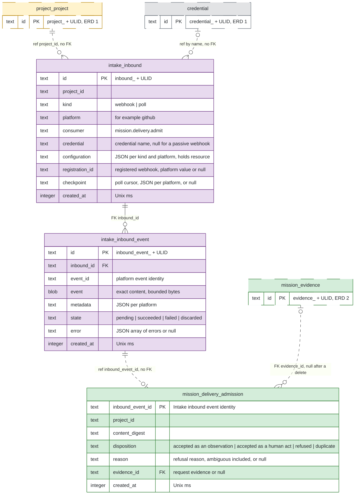

# ERD 3: External acquisition and observation

## Scope

This view holds the tables that receive the events of an external platform and turn them into end states of request evidence.
After this group, a human creates an inbound for a remote resource of a platform.
The Intake Service acquires events through a webhook or a poll, and hands each event to the delivery admission of the Mission Service.
Delivery admission calls the check of the Intake Service and sets the end state of the request evidence, so a node in `External.Requested` reaches its end state.

The [README](README.md) holds the conventions, the colors and the map of every group.

## Capability limits

- The ruled acquisition machinery supports the GitHub platform only. Slack, Telegram and Jira wait for their platform entries and credential types in [HANDOFF](https://github.com/kanthorlabs/kanthord/blob/main/docs/brainstorm/HANDOFF.md#project-service).
- The schema of `configuration` per kind and platform beyond `resource` is open in the [Intake CLI](https://github.com/kanthorlabs/kanthord-engine/blob/main/docs/cli/intake.md).
- Acceptance as a human act needs a linked human identity. The mapping from a platform account to a human identity is open.
- A request for new WHAT receives no acceptance. The inbound request contract is POSTPONED in HANDOFF.
- The Intake Service is extractable in principle: it declares one collaboration with custody, and no foreign key crosses its boundary. It still runs in the server process and in `kanthord.db`. Its peers reach it through `service`-policy operations, which the direct adapter alone serves, and the cross-process identity contract is POSTPONED.

## Records without a table

- The material of a credential release stays in memory for one call. No store holds it.
- The set of inbound events whose handoff runs stays in the memory of the dispatcher.
- An error of an inbound after its insert is a span of the Tracking Service.
- No store holds a resource healthcheck result.

## Diagram

## Tables

| Table | Owner | Basis |
| --- | --- | --- |
| `intake_inbound` | Intake Service | Ruled: [inbounds](https://github.com/kanthorlabs/kanthord/blob/main/docs/brainstorm/intake-service.md#inbounds) and [the inbound store](https://github.com/kanthorlabs/kanthord/blob/main/docs/brainstorm/intake-service.impl.md#the-inbound-store). |
| `intake_inbound_event` | Intake Service | Ruled: [inbound events](https://github.com/kanthorlabs/kanthord/blob/main/docs/brainstorm/intake-service.md#inbound-events), [handoff](https://github.com/kanthorlabs/kanthord/blob/main/docs/brainstorm/intake-service.md#handoff) and [the handoff](https://github.com/kanthorlabs/kanthord/blob/main/docs/brainstorm/intake-service.impl.md#the-handoff). |
| `mission_delivery_admission` | Mission Service | Derived: admission records its decision durably before it answers, keyed by the inbound event identity, under [the request record](https://github.com/kanthorlabs/kanthord/blob/main/docs/brainstorm/mission-service.impl.md#the-request-record). |

The verification secret of a webhook inbound derives from `masterKey` and the inbound identity, so no table holds a webhook secret.

## Constraints

The owning service enforces every rule below in the transaction of its write.
A remote effect never commits with a SQLite transaction. A row that records a remote effect follows that effect.

### Intake Service

- `intake_inbound.project_id` names a project of ERD 1.
- No column of an inbound changes after its insert, except `checkpoint`, which a poll writes. A change of the configuration is a new inbound.
- `intake_inbound` holds no unique index other than its key, because a duplicate inbound serves a rotation.
- `kind` and `consumer` hold values of closed sets in code. The Intake Service validates `configuration` per `(kind, platform)` in code, and the platform implementation validates `checkpoint`. Every property name inside a JSON column is snake_case.
- `credential` holds a credential name. A webhook with a null `credential` is a passive webhook. A poll names a credential. The insert transaction checks that the name exists and that its platform suits the inbound. A credential removal calls `inboundsNaming` in its own transaction and is refused while an inbound names the credential.
- The create of a registered webhook registers at the platform before the insert, and `registration_id` holds the answer of the platform. A passive webhook and a poll hold a null `registration_id`.
- The create of a poll performs one request with the credential before the insert.
- A poll advances `checkpoint` in the transaction that stores every event of the batch. A batch whose inbound no longer exists is discarded.
- No row holds credential material or a webhook secret.
- A delete of an inbound is refused while the inbound holds a pending event. A registered webhook deregisters at the platform before the delete. One transaction deletes the events of the inbound and the row.
- `intake_inbound_event` has a unique index on `(inbound_id, event_id)`, so a redelivery inside one inbound creates no second row.
- A webhook event is verified before it is stored, and it is stored before its acknowledgement. An event that fails verification is stored nowhere.
- A stored row keeps `event` and `metadata` unchanged, so every handoff of the event carries the same identity and the same content.
- `state` starts as `pending`. The one handoff sets `succeeded` on an answer of the consumer, and `failed` on a declared failure or an indeterminate result. A human retry sets `pending` on a `failed` event. A human discard sets `discarded` on a `pending` or a `failed` event, and it is refused while the handoff of that event runs. `discarded` is terminal. Every write of `state` is conditional on its expected state.
- `error` is null until the first failure. Each failure appends `{ code, message, created_at }`. The array has a bound in bytes, and its value is open. An append beyond the bound drops the oldest items.
- No process deletes an event by itself. A human delete names a state with a range of `id`, or a list of exact identities. It removes `succeeded`, `failed` and `discarded` events, and it never removes a `pending` event.
- The count of pending events has a bound, and its value is open.

### Mission Service

- Admission inserts its `mission_delivery_admission` row before it answers.
- `project_id` is the project of the inbound of the event. `content_digest` is the digest of the content of the event and of its metadata.
- A repeat with the same `inbound_event_id` and the same `content_digest` returns the recorded disposition. A repeat with another digest is refused.
- A refusal is terminal and holds its `reason`. A refusal and a duplicate admit no effect.
- `evidence_id` names a request evidence of an open attempt of the project that holds no end state. Admission finds it by the canonical JSON of its `platform` asset, never by the newest attempt alone, and more than one match refuses the event with the reason `ambiguous`.
- `evidence_id` is null when admission refuses the event before it resolves a request, and a forced delete of the evidence sets it to null.
- Admission calls the check of the Intake Service before its transaction. The transaction writes the admission row, `end_state` of the request and the landed-commit evidence together. A failed check answers a retryable failure and writes no row.
- The Mission Service deduplicates effects per project and per request evidence across inbounds, redeliveries and checks. The deduplication key of an unchanged state is the open item C3 of [HANDOFF](https://github.com/kanthorlabs/kanthord/blob/main/docs/brainstorm/HANDOFF.md#mission-service-1), so this page states no index for it.
- An acceptance as a human act invokes the Mission operation under the linked human identity before the admission row commits.
- A human check writes no admission row.

## Cross-group references

| From | To | Kind |
| --- | --- | --- |
| `intake_inbound.project_id` | `project_project.id` | Reference, no FK. |
| `intake_inbound.credential` | `credential.name` | Reference by name, no FK. |
| `mission_delivery_admission.inbound_event_id` | `intake_inbound_event.id` | Reference, no FK. |
