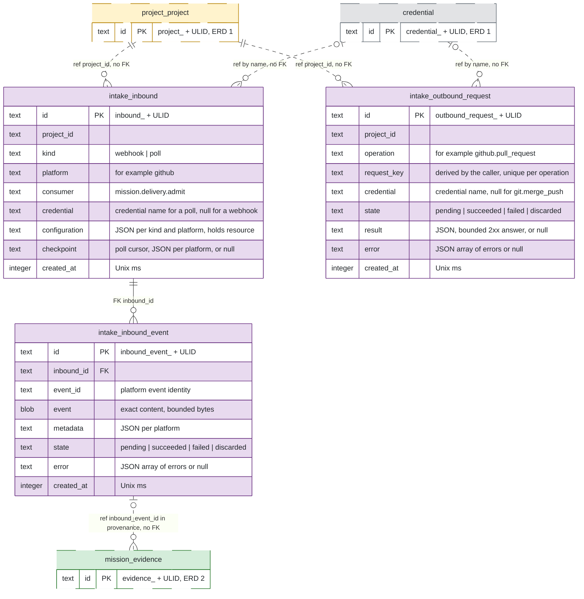

# ERD 3: External integration

## Scope

This view holds the tables that receive the events of an external platform and turn them into end states of request evidence.
After this group, a human creates an inbound for a remote resource of a platform.
The Intake Service acquires events through a webhook or a poll, and hands each event to the delivery admission of the Mission Service.
Delivery admission calls the check of the Intake Service and sets the end state of the request evidence, so a node in `External.Requested` reaches its end state.
The view also holds the outbound requests: the Intake Service records each outbound write before it performs it, for example the pull request of a configured action.

The [README](README.md) holds the conventions, the colors and the map of every group.

## Capability limits

- The ruled acquisition machinery supports the GitHub platform only. Slack, Telegram and Jira wait for their platform entries and credential types in [HANDOFF](https://github.com/kanthorlabs/kanthord/blob/main/docs/brainstorm/HANDOFF.md#project-service).
- The schema of `configuration` per kind and platform beyond `resource` is open in the [Intake CLI](https://github.com/kanthorlabs/kanthord-engine/blob/main/docs/cli/intake.md).
- Acceptance as a human act needs a linked human identity. The mapping from a platform account to a human identity is open.
- A request for new WHAT receives no acceptance. The inbound request contract is POSTPONED in HANDOFF.
- The outbound operations are `github.pull_request`, `git.merge_push` and `s3.delete_object`. A native push send and a CLI write wait for their designs.
- The Intake Service is extractable in principle: it declares one collaboration with custody, and no foreign key crosses its boundary. It still runs in the server process and in `kanthord.db`. Its peers reach it through the `client`, `human` and `service` operations that [intake-service.impl.md](https://github.com/kanthorlabs/kanthord/blob/main/docs/brainstorm/intake-service.impl.md#outbound-operations-and-checks) declares. Only the direct adapter serves a `service` operation, and the cross-process identity contract is POSTPONED.

## Records without a table

- The material of a credential release stays in memory for one call. No store holds it.
- The set of inbound events whose handoff runs stays in the memory of the dispatcher.
- The set of outbound requests whose call runs stays in the memory of the Intake Service.
- A read, a check, a presign and an inbound control call write no row.
- An error of an inbound after its insert is a span of the Tracking Service.
- The disposition of delivery admission and its refusal reason are a span of the Tracking Service. No table records an admission.
- No store holds a resource healthcheck result.

## Diagram

## Tables

| Table | Owner | Basis |
| --- | --- | --- |
| `intake_inbound` | Intake Service | Ruled: [inbounds](https://github.com/kanthorlabs/kanthord/blob/main/docs/brainstorm/intake-service.md#inbounds) and [the inbound store](https://github.com/kanthorlabs/kanthord/blob/main/docs/brainstorm/intake-service.impl.md#the-inbound-store). |
| `intake_inbound_event` | Intake Service | Ruled: [inbound events](https://github.com/kanthorlabs/kanthord/blob/main/docs/brainstorm/intake-service.md#inbound-events), [handoff](https://github.com/kanthorlabs/kanthord/blob/main/docs/brainstorm/intake-service.md#handoff) and [the handoff](https://github.com/kanthorlabs/kanthord/blob/main/docs/brainstorm/intake-service.impl.md#the-handoff). |
| `intake_outbound_request` | Intake Service | Ruled: [outbound requests](https://github.com/kanthorlabs/kanthord/blob/main/docs/brainstorm/intake-service.md#outbound-requests) and [the outbound record](https://github.com/kanthorlabs/kanthord/blob/main/docs/brainstorm/intake-service.impl.md#the-outbound-record). |

The verification secret of a webhook inbound derives from `masterKey` and the inbound identity, so no table holds a webhook secret.

## Constraints

The owning service enforces every rule below in the transaction of its write.
A remote effect never commits with a SQLite transaction. An outbound request commits as `pending` before its call. `succeeded` commits only after a 2xx answer, a CLI exit code 0 or a read-back match.

### Intake Service

- `intake_inbound.project_id` names a project of ERD 1.
- No column of an inbound changes after its insert, except `checkpoint`, which a poll writes. A change of the configuration is a new inbound.
- `intake_inbound` holds no unique index other than its key, because a duplicate inbound serves a rotation.
- `kind` and `consumer` hold values of closed sets in code. The Intake Service validates `configuration` per `(kind, platform)` in code, and the platform implementation validates `checkpoint`. Every property name inside a JSON column is snake_case.
- `credential` holds a credential name. A poll names a credential, and a webhook holds a null `credential`. The insert transaction checks that the name exists and that its platform suits the inbound. A credential archive calls `inboundsNaming` in its own transaction and is refused while an inbound names the credential.
- kanthord registers no webhook at a platform. A human sets the address and the secret of a webhook inbound at the platform.
- The create of a poll performs one request with the credential before the insert.
- A poll advances `checkpoint` in the transaction that stores every event of the batch. A batch whose inbound no longer exists is discarded.
- No row holds credential material or a webhook secret.
- A delete of an inbound is refused while the inbound holds a pending event. A delete calls no platform. One transaction deletes the events of the inbound and the row.
- `intake_inbound_event` has a unique index on `(inbound_id, event_id)`, so a redelivery inside one inbound creates no second row.
- A webhook event is verified before it is stored, and it is stored before its acknowledgement. An event that fails verification is stored nowhere. A verified handshake stores no row.
- A stored row keeps `event` and `metadata` unchanged, so every handoff of the event carries the same identity and the same content.
- `state` starts as `pending`. The one handoff sets `succeeded` on an answer of the consumer, and `failed` on a declared failure or an indeterminate result. A human retry sets `pending` on a `failed` event. A human discard sets `discarded` on a `pending` or a `failed` event, and it is refused while the handoff of that event runs. `discarded` is terminal. Every write of `state` is conditional on its expected state.
- `error` is null until the first failure. Each failure appends `{ code, message, created_at }`. The array has a bound in bytes, and its value is open. An append beyond the bound drops the oldest items.
- No process deletes an event by itself. A human delete names a state with a range of `id`, or a list of exact identities. It removes `succeeded`, `failed` and `discarded` events, and it never removes a `pending` event.
- The count of pending events has a bound, and its value is open.
- `intake_outbound_request.project_id` names the project of the binding that the caller resolved.
- `operation` holds a value of the closed set of outbound operations in code, named `<platform>.<operation>`.
- `credential` holds the name of the credential that custody released for the write. `git.merge_push` holds null, because it uses the SSH configuration of the host.
- `intake_outbound_request` has a unique index on `(operation, request_key)`, so a repeat of a key finds the first request and calls the write no second time. The caller derives `request_key` from its durable intent, and the key holds every operand that can change under that intent.
- The Intake Service authorizes the write and obtains its release before the insert. A refusal inserts no row.
- `state` starts as `pending`, and the insert commits before the call. The call sets `succeeded` on a 2xx answer or a CLI exit code 0, and `failed` on every other result, with a write conditional on `pending`.
- A read-back sets `succeeded` on `pending` or `failed`, and it runs only inside a repeat of the caller. A read-back that finds nothing changes no row.
- A human discard sets `discarded` on a `pending` request whose call does not run. `succeeded` and `discarded` are terminal.
- `result` holds the bounded body of the 2xx answer. `error` follows the rules of `error` of an inbound event.
- No row holds credential material, the operands of the write or a digest of the operands. A credential archive is not refused by an outbound request that names it.
- No process deletes an outbound request. A human delete names a state with a range of `id`, or a list of exact identities, and requires force. It removes `succeeded`, `failed` and `discarded` requests, and it never removes a `pending` request.

### Mission Service

- Delivery admission writes `end_state` of a request evidence and the landed-commit evidence of ERD 2. The same transaction writes the node transition and the attempt closure that the end state rules in the [state transitions](https://github.com/kanthorlabs/kanthord/blob/main/docs/brainstorm/mission-service.md#state-transitions).
- Admission resolves the project from the inbound of the event. It finds the request evidence among the requests of an open attempt of the project that hold no end state, by the canonical JSON of its `platform` asset, never by the newest attempt alone. More than one match refuses the event with the reason `ambiguous`.
- Admission is idempotent through the write-once `end_state`. A repeat that finds the end state of its request set answers `duplicate` and writes nothing.
- Admission calls the check of the Intake Service before its transaction. The transaction writes `end_state` of the request and the landed-commit evidence together. A failed check answers a retryable failure and writes nothing.
- A landed-commit evidence that admission writes holds `inbound_event_id` in its `provenance`. A human check writes the provenance without it.
- A refusal and a `none` result write nothing.
- The Mission Service deduplicates effects per project and per request evidence across inbounds, redeliveries and checks. The deduplication key of an unchanged state is the open item C3 of [HANDOFF](https://github.com/kanthorlabs/kanthord/blob/main/docs/brainstorm/HANDOFF.md#mission-service-1), so this page states no index for it.
- An acceptance as a human act invokes the Mission operation under the linked human identity.

## Cross-group references

| From | To | Kind |
| --- | --- | --- |
| `intake_inbound.project_id` | `project_project.id` | Reference, no FK. |
| `intake_inbound.credential` | `credential.name` | Reference by name, no FK. |
| `intake_outbound_request.project_id` | `project_project.id` | Reference, no FK. |
| `intake_outbound_request.credential` | `credential.name` | Reference by name, no FK. |
| `mission_evidence.provenance.inbound_event_id` | `intake_inbound_event.id` | Reference in JSON, no FK. |
