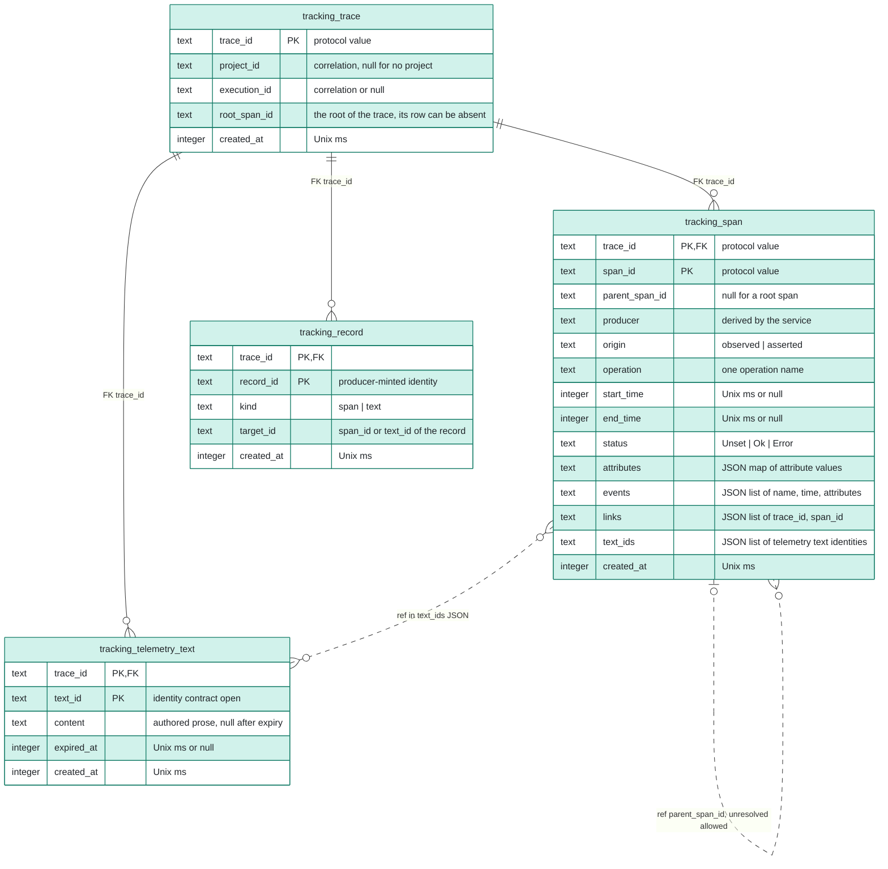

# ERD 4: Telemetry

## Scope

This view holds the tables of the Tracking Service.
They live in `tracking.db`, a database file separate from `kanthord.db`.
After this group, the server keeps the spans and the telemetry texts that reach it, and a human reads a trace and imports the capture of an external harness. Telemetry is lossy, so the store holds no complete trace by promise.

The [README](README.md) holds the conventions, the colors and the map of every group.

## Capability limits

- The first phase of the Tracking Service ships a no-op implementation of its interface. Every other service plugs that interface in from ERD 1 onwards, so a trace identity and a root span identity exist in `scheduler_execution` before this group.
- The no-op phase creates no `tracking.db`, runs no migration and validates no history. The file and its own `migration(service, version, applied_at)` table appear with the working tracer. The [README](README.md#stores) defines that table. In `tracking.db` it holds the history of the Tracking Service alone.
- No service reads telemetry to make a decision, and no outcome depends on a row of this group.
- A foreign key cannot reach `kanthord.db`. Every project, execution and node value of this group is a correlation value.

## Records without a table

- The local store of an external harness is an append-only log on the host of the harness, not a kanthord record. Only an ingested record is a kanthord record.
- The Tracking Service holds no state of the progress of an ingestion between two ingestions.
- The count of a drop and of a refusal is itself telemetry. Its representation is open in [HANDOFF](../../brainstorm/HANDOFF.md#tracking-service).

## Diagram

## Tables

| Table | Owner | Basis |
| --- | --- | --- |
| `tracking_trace` | Tracking Service | Derived: a trace belongs to exactly one project or to no project, it is the unit of deletion, and an ingestion resolves the project through the records of the Tracking Service, under [the trace and the project](../../brainstorm/tracking-service.md#the-trace-and-the-project) and [ingestion](../../brainstorm/tracking-service.md#ingestion). |
| `tracking_span` | Tracking Service | Ruled: [primary store](../../brainstorm/tracking-service.impl.md#primary-store) holds the span. The columns are derived from [the trace model](../../brainstorm/tracking-service.md#the-trace-model) and the span record of the [Tracking CLI](../../../engine/docs/cli/tracking.md#span-record-fields-kind-span). |
| `tracking_record` | Tracking Service | Derived: the Tracking Service deduplicates by the record identity that its producer mints, within the retention of the trace. The identity contract is open in HANDOFF. |
| `tracking_telemetry_text` | Tracking Service | Ruled: [primary store](../../brainstorm/tracking-service.impl.md#primary-store) holds the telemetry text; [expiry](../../brainstorm/tracking-service.impl.md#expiry) keeps its identity. The columns are derived, and the identity contract of a text is open in HANDOFF. |

## Constraints

The rules below have two kinds. A structural check is a rule that the Tracking Service enforces at the admission of a record. A producer obligation is a rule that the producer of a record follows, and the Tracking Service does not verify it. The Tracking Service refuses no record for its content.

### Admission and durability

- One transaction inserts the `tracking_record` row of a record and applies its contribution to its span or its telemetry text. The acknowledgement answers `Stored` only after that commit.
- `tracking_record` holds one row for each stored record identity of a trace. A repeat of that identity is `Stored` and changes nothing. A refused record and a dropped record leave no row.
- `target_id` of a record names a span or a telemetry text of the same trace.
- The records of one execution have a bound. A new record beyond that bound is `Refused` and writes neither its `tracking_record` row nor its contribution. A repeat of a stored record stays `Stored` and adds no row. The value of the bound is open.
- A bulk import and the retention sweep run in bounded transactions.

### Traces

- A trace belongs to exactly one project or to no project. A server operation that concerns several projects opens one root span, and so one trace, for each project, and the root spans link to each other.
- The first stored server record of a trace creates its `tracking_trace` row. For an execution, the Scheduler Service opens the root span after the claim records the execution, and `trace_id`, `root_span_id`, `project_id` and `execution_id` equal the values of the execution record. An imported record never creates a trace row.
- A trace has exactly one root span, and `root_span_id` names it. A lost write of the root span leaves no root row. The trace then stays readable through its other spans, and a reader meets an unresolved parent. The representation of a missing root is open.
- An ingestion carries no project. It names an existing trace, and it assigns no trace and reassigns no trace. The Tracking Service resolves the project from `tracking_trace`.
- An imported record names an execution and a trace that agree with `tracking_trace`. A record that names another trace is refused.
- A record that arrives after its trace expires is refused.

### Spans

- `start_time` or `end_time` is not null. A start with no end is an unfinished span. An end with no start creates the span with no start time.
- The Tracking Service persists a start when it arrives and an end when it arrives, so a reader reads a span that holds a start and no end. The root span of an execution is persisted when the server opens it.
- The first record that creates a span binds it to its producer. A record that names that span from another producer is refused.
- No record replaces a value that an earlier record set. A second end of one span is refused.
- A record that names its own span identity as its parent is refused. The Tracking Service verifies no further ancestry. A span of an execution names the root span of that execution or a span that descends from it, and that rule is a producer obligation.
- An unresolved parent is a fact that a reader sees, and never an error. A record can arrive before its parent.
- `producer` is derived by the Tracking Service and never read from a record. The producer of an imported record is the claimant of the execution that the trace resolves to. A human who issues an ingestion produces no record.
- `origin` distinguishes a span that the server observed from a span that an external harness asserted.
- `attributes` maps a name to a value of one kind: a string, a boolean, an integer, a floating-point number or an array of one primitive kind. An event holds attributes of the same kinds.
- A span carries the identity of every kanthord object that its operation concerns, as an identity attribute with the `kanthord.` prefix. One object has one attribute name in every span. An identity attribute holds an identity and never the content that it names. That rule is a producer obligation, and the registry of the attribute names is open.
- A span attribute holds no authored prose. That rule is a producer obligation.
- The record of the prompt composer of the Worker Service is a set of span attributes: the selected source of each prompt layer, the digest of its text, and every source that the composer read and rejected. It follows the retention and the access of a span. The text of a prompt reaches telemetry only through an agent transcript.
- A span of `links` names a span of another trace. A link names no project.
- `text_ids` names telemetry texts of the same trace.

### Telemetry texts

- A telemetry text belongs to exactly one trace. A span references it by identity and never embeds it.
- An agent transcript is a telemetry text.
- An expiry of a telemetry text sets `content` to null and `expired_at`, and the row stays, so a reference resolves to expired and never to missing. An unknown identity resolves to unknown.

### Retention and deletion

- The retention of a telemetry text is never longer than the retention of a span. The operator configures both once for the server, never per project. The values and the start of the retention of a text are open.
- The trace is the unit of deletion. The deletion of a trace deletes its spans, its records and its telemetry texts. The deletion of a span deletes no telemetry text.
- A deletion of a telemetry row changes no outcome, removes no evidence and changes no state of a node.
- Telemetry is the one exception to the rule that an owner deletes no record that a peer can reference, as [architecture.impl.md](../../brainstorm/architecture.impl.md#the-operation-and-its-two-entry-adapters) rules. `scheduler_execution.trace_id` and `root_span_id` keep their values after the deletion of their trace, and they resolve to expired.

## Cross-store references

| From | To | Kind |
| --- | --- | --- |
| `tracking_trace.project_id` | `project_project.id` in `kanthord.db` | Correlation value, no FK. |
| `tracking_trace.execution_id` | `scheduler_execution.id` in `kanthord.db` | Correlation value, no FK. |
| `scheduler_execution.trace_id`, `root_span_id` in `kanthord.db` | `tracking_trace.trace_id`, `tracking_span.span_id` | Correlation value, no FK. |
