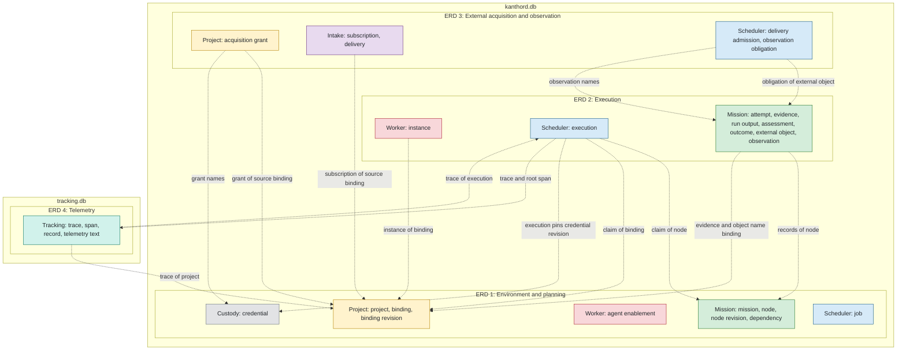

# Database schema

## Status

These pages are a design of the KanthorD database, not a description of implemented behavior.
They follow the rulings of the [design set](https://github.com/kanthorlabs/kanthord/blob/main/docs/brainstorm/README.md) as of 2026-09-26.
An open item of [HANDOFF](https://github.com/kanthorlabs/kanthord/blob/main/docs/brainstorm/HANDOFF.md) stays out of the schema. A later ruling changes the schema through a migration.

## Views

The schema has four functional views. Their order is the order of delivery.

| View | Scope | Tables of the owners |
| --- | --- | --- |
| [ERD 1: Environment and planning](01-setup.md) | Projects, credentials, bindings, agent enablement, the mission plan and the work queue. | Custody, Project, Worker, Mission, Scheduler |
| [ERD 2: Execution](02-execution.md) | Instances, executions, attempts, evidence, assessments, outcomes, external objects and observations. | Worker, Scheduler, Mission |
| [ERD 3: External acquisition and observation](03-integration.md) | Acquisition grants, subscriptions, deliveries, delivery admission and observation obligations. | Project, Intake, Scheduler |
| [ERD 4: Telemetry](04-tracking.md) | Traces, spans, records and telemetry texts. | Tracking |

A view holds the canonical definition of each of its tables.
Another view shows that table as a stub: its key only, the color of its owner and a dashed border.

## Map

The map shows the owners of each view and the references that cross two views.
A box is the set of tables of one owner in one view.

## Dependencies between views

| View | Needs | Adds |
| --- | --- | --- |
| ERD 1 | Nothing. | An environment and a plan. The work queue is here because the Mission Service writes it in its own transaction, and no later migration of the Scheduler Service can read Mission rows. Agent enablement is here because a native worker binding write validates it. |
| ERD 2 | ERD 1. | Execution and the human controls. A requested external action of an attempt stays unresolved until ERD 3, because only the observer writes an observation. The node cannot reach a terminal state through that attempt. A human can still pause the node, block it and unblock it into a next attempt. A frozen action that the attempt has not requested prevents no terminal transition. |
| ERD 3 | ERD 1 and ERD 2. | The source binding and its subscriptions, deliveries, and the observer. A node in `External.Requested` reaches its end state. Only GitHub is ruled. |
| ERD 4 | Nothing in its store. Every service calls the no-op interface of the Tracking Service from ERD 1. | The stored telemetry. |

## Stores

- `kanthord.db` of the data directory holds every table of ERD 1, ERD 2 and ERD 3. The Gateway, Project, Mission, Scheduler, Worker and Intake Services and custody share that file, and one file gives a collaboration of two services one transaction.
- `tracking.db` of the data directory holds every table of ERD 4. It appears with the working tracer.
- Each file holds its own `migration(service, version, applied_at)` table, keyed by service and version. It is the only table without the prefix of a service beside the `credential` table of custody.
- Custody owns the unprefixed `credential` table.

## Owners without a table

- The Gateway Service holds idempotency records in memory. It stores no human account, no password and no client identity.
- The Repository component is stateless transport.
- The worker catalog is a static server module.
- The `worker` application and an external harness hold no table of the server. A `worker` application runs on the host of the server or on another host.

## Conventions

- A table name carries the prefix of its owning service. A service reads no table of another service.
- A foreign key never reaches a table of another owner. A cross-owner reference is a validated value.
- An opaque identity that the server generates for an entity of its own is text of the form `<prefix>_<ulid>`. A protocol value keeps its protocol form. A natural key, for example `agent_name`, and a composite key take no prefix.
- A timestamp is an `INTEGER` of Unix milliseconds in UTC.
- A JSON column holds the canonical JSON of [RFC 8785](https://www.rfc-editor.org/rfc/rfc8785).
- A boolean is an `INTEGER` 0 or 1.
- A revision and a version start at 1. The attempt of a node reads 0 before its first attempt opens, and no attempt row exists for 0. An opened attempt starts at 1.
- An owner deletes no row that a peer can reference. It retires or disables that row. Telemetry is the one exception: the Tracking Service deletes a trace at its retention, and a peer value that names it resolves to expired.

## Diagram notation

- A solid line is an identifying relationship: the primary key of the child contains the primary key of the parent. A dashed line is a non-identifying relationship.
- The label of a line states the enforcement: `FK`, `ref, no FK`, `ref in JSON` or `validated`.
- The basis of each table is `Ruled` when a design page names the table, or `Derived` when the view maps a ruled record to rows. The basis column of a view states when the columns of a ruled table are derived.
- A stub has a dashed border and the color of its owner.

| Owner | Color |
| --- | --- |
| Custody | grey |
| Project Service | yellow |
| Worker Service | red |
| Mission Service | green |
| Scheduler Service | blue |
| Intake Service | purple |
| Tracking Service | teal |

The ER diagrams color their tables with `classDef`. [viewer.html](../../viewer.html) loads Mermaid 11.17.2, which supports this notation.
