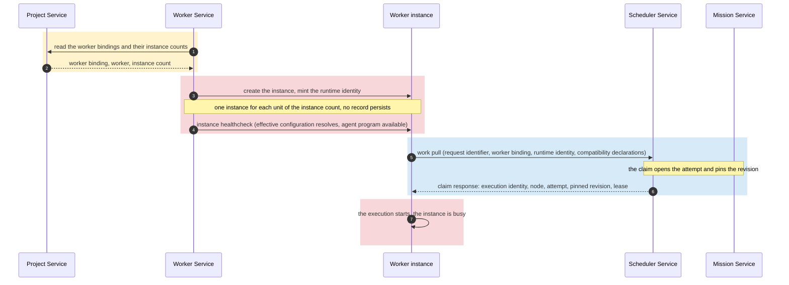
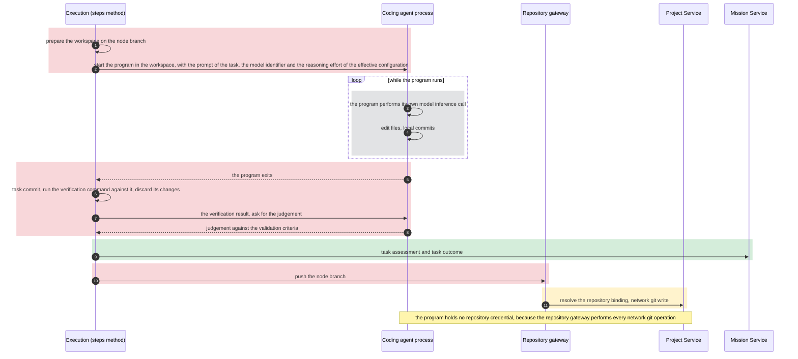
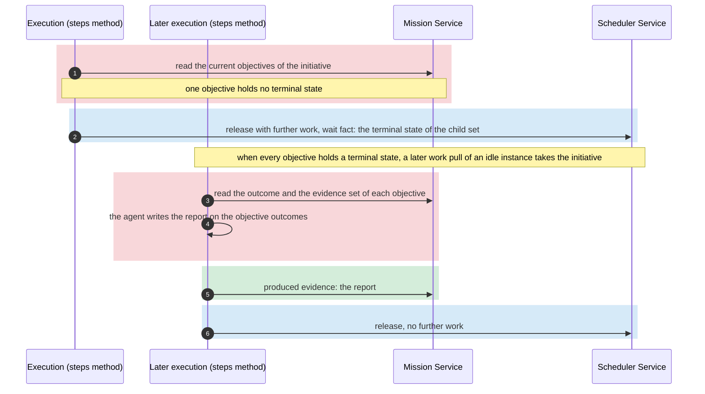
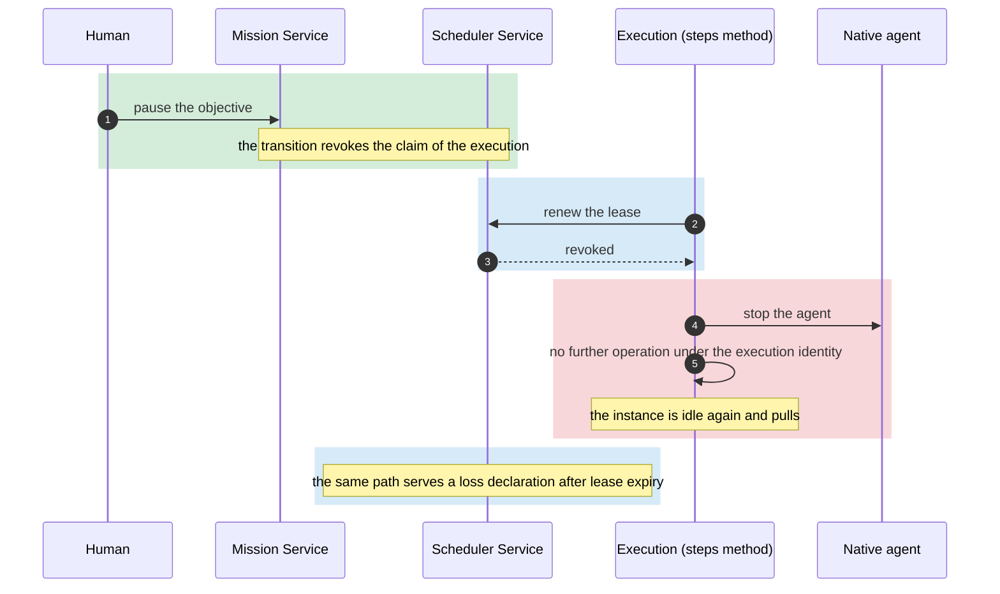
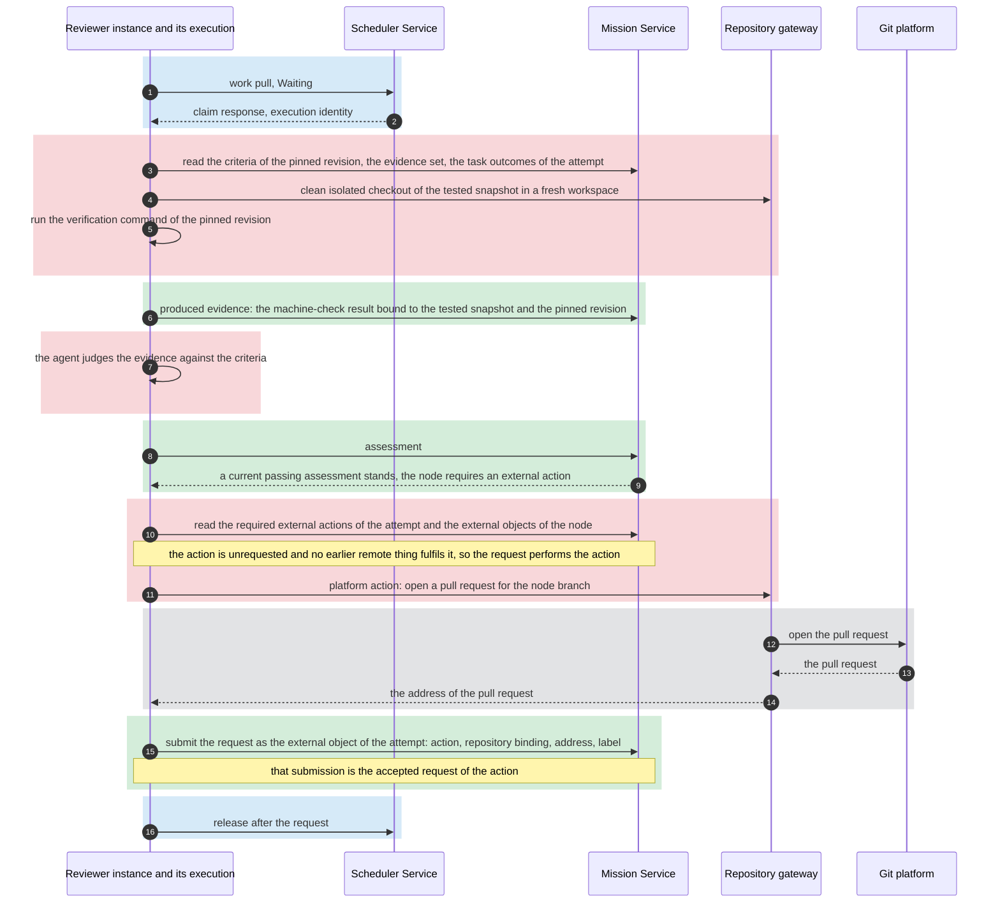
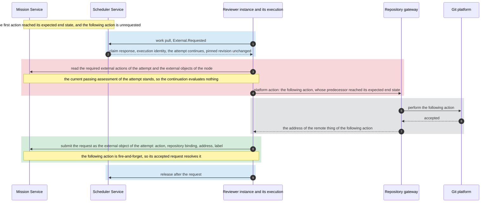
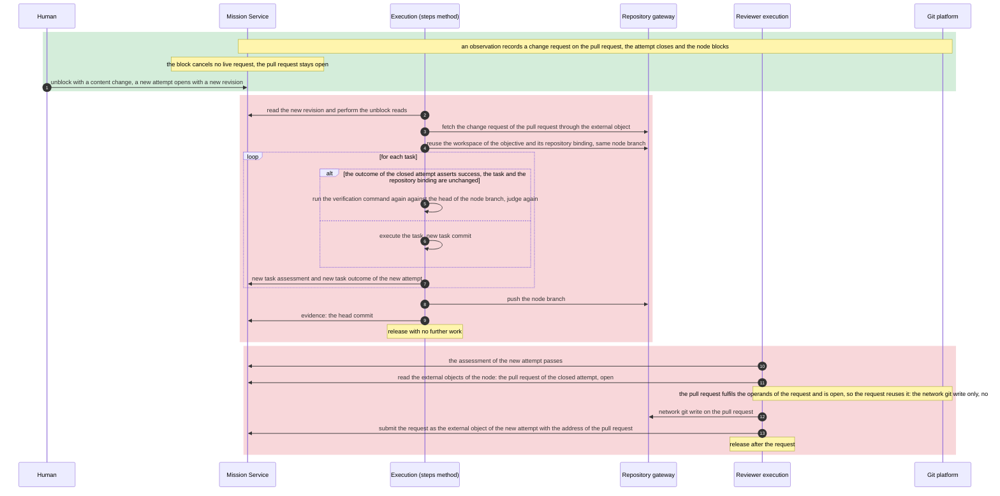

# Worker Service

## Scope

This document describes the Worker Service.
It describes the workers and their agents, the worker instances and how they host an execution, the lifecycle of an execution, the performance of a required external action and the owner of memory.
For a required external action, it describes the configured repository action only.
It describes no mechanism of another service.

## Workers and templates

The [overview](overview.md#vocabulary) defines a worker, a worker instance, an execution, an agent, a tool, memory and a prompt.
The Worker Service supplies the workers.
A worker declares its name, its method, its one agent, the default configuration of that agent, the node states that its instances claim and its required node format.
The [Scheduler Service](scheduler-service.md#claims-roles-and-counts) reads the role of a binding from the declared node states.
The default configuration of a native agent names its provider, its model identifier and its reasoning effort.
The default configuration of a coding agent names its model identifier and its reasoning effort.
A worker declares, with the default configuration of its agent, the further options of the agent, the options that a project can override and the constraint that a whole configuration satisfies, and that declaration is part of the contract of the worker name.
A worker binding of the [Project Service](project-service.md#execution-configuration-and-instance-count) overrides the default configuration through its entry, and the Project Service resolves the effective configuration of the agent.
A worker reads no other project configuration.
The required node format names the fields of a node that the method requires.
Compatibility reads the node revision that the [work-pull rules](scheduler-service.md#work-pulls-and-targeted-claims) of the Scheduler Service select.
Every worker of this page requires the same node format.

A method is the worker's own.
Two methods exist: the steps method and the evaluation method.
The steps method declares `Available`.
The evaluation method declares `Waiting` and `External.Requested`.

An agent has one of two kinds.
A native agent is an agent loop that the Worker Service runs itself.
A coding agent is a program that the Worker Service runs as a child process in the workspace of the execution.
The coding agent of a worker is the same program that an external harness runs.
The Worker Service hosts it as the WHO of an execution, under a worker binding, a work pull and an execution identity.
An external harness runs no worker of this page, and kanthord configures no agent of an external harness.

A worker fixes the prompt of its agent.
The prompt renders from the node revision that the attempt pins.
A project sets no prompt.

The Worker Service supplies two gateways as the tools that perform an authenticated operation.
The model gateway performs a model inference call.
The repository gateway performs a network git read, a network git write and a platform action.
An execution and its agent reach a git platform through the repository gateway alone.
A native agent reaches a provider through the model gateway alone.
A gateway resolves the binding of the operation through the [Project Service](project-service.md#configuration-lifecycle-and-consistency) for each operation, under the execution identity.
For every model inference call of a native agent the Worker Service uses the provider account, the model identifier and the reasoning effort of the effective configuration of the agent, which the Project Service resolves for that call.
An execution honours every value of the effective configuration of its agent.
A coding agent performs its own model inference call.
The Worker Service passes the model identifier and the reasoning effort of the effective configuration to the program when it starts.
The operator configures the provider authentication of a coding agent on the host.
The project controls no part of that authentication.
The kanthord extension of the coding agent verifies that configuration when the program starts.
A local git operation runs in the workspace and passes through no gateway.
An agent holds no repository credential.

## Instances and hosting

The Worker Service reads the worker bindings and their instance counts from the [Project Service](project-service.md#execution-configuration-and-instance-count).
It holds one instance for each unit of the instance count of a worker binding.
The instances of one binding form its pool.
An instance holds a runtime identity.
The Worker Service mints the runtime identity when it creates the instance.
The runtime identity is unique inside the daemon, and it names the worker binding of the instance.
The Worker Service vouches for that association on the [work pull](scheduler-service.md#work-pulls-and-targeted-claims).

An instance record is runtime-only.
The [Scheduler Service](scheduler-service.md#liveness) governs the execution record and the claim.
At daemon start, and when the availability or the instance count of a worker binding changes, the Worker Service adjusts the pool of that binding.
A configuration revision of the binding replaces no instance.
A daemon restart creates new instances with new runtime identities.
The Worker Service drains the excess instances of a lowered count under the [count-change rule](scheduler-service.md#claims-roles-and-counts) of the Scheduler Service: it retires idle instances first, and a busy instance ends its execution before it retires.

An instance hosts at most one execution at a time.
An instance holds at most one outstanding work pull or one execution.
It starts no work pull until its preceding pull returns no work or the execution of that pull ends.
No instance is pinned to a node.
Any idle instance of the binding takes the next compatible node.
An idle instance that receives no work retries under the [work-pull rules](scheduler-service.md#work-pulls-and-targeted-claims) of the Scheduler Service.

The Worker Service produces the instance healthcheck before each work pull.
The healthcheck passes when the effective configuration of the agent resolves under the current binding set and, for a coding agent, when its program is available on the host.
The instance carries the compatibility declarations of its worker: the worker name, the declared node states and the required node format.

The tool of an agent and the verification command of a node run code that the repository supplies.
The Worker Service runs them inside a trust boundary that the operator provides: a disposable host that the operator trusts, or a container around the daemon.
A rule on the content of a command is a policy and no trust boundary.

The sequence diagram below shows the creation of a steps instance and its first work pull, on a node with no attempt.
In every sequence diagram of this page, a colored block names the service that owns its steps: yellow the Project Service, blue the Scheduler Service, green the Mission Service, red the Worker Service, grey an external system.
A diagram shows the operations of the Worker Service and the responses that it receives, and no mechanism of another service.

## Executions

An execution performs the method of its worker under the live claim that its instance obtained.
The execution takes its execution identity, its node, its attempt and the pinned node revision from the [claim response](scheduler-service.md#work-pulls-and-targeted-claims) of the Scheduler Service.
Every operation of the execution presents its execution identity under the [liveness rules](scheduler-service.md#liveness) of the Scheduler Service.
The execution renews its lease at a fixed interval shorter than the lease expiry while it runs.
The renewal runs outside the agent, so a long model call renews the lease.
A revoked or lost execution stops its agent and performs no further operation under its execution identity.

An execution reads the [node revision](mission-service.md#mission-structure-and-nodes) that its attempt pins.
After an unblock, it performs the reads that the [unblock rules](mission-service.md#the-read) of the Mission Service require, and it fetches the external content that the external objects of the node reference through the repository gateway.

A workspace is a host-local working directory of one execution.
The method of the execution determines whether the workspace holds a repository checkout, and which snapshot.
The workspace of the steps method on an objective is a checkout of the repository that the pinned revision names, on the node branch.
The Worker Service keys that workspace by the objective and the repository binding of the pinned revision.
An execution reuses that workspace when the host holds one, and it creates one through a network git read otherwise.
Before the reuse, the execution confirms that no earlier execution still acts in that workspace, and it brings the checkout to the head of the node branch at the repository through the repository gateway.
The Worker Service removes it after a bounded retention since the last execution of that objective ended.
The workspace of the evaluation method is fresh, and the Worker Service removes it at the release.
The workspace of the steps method on an initiative holds no checkout.

The rules of the four paragraphs below hold for the steps method on an objective.
The steps method uses one node branch for each objective and repository binding, and it continues that branch across attempts.
The node branch takes its name from the node identity.
The first execution on that branch creates it from the base branch that the [repository strategy](project-service.md#repository-configuration-and-policy) names.
The execution never rewrites a commit that it pushed or that a record of the Mission Service names.
Every commit that the execution makes is attributable to its task and its attempt.
The execution pushes the node branch through the repository gateway before every release.

The steps method chooses the order of the tasks of the pinned revision.
For each task the agent performs the steps in the workspace, and the execution commits the changes of the task work.
The task commit is the head of the node branch after the last commit of the task work in the attempt that executed the task.
The execution runs the verification command of the task against the task commit when the task carries one, and it discards every change that the command made.
The agent revises the work within the resource budget of the execution before the execution records the task assessment.
The execution commits a revision as a new commit.
The agent judges the result against the validation criteria of the task, with the exit status of the verification command as an input.
The execution writes the task assessment and the task outcome.
The task assessment names the task commit and, when the task carries a verification command, the snapshot that the command ran against.
The task outcome carries the task commit as its evidence.
A worker fixes the resource budget of one execution: a turn count and a wall time.

In an attempt after the first, the execution reads the outcome of the cleared attempt for each task.
When that outcome asserts success, the task is unchanged between the revision that the cleared attempt pinned and the revision of the attempt, and the repository binding is unchanged, the execution runs the verification command again against the head of the node branch when the task carries one, judges again, and writes a new task assessment and a new task outcome.
It executes every other task.
Inside one attempt, a task that holds a current task outcome of the attempt is complete, and the execution skips it.

Before every release with no further work, the execution submits the head commit of the node branch as the evidence of the objective, whatever the task results establish.
When every task of the revision holds a current task outcome of the attempt, the execution releases with no further work.
A recorded task assessment that does not pass ends the task work, and the execution releases with no further work.
When the resource budget ends before every task holds a task outcome, the execution releases with further work.
Before that release, the execution commits the task work in progress as a checkpoint commit.
A checkpoint commit establishes no completion and no verification result, and the next execution continues the task.
The [Mission Service](mission-service.md#state-transitions) routes each release.

The sequence diagram below shows the steps method on an objective with a native agent, on the path where every task assessment passes.

The sequence diagram below shows the steps method with a coding agent, for one task.

For an initiative the steps method reads the current objectives of the initiative.
When one objective holds no terminal state, the execution releases with further work and names the terminal state of that child set as its wait fact.
When every objective holds a terminal state, the agent writes a report on the outcome of each objective, the execution submits that report as produced evidence and releases with no further work.

The sequence diagram below shows the steps method on an initiative.

The [overview](overview.md#kanthords-own-harness) owns the end conditions of an execution.
A human pause, a human discard and a success override reach the execution as a revocation.
An assessment that does not pass and a resource limit reach the Mission Service as a release.

The sequence diagram below shows a revocation and the loss of the lease.

## Evaluation and required external actions

The evaluation method follows the criterion and never the node, as the [overview](overview.md#what) states.
The reviewer execution reads the validation criteria of the pinned revision, the evidence set of the attempt and the current child outcomes.
The child outcomes of an objective are its task outcomes, and the child outcomes of an initiative are its objective outcomes.
When the evidence names a repository snapshot, the reviewer execution makes a clean isolated checkout of that snapshot in its workspace through the repository gateway.
It runs the verification command of the pinned revision when the revision carries one, whatever the node kind.
The command runs in the workspace of the reviewer execution: in the checkout when the evidence names a repository snapshot.
When the evidence names no repository snapshot, the reviewer execution places the produced evidence of the attempt in its workspace, and the command runs there.
The execution records the result of that machine check as produced evidence bound to the tested snapshot and the pinned revision, and the assessment names it in its evidence set.
The agent judges the evidence against the criteria.
The execution writes the [assessment](mission-service.md#evaluation-and-assessment) with the fields that the Mission Service defines.
The [Mission Service](mission-service.md#evaluation-and-assessment) owns the record and its currency.

A reviewer execution that claims from `Waiting` performs the evaluation.
A reviewer execution that claims from `External.Requested` performs no evaluation.
When the node requires no external action, the passing assessment ends the claim, and the reviewer execution performs nothing more.
Otherwise, on both paths, after a current passing assessment stands, the reviewer execution reads the required external actions of the attempt and the external objects of the node across every attempt.
A required action is eligible when it is unrequested in the attempt and it follows no other action.
A required action that follows another action is eligible when it is unrequested in the attempt and its predecessor reached its expected end state.
The reviewer execution requests each eligible action until no action is eligible.
A request of a repository action is a platform action or a network git write through the repository gateway.
A configured action takes its operands from the records of the attempt, the evidence snapshot and the external object, never from the worker.
The agent supplies no operand.

Before it performs a request, the reviewer execution reads the external objects of the node.
The request reuses the remote thing of an external object of an earlier attempt when three conditions hold.
The external object names the same external action and the same repository binding.
The remote thing fulfils the operands of the current request.
The remote thing is open: the platform still accepts on it the network git write that the action requires.
An end state of the earlier action does not close the remote thing by itself.
A reuse performs the network git write that the action requires and no platform write.
Otherwise the execution performs the action.
In both cases the execution submits the request to the Mission Service as the external object of the attempt, with the address that the repository gateway resolves.
That submission is the accepted request of the action.
The address correlates the external objects of one remote thing across attempts.

The reviewer execution releases after its requests.
When a required action of the attempt stays unrequested, the release names the observation that the action follows as its wait fact.
The [Scheduler Service](scheduler-service.md#claims-roles-and-counts) owns the wait record, and the [Mission Service](mission-service.md#continuation-condition) owns the continuation condition.

The sequence diagram below shows the evaluation and the configured repository action, on an objective that requires one action.

The sequence diagram below shows the continuation claim from `External.Requested`, on an objective that requires two actions, where the following action is fire-and-forget.

The sequence diagram below shows the next attempt after a block: the resume of the tasks and the reuse of the pull request.

## Memory

The execution owns memory.
The [memory](overview.md#vocabulary) of an execution is the context of its agent and the content of its workspace.
It ends with the execution.
The workspace that the Worker Service retains for a later execution of the same objective is a host-local artifact, and its content is no memory of that later execution.
A worker defines how its executions use memory, and it holds no memory of its own.
An instance holds no memory, and each execution starts with a fresh agent context.
A later execution rebuilds its context from the records of the Mission Service and from the content that those records reference, as its method requires.
A later execution never depends on the retained agent context of an earlier execution or on the continued existence of a workspace.

## Boundary

The [Project Service](project-service.md) owns the bindings, the entry of an agent whose default configuration a project overrides, the configured counts, the authorization of each operation, custody and the repository strategy.
The [Scheduler Service](scheduler-service.md) owns the work queue, the claim, the execution record, the lease, the live-execution accounting and the wait record.
The [Mission Service](mission-service.md) owns the node states, the node revision, the evidence record, the assessment record, the outcome record, the external object and the readiness and continuation conditions.
The Worker Service owns the workers and their agents, the runtime identity, the pool and the hosting of an execution, the healthcheck and the compatibility declarations, the workspace, the two gateways, the lifecycle of an execution between the claim and the release, the performance of a required external action and its idempotency across attempts, and memory.
The [Tracking Service](architecture.md#tracking-service) holds the telemetry of every execution.
An agent transcript is telemetry, unless an execution submits it as evidence under the rules of the Mission Service.
