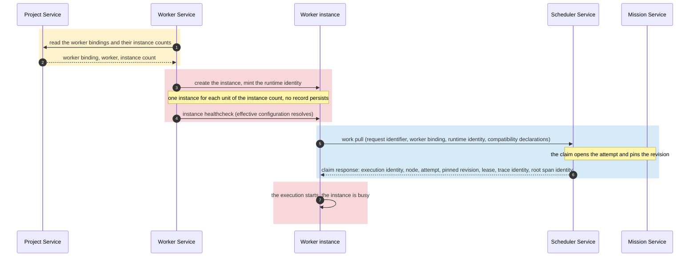
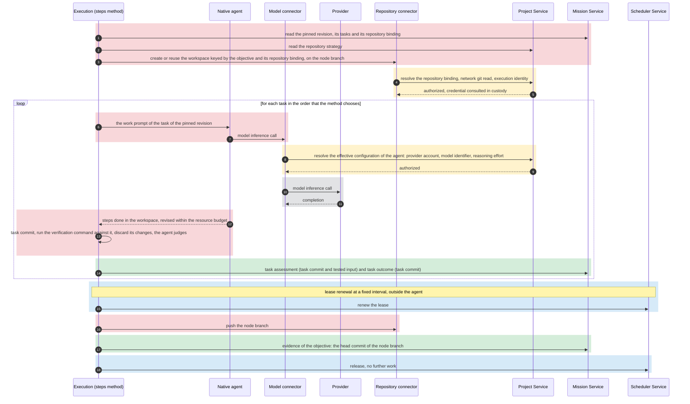
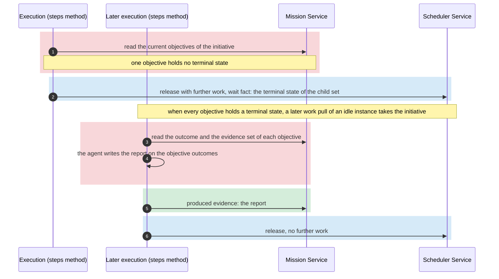
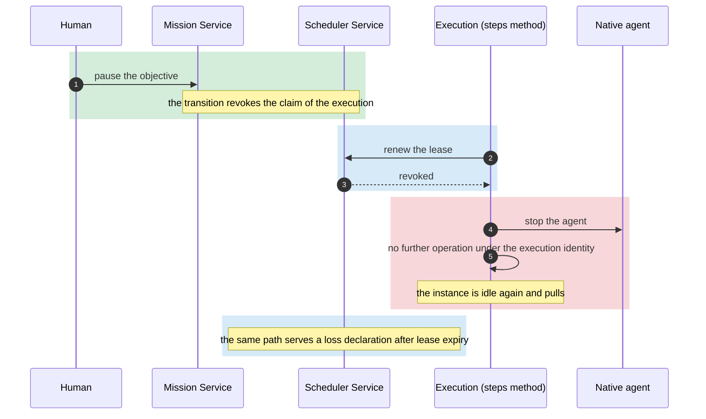
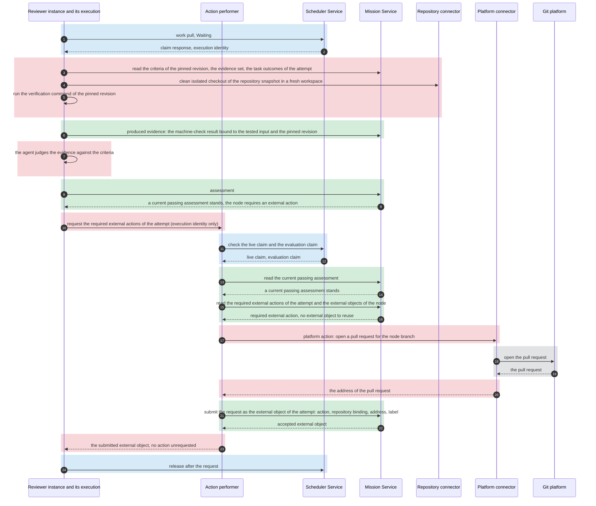
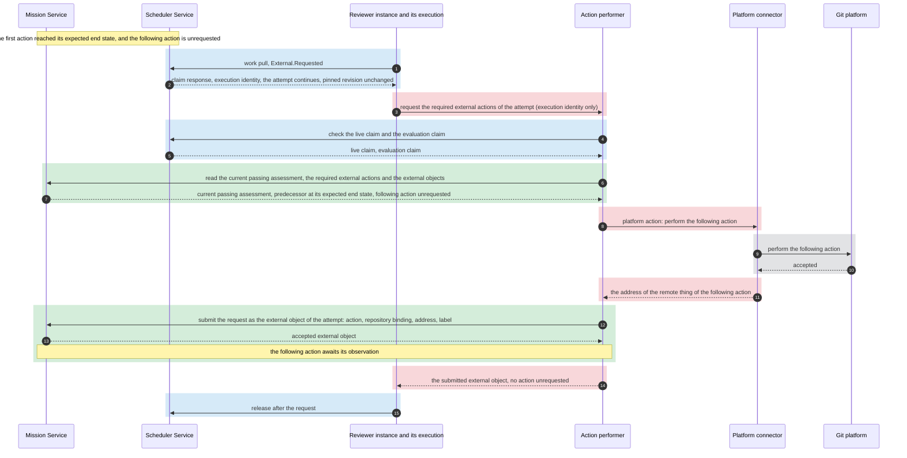
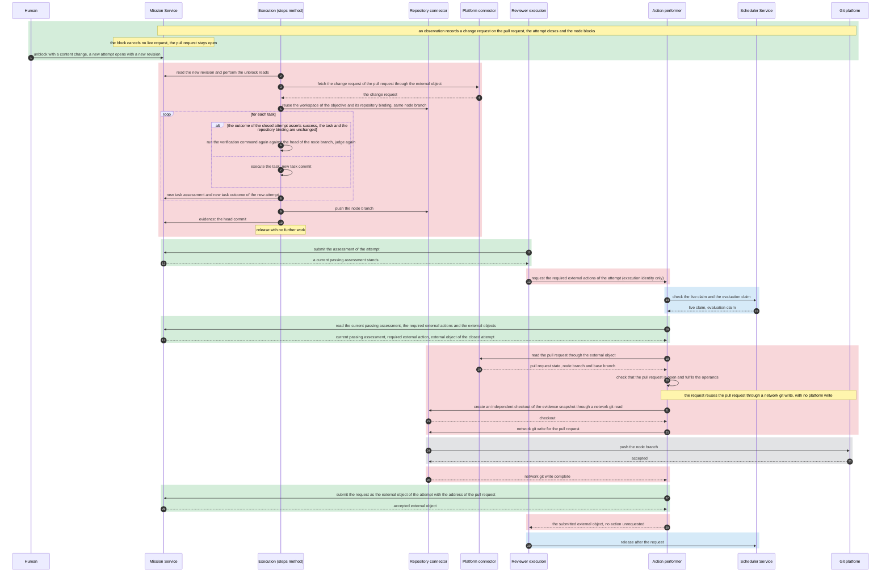
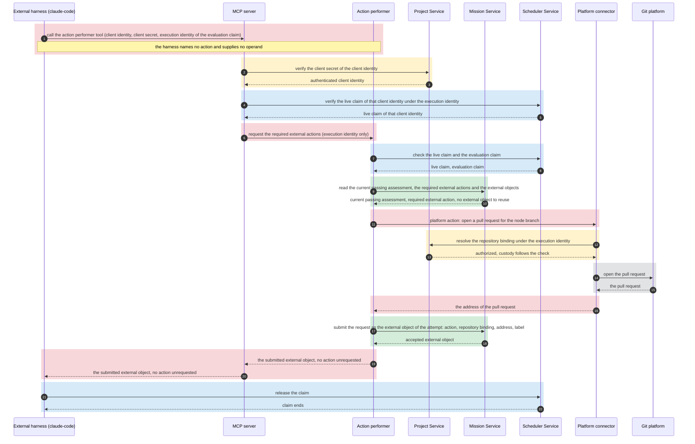

# Worker Service

## Scope

This document describes the Worker Service.
It describes the workers and their agents, the worker instances and how they host an execution, the lifecycle of an execution, the performance of a required external action and the owner of memory.
For a required external action, it describes the configured repository action only.
It describes the platform connector that performs an operation on the API of an external platform.
It describes the MCP server through which a native agent and an external harness reach the server tools.
It describes the prompt of a native agent and the prompt composer that produces it.
It describes no mechanism of another service.

## Workers and templates

The [overview](overview.vocabulary.md) defines a worker, a worker instance, an execution, an agent, a tool, memory and a prompt.
The Worker Service supplies the workers.
A worker declares its name, its host, the node states that its instances claim and its required node format.
A worker that kanthord hosts also declares its method, its one agent, the default configuration of that agent, and the base prompt and the agent prompt of that agent.
A worker that an external harness hosts declares none of those, because its method is the orchestration skill of the harness.
An agent name names a role, and no agent name equals a worker name.
A configuration is named through a worker binding, never through a bare agent name.
The [Scheduler Service](scheduler-service.md#claims-and-counts) admits a claim from the declared node states.
The default configuration of a native agent names its provider, its model identifier and its reasoning effort.
A worker declares, with the default configuration of its agent, the further options of the agent, the options that a project can override and the constraint that a whole configuration satisfies, and that declaration is part of the contract of the worker name.
A worker binding of the [Project Service](project-service.md#execution-configuration-and-instance-count) overrides the default configuration through its entry, and the Project Service resolves the effective configuration of the agent.
A worker reads no other project configuration.
The required node format names the fields of a node that the method requires.
Compatibility reads the node revision that the [work-pull rules](scheduler-service.md#work-pulls) of the Scheduler Service select.
Every worker of this page requires the same node format.

A method is the worker's own.
Two methods of kanthord exist: the steps method and the evaluation method, and the method of a worker that an external harness hosts is the orchestration skill of the harness.
The steps method declares `Available`.
The evaluation method declares `Waiting` and `External.Requested`.
A worker that an external harness hosts declares `Available`, `Waiting` and `External.Requested`.

The agent of a worker that kanthord hosts is a native agent, an agent loop that the Worker Service runs itself.
The Worker Service publishes the contract of `claude@1` and `opencode@1`: the name, the host, the declared node states and the required node format.
It runs no instance of them, and the [overview](overview.md#external-harness) states what kanthord configures of an external harness.

A worker that kanthord hosts declares the base prompt and the agent prompt of its agent, and [Prompt composition](#prompt-composition) states every layer of the prompt.

The Worker Service supplies three [connectors](worker-service.vocabulary.md#connector) as the tools that perform an authenticated operation.
The model connector performs a model inference call.
The repository connector performs a network git read and a network git write.
The repository connector performs no platform action.
The platform connector performs every operation on the API of an external platform.
It uses the [platform implementation](worker-service.vocabulary.md#platform-implementation) of that platform.
An execution and its agent reach a git platform through the repository connector and the platform connector alone.
A native agent reaches a provider through the model connector alone.
A connector resolves the binding of the operation through the [Project Service](project-service.md#configuration-lifecycle-and-consistency) for each operation, under the identity that requests the operation.
For every model inference call of a native agent the Worker Service uses the provider account, the model identifier and the reasoning effort of the effective configuration of the agent, which the Project Service resolves for that call.
An execution honours every value of the effective configuration of its agent.
A local git operation runs in the workspace and passes through no connector.
An agent holds no repository credential.

## Prompt composition

The prompt of a native agent composes prompt layers.
A prompt layer is one part of the prompt, and it has one owner.
The composition places the global prompt first, then the base prompt, then the agent prompt, then the project prompt, then the work prompt.

The operator configures the global prompt of the server.
The global prompt states the conventions of the operator, and it holds for every native agent of the server.
A worker declares, for its agent, the base prompt that the agent uses and the agent prompt of that agent.
A base prompt states what holds for every agent that uses it, and more than one agent uses one base prompt.
A base prompt describes the engineer that every agent that uses it is, and it states the default standard of the work product that those agents produce and judge.
An agent prompt states the role of the agent, its responsibility and its contribution to the WHAT.
The base prompt and the agent prompt are part of the contract of the worker name.
A change to either one is a new worker version.
The project prompt states the programming language, the development style and the coding conventions of the work product of one repository.
It states no rule about the method, the tools, the repository operations, the assessment or the release.
The work prompt renders from the node revision that the attempt pins.
It states the goal, the steps and the validation criteria of the work that the execution takes.
The agent prompt and the work prompt are required, and every other layer is optional.

A prompt layer takes its text from one prompt source.
The global prompt and the project prompt each declare an ordered list of prompt sources.
The configured source precedes the agent file source in the list of each of those two layers.
The composer takes the first source of the list that is present and valid, and it reads no further source of that layer.
A source that is absent passes the turn to the next source of the list.
A source that is present and invalid makes its layer absent, and the composer takes no further source of that layer.
The configuration of a layer holds a text, or it holds the value that disables the layer.
A disabled layer is absent, and the composer reads no source of it.
The composition places the layers that are present.

The [repository binding](project-service.md#repository-configuration-and-policy) that the pinned revision names holds the configured source of the project prompt.
The workspace of the execution holds the agent file source of the project prompt.
The steps method takes both sources of the project prompt.
The evaluation method takes the configured source of the project prompt only.
An agent file of the workspace is the work product of the candidate.

The composition states the owner, the source and the precedence of every layer to the agent.
The agent prompt holds the highest precedence, then the base prompt, then the work prompt, then the project prompt, then the global prompt.
The base prompt and the agent prompt state the obligations of the worker, and no other layer revokes one.
The agent prompt governs the base prompt, and a base prompt that contradicts the agent prompt that uses it is a defect of the worker.
An execution performs no conduct that its base prompt or its agent prompt forbids, whatever another layer states.
A global prompt and a project prompt define no validation criterion.
An assessment follows the validation criteria of the node and the [default standard](overview.vocabulary.md#default-standard) that the base prompt states.

A prompt layer carries instructions, and it authorizes no operation.
It names no value of the effective configuration, it adds no tool and it changes no resource budget.
The tool table of the agent and the effective configuration bound every operation, whatever a prompt layer states.

The prompt composer is the Worker Service component that produces the prompt of a native agent.
It resolves every layer from its sources, it validates every source that it reads, and it composes the layers.
It is the only component that reads a prompt source for the composition.
It reads the configured source of the project prompt through the [Project Service](project-service.md#configuration-lifecycle-and-consistency), and it authorizes no operation.
It reads a regular file for an agent file source, and it follows no reference inside that file.
An agent file of the workspace resolves inside the workspace, and a path that leaves the workspace is invalid.
A text that exceeds the bound of its layer is invalid, and a text that the composer cannot decode is invalid.
The composer decodes the text of a source, and it changes no instruction of that text.
The composer records the selected source of every layer, the digest of its text, and every source that it read and rejected.
The composer records no prompt text.
That record is telemetry of the execution.

The execution resolves the global prompt, the base prompt, the agent prompt and the project prompt once, when it starts.
It holds that text until the execution ends.
The work prompt renders for each unit of work that the method takes.
When the composition takes the agent file source, the composer reads that file before the agent runs.
A configuration revision and a commit change no prompt of a running execution.
A later execution of the same attempt resolves the sources that stand when that execution starts.
No model inference call of the execution drops a layer of its prompt.

## Instances and hosting

The Worker Service reads the worker bindings and their instance counts from the [Project Service](project-service.md#execution-configuration-and-instance-count).
For a worker that kanthord hosts at the `server` placement, it holds one instance for each unit of the instance count of a worker binding.
The instances of one binding form its pool.
An instance holds a runtime identity.
The Worker Service mints the runtime identity when it creates the instance.
The runtime identity is unique inside the server, and it names the worker binding of the instance.
The Worker Service vouches for that association on the [work pull](scheduler-service.md#work-pulls).
For an instance that registers, the Worker Service accepts the registration under a client identity of its binding, mints its runtime identity at that registration, and vouches for it on the work pull like every instance.
An instance of a worker that an external harness hosts registers, and an instance at the `worker` placement registers.
It accepts registrations up to the instance count of the binding, and it refuses a further one.
The registration returns the credential that the instance presents on every later request, and the [Gateway Service](gateway-service.md#machine-identities) rules that credential.
A registration ends when the program deregisters, when the server restarts, or when its client identity leaves the binding, and a live execution of that instance follows the [liveness rules](scheduler-service.md#liveness) of the Scheduler Service.

An instance record is runtime-only.
The [Scheduler Service](scheduler-service.md#liveness) governs the execution record and the claim.
At server start, and when the availability or the instance count of a worker binding changes, the Worker Service adjusts the pool of that binding.
A configuration revision of the binding replaces no instance.
A server restart creates new instances with new runtime identities.
For a worker that kanthord hosts at the `server` placement, the Worker Service drains the excess instances of a lowered count under the [count-change rule](scheduler-service.md#claims-and-counts) of the Scheduler Service: it retires idle instances first, and a busy instance ends its execution before it retires.

An instance hosts at most one execution at a time.
An instance holds at most one outstanding work pull or one execution.
It starts no work pull until its preceding pull returns no work or the execution of that pull ends.
No instance is pinned to a node.
Any idle instance of the binding takes the next compatible node.
An idle instance that receives no work retries under the [work-pull rules](scheduler-service.md#work-pulls) of the Scheduler Service.

The Worker Service produces the instance healthcheck before each work pull.
The healthcheck of an instance at the `server` placement passes when the effective configuration of the agent resolves under the current binding set.
The healthcheck of an instance at the `worker` placement passes when that configuration resolves and its client identity is a client identity of its binding.
The healthcheck of an instance that an external harness hosts passes when its client identity is a client identity of its binding.
The instance carries the compatibility declarations of its worker: the worker name, the declared node states and the required node format.

The tool of an agent and the verification command of a node run code that the repository supplies.
The Worker Service runs them inside a trust boundary that the operator provides.
A rule on the content of a command is a policy and no trust boundary.

The sequence diagram below shows the creation of a steps instance and its first work pull, on a node with no attempt.
In every sequence diagram of this page, a colored block names the service that owns its steps: yellow the Project Service, blue the Scheduler Service, green the Mission Service, red the Worker Service, grey an external system.
A diagram shows the operations of the Worker Service and the responses that it receives, and no mechanism of another service.

## Executions

An execution performs the method of its worker under the live claim that its instance obtained.
The execution takes its execution identity, its node, its attempt, the pinned node revision, its trace identity and its root span identity from the [claim response](scheduler-service.md#work-pulls) of the Scheduler Service.
The [Tracking Service](tracking-service.md#producer-and-ownership) owns what a span of the execution names as its parent.
Every operation of the execution presents its execution identity under the [liveness rules](scheduler-service.md#liveness) of the Scheduler Service.
The execution renews its lease at a fixed interval shorter than the lease expiry while it runs.
The renewal runs outside the agent, so a long model call renews the lease.
A revoked or lost execution stops its agent and performs no further operation under its execution identity.

An execution reads the [node revision](mission-service.md#mission-structure-and-nodes) that its attempt pins.
After an unblock, it performs the reads that the [unblock rules](mission-service.md#the-unblock) of the Mission Service require.
It reads every [run output](mission-service.md#run-output) of its node.
It fetches the external content that the external objects reference through the platform connector.

A workspace is a host-local working directory of one execution.
The method of the execution determines whether the workspace holds a repository checkout, and which snapshot.
The workspace of the steps method on an objective is a checkout of the repository that the pinned revision names, on the node branch.
The Worker Service keys that workspace by the objective and the repository binding of the pinned revision.
An execution reuses that workspace when the host holds one, and it creates one through a network git read otherwise.
Before the reuse, the execution confirms that no earlier execution still acts in that workspace, and it brings the checkout to the head of the node branch at the repository through the repository connector.
The Worker Service removes it after a bounded retention since the last execution of that objective ended.
The workspace of the evaluation method is fresh, and the Worker Service removes it at the release.
The workspace of the steps method on an initiative holds no checkout.

The rules of the four paragraphs below hold for the steps method on an objective.
The steps method uses one node branch for each objective and repository binding, and it continues that branch across attempts.
The node branch takes its name from the node identity.
The first execution on that branch creates it from the base branch that the [repository strategy](project-service.md#repository-configuration-and-policy) names.
The execution never rewrites a commit that it pushed or that a record of the Mission Service names.
Every commit that the execution makes is attributable to its task and its attempt.
The execution pushes the node branch through the repository connector before every release.

The steps method chooses the order of the tasks of the pinned revision.
For each task the agent performs the steps in the workspace, and the execution commits the changes of the task work.
The task commit is the head of the node branch after the last commit of the task work in the attempt that executed the task.
The execution runs the verification command of the task against the task commit when the task carries one, and it discards every change that the command made.
The agent revises the work within the resource budget of the execution before the execution records the task assessment.
The execution commits a revision as a new commit.
The agent judges the result against the validation criteria of the task, with the exit status of the verification command as an input.
The execution writes the task assessment and the task outcome.
The task assessment names the task commit and, when the task carries a verification command, the [tested input](mission-service.vocabulary.md#tested-input) that the command ran against.
The task outcome carries the task commit as its evidence.
A worker fixes the resource budget of one execution: a turn count and a wall time.

In an attempt after the first, the execution reads the outcome of the cleared attempt for each task.
When that outcome asserts success, the task is unchanged between the revision that the cleared attempt pinned and the revision of the attempt, and the repository binding is unchanged, the execution runs the verification command again against the head of the node branch when the task carries one, judges again, and writes a new task assessment and a new task outcome.
It executes every other task.
Inside one attempt, a task that holds a current task outcome of the attempt is complete, and the execution skips it.

Before every release with no further work, the execution submits the head commit of the node branch as the evidence of the objective, whatever the task results establish.
When every task of the revision holds a current task outcome of the attempt, the execution releases with no further work.
A recorded task assessment that does not pass ends the task work, and the execution releases with no further work.
When the resource budget ends before every task holds a task outcome, the execution releases with further work.
Before a release with further work that names no wait fact, the execution submits its [run output](mission-service.md#run-output).
Before that release, the execution commits the task work in progress as a checkpoint commit.
A checkpoint commit establishes no completion and no verification result, and the next execution continues the task.
The [Mission Service](mission-service.md#state-transitions) routes each release.

The sequence diagram below shows the steps method on an objective with a native agent, on the path where every task assessment passes.

For an initiative the steps method reads the current objectives of the initiative.
When one objective holds no terminal state, the execution releases with further work and names the terminal state of that child set as its wait fact.
When every objective holds a terminal state, the agent writes a report on the outcome of each objective, the execution submits that report as produced evidence and releases with no further work.

The sequence diagram below shows the steps method on an initiative.

The [overview](overview.md#kanthords-own-harness) owns the end conditions of an execution.
A human pause, a human discard and a success override reach the execution as a revocation.
An assessment that does not pass and a resource limit reach the Mission Service as a release.

The sequence diagram below shows a revocation and the loss of the lease.

## Platform connector, action performer and MCP server

The [platform connector](worker-service.vocabulary.md#connector) holds one platform implementation for each platform.
A platform implementation exposes the operations of its own platform under the names and the parameters of that platform.
No common operation interface exists across platform implementations.
The set of platform implementations is open.
A binding that reaches an external platform names its [platform](project-service.md#repository-configuration-and-policy).
The platform connector selects the platform implementation by that field.
A platform implementation derives the resource of a call from the binding.
A caller supplies no resource selector.

Every call of a platform implementation on the API of its platform names the identity that requests it and the binding that it acts on.
The platform implementation resolves the binding through the Project Service for each call on the API.
Custody follows the authorization check.
A credential stays inside the server.
The platform connector holds no authority of its own.

The [action performer](worker-service.vocabulary.md#action-performer) requests the required external actions of one attempt for every reviewer execution, whichever harness hosts it.
The evaluation method and the MCP tool of an external harness call the action performer.
Both callers pass the execution identity and nothing else.
The invocation names no action and supplies no operand.
For both callers, the action performer checks that the claim of the execution identity is live.
It checks that the claim is an evaluation claim.
It checks that a current passing assessment of the attempt stands.
The action performer obtains every operand from the records and the evidence snapshot.
When an action needs a network git write, the action performer makes its own checkout through the repository connector.
It depends on no workspace of a hosted execution.
The action performer serializes the invocations of one execution identity.
It never dispatches an action whose earlier dispatch is unresolved, across callers and invocations.

The action performer returns items in four [return classes](worker-service.vocabulary.md#return-class).

- Submitted external objects.
- Actions that await a prerequisite, with the observation that each one follows.
- Actions whose request fails before any effect, with the refusal.
- Actions whose effect or recording is uncertain.

Only an action that awaits a prerequisite carries a wait fact.
This page states no release rule for a request failure or an uncertain effect or recording.
Every write that fulfils a configured action belongs to the action performer, whichever connector transports it.
A push of the steps execution targets the node branch of its objective only.
A merge or a push into the base branch is a configured repository action.

A platform call that succeeds returns the result of the operation.
A platform call that does not succeed reports one of four [result classes](worker-service.vocabulary.md#result-class).

- A confirmed failure that establishes no effect.
- A retryable refusal that establishes no effect.
- A final refusal.
- An unknown outcome.

A platform implementation retries a read on a transport error.
It never retries a write on an unknown outcome.

The server runs one [MCP server](worker-service.vocabulary.md#mcp-server).
The MCP server is one form of the API.
It serves a native agent and an external harness.
A native agent presents the execution identity of the execution that hosts it.
An external harness authenticates with its [client identity](project-service.vocabulary.md#client-identity) and its [client secret](project-service.vocabulary.md#client-secret).
It presents the execution identity of its claim.
The MCP server refuses a call whose execution identity belongs to no live claim of that client identity.
Each tool maps to one method of a platform implementation or to the action performer.
The MCP server makes no decision of its own.
The Project Service authenticates the client identity, the Scheduler Service establishes the live claim, and the owning component performs every operation.

The MCP server exposes a list of resource-scoped read methods of the platform implementations and the tool of the action performer.
The Worker Service permits each read method individually.
The MCP server exposes no other write to a native agent or to an external harness.
It exposes the tool of the action performer to an external harness only, because the evaluation method invokes the action performer for a native agent.
The tool of the action performer takes no parameter beyond the execution identity.
It returns the four return classes of the action performer.
A native agent reaches the permitted read methods of the platform connector as tools through the MCP server.

The platform connector serves the [observer of the Scheduler Service](scheduler-service.md#intake-and-observation).
The observer presents its [service identity](project-service.vocabulary.md#service-identity) and the [external object](mission-service.md#evidence) to read its state.
A platform implementation decodes a delivery of its platform into the event types of that platform.
The decoding performs no operation on the API.
The Scheduler Service calls that decoding.

The platform connector, the action performer and the MCP server are server components.
The [trust boundary](worker-service.vocabulary.md#trust-boundary) of this page is their only containment.
Another git platform requires one platform implementation, its permitted read methods, a platform value and the corresponding behaviour of the action performer.
It changes no other rule.
A platform with a different resource model requires its binding kind, its authorization and its action semantics.
No page defines those rules.

## Evaluation and required external actions

The evaluation method follows the criterion and never the node, as the [overview](overview.md#what) states.
The reviewer execution reads the validation criteria of the pinned revision, the evidence set of the attempt and the current child outcomes.
The child outcomes of an objective are its task outcomes, and the child outcomes of an initiative are its objective outcomes.
When the evidence names a repository snapshot, the reviewer execution makes a clean isolated checkout of that snapshot in its workspace through the repository connector.
It runs the verification command of the pinned revision when the revision carries one, whatever the node kind.
The command runs in the workspace of the reviewer execution: in the checkout when the evidence names a repository snapshot.
When the evidence names no repository snapshot, the reviewer execution places the produced evidence of the attempt in its workspace, and the command runs there.
The execution records the result of that machine check as produced evidence bound to the tested input and the pinned revision, and the assessment names it in its evidence set.
The agent judges the evidence against the criteria.
The execution writes the [assessment](mission-service.md#evaluation-and-assessment) with the fields that the Mission Service defines.
The [Mission Service](mission-service.md#evaluation-and-assessment) owns the record and its currency.

A reviewer execution that claims from `Waiting` performs the evaluation.
A reviewer execution that claims from `External.Requested` performs no evaluation.
When the node requires no external action, the passing assessment ends the claim, and the reviewer execution performs nothing more.
Otherwise, on both paths, the reviewer execution invokes the action performer after a current passing assessment stands.
The action performer reads the required external actions of the attempt.
It reads the external objects of the node across every attempt.
A required action is eligible when it is unrequested in the attempt and it follows no other action.
A required action that follows another action is eligible when it is unrequested in the attempt and its predecessor reached its expected end state.
The action performer requests each eligible action for the reviewer execution until no action is eligible.
A request of a repository action uses the platform connector for a platform action.
It uses the repository connector for a network git write.
The action performer derives every operand from the records of the attempt, the evidence snapshot and the external object.
The agent supplies no operand, and an external harness supplies none.

Before it performs a request, the action performer reads the external objects of the node.
The request reuses the remote thing of an external object of an earlier attempt when three conditions hold.
The external object names the same external action and the same repository binding.
The remote thing fulfils the operands of the current request.
The remote thing is open: the platform still accepts on it the network git write that the action requires.
An end state of the earlier action does not close the remote thing by itself.
A reuse performs the network git write that the action requires and no platform write.
Otherwise the action performer performs the action through the platform implementation of the platform of the binding or through the repository connector.
In both cases the action performer submits the request to the Mission Service as the external object of the attempt.
It uses the address that the platform implementation resolves, or the address of the external object that the request reuses.
That submission is the accepted request of the action.
The address correlates the external objects of one remote thing across attempts.

The action performer performs these requests inside the evaluation method for a reviewer execution of kanthord's own harness.
An external harness invokes the tool of the action performer through the MCP server for its reviewer execution.
Both paths run the same eligibility, operand and reuse rules.

The reviewer execution releases after its requests when the return of the action performer holds only submitted external objects and actions that await a prerequisite.
That rule holds for a reviewer execution of an external harness after the tool of the action performer returns.
When a required action awaits a prerequisite, the release names the observation that the action follows as its wait fact.
The [Scheduler Service](scheduler-service.md#claims-and-counts) owns the wait record, and the [Mission Service](mission-service.md#continuation-condition) owns the continuation condition.

The sequence diagram below shows the evaluation and the configured repository action, on an objective that requires one action.

The sequence diagram below shows the continuation claim from `External.Requested`, on an objective that requires two actions, where the following action follows the first.

The sequence diagram below shows the next attempt after a block: the resume of the tasks and the reuse of the pull request.

The sequence diagram below shows the invocation of the action performer by an external harness, on an objective that requires one action.

## Memory

The execution owns memory.
The [memory](overview.vocabulary.md#memory) of an execution is the context of its agent and the content of its workspace.
It ends with the execution.
The workspace that the Worker Service retains for a later execution of the same objective is a host-local artifact, and its content is no memory of that later execution.
A worker defines how its executions use memory, and it holds no memory of its own.
An instance holds no memory, and each execution starts with a fresh agent context.
A later execution rebuilds its context from the records of the Mission Service and from the content that those records reference, as its method requires.
A later execution never depends on the retained agent context of an earlier execution or on the continued existence of a workspace.

## Boundary

The [Project Service](project-service.md) owns the bindings, the entry of an agent whose default configuration a project overrides, the configured counts, the authorization of each operation, custody and the repository strategy.
The [Scheduler Service](scheduler-service.md) owns the work queue, the claim, the execution record, the lease, the live-execution accounting and the wait record.
The [Mission Service](mission-service.md) owns the node states, the node revision, the evidence record, the assessment record, the outcome record, the external object and the readiness and continuation conditions.
The Worker Service owns the workers and their agents, the runtime identity, the pool and the hosting of an execution.
It owns the healthcheck, the compatibility declarations, the workspace, the three connectors and the prompt composer.
It owns the platform implementations, the action performer, the MCP server and the exposure of its tools.
It owns the lifecycle of an execution between the claim and the release.
It owns the performance of a required external action and its idempotency across attempts.
It owns memory.
The [Tracking Service](tracking-service.md#scope) holds the telemetry of every execution.
An agent transcript is telemetry, unless an execution submits it as evidence under the rules of the Mission Service.
