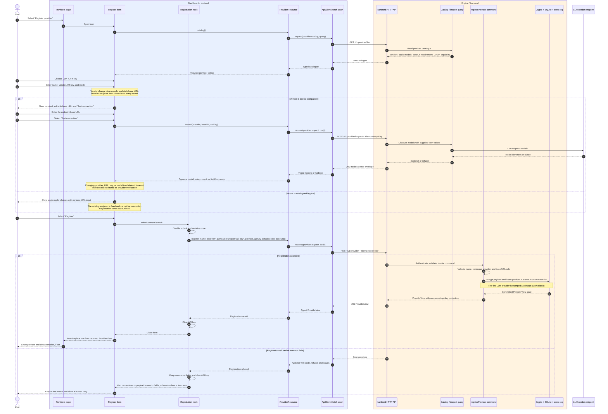
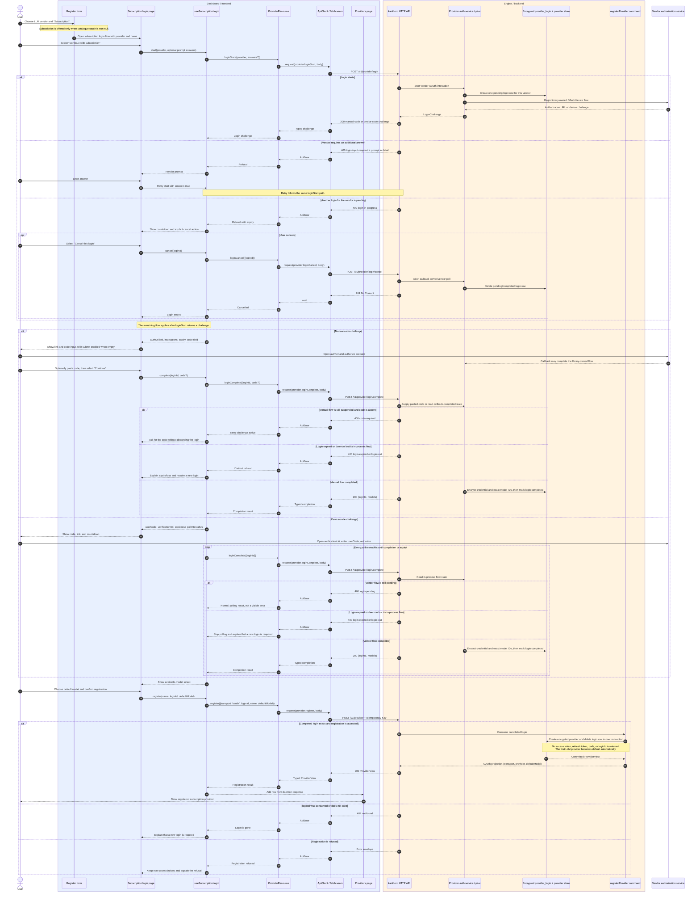
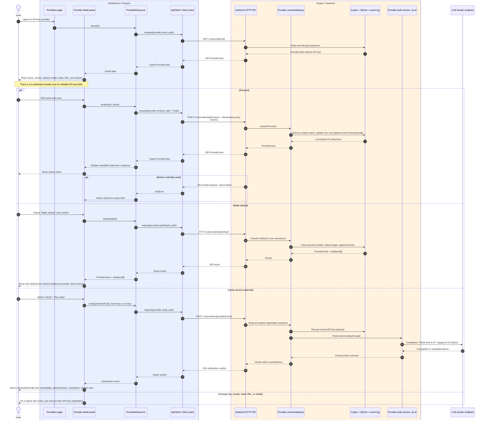
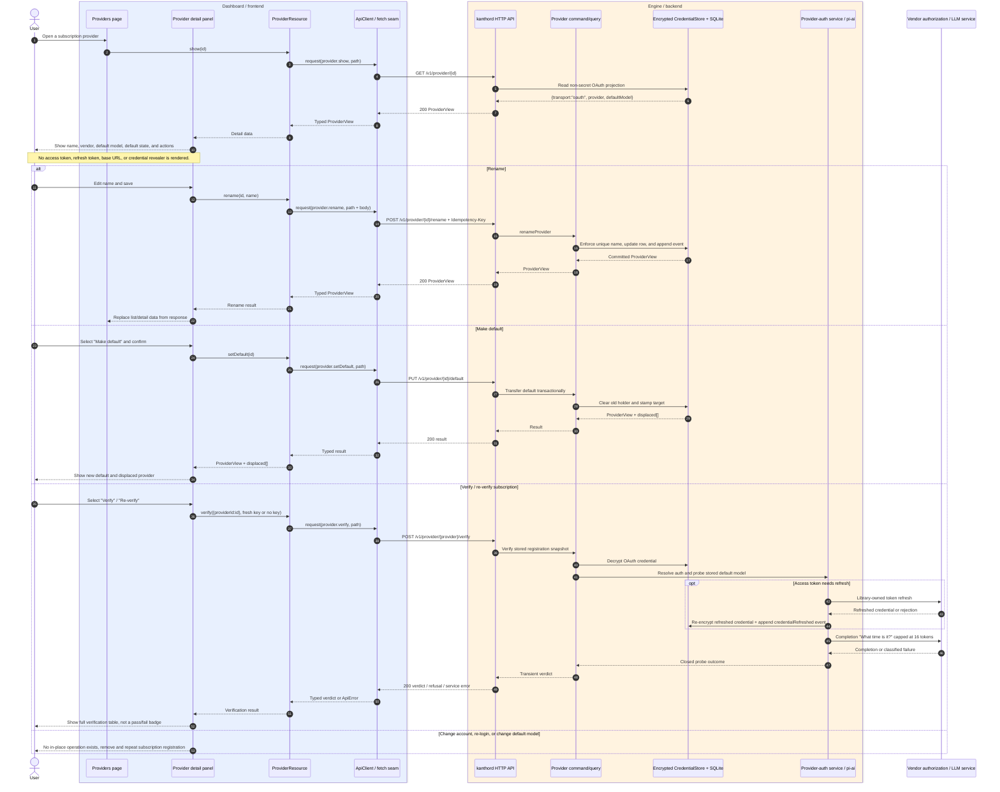
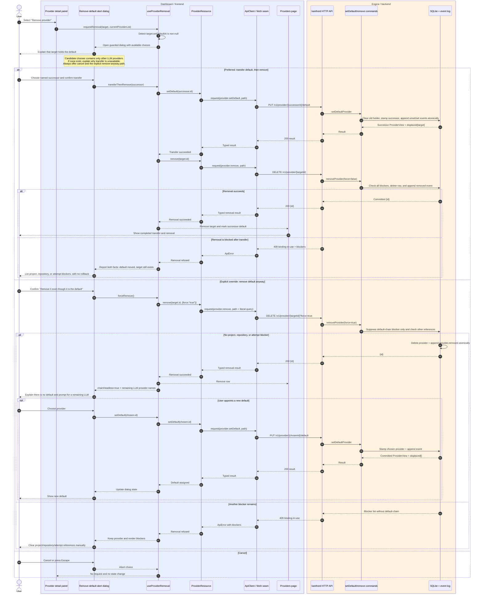

# Provider workflows

These sequence diagrams describe the **planned live-mode dashboard flow** across the transport foundation, provider CRUD, subscription login, and provider readiness plans.

> **Contract status:** the vendored API snapshot in `apps/docs/api/contract/manifest.json` is version `27.8.1`. It declares the existing provider CRUD operations, but not yet `provider.verify`, the three login operations, or the OAuth registration arm. Those interactions below are target-state behavior from the plans and require the planned contract refresh. The existing contract remains authoritative for `provider.register`: `POST /v1/provider`.

## Participants and invariants

The sequence diagrams use a **blue band for dashboard/frontend elements** and an **amber band for engine/backend elements**. The user and vendor services sit outside both bands because they are external actors.

- UI components call typed `ProviderResource` functions; they do not construct paths, headers, or raw `fetch` calls.
- A catalogued `pi-ai` provider carries a fixed base URL and static models. The form renders no base-URL input for it and sends `baseUrl: null`; the engine selects the fixed endpoint by provider id. Only `openai-compatible` renders an editable, required base URL.
- `ApiClient` is the only HTTP seam. In live mode it adds the bearer token and operation-specific idempotency key and decodes the common error envelope. In offline mode the same resource calls are dispatched to stateful fixtures instead.
- A secret is never returned in a provider view. API keys and OAuth credentials are encrypted at rest. The UI must not put them in logs, browser storage, URL state, or telemetry.
- Registration, rename, inspect, and verification use memory idempotency. A transport retry reuses the intent's key; a deliberate re-verification uses a new key or no key.
- A provider cannot be edited optimistically. The list and detail views update from the daemon response.

## 1. Register a new API-key provider

**Important:** ordinary API-key registration does not contact the vendor. A catalogued `pi-ai` provider uses its fixed endpoint and static model list; the dashboard neither renders nor submits an override. Only `openai-compatible` accepts a human-entered base URL, and only its visible **Test connection** control calls `provider.inspect`. After registration, the user can run `provider.verify` from the detail panel to probe the stored default model.

## 2. Register a new subscription provider

A pending or completed login is not itself a provider. The provider row exists only after `provider.register` succeeds and consumes the `loginId`.

## 3. Edit an existing API-key provider

The API has no update operation for the vendor, API key, base URL, or default model. “Edit” therefore means **rename**, optionally **make global default**, and **verify the stored credential**. Credential rotation or configuration replacement is remove-then-register.

A verification verdict is transient. It must be cleared when provider data changes and must not be rendered later as a persisted “healthy” or “ready” status.

## 4. Edit an existing subscription provider

A subscription registration has the same writable surface as an API-key registration. The dashboard cannot reveal tokens, manually refresh them, change the authenticated account, or change the stored model in place.

OAuth refresh is backend-owned and may occur while `pi-ai` resolves a credential. There is deliberately no refresh button or refresh API in the dashboard.

## 5. Delete a default provider

Deleting a provider whose `setDefaultAt` is non-null is guarded **before** the delete call. The preferred path transfers the default first. The explicit override can leave the LLM chain without a default and overrides only the `default-chain` blocker.

### Deletion outcomes

| Choice | Result |
| --- | --- |
| Transfer first | The selected LLM becomes default, then the old provider is removed if no other blocker exists. If removal fails, the transfer remains and the UI reports both facts. |
| Remove anyway | `force=true` ignores only `default-chain`. On success, no provider is default until the user appoints one. |
| Other blockers | `project-binding`, `repository`, and `attempt` always refuse deletion, even with `force=true`; the UI lists them and never auto-resolves them. |
| Cancel | No HTTP request and no state change. |

## Source material

- `apps/.agents/plan/transport-foundation--01m13wjg35r6akr4fh41a4zj17`
- `apps/.agents/plan/subscription-login--01m13wjg5pb5nabbtb8t2v2bxf`
- `apps/.agents/plan/provider-crud--01m13wjg401jqj8xezaph3s633`
- `apps/.agents/plan/provider-readiness--01m13wjg520a3qwh4a5xz8c9f0`
- `apps/docs/api/operations.md`, `errors.md`, and `contract/features/provider.yaml`
