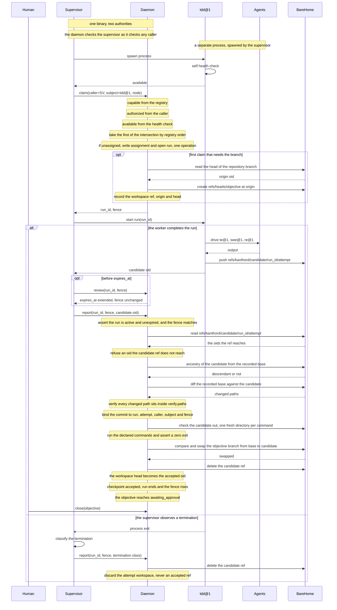
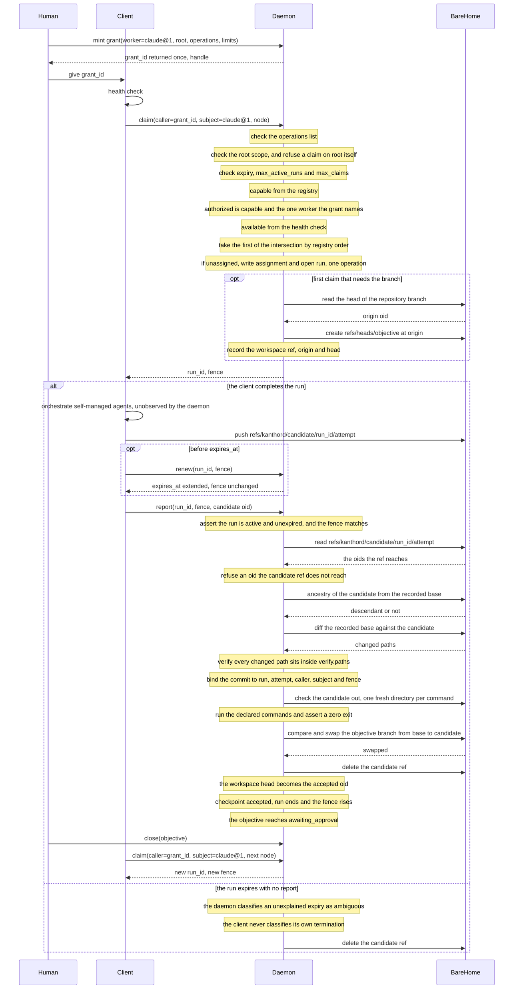

# Worker model

## Glossary

| Term | Meaning | Example |
| --- | --- | --- |
| `node` | The unit of work in the graph. | `task_01m13ymgvfq91nbjqbs9kgxk2n` |
| `kind` | The place of a node in the hierarchy. | `initiative`, `objective`, `task` |
| `initiative` | One outcome that several objectives deliver. | Provider CRUD |
| `objective` | One deliverable in one repository. | Contract types, in `kanthord-apps` |
| `task` | One unit of behaviour. | Projection union |
| `deliverable` | The outcome a node declares. Never a method. | `test`, `implementation`, `review`, `research`, `expansion` |
| pair | The `kind` and the `deliverable` together. The pair fixes the shape and the state owner. | `(objective, implementation)` |
| parent objective | An objective that declares `expansion`. It holds children. | An objective that splits into five tasks. |
| atomic objective | An objective that declares an execution deliverable. It holds no child. | An objective that one worker finishes alone. |
| `verify` | The machine-readable check of a node. | `paths`, `commands` |
| `aggregate` | The rule that derives a parent state from its children. | Every child `done` gives `done`. |
| `agent` | The role that does the work. | `te@1`, `swe@1`, `re@1`, `general@1` |
| role contract | The tool whitelist of an agent. | `re@1` holds `read`, `bash`, `grep`, `find`, `ls`. |
| `worker` | The method that drives one run against one node. | `tdd@1`, `poc@1`, `claude@1` |
| `driver` | Who implements the worker. | `internal`, `external` |
| `composition` | How many agents a worker drives. Metadata only. | `single`, `composed`, `self-managed` |
| registry | The design-time record of every worker. | `claims`, `deliverables`, `agents` |
| `assignment` | The worker of one node. Runtime state, not plan text. | `tdd@1` on one task |
| eligible sets | `capable` from the registry, `authorized` from the caller, `available` from the health check. | `tdd@1` is capable, authorized, and busy. |
| `unroutable` | An empty intersection of the three sets. | No worker declares `research` on an objective. |
| switch | A human change of the assignment. | `tdd@1` becomes `claude@1`. |
| `run` | One worker's work against one node. | `run_01m1...`, `state: active` |
| `claim` | The verb that opens a run. | A client claims one objective. |
| `report` | The verb that carries a run result. | A client reports one commit. |
| `close` | The verb a human uses to end an objective. | A human approves and closes. |
| `fence` | A counter on the run. A stale `fence` fails a write. | `fence: 7` |
| `expires_at` | The end of a run against the daemon clock. | A worker renews before it. |
| `attempt` | One try of a node. A node holds a limit. | `attempt_limit: 3` |
| `termination` | The class of a failed attempt. | `semantic`, `infrastructure`, `ambiguous` |
| `checkpoint` | The accepted evidence of a run. | A commit, a graph patch, an attestation |
| execution checkpoint | An accepted commit. | The head that makes a test pass |
| structural checkpoint | An accepted graph patch. | Five new task nodes |
| review checkpoint | An accepted attestation. | A verdict on a pinned commit |
| `candidate` | A reported head before the daemon accepts it. | `9b71e02...`, not yet landed |
| `base` | The branch head the run recorded at claim time. | `4f2a9c1...` |
| `contended` | A failed compare and swap on the objective branch. | Another run landed first. |
| `graph_revision` | The graph version a run pins. A structural run is compared against it. | `graph_revision: 41` |
| `workspace` | The branch record of an objective. | `repo`, `ref`, `origin`, `head` |
| `origin` | Where the daemon cut the objective branch. Immutable. | `4f2a9c1...` |
| supervisor | The process that owns an internal worker. | It launches, observes and classifies. |
| client | An external worker that calls the daemon itself. | A Claude Code session |
| `caller` | Who is authenticated. | The supervisor, or the client |
| `subject` | Which worker the evidence belongs to. | `claude@1` |
| `grant` | The delegation a human mints for a client. | `root`, `worker`, `operations`, `max_claims` |
| `root` | The subtree a grant reaches. Scope, never work. | One initiative |

## 1. The model

The graph describes WHAT to do. A worker describes HOW to do it. An agent is WHO does it.

A plan document names no worker, no agent, no harness and no provider.

## 2. Node

A node is the unit of work in the graph.

| `kind` | Purpose |
| --- | --- |
| `initiative` | Holds one outcome that several objectives deliver. |
| `objective` | Holds one deliverable in one repository. Owns a workspace. |
| `task` | Holds one unit of behaviour. |

A node declares a deliverable. A deliverable is an outcome, never a method.

| `deliverable` | Purpose |
| --- | --- |
| `test` | A test that fails at this node's commit and names the missing behaviour. |
| `implementation` | Code that makes the declared tests pass. |
| `review` | A verdict against the acceptance criteria. |
| `research` | A document that answers the node's question. |
| `expansion` | Child nodes that satisfy the parent's acceptance criteria. |

The set of deliverables grows. A deliverable never carries an agent name.

The `kind` and the `deliverable` form a pair. The pair is legal, or the daemon rejects the node. The pair fixes the shape of the node and the owner of its state.

| `kind` | Legal `deliverable` | Shape | State owner |
| --- | --- | --- | --- |
| `initiative` | `expansion` | Holds children. | `aggregate` |
| `objective` | `expansion` | Holds children. | `aggregate` |
| `objective` | `test`, `implementation`, `review`, `research` | Holds no child. | Attestation, then a human. |
| `task` | `test`, `implementation`, `review`, `research` | Holds no child. | Its own accepted report. |

An objective that declares `expansion` is a parent objective. An objective that declares an execution deliverable is an atomic objective.

The pair is fixed once the node holds an accepted checkpoint or a child. Before that, a structural patch changes it. The patch obeys the rules of section 7, like every other structural mutation. A parent objective becomes atomic only after a structural patch deletes every child, in any state.

```yaml
# initiative.md
id: initiative_01m13wjg401jqj8xezaph3s633
kind: initiative
title: Provider CRUD
deliverable: expansion
verify:
  paths: []
  commands: []
```

```yaml
# objective.md
id: objective_01m13wjg4185jk8p3pdvzt2spv
kind: objective
title: Contract types
deliverable: implementation
repo: kanthord-apps
depends_on:
  - objective_01m14b2k7x9qd3vs5nfh8tzg42
verify:
  paths: []
  commands: []
```

```yaml
# 01-projection-union-test.md
id: task_01m13ymgvfq91nbjqbs9kgxk2n
kind: task
title: Projection union — test
deliverable: test
verify:
  paths:
    - apps/dashboard/src/api/types.test.ts
  commands:
    - "! pnpm --filter @kanthord/dashboard test src/api/types.test.ts"
```

```yaml
# 02-projection-union.md
id: task_01m13ymgvgywcy5x323zygnec1
kind: task
title: Projection union
deliverable: implementation
depends_on:
  - task_01m13ymgvfq91nbjqbs9kgxk2n
verify:
  paths:
    - apps/dashboard/src/api/types.ts
  commands:
    - pnpm --filter @kanthord/dashboard test src/api/types.test.ts
```

Every node declares `verify`. `verify` is machine readable. The daemon runs each entry of `commands` against the pinned commit. A command exits zero, or the node fails. The daemon confirms the diff touches `paths` only. An empty `commands` list asserts nothing.

A command carries its own expectation. A `test` node names the missing behaviour, so its command exits zero when the test fails.

## 3. Agent

An agent holds a role contract. Every agent implements the pi-coding-agent contract.

A contract declares `capabilities.tools`. The list is a whitelist. The harness denies every tool the list omits.

| `tool` | Purpose |
| --- | --- |
| `read` | Read file contents. |
| `bash` | Execute bash commands. |
| `edit` | Edit files with find and replace. |
| `write` | Write files. Creates or overwrites. |
| `grep` | Search file contents. |
| `find` | Find files by glob pattern. |
| `ls` | List directory contents. |

| `agent` | Purpose | `capabilities.tools` |
| --- | --- | --- |
| `general@1` | Does any task end to end. | `read`, `bash`, `edit`, `write`, `grep`, `find`, `ls` |
| `swe@1` | Writes production code. Writes no test. | `read`, `bash`, `edit`, `write`, `grep`, `find`, `ls` |
| `te@1` | Writes tests. Writes no production code. | `read`, `bash`, `edit`, `write`, `grep`, `find`, `ls` |
| `re@1` | Reviews a diff against acceptance criteria. | `read`, `bash`, `grep`, `find`, `ls` |

`swe@1` and `te@1` hold the same tools. Their contracts differ by the paths they own, not by the tools they hold.

One role contract exists per agent. A generator renders that contract into each harness format. Generation fails when a harness cannot deny by default.

```yaml
# agent contract: re@1
agent: re@1
purpose: Review a diff against acceptance criteria.
capabilities:
  tools: [read, bash, grep, find, ls]
```

## 4. Worker

A worker owns one run against one node.

| `driver` | Meaning |
| --- | --- |
| `internal` | Designed and implemented here. |
| `external` | Designed here. A third-party harness implements it. |

| `worker` | Driver | Composition | Purpose |
| --- | --- | --- | --- |
| `general@1` | internal | single | Runs one agent against one node. |
| `tdd@1` | internal | composed | Drives `te@1`, `swe@1` and `re@1`. |
| `poc@1` | internal | composed | Implementation plus happy-path test only. |
| `research@1` | internal | single | Produces a document and an expansion. |
| `git@1` | internal | single | Runs a declared git operation. Uses no model. |
| `claude@1` | external | self-managed | Claude Code drives its own sub-agents. |
| `opencode@1` | external | self-managed | opencode drives its own sub-agents. |

Two of the seven ship first. `claude@1` and `opencode@1` are external, so a third-party harness implements them and the daemon needs no executor. Every internal worker is later work: `general@1`, `tdd@1`, `poc@1`, `research@1` and `git@1`. The registry therefore holds two entries until the first internal worker lands.

`research@1` is the only worker that declares `expansion`, and it is not among the first two. An expansion node is `unroutable` until an internal worker exists. That is correct rather than a gap: section 10 states an external client submits no graph patch and creates no node, so expansion is internal-only work. The structural mechanism ships before the worker, and the worker is then a registry edit.

| `composition` | Meaning |
| --- | --- |
| `single` | One execution path the daemon observes. It drives at most one agent. |
| `composed` | An explicit agent list. The daemon observes each. |
| `self-managed` | The harness selects its agents. The daemon observes none. |

`composition` counts execution paths, not agents. `git@1` is `single` and drives no agent, because it runs a declared git operation and calls no model. Counting agents would make that row contradict itself.

`composition` is read-only metadata. It describes a worker to a human. No integration branches on it.

Enforcement sits in the internal implementation, or in the external prompt. The daemon enforces the active run, the fence, the claimed subtree, the graph revision and the verified diff. Those five hold whatever a worker declares about itself.

A worker claims a node of any kind. A worker declares its properties in code, at design time.

A worker id has the format `<name>@<version>`, and it matches `^[a-z][a-z0-9-]*@[1-9][0-9]*$`. A name holds no dot, so a harness is a registry field and never a name prefix. A version change is backward compatible. That promise comes from a human. The daemon does not verify it, and an in-flight checkpoint survives a version change.

```yaml
# worker registry entry
worker: tdd@1
driver: internal
agents: [te@1, swe@1, re@1]
claims: [objective, task]
deliverables: [test, implementation, review]
metadata: 
  composition: composed
```

```yaml
worker: claude@1
driver: external
agents: []
claims: [objective, task]
deliverables: [test, implementation, review]
harness: claude-code
metadata:
  composition: self-managed
```

```yaml
worker: research@1
driver: internal
agents: [general@1]
claims: [initiative, objective]
deliverables: [research, expansion]
metadata:
  composition: single
```

```yaml
worker: opencode@1
driver: external
agents: []
claims: [objective, task]
deliverables: [test, implementation, review]
harness: opencode
metadata:
  composition: self-managed
```

`opencode@1` takes the `claims` and the `deliverables` of `claude@1`. Both are self-managed harnesses that dispatch the same personas, and a narrower set would leave one harness unable to take work the other can.

Capability is design-time and code-derived. Availability is runtime and per instance. A worker runs a self health check before it claims. A worker declines to claim when the check fails.

The registry declares an order. The daemon computes three sets for a node.

| `set` | Meaning |
| --- | --- |
| `capable` | Every worker whose `claims` holds the node kind, and whose `deliverables` holds the node `deliverable`. |
| `authorized` | Every capable worker the caller runs. A grant names one worker. |
| `available` | Every authorized worker that passes its health check. |

An empty intersection is `unroutable`. The daemon opens no run and names the set that failed.

A node holds an `assignment`. The assignment names the worker of that node. The assignment is runtime state, and a plan document still names no worker.

The daemon writes the assignment and opens the run in one operation, at the first claim on an unassigned node. The daemon takes the first worker of the intersection, by registry order. The assignment then holds.

A claim is legal only when the assignment equals the claiming worker. A grant names one worker, so the daemon rejects a client on a node that another worker holds. The daemon names the assignment and offers a switch.

A failure never changes the assignment. A worker retries inside its budgets. An exhausted budget waits for a human.

Only a human switches a worker. A switch is one operation. It ends the active run as an operator handoff, raises the fence and writes the new assignment, in one transaction. It then discards the attempt workspace, after that transaction commits, because a file system removal cannot join it. The raised fence is what makes the discard safe: a late write from the old worker fails whether the discard has run or not, and an orphaned attempt directory costs nothing because the attempt workspace is not durable evidence.

The switch opens no run. It leaves the node assigned to the new worker, with no active run, and the objective branch at the accepted head, so the next claim from that worker starts there. A new external worker needs its own grant, and it adopts no run.

## 5. Run

A run records one worker's work against one node. Node state and run outcome are orthogonal.

A claim opens one run, against the claimed node. A task claim opens no other run. A run against an objective needs a claim on that objective.

The verbs are `claim`, `report` and `close`. A claim comes before the run. The daemon creates the run and returns the run id and the fence. Every later write carries both. A report carries the result of the run. A report against a `review` node carries a verdict, bound to the pinned commit it judged.

An accepted report ends the run. The daemon derives the node state from the accepted checkpoint. A worker holds no active run while a human decides.

The node's `deliverable` selects the run kind. The worker's metadata does not.

| `run.kind` | Checkpoint | Node `deliverable` |
| --- | --- | --- |
| `structural` | A graph patch against a graph revision. | `expansion` |
| `execution` | An artifact candidate, qualified by repository. | `test`, `implementation`, `research` |
| `review` | An attestation. | `review` |

External:

```yaml
run:
  id: run_01m1...
  node_id: objective_01m13wjg4185jk8p3pdvzt2spv
  kind: execution
  driver: external
  state: active
  fence: 7
  attempt_limit: 3
  base:
    - repo: kanthord-apps
      oid: 4f2a9c1...
  graph_revision: 41
  provenance:
    worker: claude@1

```

Internal:

```yaml
run:
  id: run_01m1...
  node_id: objective_01m13wjg4185jk8p3pdvzt2spv
  kind: execution
  driver: internal
  state: active
  fence: 7
  attempt_limit: 3
  base:
    - repo: kanthord-apps
      oid: 4f2a9c1...
  graph_revision: 41
  provenance:
    worker: tdd@1
    agents: [te@1, swe@1, re@1]

```

`base` is a set, qualified by repository. Every run records `graph_revision`, which pins the graph the run read. The daemon compares it at the structural compare and swap, and nowhere else, so an execution run carries the value and is never refused by it.

`provenance` records the worker and its version, as well as the agents involved. The daemon knows both at claim time and asks the worker for neither.

## 6. Node state

The pair of section 2 selects the state owner.

Initiative state and parent objective state derive from children. `aggregate` owns them: every child `done` gives `done`; every child `discarded` gives `discarded`; a mixture gives `partial`.

A run never sets an initiative or a parent objective terminal state. A research worker finishes a run against an initiative. The initiative stays `pending` or `ready`. An author worker then claims the same initiative and expands it.

Human input overrides aggregation. Aggregation overrides attestation.

A task's terminal state comes from its own accepted report.

An atomic objective reaches `awaiting_approval` from its own accepted checkpoint. A parent objective reaches `awaiting_approval` when `aggregate` gives `done`. A parent objective holds no attestation of its own. An objective reaches a terminal state when a human closes it.

A worker decides its own verdict. `tdd@1` uses `re@1` to conclude. An external worker uses its own method. Every worker reports the conclusion, and the daemon applies the rules above. The daemon does not verify the method.

## 7. Exclusion

A run covers the claimed node and every descendant. The daemon admits at most one active run over a node.

The `fence` is a counter on the run. Every write carries the run id and the `fence`. A write with a stale `fence` fails. The daemon raises the `fence` when it ends a run.

A worker that claims an initiative serializes that whole initiative. Structural work is short. Execution work claims an objective or a task.

The completeness check does not gate a node that declares `deliverable: expansion`. That node holds no child yet, because producing its children is the work. The exemption covers that node's own missing children, and nothing else.

An accepted expansion checkpoint creates at least one child. The daemon rejects an expansion patch that creates none. This bounds the exemption above.

A claim is legal only when the node kind sits in the worker's `claims`, and the node `deliverable` sits in the worker's `deliverables`. The daemon rejects a claim that fails either.

Two nodes are independent when neither depends on the other, directly or indirectly. The daemon computes the transitive closure of `depends_on`. A cycle is a validation error.

A run expires. The run records `expires_at` against the daemon clock. The worker renews the run with the run id and the `fence`. The daemon renews it in one operation.

A run holds a maximum lifetime. A worker renews no later than that limit. An expiry ends the run and raises the `fence`.

An objective owns one branch. The daemon admits one active run per objective branch. A claim on a task while a sibling task runs is refused, and the refusal names the sibling node, its run and that run's `expires_at`. The daemon holds no queue, so the caller retries. A blocking wait would hold one request open for a run lifetime, and a queue would make the daemon a scheduler.

The objective owns a workspace record. The record is not a run. It holds no attempt and no worker.

```yaml
workspace:
  repo: kanthord-apps
  ref: refs/heads/objective_01m13wjg4185jk8p3pdvzt2spv
  origin: 4f2a9c1...
  head: 9b71e02...
  state: active
```

`origin` records where the daemon cut the branch. `origin` is immutable. `head` records the current branch head. A run records its own `base`, which is `head` at claim time.

The daemon initializes the workspace on the first claim that needs the branch. The daemon initializes it inside the claim, so two first claims never race.

A structural mutation is legal only when the run is active, the `fence` matches, the target sits inside the claimed subtree, and the graph revision matches. The daemon rejects a node write that fails any of these. The daemon applies the same four rules to every worker.

## 8. Checkpoint

The node's `deliverable` selects the checkpoint type, as section 5 states.

An execution checkpoint is an accepted commit:

1. Record the base, qualified by repository.
2. Ingest and pin the reported head. The worker delivers it first: the daemon owns the bare home, and the worker pushes its candidate to `refs/kanthord/candidate/<runId>/<attemptNo>` before it reports. That ref is the pin. A report naming an oid the ref does not reach is refused. The daemon deletes the ref on acceptance, on rejection and on contention.
3. Verify ancestry from the base, and verify the diff touches declared paths only.
4. Bind the commit to the run, the attempt, the caller, the subject and the fence.
5. Run the declared `commands` against an immutable checkout. Assert that each exits zero.
6. Land the candidate on the objective branch.
7. Start the next task from the accepted head.
8. Discard the attempt workspace of a failed task.

Step 6 is a compare and swap against the objective branch:

| field | Meaning |
| --- | --- |
| `ref` | The objective branch. |
| `expected` | The oid the run recorded as `base` for that repository. |
| `next` | The head the daemon pinned and verified. |

The daemon swaps `ref` from `expected` to `next` in one operation. The swap fails when another run landed first.

A failed swap is `contended`. The daemon discards the candidate, repeats the node from the new head, and consumes no attempt. Contention is not a worker failure.

Two objectives that are independent hold separate branches. They never contend.

A structural checkpoint is an accepted graph patch: stage the mutation set, validate ids, hierarchy, dependencies and scope, then compare and swap against `graph_revision`.

A review checkpoint is an attestation bound to the pinned commit it judged. The report names the checkpoint it judged, and the daemon refuses one that is not an accepted execution checkpoint of a node the review node depends on. A review node is atomic, so it holds no child and its own subtree can never contain the checkpoint; `depends_on` is what connects a verdict to its subject. The attestation stores the checkpoint reference, so the commit it names is repository-qualified.

A verdict is evidence, and both values deliver the node. A review node reaches `done` for `accept` and for `reject` alike, because the deliverable is a verdict and a negative verdict is still a verdict. The verdict changes no other node's state.

A worker switch keeps the node, its state and every accepted checkpoint. A mid-run failure discards that run's uncommitted work and repeats the node.

The daemon discards an attempt workspace. The daemon never rewrites an accepted ref.

## 9. Attempt

| `termination` | Consumes an attempt | Source |
| --- | --- | --- |
| `semantic` | Yes | Daemon acceptance failed, or the worker reported failed work. |
| `infrastructure` | No | Operator handoff, a provider-signed quota response, or a contended land. |
| `ambiguous` | Against a separate budget | An unexplained process exit. |

The classifier depends on the driver.

An internal worker has a supervisor. The supervisor classifies from observed termination. A worker's own claim of quota exhaustion is evidence, never a verdict.

An external worker has no supervisor. The daemon classifies. A daemon rejection is `semantic`. An explicit report of failed work is `semantic`. A human cancellation is `infrastructure`. An unexplained run expiry is `ambiguous`. An external client never classifies its own termination, because a client that classifies evades the attempt limit.

An ambiguous termination spends the infrastructure retry budget. An exhausted budget converts the next ambiguous termination to `semantic`. This bounds a crash loop.

The budget belongs to the node and its current assignment, never to the run. An unexplained expiry ends the run, so a per-run counter would reset on the very event it must count. A human switch clears the counter, because the budget bounds one worker's crash loop and a new worker starts clean. The conversion happens when the class is decided, and the converted class is what the attempt records, so the row and the accounting never disagree.

## 10. Supervisor

A supervisor serves an internal worker. An external worker is a client and has no supervisor.

A supervisor sits outside the worker process. The supervisor owns the attempt, the credentials and the process tree. The supervisor launches the worker, observes termination, classifies failure and reports the outcome.

The supervisor is engine code, and it ships in the daemon binary. Section 4 calls an internal worker one that this project designs and implements, and the supervisor of that worker is the same kind of code. A separate deployment unit is not what makes a supervisor.

The worker runs as a separate process. The supervisor spawns it and owns its process tree. `tdd@1` starts one process per run, and that process initialises the `tdd@1` instance and does the work. The supervisor holds the credentials, so the worker process holds none that names `node report`.

A worker process is not always local. A later worker runs on another machine. The name says so: a worker is the method that drives one run, and it is never a thread of the daemon. The supervisor stays in the daemon binary and stays the `caller`, so a remote worker changes no authority and adds no daemon-side trust. An external worker is already another program, and it needs a grant for the same reason.

Co-location is not exemption. The supervisor authenticates, and every write it makes carries the run id and the fence. The daemon applies the five enforcements of section 4 to it: the active run, the fence, the claimed subtree, the graph revision and the verified diff. The daemon exempts no caller from one of them.

The boundary is an authority boundary, not a process boundary. One binary holds the supervisor and the daemon, and the daemon still checks the supervisor as it checks any caller. A supervisor that skipped a check would make internal evidence weaker than external evidence. Section 11 calls external mode trusted-client execution, so an unchecked supervisor would invert the trust order of the two topologies.

Authorization and attribution are separate.

| | Meaning |
| --- | --- |
| `caller` | The supervisor. The supervisor is the only authenticated writer. |
| `subject` | The registered worker the run belongs to. The daemon attributes the evidence to it. |

A human holds `close`, an override, worker selection and the authorization of a worker switch. A human never claims and never reports.

An external client calls the daemon. The client is the `caller`. The registered external worker is the `subject`.

A human mints a grant and gives it to the client.

```yaml
grant:
  id: grant_01m1...
  handle: grant_h_01m1...
  root: initiative_01m13wjg401jqj8xezaph3s633
  worker: claude@1
  operations: [claim, report, renew]
  issuer: <human>
  expires_at: ...
  max_active_runs: 2
  max_claims: 40
```

The grant contains the client. The client claims and reports on a node inside `root`, and on no other node. The daemon rejects an operation that the `operations` list omits.

`root` is a scope, so the daemon refuses a claim on `root` itself as well as on a node outside it. A membership test alone admits what the rule forbids.

The grant names an external worker. An internal worker stays behind its supervisor, and a grant that named one would route around it.

The `id` is the bearer credential, and the `handle` is the name a human uses. A read that returned the id would hand the credential to any reader, so a listing and a read carry the handle, and the id is returned once when the grant is minted.

A grant is immutable. A human raises no limit and moves no date. A human mints a new grant instead. A new grant adopts no run of the old grant.

A grant is a bearer credential. Two clients hold the same grant, and the daemon counts every limit against the grant id, in one operation. The daemon counts no limit against a process.

The daemon and the client run on one trusted machine. A human that reads a grant also reads every credential beside it, so a holder key adds no boundary. A grant carries no key.

The `caller` of an external client is the grant id. The daemon identifies no process. Two holders of one grant give one audit trail, and the daemon attributes an operation to neither.

A grant bounds an agent, not a thief. `root` holds a session inside one subtree. `max_claims` stops a loop. Revocation stops a session at once.

A remote daemon, a second human, or a shared runner moves the grant across a trust boundary. Add a holder key then, and bind every write of the run to it.

| `limit` | Meaning |
| --- | --- |
| `max_active_runs` | The count of runs the grant holds at one time. |
| `max_claims` | The count of claims that opened a run. The daemon raises it when a claim opens a run, and never lowers it. |

An exhausted limit rejects a new claim. An open run finishes under the rules of its own run.

| `end` | Effect on a new claim | Effect on an open run |
| --- | --- | --- |
| `expires_at` passes | The daemon rejects it. | The run keeps `report` and `renew` until its maximum run lifetime. |
| A human revokes the grant | The daemon rejects it. | The daemon raises the fence and ends the run. |
| A human closes or discards `root` | The daemon rejects it. | The daemon raises the fence and ends the run. |

A claim returns the run id and the fence. Those two hold the authority of that run. A write from an ended run fails the fence, so the grant needs no second credential.

An external client does orchestration only. It claims an eligible node inside `root`. It submits no graph patch, and it creates no node. `root` is a scope, never a unit of work.

An accepted report ends the run. The daemon then derives the node state. A client holds no active run while a human decides. The human closes the objective against the accepted checkpoint. The client then makes a new claim, with a new run and a new fence. An initiative advances as a sequence of claims, never as one long run.

An internal worker keeps the supervisor. A model session of an internal worker holds no credential that names `node report`, and the supervisor brokers that write.

Every authority input is pinned by content hash into the attempt record: the plan document, `AGENTS.md`, the role contract, the client skill and any binding guideline block.

A content hash is audit evidence. The hash names the skill a human authorized, and it detects a substitution. The hash proves no execution. A self-managed client runs what it chooses.

### The two topologies, end to end

The two diagrams trace one **atomic execution objective**, whose `deliverable` is `implementation`. A `review` node reports an attestation and pushes no candidate, so this pair does not describe it. Each diagram runs from the first `claim` to the human `close`.

Both diagrams draw one attempt against one node. They omit the retry loop, the walk across sibling tasks, and contention. Contention has its own rules in section 8: the daemon discards the candidate, consumes no attempt, and the node repeats from the new head.

The daemon owns the bare home, so every git read and every git write in these diagrams is an arrow to it. A worker writes exactly one thing there, the candidate ref. The daemon writes everything else: it cuts the objective branch, it swaps that branch, and it deletes the candidate ref. That asymmetry is the design. A worker proposes a commit, and only the daemon moves an accepted ref.

The daemon acceptance chain is identical in both diagrams, arrow for arrow. That identity is the point of the pair. The daemon weakens no check for a trusted client.

An internal worker runs under a supervisor. The supervisor holds the credentials, spawns the worker process, and brokers the `report` call. Two spanning notes mark the two boundaries. The supervisor and the daemon share one binary, and every arrow between them is still an authenticated write the daemon checks. The worker and its agents are a separate process the supervisor owns.



An external client calls the daemon directly, with a grant as its credential. There is no supervisor, and the client reports without a broker. A grant narrows the authorized set. It replaces no other check, and it gives the client no extra reach into the bare home.



| | Internal | External |
| --- | --- | --- |
| `caller` | The supervisor | The grant id |
| `subject` | The registered worker | The registered worker |
| Supervisor | Yes | No |
| Credential | The supervisor holds it | A grant, minted by a human |
| Ships in the daemon binary | Yes, the supervisor does | No, the client is a separate program |
| The worker process | Spawned by the supervisor. Local now, and a later worker runs remotely. | The client's own program |
| Exempt from the five enforcements | No | No |
| Who classifies a termination | The supervisor, from observed termination | The daemon |
| The daemon observes the agents | Yes, for `single` and for `composed` | No, `self-managed` |
| The `report` path | The supervisor brokers it | The client calls the daemon |
| Writes to the bare home | The candidate ref only | The candidate ref only |
| A graph patch | Only an internal worker whose `deliverables` hold `expansion`. `tdd@1` holds none, so the run drawn above submits none. | Never |

## 11. Guarantees

A guarantee holds per checkpoint type. State the class.

| | Execution | Structural | Review |
| --- | --- | --- | --- |
| **Enforced by the daemon** | Active run, `fence`, claimed subtree, transition legality, attempt limit, compare and swap on the objective branch. | Active run, `fence`, claimed subtree, compare and swap on `graph_revision`, id and hierarchy validation. | Active run, `fence`, claimed subtree, binding to the pinned commit it judged. |
| **Verified from artifacts** | Ancestry from the recorded base. The diff touches declared paths only. The declared `commands` run against an immutable checkout of the pinned commit. | The mutation set. No diff exists. No command runs. | That the attestation names a commit the daemon accepted. |
| **Trusted** | Which tools the agent used. Which secrets it read. Side effects outside the tree. The reason a command failed. That the worker wrote only its candidate ref. | That the children satisfy the parent's acceptance criteria. | The verdict. That the reviewer mutated nothing. |

The daemon accepts pinned evidence only, at every checkpoint type.

A worker writes into the bare home, so the candidate ref is a convention and not a boundary. A worker that writes another ref is not detected. The daemon reads no such ref: it accepts the candidate the report names, it verifies ancestry from the recorded base, and it moves the objective branch itself by compare and swap. A worker that moved that branch directly would bypass every check of section 8. An internal worker is engine code, and an external worker is trusted-client execution, so this holds by trust and not by enforcement.

A review checkpoint holds no diff. The daemon detects no reviewer mutation at a review checkpoint. `re@1` holds `bash` because it runs the declared check, and `bash` writes.

A `test` deliverable is verifiable as a pair. The `test` node inverts the command, so the command exits zero while the test fails. The `implementation` node that depends on it runs the same command directly. The daemon asserts a zero exit at each commit. The daemon does not verify that a command failed for the named reason. The daemon does not detect a pass that a change to a fixture, a configuration or the command itself produced.

External mode is trusted-client execution. That is the design, not a stage of it. Claim no process guarantee for an external worker.

A client topology adds failure modes that the table above does not cover. A copied grant reaches every unassigned node inside its `root`, and every node its own worker holds. A client exhausts an attempt budget. A client renews a run and produces nothing. A client submits a review verdict that the daemon trusts. A client writes a ref outside the candidate namespace. A client asserts that it is available when it is not. Revocation and the maximum run lifetime bound each of them. None of them is detected.
